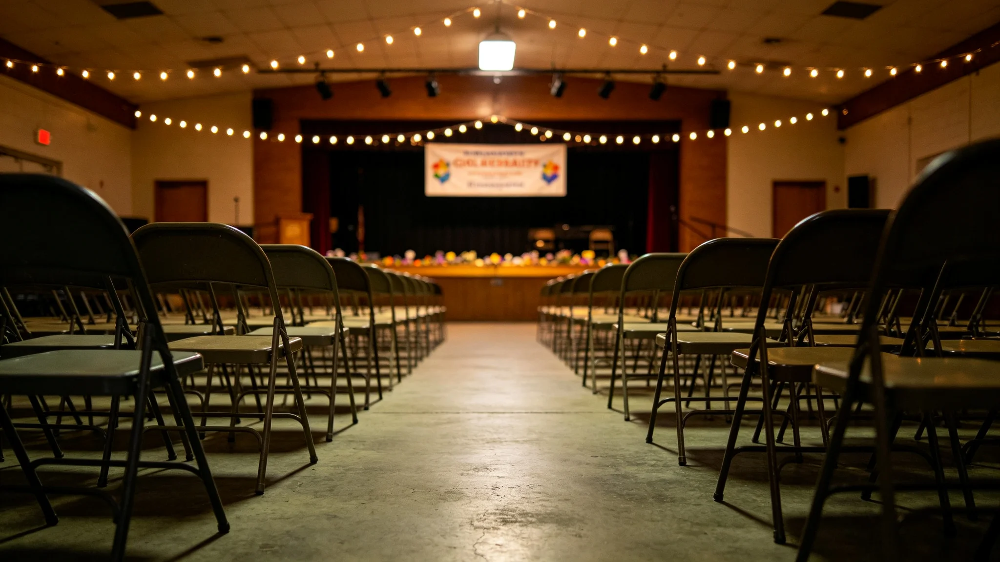

## 一、事件概况

3945年八月初二，五号环带管委会收到两份居民联名投诉。第一份由三十一名六十岁以上居民联名提出，反对管委会拟议的本环带公共活动区改造方案——该方案拟将现有退休居民活动室改为青年居民社交空间。第二份由二十七名二十至三十五岁居民联名提出，支持该改造方案，认为现有活动室使用率偏低，浪费公共空间。

两份投诉于同日送达管委会办公室，管委会主任于当日十六时收到投诉，十八时三十分召开紧急协调会。社会局代际沟通专员于十九时四十分到达五号环带管委会。

## 二、事件经过

八月初二十六时，管委会收到两份联名投诉。十八时三十分，管委会主任召开紧急协调会。十九时四十分，社会局代际沟通专员到达。

八月初三九时，代际沟通专员分别约谈双方代表。退休居民代表陈述：活动室自3935年建成以来，一直是退休居民每日固定活动场所，突然改为青年社交空间，将导致退休居民失去日常社交场所。青年居民代表陈述：活动室目前每日仅上午开放约三小时，下午与晚间闲置，本环带青年居民缺乏社交空间，改造方案可提高空间利用率。

八月初四十七时，代际沟通专员组织双方代表在五号环带代际沟通站召开面对面调解会。会议持续约三小时，最终达成折中方案：活动室保留上午时段（六时至十二时）供退休居民使用，下午与晚间（十二时至二十二时）改为青年社交空间，两侧共用一间储物间。

## 三、事件原因

事件直接诱因为五号环带管委会拟议的公共活动区改造方案未提前征求退休居民代表意见。该方案由环带规划组根据青年居民占比上升的人口趋势提出，论证过程中主要参考了青年居民需求数据，未充分评估对退休居民日常活动的影响。

事件深层原因为：五号环带为混合型居住环带，六十岁以上居民占百分之二十九，二十至三十五岁居民占百分之三十四，两个年龄段人口占比接近，公共空间资源分配容易引发代际分歧。此前五年，五号环带未发生过类似冲突，原因是退休居民人口占比在此前五年持续低于百分之二十五，公共空间分配矛盾不突出。

## 四、事件影响

事件直接影响：五号环带公共活动区改造方案按折中方案修改后执行，未导致任何一方完全失去活动空间。事件后两周内，五号环带未再收到同类投诉。

事件间接影响：事件直接推动了世代交替社会支持法（见 GS-3964-01）的立法进程。事件后，社会局在全部八个居住环带设立代际沟通站，将代际沟通争议的调解机制制度化。事件也推动了五号环带管委会在后续公共空间改造方案中，必须提前征求各年龄段居民代表意见。

## 五、事件处置责任认定

事件处置中，管委会在收到两份联名投诉后约两小时三十分召开紧急协调会，在规定时限内。代际沟通专员从收到通知到达五号环带管委会用时约一小时十分，符合应急预案规定的两小时内要求。面对面调解会在投诉收到后约二十四小时内召开，在规定时限内。

事件责任认定：五号环带管委会拟议改造方案时未充分征求退休居民代表意见，为事件根本原因。代际沟通专员在调解中促成双方达成折中方案，处置得当，未认定责任。

## 六、整改措施

事件后采取以下整改措施：其一，在全部居住环带建立公共空间改造方案的跨年龄段征求意见机制，方案公示期不少于十四日；其二，在全部八个居住环带设立代际沟通站，配备专职协调员；其三，将五号环带事件作为案例编入代际沟通协调员培训教材；其四，在五号环带试点退休居民与青年居民共用公共空间的分时使用方案，评估其效果后向其他环带推广。

## 六·补、事件后长期随访数据

事件后两年（3945年至3947年），社会局对五号环带公共空间使用情况进行了持续随访。随访数据显示：事件后实施的分时使用方案运行两年后，退休居民对上午时段使用的满意度评分为三点九分（五分制），青年居民对下午与晚间时段使用的满意度评分为三点六分。双方均未在随访中提出调整需求。

事件后，全部八个居住环带均设立了代际沟通站。3946年至3947年，各环带代际沟通站共受理代际沟通争议一百一十三件，调解成功八十九件，调解成功率百分之七十九，较事件前百分之六十一提升十八个百分点。3947年，五号环带未再发生同类公共空间分配冲突事件。本报告附事件后两年代际争议调解成功率统计表一张，由社会局服务科绘制。

## 七、附则

本报告由社会局事件调查科起草，经局务委员会审议后发布。抄送社会局、各居住环带管委会、世代心理学研究所。报告封面号SH-3945-013。
