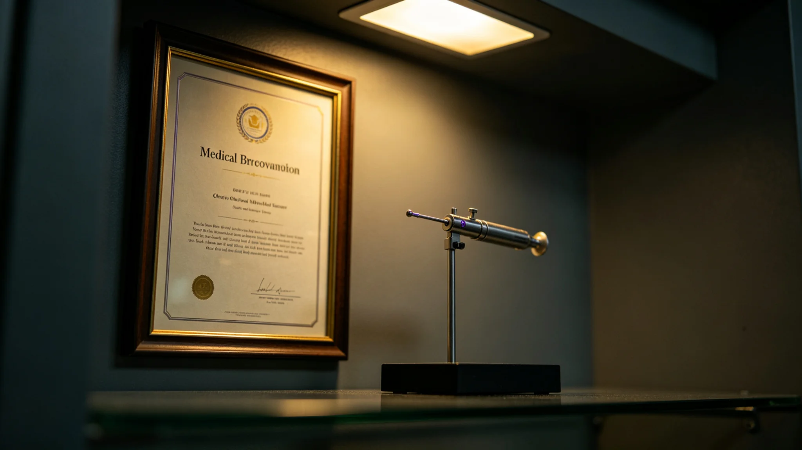

## 一、事件概况

3947年八月初七凌晨三时十七分，五号环带居住环境智能调节系统（见 GS-3972-01）主控制机柜硬件故障，导致五号环带温湿度、通风、照明四项环境参数同时偏离标准值。环带内居民在三时二十分左右开始通过温控面板手动调节，发现系统无响应。

三号环带居住环境优化局中央控制室监测到五号环带参数异常，于三时二十二分发出警报。值班工程师于三时二十五分确认五号环带主控制机柜离线，三时三十分启动冗余控制节点切换程序。三时三十八分，冗余控制节点成功接管五号环带环境控制，切换用时八秒。

## 二、事件经过

八月初三十七时十七分，五号环带主控制机柜故障。三时二十二分，中央控制室监测到参数异常并发出警报。三时二十五分，值班工程师确认主控制机柜离线。三时三十分，启动冗余控制节点切换。三时三十八分，冗余节点接管成功。

四时至六时，冗余控制节点逐步将五号环带各项环境参数调回标准值。四时二十分，温度恢复至标准值正负百分之二以内。四时五十分，湿度恢复。五时二十分，通风恢复。五时五十五分，照明恢复。

六时整，五号环带各项环境参数全部恢复至标准值容许范围内。值班工程师通知环带管委会，告知故障已排除。环带管委会于六时十分通过环带广播通知居民，故障已排除，环境参数已恢复正常。

## 三、事件原因

经事后拆机检查，五号环带主控制机柜故障原因为：机柜内部一块电源模块因长期运行（已连续运行八年未更换），内部电容老化短路，导致机柜整体断电。该电源模块设计寿命为十年，实际运行八年后出现提前老化。

该故障为二期升级前已部署的第一代控制机柜，二期升级中仅在中央调度层新增了冗余控制节点，各环带本地控制机柜尚未配备冗余设计。主控制机柜断电后，本地无法自行切换至备用控制，需依赖中央调度层的冗余节点远程接管。

## 四、事件影响

事件直接影响：五号环带环境参数偏离标准值共计约三小时四十分钟。期间温度在标准值正负百分之五以内波动，湿度在正负百分之六以内，通风量降至标准值的百分之七十，照明降至标准值的百分之五十。环带内约一千二百名居民受到影响，无人员受伤报告。事件后二十四小时内，五号环带卫生服务站收到七名居民主诉睡眠质量受影响，均为轻度症状，无需住院治疗。

事件间接影响：事件直接推动了居住环境标准法（见 GS-3965-01）修订中关于各环带本地控制机柜冗余设计的条款。事件后，居住环境优化局启动各环带本地控制机柜冗余改造论证，计划在五年内完成全部八个环带的本地冗余设计。

## 五、事件处置责任认定

事件处置中，中央控制室从监测到参数异常到发出警报用时四分钟，从确认主控制机柜离线到启动冗余切换用时五分钟，从启动切换到冗余节点接管成功用时八分钟。全部处置过程在应急预案规定时限内。

事件责任认定：主控制机柜电源模块设计寿命十年，实际运行八年后提前老化，属于设备本身寿命偏差，非人为维护失误。但二期升级中未同步在各环带本地控制机柜配备冗余设计，为事件发生后需依赖中央远程接管的原因。该设计缺陷被认定为系统层面的改进方向。

## 六、整改措施

事件后采取以下整改措施：其一，立即对全部八个环带的主控制机柜电源模块进行一次全面检测，对运行超过六年的模块安排预防性更换；其二，启动各环带本地控制机柜冗余设计改造论证，制定五年改造计划；其三，修订居住环境智能调节系统操作规程，明确在主控制机柜故障时中央冗余节点接管的标准操作流程；其四，对全部值班工程师开展一次冗余切换操作复训。

## 六·补、事件后长期随访数据

事件后一年（3947年八月至3948年八月），居住环境优化局对全部八个环带的主控制机柜电源模块进行了全面检测与预防性更换。检测结果：运行超过六年的电源模块共发现五块存在电容老化迹象，均已更换。更换后，3947年九月至3948年八月，八个环带未再发生主控制机柜硬件故障事件。

事件后，居住环境优化局启动各环带本地控制机柜冗余设计改造论证，3948年三月完成论证报告，结论为：全部八个环带本地冗余改造预计总投资相当于该局年度预算的百分之十八，建议分五年完成，每年改造一至两个环带。3948年下半年，首个改造试点（五号环带）已启动设计工作，预计3949年底完成。本报告附事件后一年故障统计与改造计划表一张，由居住环境优化局技术科绘制。

## 七、附则

本报告由居住环境优化局事件调查科起草，经局务委员会审议后发布。抄送居住环境优化局、各居住环带管委会。报告封面号HJ-3947-019。
