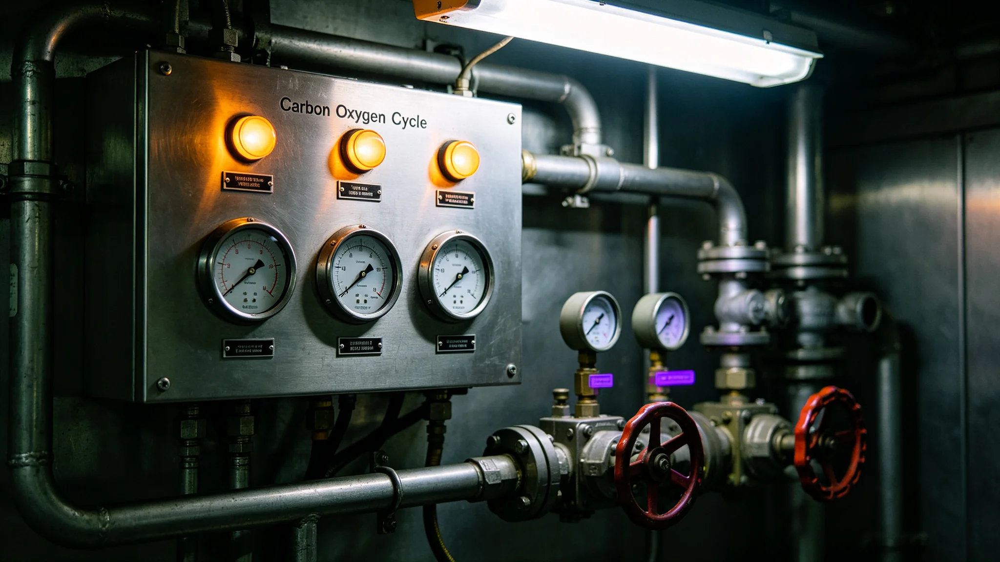

# 居住环境优化产业年度决算报告（3948 年度）

**编制**：居住环境优化局 · 财务科
**决算年度**：3948 年正月至十二月
**审议**：局务委员会
**封面号**：HJ-3949-027

## 一、决算口径

业务四项：居住环境智能调节系统运行、环境标准检测、环境改造工程、居民环境咨询。决算依权责发生制。凭证、验收单存根与检修台账附后。

## 二、收支总表

| 项 | 3948（配给额度·单位） | 3947 | 增减 |
|---|---|---|---|
| 总收入 | 约二十万八千 | 约十九万一千 | +约百分之八点九 |
| 总支出 | 约十九万四千 | 约十八万二千 | +约百分之六点六 |
| 年度结余 | 约一万四千 | — | 结转下年度 |
| 单人口均年支出 | 约八十九 | — | 人均成本较上年 +约百分之七 |

收入来源：八个环带管委会按人口分摊环境运行费用。分摊依各环带人口占比，与其他产业口径一致。

| 环带 | 各带分摊额 |
|---|---|
| 一号至三号 | 各约三万五千 |
| 四号至六号 | 各约二万六千 |
| 七号至八号 | 各约一万八千 |

## 三、支出构成与分项

构成：人员薪酬 百分之四十二｜设备运维 百分之二十四｜改造工程 百分之二十｜检测与咨询 百分之八｜其他杂项 百分之六。

| 分项 | 3948 支出 | 明细 | 较上年 |
|---|---|---|---|
| 人员薪酬 | 约八万一千五百 | 系统运维工程师三十六·环境检测员二十八·改造工程施工人员四十二·管理人员十九，计一百二十五人；人均约六千五百二十 | 占比 +一点二个百分点（二期升级新增运维工程师八人）|
| 设备运维 | 约四万六千六百 | 控制机柜维护约一万八千（见 GS-3972-01）·环境传感器校准约一万二千·照明与通风设备维护约一万六千六百 | +约百分之十（二期升级后控制节点增加）|
| 改造工程 | 约三万八千八百 | 七至八号外环带照明改造约一万八千·五号环带控制机柜冗余改造试点约一万二千·其他小型改造约八千八百 | — |

## 四、验收单存根（附一件，以见全年）

> **验收单 HJ-3948-三-0117**（存根联）
> 标的：照明灯具一批，供七号至八号外环带照明改造。
> 验收：三季度。施工方签字栏——空白。
> 内审组批注：缺施工方签字，退回补办。
> 补办：补签一处，签名涂改，原件附卷。
> 经办人：财务科（签名略）。
> 局务委员会照准：入账。金额无偏差。

## 五、控制机柜检修台账（原行摘录，见 GS-3972-01）

> 03-11 07:20　五号环带　冗余改造试点　控制节点自检 …… 通过
> 环境传感器校准一组，读数偏差在容许范围内。
> 值班工程师签认。
>
> 全年控制机柜维护约一万八千单位。二期升级后控制节点增加，设备运维较上年 +约百分之十。台账无备注栏——自检既过，无需人过问。

## 六、与上年度对比

支出：3947 约十八万二千 → 3948 约十九万四千，+约百分之六点六（二期升级后设备运维上升、外环带照明改造工程）。
收入：3947 约十九万一千 → 3948 约二十万八千，+约百分之八点九（各环带人口增长后分摊基数扩大）。

## 七、审计与复核

内审组：决算数据完整，支出与收入分类合理，未发现违规支出。查出两处小问题——
其一，三季度一批照明灯具采购验收报告缺施工方签字，已补办（见第四节存根）；
其二，四季度一笔改造工程款支付审批流程倒置，先施工后补审批，已要求整改。
两处均不涉及金额偏差。

财政局复核：决算数与预算执行数差异均在容许范围内；改造工程支出与外环带照明改造及冗余改造试点进度一致；设备运维支出与二期升级后控制节点数匹配。复核未要求调整决算数。

## 八、下年度（3949）预算建议

总支出约二十万五千，较 3948 +约百分之五点七。增加项：五号环带控制机柜冗余改造完工约四千；照度传感器清洁频次提高约一千五百。收入渠道不变，预计总收入约二十二万。

横向比较：单人口均年支出约八十九单位，在六项年度决算产业中处中高水平——改造工程占比高（百分之二十），设备运维随二期升级上升。预计未来五年冗余改造全面铺开，改造工程支出继续增加。

## 九、附件索引

一、近五年产业支出结构变化趋势表（3944—3948，人员薪酬/设备运维/改造工程/检测咨询/杂项五类占比逐年）。财务科编制，陆迟（见 GS-3957-01）以总设计师签字确认工程支出分类无误。
二、各环带环境改造工程量年度统计表（3944—3948，完成改造项目数/改造预算执行率/居民满意度三项）。

## 十、附则

本决算由居住环境优化局财务科编制，经局务委员会审议后发布。抄送财政局、各环带管委会。所附各表均为正本附件，与正文同等效力。封面号 HJ-3949-027，与优化局其他决算档案同序列。

财务科注：两处小问题，一为签字栏空白，一为先施工后补审批。均已补办、整改，金额无偏差。档案记到此为止。

**记录人**：财务科（签名略）
**签批**：局务委员会（印）　**日期**：3949-03-29
