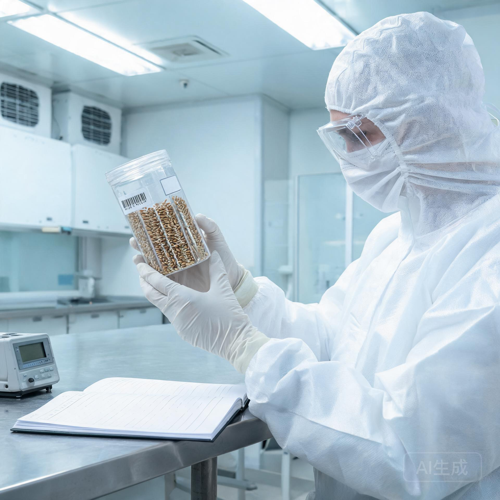

## 一、 立项依据与背景

本载荷立项依据有二：

1. **深空辐射环境实测数据的开放：** 依托"远巡-02"号星际边界探测器 2035 年 10—11 月日球层顶穿越实测（GS-2035-02 归档公报），人类首次获得未受日球层调制过滤的真实银河宇宙线能谱：高能质子通量 6.24 cm⁻²·s⁻¹·sr⁻¹、高能铁核通量 1.48×10⁻³ cm⁻²·s⁻¹·sr⁻¹（较日鞘内跳变 +369.8%）。该数据为星际辐射生物学载荷提供了**真实的剂量学输入**，替代了此前的模型外推。
2. **星际生态的远期命题：** 若人类未来以数百年级航程迁往恒星际，植物种子与遗传物质将长期暴露于星际辐射。当前对"辐照积累剂量×种子存活/突变率"的关联仍以地面加速器模拟为主，缺少真实深空长期在轨数据。"种舟-01"即为此填补首个真实环境数据点。

---

## 二、 载荷设计方案（评审通过版）

### 2.1 样本构成

| 样本组 | 物种 | 数量 | 备注 |
| :--- | :--- | :---: | :--- |
| A 组（对照·屏蔽舱） | 小麦（春麦） | 240 粒 | 置于 8 cm 铅当量屏蔽盒内 |
| A 组（对照·屏蔽舱） | 拟南芥 | 600 粒 | 同上 |
| B 组（实验·暴露舱） | 小麦（春麦） | 240 粒 | 暴露于舱壁薄屏蔽（0.5 cm 铝） |
| B 组（实验·暴露舱） | 拟南芥 | 600 粒 | 同上 |
| C 组（实验·深层暴露） | 小麦/拟南芥 | 各 120 粒 | 置于舱外安装座（微流星风险最低面） |

**总量：** 1,920 粒（含备份 120 粒），全部为航天育种谱系种子（已完成 3 代以上航天搭载复壮）。

### 2.2 剂量测量与遥测

- 每样本舱内植入 1 组小型化半导体剂量计（量程 0—10 Gy，精度 ±5%）；
- 深冷舱外安装座搭载 1 组微型 CR-39 径迹探测器，记录重核线性能量沉积（LET）谱；
- 遥测周期：每 90 天回传剂量累计与舱温，样本本体留存，待回收方案论证（当前按"远期回收或最终解体"双预案备案）。

### 2.3 辐射剂量预评估（基于远巡-02 实测谱推算）

| 工况 | 年均剂量当量（估算） | 10 年累计 | 预期发芽率影响（模型） |
| :--- | :---: | :---: | :--- |
| A 组（8 cm 铅屏蔽） | ≈ 0.08 Sv | 0.8 Sv | 对照基准 |
| B 组（0.5 cm 铝） | ≈ 0.55 Sv | 5.5 Sv | 预期 <10% 下降 |
| C 组（舱外） | ≈ 0.95 Sv | 9.5 Sv | 预期 20—30% 下降，重点关注突变谱 |

**评审意见：** 当前剂量区间设计合理，能有效覆盖"船载屏蔽方案（对应 A 组）"与"薄弱屏蔽/舱外作业暴露（对应 B/C 组）"两种星际航程真实场景。

---

## 三、 种子样本入舱备案（节录）

### 3.1 样本来源与检疫

全部样本经深空生物与生命保障联合实验室检疫放行，无活性病原体、无检疫性杂草种子，含水率 6.8±0.3%，休眠状态良好。出库冷链全程温控 -18±2℃。

### 3.2 备案表（节录 6 组）

| 备案编号 | 物种 | 组别 | 粒数 | 入库批次号 | 责任实验员 |
| :--- | :--- | :---: | :---: | :--- | :--- |
| PZ-2035-001 | 春小麦（中麦 88 航天系） | A（屏蔽） | 240 | HT-2035-0318 | 顾慧敏 |
| PZ-2035-002 | 拟南芥（Col-0 航天系） | A（屏蔽） | 600 | HT-2035-0318 | 顾慧敏 |
| PZ-2035-003 | 春小麦（中麦 88 航天系） | B（暴露） | 240 | HT-2035-0318 | 顾慧敏 |
| PZ-2035-004 | 拟南芥（Col-0 航天系） | B（暴露） | 600 | HT-2035-0318 | 顾慧敏 |
| PZ-2035-005 | 春小麦（中麦 88 航天系） | C（舱外） | 120 | HT-2035-0318 | 顾慧敏 |
| PZ-2035-006 | 拟南芥（Col-0 航天系） | C（舱外） | 120 | HT-2035-0318 | 顾慧敏 |

### 3.3 样本注释栏（民间附言·经本人同意归档）

> 「这些麦子跟我老家地里的是同一批种源，我爷爷那辈就在种。装舱的时候我手抖了一下，同事说没事，种子不怕颠。我想了想也是——它们要去的路，比我们能想象的所有颠簸都长。」——样本封装员（隐名），2035-12-26

---

## 四、 评审结论

1. "种舟-01"载荷设计方案科学依据充分（基于 GS-2035-02 实测辐射环境）、样本构成合理、剂量分组覆盖真实航程场景，**评审通过**；
2. 同意样本入舱备案，随"远巡-03"于 2036 年发射窗口搭载；
3. 遥测与回收预案按本方案第 2.3 节执行，首期剂量数据预期于发射后第 1 年（2037 年）回传并公开发布；
4. 本载荷为星际生态研究首例真实环境数据点，建议作为长期序列（后续任务继续搭载）立项。

---

**签发：**  
深空生物与生命保障联合实验室主任（签）  
国家航天联合深空探测工程指挥部 · 科研管理部（核签）  
"远巡-03"任务总体部（会签·总装厂交接确认）  

**签发日期：** 公元 2035 年 12 月 28 日

*(本文件一式四份：联合实验室、任务总体部、天津总装工厂随行档案、载荷备份件归档)*

---

## 图片提示词

中文：航天生物载荷封装实验室内景，公元2035年，一位身着洁净服的实验员双手捧着一只透明密封样本舱，舱内整齐排列着数百粒小麦种子与拟南芥种子，样本舱上贴着条形码与批次标签；桌面另一侧放着一台半导体剂量计与一册打开的红外光谱台账；顶部冷白工作灯，硬光勾勒出种子与金属实验台的轮廓，洁净、克制、纪实，无文字可读。

English: Interior of a space biology payload encapsulation lab, 2035. A technician in cleanroom suit holds a transparent sealed sample canister containing neatly arranged wheat and Arabidopsis seeds, with barcode and batch labels affixed; on the bench beside her a semiconductor dosimeter and an open spectral logbook. Cold overhead work light, hard shadows on seeds and metal bench, clean restrained documentary feel, no readable text.

## 修订记录（元层，非世界内容）

- 2026-08-20 批 7 创作入库（GS-2035-05）。辐射环境数据严格引用 GS-2035-02 远巡-02 实测谱（质子 6.24、铁核 1.48×10⁻³、+369.8%）；搭载对象远巡-03 引用 GS-2034-03 总装验收；与 GS-2150-02（ARK-01 生态总装 2150）、GS-2353-01（种子库退役移交 2353）构成"种子进舱—种子库退役"时间远链。正文无纪元名/元层词。