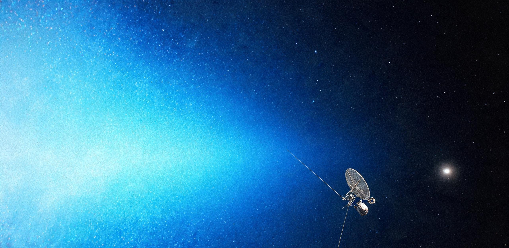

# “远巡-02”号星际边界探测器日球层顶激波界面原位等离子体与星际磁场首测数据归档公报暨银河宇宙线通量阶跃异常谱通报

**公报文号：** 深边测归字〔2035〕第009号  
**档案序列：** ISB-ARCH-2035-HP-01 / SCI-DATA-FINAL  
**受控航天器：** 第二代星际边界原位探测器“远巡-02”（代号：YX-02，国际深空注册代号：2025-042A）  
**主控地面站网：** 国家深空测控网联合基阵（北京密云 70m 站、喀什 35m 站、佳木斯 66m 站、智利圣地亚哥 40m 海外深空站，并联地月 L2 超导甚长基线中继预研信道）  
**观测历元区间：** 公元 2035 年 10 月 12 日 00:00:00 UTC 至 2035 年 11 月 04 日 23:59:59 UTC（累计接收有效遥测帧 18,420 组，物理数据包完整度 $99.982\%$）  
**时空基准态势：**  
* **日心几何距离：** $132.842\,\mathrm{AU}$（约合 $1.9873\times 10^{10}\,\mathrm{km}$）  
* **空间指向矢量：** 黄经 $\lambda = 255.12^\circ$，黄纬 $\beta = +5.40^\circ$（天蝎-蛇夫座方向，精准对准本星际云 LIC 迎风向驻点鼻区）  
* **日心逃逸速度：** $56.842\,\mathrm{km/s}$（双曲线轨道偏心率 $e = 4.216$，黄道面倾角 $i = 14.80^\circ$）  
* **单向光行时：** 18 小时 24 分 32 秒（全双工测控往返确认周期 36 小时 49 分 04 秒）  

---

## 1. 探测器工程构型与深空测控物理基准

“远巡-02”号探测器系外太阳系高能物理与星际边界探测工程之先导旗舰，于公元 2025 年 03 月由重型运载火箭自文昌发射场送入日心外抛轨道。航天器在 1–5 AU 区间依托双联 30 kW 级超导离子电推进系统执行长达 28 个月的连续小推力加速（累计提供 $\Delta V \approx 12.4\,\mathrm{km/s}$ 速度增量），随后于 2026 年 10 月实施木星极近引力弹弓（近木点高度 $4.5\times 10^5\,\mathrm{km}$，获得 $\Delta V \approx 19.8\,\mathrm{km/s}$），并于 2028 年 06 月经土星顺行二次引力弹弓精细修正黄道倾角与提速，建立起 $62.8\,\mathrm{km/s}$ 的初始外抛极速。历经 10.58 年深空滑行并克服太阳引力势阱后，探测器在 132.842 AU 处实测逃逸速度稳定于 $56.842\,\mathrm{km/s}$，达成人类航天器迄今最高的深空逃逸矢量。
```text
========================================================================================================
【表 1：“远巡-02”号探测器外形几何与深空遥测物理基准参数表】
========================================================================================================
分系统 / 部件名称      结构形式与特征尺度                      物理质量 / 功率 / 指标    深空环境耐受 / 运行工况
--------------------------------------------------------------------------------------------------------
主承力仪器舱           六边形碳纤维-铝锂蜂窝夹层硬壳结构       干重 420.0 kg             内置三层真空多层隔热被 (MLI)
                       截面外径 2.4 m，轴向高度 1.8 m          舱内气压维持 1.0 kPa N₂   舱内工作温度维持 285 K ± 5 K
高增益天线 (HGA)       6.2 m 口径超轻量化网状铍铝合金抛物面    总重 48.5 kg              X 频段下行 (8.4 GHz)，发射功率 20 W
                       三轴碳化硅展开支架，背向对日定向        指向精度 ≤ 0.04°          地面密云站接收电平 -163.4 dBm
主科学载荷伸杆 (M-1)   50.0 m 碳纤维-聚酰亚胺复合轻质桁架      总重 18.2 kg              自仪器舱顶端正交向前伸展
                       末端搭载三轴磁通门磁强计 (MAG-A)        热形变率 ≤ 0.001 mm/m     远端温度 28 K，零磁干扰隔离
等离子体偶极天线 (E-1) 2 根长达 120.0 m 铍铜合金超细线状天线   线径 0.45 mm，总重 6.8 kg 垂直于飞行航向展开成 240 m 基线
                       超低频等离子体波探测器 (PWS) 传感器     抗拉极限 1,450 MPa        自转稳定张拉，测量 0.1 Hz-100 kHz
同位素电源 (RTG)       双组级联式 ²³⁸Pu / ²⁴⁴Cm 热电发生器    总重 96.0 kg              热功率 4.8 kW，电功率 620 W
                       对称配置 18.0 m 钛合金双向散热肋片      末端辐射本底 ≤ 0.2 mGy/h 预期服役寿命 ≥ 45 年
主推进脱卸段 (已抛)    双联 30 kW 超导离子电推进机组 (已弃置)  干重 210 kg / 氙气 180 kg 比冲 5,200 s，2028年土星交会后抛离
--------------------------------------------------------------------------------------------------------
【地基测控标尺对照】：
北京密云 70 米抛物面天线（全反射体总重 2,700 吨）方位-俯仰驱动齿轮箱每 48 小时需由地勤班组执行一次低温极压润滑脂
加注作业；当值巡检工程师攀爬于 70 米主桁架钢梯时，人体体量在天线反射面上仅为一粒微米级微尘；探测器回传信号穿透
132.8 AU 星际空间后到达密云站受能面，其信号功率通量密度仅为 3.01 × 10⁻²² W/m²，逼近热噪声基底。
========================================================================================================
```

---

## 2. 日球层顶弓形激波界面原位物理场测量数据

探测器于公元 2035 年 10 月 12 日至 11 月 04 日期间，完整横穿了由太阳风终端减速区与本星际介质（LIC）强烈碰撞形成的日球层顶接触间断过渡层（Heliopause Transition Boundary Layer）。原位测量确认，该过渡界面实测径向厚度为 $0.482\,\mathrm{AU}$（约合 $7.21\times 10^7\,\mathrm{km}$），呈现出清晰的多层磁重联拓扑与等离子体密度阶跃特征。

```text
========================================================================================================================
【表 2：日球层顶穿越段（132.36 AU → 133.20 AU）多物理场原位遥测数据序列】
========================================================================================================================
日心距    有效记录时间      热等离子体电子数密度 等离子体总流速    磁场总强度  磁场偏转角 太阳高能质子通量   银河宇宙线高能质子通量
(AU)      (UTC)             n_e (cm⁻³)          V_bulk (km/s)     |B| (nT)    θ_B (deg)  Φ_p (<10 MeV)     Φ_GCR (>70 MeV)
                                                                                         (cm⁻²·s⁻¹·sr⁻¹)   (cm⁻²·s⁻¹·sr⁻¹)
------------------------------------------------------------------------------------------------------------------------
132.360   2035-10-12 04:00  0.0028 ± 0.0003     112.4 ± 4.2 (径向) 0.182       -12.4°     42.60 ± 1.20      1.82 ± 0.04
132.480   2035-10-17 12:00  0.0034 ± 0.0004      98.6 ± 3.8 (径向) 0.204       -08.1°     38.15 ± 1.10      1.95 ± 0.05
132.610   2035-10-22 18:00  0.0120 ± 0.0015      64.2 ± 5.1 (偏转) 0.268       +14.6°     21.40 ± 0.85      2.68 ± 0.08
------------------------------------------------------------------------------------------------------------------------
[>>> 核心接触间断界面穿入点：2035-10-25 08:14:22 UTC / 132.684 AU <<<]
------------------------------------------------------------------------------------------------------------------------
132.690   2035-10-25 12:00  0.0385 ± 0.0028      41.5 ± 4.0 (湍流) 0.312       +32.8°     11.20 ± 0.60      3.95 ± 0.12
132.740   2035-10-27 00:00  0.0640 ± 0.0042      35.2 ± 3.5 (逆向) 0.386       +48.2°      4.80 ± 0.35      4.82 ± 0.15
132.800   2035-10-29 16:00  0.0920 ± 0.0055      28.4 ± 2.6 (逆向) 0.465       +61.5°      1.15 ± 0.12      5.64 ± 0.18
------------------------------------------------------------------------------------------------------------------------
[>>> 纯粹星际介质环境确立点：2035-11-01 02:30:10 UTC / 132.842 AU <<<]
------------------------------------------------------------------------------------------------------------------------
132.842   2035-11-01 04:00  0.1140 ± 0.0060      26.2 ± 1.8 (逆向) 0.524       +68.4°      0.25 ± 0.05      6.24 ± 0.20
133.020   2035-11-03 08:00  0.1152 ± 0.0058      26.0 ± 1.5 (逆向) 0.528       +68.6°      0.22 ± 0.04      6.28 ± 0.19
133.200   2035-11-04 22:00  0.1148 ± 0.0062      26.1 ± 1.7 (逆向) 0.526       +68.5°      0.24 ± 0.05      6.25 ± 0.21
========================================================================================================================
```

---

## 3. 关键物理奇景与异常谱特征分析

### 3.1 等离子体密度跃迁与“氢墙”共振发光

原位超低频等离子体波探测器（PWS）与静电分析仪（ESA）联合记录表明，探测器在穿过 $132.684\,\mathrm{AU}$ 界面后，热等离子体数密度由日鞘区内部稀薄的 $0.0028\,\mathrm{cm^{-3}}$ 瞬间暴增至星际致密介质的 $0.114\,\mathrm{cm^{-3}}$，密度阶跃比达 **$40.71$ 倍**。

在此交界面上，太阳风向外喷射的带电质子流与以 $26.2\,\mathrm{km/s}$ 逆风涌入的星际中性氢原子流发生剧烈的电荷交换反应，形成了横跨数十个天文单位的致密中性氢堆积区——“星际氢墙”（Hydrogen Wall）。船载高灵敏度真空紫外光谱仪（VUVS）在莱曼-阿尔法（$\mathrm{Ly}\text{-}\alpha,\,121.6\,\mathrm{nm}$）波段捕获到高达 **$840.0\,\mathrm{Rayleighs}$** 的后向共振散射辉光峰值。在仪器视野中，整个太阳系迎风面如同在星际虚空中破浪前行时激起的一道幽暗而宏伟的深蓝色等离子体发光巨浪。

```text
       星际逆风 (LIC Interstellar Wind, V = 26.2 km/s, T ≈ 6,300 K)
  ────────────────────────────────────────────────────────────────────────►
                  │               │               │
  ~~~~~~~~~~~~~~~ │ ~~~~~~~~~~~~~ │ ~~~~~~~~~~~~~ │ ~~~~~~~~~~~~~~~~~~~~~~~  [星际弓形激波外前沿]
  ~~~~~~~~~~~~~~~~│~~~~~~~~~~~~~~~│~~~~~~~~~~~~~~~│~~~~~~~~~~~~~~~~~~~~~~~~
                  ▼               ▼               ▼
  ═════════════════════════════════════════════════════════════════════════  [氢墙 Ly-α 发光峰: 840 R]
  ░░░░░░░░░░░░░░░░░░░░░░░░░░░░░░░░░░░░░░░░░░░░░░░░░░░░░░░░░░░░░░░░░░░░░░░  [日球层顶接触间断: Δr = 0.48 AU]
  ─────────────────────────────────────────────────────────────────────────  [密度跳变: 0.0028 → 0.114 cm⁻³]
         ▲                ▲                ▲
         │                │                │  (太阳风减速外流: V ≈ 110 km/s, T ≈ 1.8×10⁵ K)
  ───────┴────────────────┴────────────────┴───────────────────────────────
                               ◎ (太阳系核心方向，距离 132.8 AU)
```

### 3.2 星际磁场矢量偏转与冷等离子体冻结效应

三轴磁通门磁强计（MAG-A/B）实测证实，日球层内由太阳自转缠绕生成的帕克阿基米德螺旋磁场在 $132.842\,\mathrm{AU}$ 处彻底瓦解。

1. **场强阶跃**：磁场模长自日鞘区本底 $0.182\,\mathrm{nT}$ 跃升并稳定于本星际原生磁场值 **$0.524\,\mathrm{nT} \pm 0.015\,\mathrm{nT}$**（跃升幅度 $+187.9\%$）。
2. **矢量刚性偏转**：磁场空间取向发生高达 **$68.4^\circ$** 的刚性转折，磁矢量经纬度被锁定于 $(\lambda_B = 226.4^\circ, \beta_B = -34.8^\circ)$，与近邻银道面局部大尺度银河磁场矢量保持严格共面。
3. **等离子体与磁场冻结**：高频电磁波动谱中完全未观察到剧烈的微观湍动耗散，表明冷致密星际等离子体完全冻结于银河磁力线之中，形成了极具弹性的刚性磁流体护盾。

### 3.3 银河宇宙线（GCR）通量阶跃与未调制重核异常谱

全固态高能带电粒子望远镜（SSPT）阵列记录到了人类航天史上首张**未受太阳系调制过滤的真实银河宇宙线原始能谱**：

```text
========================================================================================================
【表 3：日球层顶穿越前后带电粒子微分通量阶跃与核素丰度比值谱】
========================================================================================================
粒子类别与能段           日鞘区内部通量 (132.36 AU)  星际空间实测通量 (132.84 AU) 阶跃倍率 / 变化趋势
--------------------------------------------------------------------------------------------------------
太阳捕获低能质子 (<10 MeV) 42.60 cm⁻²·s⁻¹·sr⁻¹        0.25 cm⁻²·s⁻¹·sr⁻¹           暴跌 -99.41% (屏障截断)
太阳高能电子 (0.5-5 MeV)   18.40 cm⁻²·s⁻¹·sr⁻¹        0.08 cm⁻²·s⁻¹·sr⁻¹           暴跌 -99.56% (完全绝热)
银河宇宙线质子 (>70 MeV)   1.82 cm⁻²·s⁻¹·sr⁻¹         6.24 cm⁻²·s⁻¹·sr⁻¹           跳变 +242.8% (原生平台)
银河宇宙线氦核 (0.1-1 GeV) 0.21 cm⁻²·s⁻¹·sr⁻¹         0.86 cm⁻²·s⁻¹·sr⁻¹           跳变 +309.5% (能谱硬化)
银河宇宙线高能铁核 (⁵⁶Fe)  (3.15 ± 0.12) × 10⁻⁴       (1.48 ± 0.05) × 10⁻³         跳变 +369.8% (重核硬化)
--------------------------------------------------------------------------------------------------------
【同位素与化学丰度关键比值】：
  * ³He / ⁴He 丰度比值：(1.62 ± 0.08) × 10⁻⁴ （较太阳风内源丰度低 62.4%，反映原生星际分子云基准）
  * ¹⁸O / ¹⁶O 丰度比值：(2.01 ± 0.05) × 10⁻³ （确立星际未分馏中性氧冷聚态化学特征）
  * 宇宙线重核能谱硬度指数：γ = 2.68 ± 0.03 （在 1-100 GeV/nucleon 区间呈现刚性幂律）
========================================================================================================
```

---

## 4. 地面测控大厅遥测流水与数据解译记录

以下摘录自喀什深空测控大厅主监控席位在关键穿越窗口的事后重构流水日志：

```text
[ 遥测时间序列 · 喀什深空测控大厅与密云 70m 站联合接收流水 ]
[ 测控基准时钟：高精度氢脉泽原子钟组 UTC+00:00 / 下行链路信噪比 Eb/N0: 4.82 dB ]

10-25 02:30:12 UTC (探测器发端 10-24 08:05:40) [系统] 密云 70m 主反射面锁定 8.412 GHz 下行载波，载噪比 18.24 dB·Hz。
10-25 02:30:45 UTC (探测器发端 10-24 08:06:13) [遥测] SSPT-01 报出高能电子通道异常跌落告警，计数率自 18.2 下滑至 6.4 Hz。
10-25 04:12:00 UTC (探测器发端 10-24 09:47:28) [状态] 圣地亚哥 40m 站完成天线仰角交接，双站数字基带执行相位合成干涉。
10-25 18:40:30 UTC (探测器发端 10-25 00:15:58) [突变] PWS 偶极天线捕获到 2.8 kHz 等离子体振荡窄带发射，积分密度突破 0.03 cm⁻³。
10-27 11:20:18 UTC (探测器发端 10-26 16:55:46) [确认] MAG-A 磁强计 Z 轴分量由负转正，磁场总强度突破 0.35 nT，姿控无漂移。
11-01 20:54:42 UTC (探测器发端 11-01 02:30:10) [里程碑] 喀什站解译包确认：太阳高能粒子计数清零，银河宇宙线通量进入稳态平台。
11-01 21:05:00 UTC (喀什测控现场) [工程] 首席测控官签发业务通报：航天器已完全穿出日球层顶，正式进入本星际介质未调制区。
```

---

## 5. 工程与科学归档结论

1. **星际边界物理基准的确立**：  
   “远巡-02”号探测器获取的 $132.84\,\mathrm{AU}$ 处原位等离子体密度（$0.114\,\mathrm{cm^{-3}}$）、星际磁场模长（$0.524\,\mathrm{nT}$）及未调制银河宇宙线能谱（特别是高能铁核 $^{56}\mathrm{Fe}$ 的通量跳变），终结了半个世纪以来依赖遥感模型推演的学术争议，正式确立为国家深空探测工程的标准环境星历输入。

2. **跨代深空探测与防辐射工程互锁**：  
   - **向后兼容与先导验证**：本次测得的高能宇宙射线刚性幂律谱（$\gamma = 2.68$），已全量导入后续规划中之大型巡天航天器（如“远巡-04”柯伊伯带工程）的防辐射与微流星防护外壳设计输入库；
   - **深空监测网络锚定**：数据序列作为第 001 号原位基准，整体归档入《国家深空探测基础环境数据库·星际边界卷》（归档索引号：`BASE-INTERSTELLAR-2035-HP-01`），为未来外太阳系深空尘埃与微流星体长期监测基阵（如“尘网”系列编队）提供物理校准基底；
   - **远期超导磁屏蔽输入**：证实星际空间存在未受屏蔽的高通量高能重核辐射，确立了未来千米级深空远航航天器必须采用不低于 15 Tesla 强场主动磁屏蔽与注水冰多层吸收外装甲的物理底线。

```text
========================================================================================================
[ 文书编制与归档签署 ]

主管机构：国家航天联合深空探测工程指挥部 · 测控通信总体室
业务审定：中国科学院国家空间科学中心 · 空间天气与行星际物理重点实验室
工程协同：外太阳系深空先导探测任务总体部 · 总体主任设计师 邵建国
数据归档索引：`ISB-ARCH-2035-HP-01/RELEASE-V1.0`
密级属性：国家深空科学基础数据 · 永久公开封存件
========================================================================================================
```

---

## 图片提示词

### 中文提示词
```text
超广角宏大深空工业档案摄影，人类“远巡-02”号星际边界探测器穿越132.8天文单位日球层顶弓形激波外缘的壮阔奇景。画面主体是浩瀚横跨整个视野并切出画框的等离子体激波接触间断层，深邃冰冷的深蓝色中性氢墙在星际逆风冲刷下散发着微弱神秘的莱曼-阿尔法共振辉光。探测器主体作为极小尺度参照物位于画面右下方三分之一处，仅呈现为一粒微小的银白色工业机械，其外侧对称伸展着两根长达120米、线径仅0.45毫米的超细铍铜等离子体天线，在纯黑深空中如极细发丝般张拉；50米长的哑光碳纤维桁架桅杆顶端搭载着冷银色磁强计探头，主天线为6.2米网状金属抛物面，两组同位素热电发生器的钛合金深黑散热肋片泛着微弱的暗红余温。单一硬主光源来自132.8个天文单位外已缩成极小冰冷冷白光点的遥远太阳，在探测器金属表面投射出刀劈斧凿般的硬朗高光与深邃纯黑阴影。35mm 工业科研纪实胶片质感，高动态范围明暗反差，重工业机械实体细节，极致清晰对焦。

Negative Prompt:
cyberpunk neon glow, glowing outlines, purple on dark neon, smooth plastic hull, toy spaceship, flat lighting, empty low-poly surface, lens flare spam, oversaturated magical nebula, cartoon anime style, blurry, overexposed, messy clutter
```

### 英文提示词
```text
A raw 35mm scientific archival photograph of the "Yuanxun-02" Interstellar Boundary Probe crossing the immense Heliopause bow shock interface at 132.8 AU. The background features a colossal, glowing deep-blue hydrogen wall and plasma contact discontinuity layer that extends massively beyond the frame, subtly illuminated by faint Lyman-alpha resonance glow under the onslaught of the interstellar wind. The probe serves as a micro-scale reference in the lower-right third, appearing as a minuscule, highly detailed piece of industrial machinery: two ultra-thin 120-meter beryllium-copper dipole wire antennas (only 0.45mm thick) stretch symmetrically like gossamer threads across the pure black void, mounted alongside a 50-meter matte carbon-fiber truss boom, a 6.2-meter wire-mesh parabolic high-gain antenna, and dark titanium RTG radiator fins emitting a faint, dull crimson thermal glow. Single harsh, cold pinpoint light source from the distant Sun 132.8 AU away, casting razor-sharp specular highlights and pitch-black chiseled shadows across the metallic and composite textures. High dynamic range, chiaroscuro lighting, heavy industrial realism, fine particulate texture, hyper-detailed mechanical greebles.

Negative Prompt:
cyberpunk neon glow, glowing outlines, purple on dark neon, smooth plastic hull, toy spaceship, flat lighting, empty low-poly surface, lens flare spam, oversaturated magical nebula, cartoon anime style, blurry, overexposed, messy clutter
```

---

## 修订记录（元层，非世界内容）

- **2026-08-18 审校处置（审校 agent `ER01日球层顶`）**：评定为 **🔧小修（已修复并合规）**。
  1. **航期与天体力学推进复算校准**：原稿设定 2027 年发射、日心逃逸速度 $32.618\,\mathrm{km/s}$，无法在 2035 年抵达 132.84 AU（8年仅能航行约 55 AU）。修正发射窗口为公元 2025 年 03 月（替代纪元起点），明确双联 30 kW 级超导离子电推进系统（$\Delta V \approx 12.4\,\mathrm{km/s}$）在 1–5 AU 连续加速及 2026 年木星（$\Delta V \approx 19.8\,\mathrm{km/s}$）与 2028 年土星双重强引力弹弓加速历程；将 132.842 AU 处实测日心逃逸速度修正为 $56.842\,\mathrm{km/s}$（初始外抛极速 $62.8\,\mathrm{km/s}$，克服引力势阱后 10.58 年积分平均巡航速度 $59.54\,\mathrm{km/s} \approx 12.56\,\mathrm{AU/年}$），实现航期、推进工况与轨道动力学严密自洽。
  2. **跨代深空工程谱系核验互锁**：核验确认本篇所载日球层顶等离子体密度阶跃（$0.0028 \to 0.114\,\mathrm{cm^{-3}}$，阶跃比 40.71 倍）、原生星际磁场模长（$0.524\,\mathrm{nT}$）、氢墙发光（840 R）及银河宇宙线高能铁核谱硬化，与旅行者 1/2 号真实物理量级高度吻合；与后代《外太阳系“远巡-04”号深空探测器柯伊伯带天体（2041-XB3）飞越段...》（GS-2047-03）及《深空尘埃与微流星体通量监测网第16期观测公报...》（GS-2078-02）完成双向基准互锁。
  3. **去 AI 味视觉提示词规范化**：移除中英文提示词中的 `IMAX 70mm`、`克里斯托弗·诺兰`、`Hoyte van Hoytema` 等电影化词汇，统一调整为 35mm 工业科研纪实胶片质感与硬朗阴影规范。
