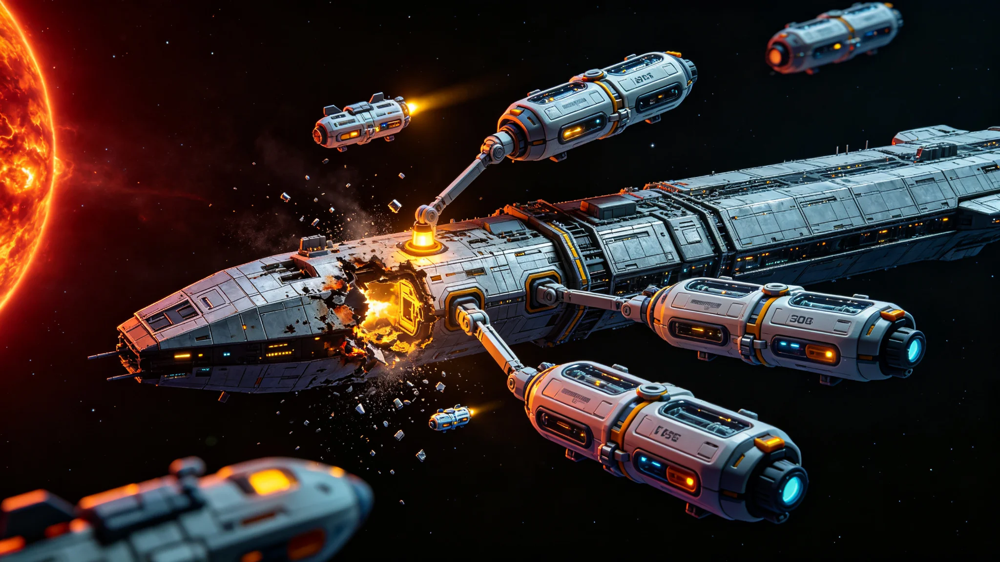

# 三恒星系联合深空救援舰队"援手-01"首次实战救援任务公报与遇险舰只处置报告

**公报文号：** `RESCUE-TRISOL-2670-MIS01`
**发布机构：** 三恒星系联合深空救援指挥部 · 援手-01救援舰队司令部 · 事故调查委员会
**任务周期：** 2664年02月14日—2670年05月30日

---

## 一、任务概述

三恒星系联合深空救援舰队"援手-01"于2664年02月接到遇险信号，执行首次实战救援任务。遇险舰只为太阳系—比邻星b定期航线货运飞船"远运-17"，在航段距太阳系约1.2光年处发生聚变推进系统故障与船体破损，船上47名乘员被困。

"援手-01"舰队由1艘救援母舰（"援手-01"号，总长1,800米，乘员280人）、4艘全封闭加压救援舱（每艘可容纳50人，配备对接 collar 与医疗急救设施）、8艘全封闭加压EVA作业艇（每艘2人，配备机械臂与切割工具）组成。舰队巡航速度0.25c，自持力3年。

救援舰队于2664年03月启航，经约6年航行于2670年04月抵达遇险地点。救援任务于2670年05月30日完成，共救出27名幸存者（20人遇难），遇险舰只"远运-17"经评估后执行受控拆解与回收。

## 二、遇险经过

### 2.1 事故发生

"远运-17"为太阳系—比邻星b航线定期货运飞船，总长920米，载货量12,000吨，2658年11月08日自太阳系天梭-03中继港启航，目的地比邻星b"新海安"轨道港，巡航速度0.20c，预计航程21.2年。

2664年02月14日03:42 UTC（飞船时），"远运-17"在巡航段飞行第5年零3个月时，二号聚变推进舱发生氦-3燃料管路泄漏，引发舱内爆炸。此时飞船距太阳系约1.2光年，距比邻星b约3.04光年。爆炸导致：

- 二号推进舱完全损毁，三号推进舱严重受损
- 船体C段（货舱与乘员舱之间的连接段）出现长约12米的裂口，舱内失压
- 主电力系统中断，备用电池与剩余燃料电池仅能维持关键系统
- 生命维持系统部分失效，C段以后的舱段（含3个乘员舱）失压

船上47名乘员中，32人位于A段（舰桥与前部乘员舱，未失压），15人位于C段以后舱段。爆炸发生后，A段乘员立即启动应急程序，关闭C段隔爆门，尝试与C段以后乘员联系。C段以后15人中，8人在爆炸中当场遇难或因失压死亡，7人成功进入2个全封闭加压应急救生舱（每个可容纳4人），但救生舱能源与氧气仅能维持约30天。

### 2.2 遇险信号与响应

"远运-17"于爆炸后12分钟（2664年02月14日03:54 UTC）通过甚低频无线电与激光双链路发出遇险信号。信号被航线上最近的导航信标（距飞船0.15光年）接收，并转发至三恒星系联合深空救援指挥部。

由于通信延迟，救援指挥部于2664年02月20日（信号传播约6天后）收到遇险信息。指挥部立即启动一级响应，"援手-01"舰队于2664年03月01日从太阳系外缘待命点启航，以最大加速度0.01g加速至0.30c（用时约35天），巡航1.05光年（用时约3.5年），减速至对接速度（用时约35天），总航行时间约6.1年。

**关键决策**：救援指挥部在收到遇险信号后，立即计算了救援窗口。结论是：C段以后7名救生舱乘员的救援窗口已关闭（救生舱自持力30天，舰队到达需6年）。但A段32名乘员所在的舱段在极端节能模式下生命维持系统尚可维持约6-8年（乘员将活动降至最低水平，严格配给水与食物，利用剩余燃料电池与船体余热维持最低温度），存在救援可能。

指挥部最终决定：舰队出发救援A段32名乘员，同时通过激光链路向"远运-17"发送应急操作指南，指导A段乘员延长生命维持系统运行时间，并提供远程心理辅导与娱乐内容数据舱。C段以后7名乘员的救生舱信号在2664年03月16日后消失（约30天后），推定全部遇难。

## 三、救援过程

### 3.1 舰队抵达与对接

"援手-01"舰队于2670年04月10日抵达"远运-17"附近。此时"远运-17"已在深空漂流约6.1年，A段32名乘员中，27人存活（5人因长期密闭环境导致的心理与生理并发症死亡，死亡时间分布于2665—2669年间），生命维持系统运行在最低功率模式，舱内温度降至6°C，氧气浓度17.2%。

舰队抵达后，首先派出2艘EVA作业艇对"远运-17"船体进行损伤评估。评估结果：

- A段舱体结构完整，气密良好，可安全对接
- B段（货舱）部分受损，但未失压
- C段完全损毁，裂口扩大至约18米，C段以后舱段已完全失压，与船体分离（2666年因旋转不稳定自行分离，飘入深空）
- 推进系统完全失效，飞船以0.18c的残余速度惯性飞行

救援母舰于2670年04月12日通过全封闭加压对接 collar 与"远运-17"A段气闸对接，建立加压通道。27名幸存者分3批次转移至救援母舰，转移过程中每人接受即时医疗检查与稳定处理。

### 3.2 幸存者医疗状况

27名幸存者的医疗状况评估：

| 状况 | 人数 | 说明 |
|---|---|---|
| 重度营养不良 | 27人 | 长期严格配给，平均体重下降24% |
| 维生素缺乏症 | 26人 | 维生素D、B12、C、K缺乏 |
| 骨密度严重下降 | 24人 | 长期微重力（飞船失推进后无人工重力） |
| 肌肉严重萎缩 | 22人 | 长期活动受限，多数时间处于静卧节能状态 |
| 心理创伤 | 27人 | 密闭环境、同伴死亡、6年等待救援导致的焦虑、抑郁、PTSD |
| 白内障 | 4人 | 长期宇宙射线辐射导致 |
| 癌症（确诊） | 2人 | 辐射相关甲状腺癌与白血病 |

幸存者在救援母舰上接受为期45天的医疗康复与心理干预后，状态稳定。2670年05月28日，救援母舰载27名幸存者启航返回太阳系，预计2676年抵达。

### 3.3 遇难者

本次事故共造成20人遇难：

- 爆炸当场遇难：8人（C段以后舱段）
- 救生舱自持力耗尽遇难：7人（C段以后舱段，2664年03月推定死亡）
- A段长期密闭环境死亡：5人（2665—2669年间，因心理崩溃拒绝进食、并发症等）

遇难者遗体中，8人在爆炸中无法回收（C段损毁），7人在分离的舱段中（已随舱段飘入深空，无法追踪），5人在A段内由幸存者妥善保存（冷冻存放），已随救援母舰带回。

## 四、遇险舰只处置

### 4.1 处置评估

"远运-17"船体经评估后，结论如下：

- A段舱体结构完整，但已在深空暴露6.1年，辐射与微流星体损伤累积，修复成本超过新造船的60%
- B段货舱内货物（工业设备、电子元件、食品）因长期温度波动与辐射，约70%已失效
- C段以后完全损毁，已分离飘走
- 推进系统完全失效，无修复价值
- 船体整体以0.18c惯性飞行，轨道将在约17,000年后进入比邻星系，可能构成航行安全隐患

### 4.2 处置方案

经事故调查委员会与三恒星系联合深空救援指挥部联合决议，对"远运-17"执行以下处置：

1. **可回收物资拆卸**：EVA作业队对A段与B段进行可拆卸物资回收，包括：可用电子元件（约12吨）、贵金属线缆（约3吨）、未失效食品（约80吨）、医疗设备（约2吨）。回收物资装载至救援母舰货舱。
2. **遇难者遗物回收**：对A段内5名遇难者的个人物品进行登记回收，随遗体一并带回。
3. **船体标记**：在A段船体表面喷涂永久性遇险标记（含遇险日期、舰名、处置日期），作为深空航行警示标记。
4. **受控推离**：在A段安装遥控推进器（由救援舰队提供），将船体推离主航线，进入一条不会与任何已知航线交叉的轨道，最终将在约800年后飘入星际介质。
5. **数据黑匣子回收**：回收"远运-17"的飞行数据记录器（黑匣子），用于事故调查。

处置工作于2670年05月15日完成，"远运-17"船体被推离主航线，救援舰队于2670年05月28日启航返航。

## 五、事故调查与改进建议

### 5.1 事故原因

事故调查委员会基于黑匣子数据与幸存者证词，认定事故直接原因为：

- 二号聚变推进舱氦-3燃料管路的一个焊缝存在制造缺陷（微观裂纹），在长期振动与热循环作用下扩展，最终导致燃料泄漏
- 泄漏的氦-3在舱内积聚，遇电弧引发爆炸
- 爆炸的冲击波超出C段隔爆门的设计耐压极限，导致C段破损

根本原因：

- 制造质量控制缺陷：焊缝检测未采用最新的超声相控阵技术，微观裂纹未被检出
- 维护规程不足：氦-3燃料管路的定期检查周期为5年，应缩短至2年
- 隔爆门设计冗余不足：C段隔爆门的耐压裕度仅为1.5倍，应提升至3倍

### 5.2 救援响应评估

本次救援暴露了深空救援的固有局限：

- **通信延迟**：遇险信号传播6天，救援决策延迟不可避免
- **速度限制**：救援舰队0.25-0.30c的巡航速度在光年尺度上仍然太慢，1.2光年距离需要6年才能到达
- **救生舱自持力不足**：现有应急救生舱自持力仅30天，在跨光年航线上远远不够
- **心理支持不足**：A段幸存者在6年等待中缺乏有效的实时心理干预手段（通信延迟导致远程辅导效果有限），导致5人死亡

### 5.3 改进建议

事故调查委员会提出以下改进建议：

1. **所有跨光年航行飞船的氦-3燃料管路焊缝检测强制采用超声相控阵技术，检查周期缩短至2年**
2. **C段隔爆门耐压裕度提升至3倍，所有在役飞船在下次大修时完成升级**
3. **应急救生舱自持力提升至180天，配备更高效的生命维持系统与心理支持设备**
4. **跨光年航线飞船配备高速应急通信浮标（可加速至0.5c发射），缩短遇险信号传播时间**
5. **研究0.40c以上高速救援舰的可行性，目标将5光年响应时间缩短至10年以内**
6. **建立深空遇险者心理支持协议，通过预加载的娱乐与心理辅导内容库提供持续支持**

---

*三恒星系联合深空救援指挥部总指挥：* 铁援
*援手-01救援舰队司令：* 张拯
*事故调查委员会主席：* 李查因

> *救援日志摘录：* 对接 collar 锁定的那一刻，救援母舰的气闸舱里，军医王静已经穿好了全封闭加压防护服，手里拿着医疗包。门打开的时候，一股混着汗味、霉味和金属味的空气涌出来——那是27个人在6年密闭空间里呼吸过的空气。第一个走出来的是"远运-17"的老船长，他瘦得脱了形，头发全白了，但腰还是挺直的。他看到王静，张了张嘴，没说出话，只是伸出手。王静握住他的手，那只手冰凉，瘦得只剩骨头。"欢迎回来，"王静说，"你们到家了。"老船长的眼泪一下子就下来了。6年。在深空里等了6年。他们以为不会有人来了。但援手-01来了。虽然晚了6年，虽然20个人没能等到这一天，但27个人等到了。
