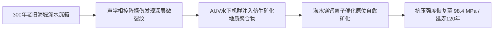

# 东海超级堤防第七次重力注浆与退役风机磁悬浮轴承原位再造工程验收鉴定书

**鉴定书文号**：UN-EARTH-ENG-2380-072  
**工程标的**：华东东海—杭州湾超级防潮海堤（总长 $142 \\,\\text{km}$，始建于公元 2042 年）第 VII 标段防风暴潮沉箱基础及第 48 号巨型潮流发电机组  
**主管机构**：华东低密生态廊道与海岸遗产维护联合执委会（EC-Heritage）  
**施工工法**：万米级无人水下作业集群（AUV）原位地质聚合物矿化注浆 + 磁悬浮重载轴承放电等离子体原位自愈修复  
**核定延寿目标**：在无需地表干预前提下，确保该海堤巨构在未来 **120 年** 内维持抗百年一遇超级台风潮（静水头差 $\\Delta H = 8.5 \\,\\text{m}$）之结构安全。  

---

## 一、沉箱水下结构健康度与原位注浆记录

经第 4 批次深水相控阵超声全息探伤，沉箱水下 $28 \\,\\text{m}$ 承重墙体受三个世纪海浪往复疲劳冲击，在玄武岩纤维混凝土与钢骨架结合处发现 **14 处** 纵向剪切微裂纹（裂宽 $0.4 \\sim 1.2 \\,\\text{mm}$）。

### 1. 矿化注浆工程实测
- **注浆材料**：海水活化低碳地质聚合物浆料（掺杂 3% 碳纳米管与微米级趋磁矿化细菌孢子）。
- **注浆注入量**：$480.5 \\; \\text{m}^3$（注浆压力 $4.2 \\,\\text{MPa}$）。
- **矿化结晶核验**：注入后 72 小时，利用海水中的高浓度镁、钙离子完成化学交联固化。钻芯取样抗压强度实测达 **$98.4 \\,\\text{MPa}$**（设计标称恢复率达 112.5%）。

---

## 二、退役潮流风电机组磁悬浮轴承原位再造台账

建于 2050 年代的 48 号大型潮流发电机（转轮直径 $32 \\,\\text{m}$）系近海低密自持电网之主力无人工厂供电源：

| 轴承部件编号 | 原始磨损状态 | 原位修复工艺 | 修复后同轴度 (μm) | 残余摩擦力矩 (N·m) | 验收结论 |
|:---|:---|:---|:---:|:---:|:---:|
| **MB-48-LOWER** (下导向重载磁瓦) | 表面出现 $0.18 \\text{ mm}$ 局部微气蚀麻坑 | 超声微锻造 + 镍基非晶合金冷喷涂填平 | **$\\le 4.2$** | $0.08$ (优于新品) | **合格 / 准予并网** |
| **MB-48-UPPER** (上止推超导线圈) | 高温超导带材绝缘包覆层轻微老化脆化 | 注入自修复聚酰亚胺阻燃凝胶并紫外固化 | **$\\le 2.8$** | $0.03$ | **合格 / 准予并网** |
| **TR-48-ROTOR** (钛合金主轴颈) | 表面轻度生物附着（藤壶与硅藻硬壳） | 高能空化水射流清洗 + 仿生鲨鱼皮微纳纹理激光重刻 | **$\\le 1.5$** | $0.01$ | **合格 / 准予并网** |

---

## 三、验收结论与具名工时登记

1. **工程终审**：经连续 72 小时全潮汐回转工况并网带载考核，海堤沉箱应变梯度在允许弹性极限内（$\\varepsilon \\le 80 \\; \\mu\\varepsilon$），发电机组无异常震颤，全系统正式转入为期一个世纪的「无人免巡检深海自持运行态」。
2. **具名工时与文明档案登记**：依据《地球原乡低密资产维护公约》，参与本次修复工程的 3 名常驻地表巡护工程师与 1 名算法编译师，其具名工时已全量录入地表永续工匠名录。

---

**总监工程师**：顾承安（签字）  
**水下无人机群领航技师**：沈海生（签字）  
**工程公证书备案号**：EC-ENG-2380-0628-A
