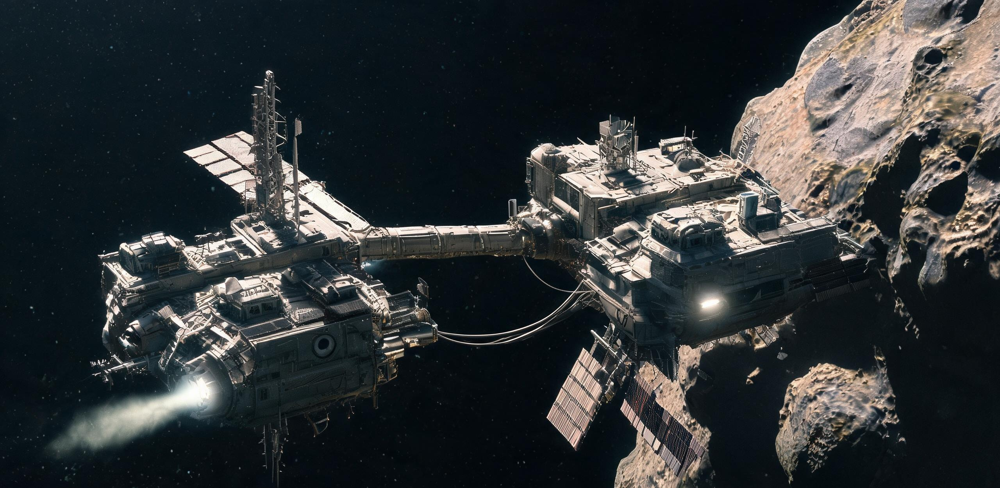

# 主小行星带先导自主采选无人平台紧急避险与物料互援协调规约（试行）

**公文文号：** 深空采联〔2048〕规字第 044 号 ｜ **密级：** 国际工程受控 · 主带全域广播件  
**签发机构：** 国际深空自主采掘工程协调会（ISACEC）、深空资源勘测开发联合总署主带局、泛大西洋深空矿业技术联盟（TADMA）、东亚深空资源开发联合体（EADRC）、地月空间资源开发建设集团  
**生效日期：** 地月协调历 2049 年 01 月 01 日 00:00 UTC（签发：2048 年 12 月 15 日）  
**抄送：** 静海第一竖井工业建设指挥部、地月 L2“远望-1”深冷接收中枢、佳木斯-喀什深空测控干线网  

---

## 序言与法理基准

内太阳系主小行星带内缘（日心距 2.06—2.80 AU）与地月系统存在 **18 至 24 分钟之单向光行时**（指令往返 36—48 分钟）。各方部署之第一代主带先导自主采选平台（“夸父-03”、“燧石-1”、“赫菲斯托斯-02”、“先知-04”等）均搭载百千瓦至兆瓦级空间快堆，长期处于微重力（$10^{-5}\ g$）、极端温差（95 K 至 390 K）与真空冷焊环境。

地面与月面测控受光速壁垒制约，无法对突发性堆芯回路失压、工质泄漏及机械臂抱死实施微秒级干预。为**杜绝核动力平台碰撞解体、防止放射性碎屑云污染共轨航道、保护极其珍贵之先导开采装备与矿样**，各签约方依据《主带近地化矿样捕获与轨道交割清算规程》（深矿联发〔2043〕第007号），特制定本规约。

---

## 第一章 应急态势分级与自律响应准则

```
┌────┬──────────┬────────────────────────────────────┬───────────────────────┐
│级别│ 态势名称 │ 临界物理判据 (机载传感器实测值)    │ 自律处置与互援强制响应│
├────┼──────────┼────────────────────────────────────┼───────────────────────┤
│Ⅰ级 │ 致命解体/│ 1. 堆芯回路失压 (P < 0.18 MPa)     │ 1. 邻近 50,000km 平台 │
│    │ 热工失控 │ 2. 堆温失控 (T_core > 1,180 K)     │    开放防撞隔离走廊； │
│    │          │ 3. 自旋失锁 (角速度 ω > 0.45 rpm)  │ 2. 遇险平台自律钝化。 │
├────┼──────────┼────────────────────────────────────┼───────────────────────┤
│Ⅱ级 │ 动力瘫痪/│ 1. 液氙/液氢管路穿孔 (Q > 0.8 kg/h)│ 1. 距离 <20,000km 平台│
│    │ 工质匮乏 │ 2. 剩余 Δv < 18.0 m/s (失控漂移)   │    自律响应伴飞；     │
│    │          │ 3. 姿控冷气压力 P < 1.2 MPa        │ 2. 实施标准管路加注。 │
├────┼──────────┼────────────────────────────────────┼───────────────────────┤
│Ⅲ级 │ 机构卡死/│ 1. 采掘抓斗/钻机高真空冷焊锁死     │ 1. 调度伴随子星探针； │
│    │ 传感失效 │ 2. 超导磁选机低温杜瓦淬火          │ 2. 实施超声振动解冻或 │
│    │          │ 3. 聚光薄膜镜充气撕裂              │    激光除尘原位维护。 │
└────┴──────────┴────────────────────────────────────┴───────────────────────┘
```
**自律响应原则：** **物理优先、自主握手、实物借调、等价平账、事后核销。**

---

## 第二章 机器自律通信握手协议（ISRU-Mesh-Protocol v1.2）

主带无人平台间之一切互援机动均遵循 **ISRU-Mesh-Protocol v1.2** 广播标准。

```
                    【主带自律避险与互援决策逻辑流】
  [ 遇险平台 (先知-04) ]                       [ 邻近履约平台 (燧石-1) ]
            │                                             │
            ├─────── 1. X波段 SOS 广播 (8.45 GHz, 12s周期) ─────►│ 2. 测算碰撞包络
            │        (含 ICRF 状态矢量与故障代码)         │ 3. 工质自检(底>15%)
            │                                             │
            │◄────── 4. 1064nm 脉冲激光握手确认 (ACK) ────┤
            │                                             │
            │═══════ 5. 开启近场测距 / 自律抵近 ══════════│ (机动 Δv < 12 m/s)
            │                                             │
            │◄ - - - 6. 物理对接 / 工质加注 / 激光补焊 - -┤
            │                                             │
            ├─────── 7. 签署非对称加密凭单 (AID-Voucher) ──►│ 8. 日志双重固化
            ▼                                             ▼
  [ 延迟 22 分钟下行至佳木斯站 ]                 [ 延迟 22 分钟下行至喀什站 ]
            └──────────────────────┬──────────────────────┘
                                   ▼
                 [ 地月 L2 远望-1 中枢记账与平账 ]
```

### 2.1 紧急求援广播报文格式（ISRU-SOS 帧结构）

X 波段深空应答机（8.45 GHz）以 0.1 Hz 周期播发 72 字节紧凑 ASCII 编码：
`$ISRU-SOS,P_ID:KF03,EP:20481215142012,POS:+2.2841E8,-1.1420E8,+0.0812E8,VEL:-12.41,+18.22,+0.45,LVL:2,REA:0480,0890,00.0,PRP:XE:0042,LH2:0120,N2:008,REQ:PROP_XE+TOW,CRC:9F4A8C21*`
- **P_ID**：在册平台代码（KF03=夸父-03，FL01=燧石-1，HP02=赫菲斯托斯-02，AG04=先知-04）；
- **POS / VEL**：太阳系质心 J2000 参考架（ICRF）下位置（km）与速度矢量（km/s）；
- **LVL / REA / PRP**：态势级别（1/2/3）、反应堆工况（热功率/堆温/泄漏率）、工质余量（kg）；
- **REQ / CRC**：请求代码（PROP_XE=液氙，TOW=牵引，THAW=解冻）与 32 位循环校验码。

---

## 第三章 救援物料调剂、工时费率与 LAU 清算机制

主带互助以“月面结算记账分（LAU）”为核算尺度（**1.00 LAU 严格等值于静海电网 1.00 kWh 核电保障底载电能当量**）。

### 3.1 紧急调剂物料标准作价表（衔接地月 L2 交割基准）

| 物资/工质品类 | 规格与物理纯度指标 | 标准借调价 (LAU/kg) | 计价依据与折算说明 |
| :--- | :--- | ---:| :--- |
| **高纯推进级液氙 (Xe)** | 纯度 $\ge 99.999\%$, 杂质 $< 1\text{ ppm}$ | **850.00** | 衔接 GS-2047-01 霍尔电推工质标准交割价 |
| **超低温液氢工质 (LH2)** | 仲氢含量 $\ge 99.8\%$, 温度 $\le 20.4\text{ K}$ | **120.00** | 空间核热推进（NTR）标准变轨工质价 |
| **主带深空原生超纯水冰** | 氘丰度 $\le 82\text{ ppm}$, 低温结晶块 | **860.00** | 替代地月高昂上行水及生保水冰标准价 |
| **天然高纯富铁镍坯** | Fe 88.5%, Ni 10.2%, Co 0.85% | **420.00** | 原位冷压结构修复与配重平衡标准块 |
| **高强碳化硅拖曳缆绳** | 破断拉力 $\ge 450\text{ kN}$, 32mm 编织缆 | **180.00 / 米** | 微重力近距牵引防漂移标准缆具折旧价 |

### 3.2 援助平台物理损耗核算公式

$$\text{Claim}_{\text{total}} = \sum_{i} (M_i \times P_i) + \Delta v_{\text{burn}} \times M_{\text{dry}} \times 1.25 + T_{\text{mech}} \times 2,400.00 + \text{Depr}_{\text{reactor}}$$

1. $\sum (M_i \times P_i)$ 为实拨物资总货值（LAU）；
2. $\Delta v_{\text{burn}} \times M_{\text{dry}} \times 1.25$ 为变轨运力贴现补偿（干重吨数 $\times$ 增量 $\text{m/s} \times 1.25\text{ LAU}$）；
3. $T_{\text{mech}} \times 2,400.00$ 为机械臂/激光作业工时费（每台时 2,400.00 LAU）；
4. $\text{Depr}_{\text{reactor}}$ 为快堆脉冲热工冲击固定补偿（每起救援计提 **15,000.00 LAU**）。

---

## 第四章 不可抗力避险泊位与资产防侵占公约

1. **避险工区使用权**：遇险平台失去动力时，有权紧急利用邻近签约实体已平整之小行星锚固基座、背风防辐射区系泊，最长停靠 **45 个地球日**（每日支付 **1,500.00 LAU** 监测费）。
2. **资产保护红线**：严禁借救援之机实施非授权无线接入、固件逆向或拆运受援方原位封存之金属锭与矿样。违者判定为“深空海盗行为”，扣押其地月 L2 资产并剥夺互援权。

---

## 第五章 典型互援处置与平账备忘（先导期实录）

### 案例一：先知-04（AG-04）高压液氙管路穿孔自律救援
2048 年 9 月 14 日，东亚“先知-04”在 19 号福神星共轨带受微流星撞击导致液氙泄漏（$1.45\text{ kg/h}$），地主时延 20 分 18 秒，机载触发 Ⅱ 级告警。相距 14,200 km 之“燧石-1”（FL-01）自律变轨抵近（耗费 $\Delta v = 8.6\text{ m/s}$），以激光局部重熔完成管壁冷补焊并加注 **85.00 kg 液氙**。

```
[深空互援电子记账凭单 · 远望平账 2048-AID-009 号]
┌────────────────────────────────────────────────────────────────────────────┐
│ 救助平台：燧石-1 (FL-01)             受援平台：先知-04 (AG-04)             │
│ 作业位置：日心空间基准 (2.441 AU, +14.2°, -3.1°) · 19号天体外缘            │
├────────────────────────────────────────────────────────────────────────────┤
│ 1. 紧急调剂物料：液氙 85.00 kg × 850.00 LAU/kg          = 72,250.00 LAU    │
│ 2. 运力与机械补偿：                                                        │
│    - 变轨推进剂消耗 (Δv=8.6 m/s, 干重 1,840 t)          = 19,780.00 LAU    │
│    - 机械臂激光补焊工时 (2.5 台时 × 2,400.00)           =  6,000.00 LAU    │
│    - 反应堆脉冲热工冲击固定折旧补偿                     = 15,000.00 LAU    │
├────────────────────────────────────────────────────────────────────────────┤
│ ★ 索赔总金额：113,030.00 LAU                                              │
│ 结算方式：东亚联合体在地月 L2 远望-1 专户于 2048 年 10 月全额划转平账。     │
│ 履约评定：技术处置评级 优 (Grade-A) ｜ 双方测控数据链校验无异议             │
└────────────────────────────────────────────────────────────────────────────┘
```

### 案例二：赫菲斯托斯-02（HP-02）主钻机高真空冷焊解冻
2048 年 11 月 03 日，泛大西洋“赫菲斯托斯-02”在标靶-RQ36 背风侧钻探遇高真空固相冷焊卡死。“夸父-03”（KF-03）释放 1 具 28 kHz 超声振动子星实施共振剥离，耗时 1.8 小时解锁，核定工时费 **24,600.00 LAU**，已由泛大西洋联盟以 2049Q1 月面玄武岩构件期货冲抵。

---

## 第六章 缔约方签署与生效会签

```
┌────────────────────────────────────────────────────────────────────────────┐
│ 深空资源勘测开发联合总署 主带事务局长：   国际深空采掘标准化委员会 秘书长：│
│          陆振东 （签字）                           埃琳娜·瓦西里耶娃 （签字）│
│ 泛大西洋深空矿业技术联盟 技术总监：       东亚深空资源开发联合体 执行理事：│
│          阿兰·杜波依斯 （签字）                    金镇宇 （签字）         │
│ 地月 L2 远望-1 深冷交割中枢长：           静海第一竖井工业清算特派员：     │
│          罗曼·诺维科夫 （签字）                    徐静仪 （签字）         │
├────────────────────────────────────────────────────────────────────────────┤
│ 签署地点：地月 L2 轨道“远望-1”深冷接收中枢 01 号会议厅                     │
│ 签发日期：公元 2048 年 12 月 15 日                                        │
│ 盖章印鉴：［国际深空自主采掘工程协调会专用章］ ［深空资源联合总署主带局印］│
└────────────────────────────────────────────────────────────────────────────┘
```

---

## 图片提示词

### 中文提示词
纪实风格深空档案照片，建立镜头，主小行星带内缘日心距2.4天文单位。两座百米级无人深空采选试验平台在漆黑太空中近距离伴飞对接，前景168米长的高强度碳纤维桁架与闪烁金光的聚酰亚胺遮阳薄膜向左上方切出画面，冷冽单一日光在钛合金管路与微波反应器上切割出极度锐利的硬高光与纯黑阴影。一根纤细的发光加注管线连接着两座平台，微弱的淡蓝等离子体反推尾焰在虚空中静默喷射，远景为被冰冷阳光照亮一半的嶙峋暗黑碳质小行星与繁密深空星野。哈苏70mm工业质感，无文字无国旗，极致宏微尺度对比。

### 英文提示词
Cinematic archival photograph, establishing shot in the inner asteroid belt at 2.4 AU. Two hundred-meter-class unmanned deep-space mining prototype platforms performing a delicate co-orbital rendezvous in pitch-black space. In the foreground, a massive 168-meter carbon-fiber truss structure with shimmering gold polyimide sunshields extends beyond the upper-left frame, bathed in harsh, unfiltered sunlight that creates razor-sharp specular highlights and pitch-black geometric shadows across titanium propellant conduits and microwave reactor casings. A slender illuminated fueling umbilical bridges the two platforms, while faint cyan ion thruster plumes fire silently into the void. In the background, a rugged, half-shadowed dark carbonaceous asteroid and an infinite starfield stretch across the expanse. Hasselblad 70mm tactile industrial realism, no text, no flags, extreme macro-micro scale contrast.
