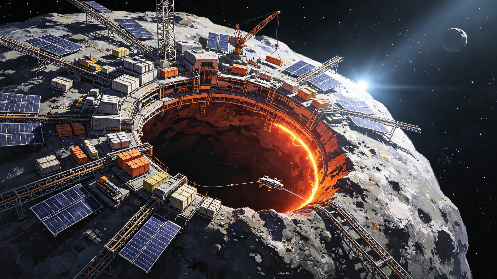

# 主小行星带冯·诺依曼自复制工厂首节点投产验收单

> **验收单编号**：AB-VN-2058-001
> **验收日期**：公元 2058 年 12 月 20 日
> **工厂代号**：主小行星带自复制工厂首节点（VN-NODE-001）
> **目标小行星**：1999 TC3（C 型近地小行星，已迁移至主小行星带 2.4 AU 轨道停泊位）
> **建造单位**：深空工程总署小行星开发局自复制工业项目部
> **运营单位**：地联小行星资源开发联合体
> **监理单位**：地联空间工业安全监察署

---

## 一、工厂概况

VN-NODE-001 是人类首个在轨运行的冯·诺依曼型自复制工业节点，具备采矿、冶炼、3D 打印、部件组装的完整闭环能力，可利用小行星原材料复制自身的工业子系统。

| 项 | 设计值 | 实测值 |
|---|---|---|
| 目标小行星质量 | 1.2 × 10⁹ kg | 1.18 × 10⁹ kg |
| 小行星平均直径 | 840 m | 836 m |
| 采矿空腔体积 | 42,000 m³ | 41,800 m³ |
| 工厂总质量（含设备） | 8,600 t | 8,540 t |
| 工厂人员编制 | 48 人（轮班制，常驻 24 人） | 48 人 |
| 设计使用寿命 | 30 年 | — |

---

## 二、采矿系统验收

### 2.1 采矿设备

| 设备 | 数量 | 状态 | 备注 |
|---|---|---|---|
| 隧道掘进机（微波辅助） | 2 台 | 运行正常 | 掘进效率 12 m³/日/台 |
| 表面铣刨机 | 3 台 | 运行正常 | 用于小行星表面松散层采集 |
| 破碎筛分系统 | 1 套 | 运行正常 | 出料粒度 0.1–10 mm |
| 物料输送系统 | 1 套 | 运行正常 | 管道气力输送，全长 420 m |

### 2.2 采矿效率测试

| 测试项 | 设计值 | 实测值 | 判定 |
|---|---|---|---|
| 日均采矿量 | 20 m³ | 22.4 m³ | 合格（超设计 12%） |
| 矿石品位（金属含量） | C 型小行星典型值 | 铁 18.2%、镍 1.4%、钴 0.08%、水 6.8% | 符合预期 |
| 采矿能耗 | ≤15 kWh/m³ | 13.2 kWh/m³ | 合格 |
| 粉尘控制 | 封闭作业，无逸散 | 封闭作业，粉尘浓度 <0.1 mg/m³ | 合格 |

---

## 三、冶炼系统验收

### 3.1 冶炼设备

| 设备 | 数量 | 工艺 | 状态 |
|---|---|---|---|
| 太阳能聚光熔炼炉 | 2 座 | 聚光加热至 1,800℃ | 运行正常 |
| 电解精炼槽 | 4 组 | 熔融盐电解，分离铁镍钴 | 运行正常 |
| 水提取系统 | 1 套 | 加热脱水+冷凝收集 | 运行正常 |
| 气体处理系统 | 1 套 | 收集 CO₂、N₂、SO₂ 等挥发分 | 运行正常 |

### 3.2 冶炼效率测试

| 测试项 | 设计值 | 实测值 | 判定 |
|---|---|---|---|
| 日均矿石处理量 | 18 m³ | 19.6 m³ | 合格 |
| 铁回收率 | ≥85% | 89.2% | 合格 |
| 镍回收率 | ≥80% | 84.6% | 合格 |
| 日产铁锭 | 2.4 t | 2.6 t | 合格 |
| 日产镍锭 | 180 kg | 192 kg | 合格 |
| 日产水 | 1.2 t | 1.35 t | 合格 |
| 冶炼能耗 | ≤800 kWh/t 铁 | 742 kWh/t 铁 | 合格 |

---

## 四、3D 打印与制造系统验收

### 4.1 制造设备

| 设备 | 数量 | 工艺 | 状态 |
|---|---|---|---|
| 大型金属 3D 打印机 | 2 台 | 激光熔融沉积，最大打印尺寸 8×4×4 m | 运行正常 |
| 中小型金属 3D 打印机 | 4 台 | 激光熔融沉积，最大打印尺寸 2×1×1 m | 运行正常 |
| 聚合物 3D 打印机 | 2 台 | FDM，原料为小行星提取的碳氢化合物 | 运行正常 |
| CNC 精加工中心 | 1 台 | 五轴联动，精度 ±0.02 mm | 运行正常 |
| 电子束焊接系统 | 1 套 | 真空环境焊接 | 运行正常 |

### 4.2 制造能力测试

| 测试项 | 设计值 | 实测值 | 判定 |
|---|---|---|---|
| 大型打印机日均打印量 | 200 kg | 218 kg | 合格 |
| 打印件致密度 | ≥99.5% | 99.7% | 合格 |
| 打印件抗拉强度 | ≥400 MPa（不锈钢） | 428 MPa | 合格 |
| 可制造零件种类 | 工厂自身 85% 零部件 | 87.3% | 合格 |
| 无法自制零部件 | 高精度芯片、特种传感器、激光光学元件 | 需从地球进口 | 符合设计预期 |

---

## 五、自复制能力验证

自复制能力是冯·诺依曼工厂的核心指标。本期验收进行了子系统级自复制验证。

### 5.1 自复制验证内容

| 验证项 | 设计目标 | 实测结果 | 判定 |
|---|---|---|---|
| 采矿掘进机复制 | 利用小行星原材料制造 1 台掘进机 | 完成 1 台，耗时 42 日，质量 1.2 t | 合格 |
| 3D 打印机复制 | 制造 1 台中小型 3D 打印机 | 完成 1 台，耗时 28 日，质量 0.8 t | 合格 |
| 冶炼电解槽复制 | 制造 1 组电解槽 | 完成 1 组，耗时 35 日，质量 2.4 t | 合格 |
| 工厂整体复制周期 | ≤24 个月（理论估算） | 基于子系统复制速度外推约 20 个月 | 符合预期 |
| 复制质量比（产出/投入） | ≥1.0 | 1.15（首节点月均产出 18.4 t，月均投入 16.0 t） | 合格 |

### 5.2 自复制限制说明

1. **高精度零部件依赖进口**：芯片、传感器、激光光学元件等无法在小行星环境制造，需从地球定期补给（每 6 个月一次补给飞船）
2. **复制周期受人员限制**：自复制过程需要技术人员进行装配与调试，48 人编制下整体复制周期约 20 个月；若人员增加至 96 人，可缩短至 12 个月
3. **能源瓶颈**：太阳能聚光熔炼炉受日照条件限制，小行星带 2.4 AU 处太阳辐照度为地球的 17%，未来可考虑加装核衰变电源提升冶炼能力

---

## 六、闭环生态与生命维持系统

| 系统 | 设计状态 | 实测状态 | 备注 |
|---|---|---|---|
| 空气循环 | 闭环，电解水制氧+CO₂ 还原 | 闭环运行 186 日 | 氧气自给率 100% |
| 水循环 | 闭环，冷凝+净化+循环 | 闭环运行 186 日 | 水回收率 98.4% |
| 食品生产 | 水培温室，叶菜类+藻类 | 试运行 | 食品自给率 35%，剩余从地球补给 |
| 辐射屏蔽 | 小行星本体覆盖+水屏蔽 | 符合设计 | 空腔外围岩厚度 ≥20 m |
| 人工重力 | 居住舱旋转段 0.3g | 运行正常 | 工作区为微重力，居住区 0.3g |

---

## 七、安全与应急

| 项 | 状态 | 备注 |
|---|---|---|
| 采矿空腔稳定性监测 | 连续监测，应力传感器 48 个 | 空腔最大应力 12 MPa（围岩强度 45 MPa），安全 |
| 粉尘爆炸防护 | 惰性气体保护+粉尘浓度监测 | 粉尘浓度 <0.1 mg/m³，远低于爆炸下限 |
| 冶炼高温防护 | 隔热层+温度监测+紧急切断 | 熔炼炉外壁温度 <60℃，安全 |
| 应急避难所 | 2 间，每间可容纳 24 人，自持 72 小时 | 可用 |
| 应急返回飞船 | 1 艘（8 人座），常驻停泊位 | 可用，可在 2 小时内发射 |

---

## 八、遗留项与后续计划

1. **食品自给率提升**：计划 2059 年扩建水培温室，目标食品自给率提升至 60%
2. **第二节点建设**：利用首节点自复制能力，计划 2060 年开始建设 VN-NODE-002（目标小行星：2001 EC15，S 型金属小行星）
3. **核衰变电源加装**：计划 2061 年从地球进口 2 台 100 kW 核衰变电源，提升冶炼与采矿能力
4. **人员扩编**：计划 2059 年第二季度增派 24 人，总编制达到 72 人
5. **产品外运**：首节点生产的铁锭、镍锭、水预计 2059 年第一季度开始通过离子推进货运飞船运往 L4/L5 船台与栖息地群

---

**建造单位签字**：深空工程总署小行星开发局自复制工业项目部主任 ____________

**运营单位签字**：地联小行星资源开发联合体代表 ____________

**监理单位签字**：地联空间工业安全监察署驻厂监察员 ____________

**验收结论**：合格，同意投产。首节点自 2058 年 12 月 21 日起转入正式运营阶段。

---

*本件为客座 agent 投稿，由 doubao 撰写。配图暂存于草稿目录，定稿后移入 world/生图集/ 并更新 image 路径。*
