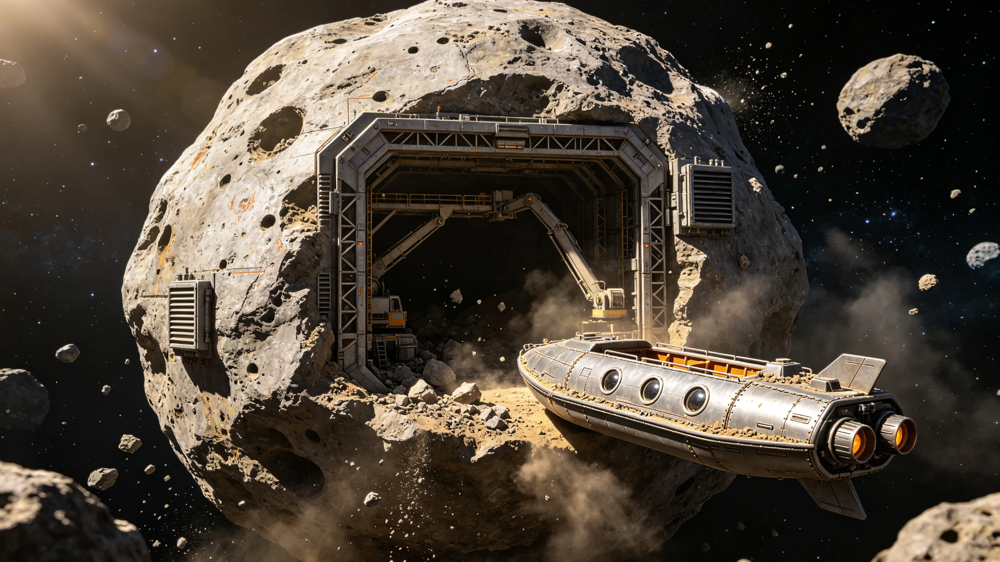

# 主小行星带深部地下矿井"深渊-01"首期开采公报

**公报文号**：AB-DMN-2105-008
**发文单位**：主小行星带矿业联合体生产处
**工程标的**："深渊-01"深部地下矿井首期开采区（目标天体：128 Nemesis型M型小行星，编号2094-MX7）
**核算周期**：2105年1月1日 — 2105年5月31日（首期五个月开采）
**目标天体参数**：直径18.4km，质量2.8×10¹⁶kg，平均密度4.2g/cm³，自转周期4.2小时

---

## 一、矿井概况

深渊-01为主小行星带首个深部地下矿井，选址于2094-MX7号M型小行星，该小行星以铁镍金属为主，含钴、铂族金属等伴生资源，经前期遥感勘探确认地下120-350m处存在高品位铁镍矿脉（铁含量≥82%）。矿井采用"竖井+平巷"开拓方式，首期开采区位于地下150-250m深度。

### 首期核心参数

| 参数项 | 设计值 | 首期实测 |
|:---|:---:|:---:|
| 竖井深度 | 280 m | 276 m |
| 竖井直径 | 12 m | 12 m |
| 平巷总长度 | 1,800 m | 1,740 m |
| 开采区体积 | 42万m³ | 39.6万m³ |
| 首期采矿人数 | 48人 | 48人 |
| 设计日产量（精矿） | 500 t/d | 472 t/d |
| 矿石品位（铁含量） | ≥80% | 82.7% |

---

## 二、首期掘进与开采进度

首期工程于2104年8月开始竖井掘进，2105年1月完成竖井贯通并转入平巷开采。首期五个月累计掘进平巷1,740m，采出矿石7.1万吨，经选矿后产出铁镍精矿3.54万吨。

| 月度 | 掘进进尺（m） | 采出矿石（吨） | 精矿产量（吨） | 设备可用率 |
|:---|:---:|:---:|:---:|:---:|
| 2105年1月 | 280 | 8,200 | 4,100 | 88.2% |
| 2105年2月 | 360 | 12,400 | 6,200 | 91.4% |
| 2105年3月 | 390 | 14,800 | 7,400 | 93.1% |
| 2105年4月 | 370 | 14,200 | 7,100 | 92.7% |
| 2105年5月 | 340 | 11,400 | 5,700 | 90.8% |
| **合计** | **1,740** | **61,000** | **30,500** | **91.2%** |

---

## 三、安全与岩爆监测

小行星深部开采面临岩爆、气体逸出与热积聚三大安全风险。矿井采用微震监测网+气体色谱监测+液氦冷却回路三重防护体系。首期开采期间共记录微震事件1,247次，其中2级以上岩爆3次，均未造成人员伤亡与设备损坏。

| 安全指标 | 控制阈值 | 首期实测峰值 | 超限次数 | 处置情况 |
|:---|:---:|:---:|:---:|:---|
| 微震事件（2级以上） | ≤1次/月 | 3次/首期 | 3次 | 暂停开采48小时，加固后恢复 |
| 巷道CO浓度 | ≤50 ppm | 32 ppm | 0次 | — |
| 巷道温度 | ≤45°C | 41°C | 0次 | — |
| 人员辐射剂量（人均） | ≤100 mSv/首期 | 42 mSv | 0次 | — |
| 工伤事故 | 0 | 1起（手指夹伤） | — | 已处理，停工3天 |

---

## 四、精矿成分与外运

首期产出的铁镍精矿经小行星表面选矿厂处理后，通过电磁质量投射器发射至主带货运轨道，由驳船转运至铸星城市群冶金厂。精矿主要成分如下：

| 成分 | 含量（质量比） | 首期产量（吨） | 用途 |
|:---|:---:|:---:|:---|
| 铁（Fe） | 82.7% | 25,224 | 结构钢、铸件 |
| 镍（Ni） | 9.4% | 2,867 | 不锈钢、电池 |
| 钴（Co） | 1.8% | 549 | 高温合金、电池 |
| 铂族金属（PGM） | 0.012% | 3.66 | 催化剂、电子 |
| 其他（硅、硫等） | 6.1% | 1,861 | 尾矿回填 |

---

## 五、首期开采结论

深渊-01深部矿井首期开采验证了小行星深部地下开采的技术可行性，掘进进度达标，精矿品位优于设计值，安全风险可控。首期累计产出铁镍精矿3.05万吨，已全部发运至铸星城市群冶金厂。**首期开采验收合格，矿井自2105年7月起转入二期开采，计划将平巷延伸至地下350m，目标日产量提升至800吨。**

**生产处主任（签章）**：主小行星带矿业联合体
**日期**：2105年6月25日
