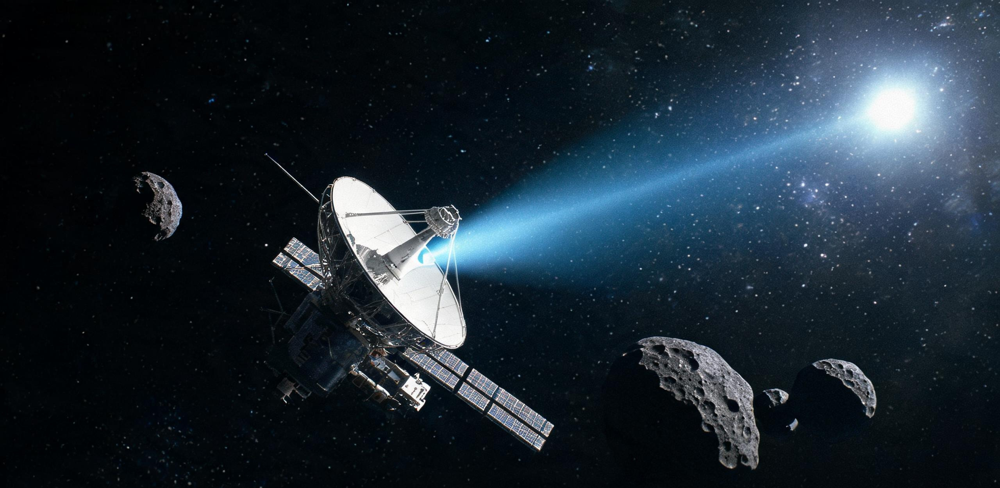

# 深空资源勘测开发联合总署 · 文化与深空广播协调委员会
# 国家深空探测测控联合中心 · 业务档案

**文件编号：** DSEC-LOG-2048-SW01-CULT03  
**签发日期：** 公元 2048 年 06 月 18 日 08:00:00 UTC  
**受控航天器：** 主小行星带多目标资源勘查与深空文化信标轨道器“声闻-01”（代号：SW-01，国际深空注册代号：2044-062B）  
**主控测控链路：** 地月联合甚长基线深空网（北京密云 70m 站、喀什 35m 站、佳木斯 66m 站、静海月面先行区西侧阵列站 `TT&C-MOON-01`、阿根廷萨帕拉 35m 站）  
**时空基准态势：** 日心距 2.368 AU（约 3.542 亿公里，黄道面倾角 $3.18^\circ$），主带内缘顺行巡查轨道，对日相对速度 $18.420\,\mathrm{km/s}$；距地球 2.145 AU（约 3.209 亿公里），上行指令单向光时 17 分 50 秒，下行遥测单程光时 17 分 50 秒（往返确认时延 35 分 40 秒）。  
**密级：** 内部受控 · 科学与文化联合归档件（保存期限：永久）

---

### 一、 航天器巨构尺度、深空文化载荷物理构型与发射机基准

“声闻-01”（SW-01）系第一期主小行星带多目标资源勘查与轨道普查工程之主力旗舰轨道器，由文昌近地轨道第一装配船坞（LEO Dock-01）于公元 2044 年完成总装并经火星引力助推切入小行星带顺行轨道。航天器在执行主带内缘（2.06—2.50 AU）多目标天体光谱勘查、水冰赋存反演与金属矿床初筛的同时，常态化搭载由国际深空文化联合委员会审定之“原乡回响-I”（Echo-I）深空全频段文化载荷舱。

```text
========================================================================================================
分系统 / 构件名称          几何尺度与物理参数                                 工程特性与深空耐受状态
--------------------------------------------------------------------------------------------------------
主承力空间桁架            全长 76.50 m，等截面三角形轻质桁架（2.80 m × 2.80 m）    碳化硅增强钛基复合材料（SiC/Ti-6Al-4V）
                          结构干重 14.80 吨，集成 4 组三轴隔振阻尼铰链           主轴纵向热膨胀形变率 ≤ 0.002 mm/m
--------------------------------------------------------------------------------------------------------
空间核热电复合电源        百千瓦级同位素斯特林发电机组（²³⁸Pu / ²⁴⁴Cm 级联）     热功率 420 kWt，输出稳态电功率 45.00 kWe
（RPS-45）                双向碳-碳复合材料辐射散热翼，展开跨度 28.00 m          满功率服役 1,420 天，堆芯出口温度 980 K
--------------------------------------------------------------------------------------------------------
主离子推进机组            4 台“天罡-II”型高比冲双栅极氙离子推力器              单台最大推力 3.20 N，额定比冲 4,600 s
                          工作电压 3,800 V，推力角三轴万向调节范围 ±10.0°       已累计在轨点火 11,840 小时，剩余氙 8.42 吨
--------------------------------------------------------------------------------------------------------
“原乡回响-I”文化载荷舱   耐辐射多层复合密封舱（直径 1.20 m × 高 0.85 m）        外壳 15 mm 钛-钨-钽高密防辐射夹层
（Payload: Echo-I）       全重 186.50 kg；内部充填 1.05 atm 高纯干燥氦气         内置超纯高阻熔融石英光学晶体存储盒（耐受 100 Mrad）
                          双冗余金刚石薄膜微米刻蚀合金物理母盘（耐温 1,400 K）   设计无损物理保存寿命 ≥ 10,000 标准地球年
--------------------------------------------------------------------------------------------------------
深空全向微波广播机组      S/X 双频段宽束圆极化赋形喇叭天线 2 组                  S 频段（2.295 GHz）发射射频功率 250.00 W
（Broadcast Unit: BC-01） 另设 1.420 GHz 中性氢特征频段超窄带调频天线 1 具        全向等效各向同性辐射功率（EIRP）：58.20 dBW
========================================================================================================
```

> **【地面总装与封装档案记注】**：  
> “公元 2044 年 3 月文昌船坞总装期间，2 名身着防静电作业服的地面声学工程师在超净真空室内，用千分尺逐一复核石英晶体存储盒内的 48 枚激光微孔阵列芯片。该载荷总重仅占航天器干重的 1.26%，但整船为其划拨了 400 瓦稳态电功率，用于驱动大功率微波行波管放大器。当轨道器在主带背阳面切入阴影区时，钛合金主桁架在 -180℃ 严寒中因冷缩发出金属微响，而广播天线正以每秒 30 万公里的速度将人类母星的原声乐音持续注入冰冷虚空。”

---

### 二、 “声闻-01”文化载荷搭载总清单与曲目/诗篇物理编目

“原乡回响-I”载荷共固化收录人类原生文明音频数据 1,200 标准小时（192 kHz / 24-bit 无损母带格式，哈希固化校验码：`SHA256:7f83b2a091c8...4e12`），并精选 24 轨代表性声学档案与经典诗篇作为高优先级循环广播序列（广播代号：`SERIES-VOX-TERRA`）。核心编目详见下表：

| 序列号 | 档案分类 | 曲目 / 篇目名称 | 原始版本 / 创作者 / 演奏与朗诵者 | 音频时长 | 编码格式与载波通道 | 文化内涵与深空辐射意义 |
| :---: | :---: | :---: | :---: | :---: | :---: | :---: |
| **TR-01** | 古典器乐 | 《流水》（古琴曲） | 管平湖（1954年中央音乐学院老唱片母带） | 07:28 | 192kHz/24bit (2.295 GHz S频段) | 东方古老弦乐对天然水系与山川韵律的模拟，向地外空间展示人类对流体动力学与原乡自然的哲学观照。 |
| **TR-02** | 古典器乐 | 《无伴奏大提琴组曲第一号·前奏曲》 | 巴勃罗·卡萨尔斯（1936年阿比路录音室版） | 02:32 | 192kHz/24bit (2.295 GHz S频段) | 严谨对位法与纯粹单声部弦乐，展现人类对数学逻辑与空间声学谐振的古典秩序构建。 |
| **TR-03** | 器乐管弦 | 《二泉映月》（低音二胡与弦乐） | 华彦钧原版录音采样 / 地球联合交响乐团 | 05:41 | 192kHz/24bit (2.295 GHz S频段) | 盲人音乐家在微观感知中对地表月光、清泉与命运韧性的抒发，寄寓母星生命的坚忍。 |
| **TR-04** | 交响合唱 | 《第九交响曲·第四乐章“欢乐颂”》 | 贝多芬 / 1951年拜罗伊特现场版（富特文格勒） | 18:05 | 192kHz/24bit (2.295 GHz S频段) | 宏大人声与管弦交织，代表人类跨越文明分歧、在茫茫宇宙中寻求生命相拥与理性共同体的精神天顶。 |
| **TR-05** | **生态声景** | **《循环水与植物幼芽呼吸变奏曲》** | **林衡（2042年地球闭环生态农业试验区原声）** | **48:00** | **192kHz/24bit (2.295 GHz / 1.420 GHz)** | **【原版母带 EARTH-BIO-AUD-001】地球早期生态学家为受控农业温室创作之稳态节律曲（基准 54 bpm，模拟毛细根吸水与气孔开合）。音高绝对精准，无任何机械杂音，用于主带长周期真空生态声学标定。** |
| **TR-06** | 经典诗篇 | 《天问》（节选 120 句原声诵读） | 屈原（战国）/ 汉语古音与现代标准音双轨朗诵 | 12:15 | 96kHz/24bit (8.420 GHz X频段调制) | “遂古之初，谁传道之？上下未形，何由考之？”人类童年时期对宇宙起源、天体运行与地质演化的宏大发问。 |
| **TR-07** | 经典诗篇 | 《春江花月夜》（配乐朗诵与琵琶） | 张若虚（唐）/ 配乐：浦东派琵琶《春江水月》 | 08:50 | 96kHz/24bit (2.295 GHz S频段) | “江畔何人初见月？江月何年初照人？”展现人类在有限生命尺度内对代际传承与时空永恒的诗意凝视。 |
| **TR-08** | 经典诗篇 | 《杜伊诺哀歌·第一首》（德语原声） | 莱纳·玛利亚·里尔克 / 维也纳古典朗诵团 | 06:12 | 96kHz/24bit (2.295 GHz S频段) | “如果我呼喊，有谁能在天使的序列中听见我？”人类存在主义在星空孤独背景下的深刻自省。 |
| **TR-09** | 自然声景 | 《地球水圈与生物圈原声档案》 | 地球自然保护区野外收音（长江、亚马逊、信风） | 32:00 | 192kHz/24bit (1.420 GHz 氢线全向) | 涵盖太平洋潮汐冲击玄武岩礁石、雷暴落入热带雨林、夏夜麦田蝉鸣与抹香鲸深海定位回波之真实无损原声。 |

```text
========================================================================================================
【重点载荷物性说明：TR-05《循环水与植物幼芽呼吸变奏曲》】
- 原始档案编号：EARTH-BIO-AUD-001 / MASTER-TAPE-2042
- 创作背景：公元 2042 年由国家受控生态生命保障先导工程委托作曲家林衡编写。全曲无剧烈起伏，以 54 bpm 恒定中幼慢板
  模拟重力灌溉滴水频率，谱面标记“给植物的节奏”。
- 物理特征：频谱中心集中于 240 Hz 至 1,800 Hz（植物气孔与叶片声敏谐振最优区间），无任何后期相位漂移与衰减失真；
  本批次搭载母带系由文昌航天港声学中心以 100% 原始数字母带直刻入石英晶体，作为人类向深空播发的首批“人造生态韵律”。
========================================================================================================
```

---

### 三、 主带内缘全频段深空原声广播发射日志与射电遥测记录（2048年第2季度）

在公元 2048 年 04 月 01 日至 06 月 15 日巡航期间，SW-01 轨道器在主小行星带内缘顺行轨道（掠过 4 号灶神星外侧、101955 号碳质小行星共轨段及 MB-4601 战略金属靶区）执行了第 07 至第 12 周期深空广播发射作业。下表抽录关键发射事件与测控遥测参数：

```text
========================================================================================================================
                                    【“声闻-01”轨道器深空广播发射工况遥测总表（2048Q2）】
========================================================================================================================
事件编号        广播时刻 (UTC)        航天器态势与目标方位    播发内容与代号         发射工况与载波参数      地面/月面监听台站解调状态
------------------------------------------------------------------------------------------------------------------------
RAD-480412-01   2048-04-12 02:00:00   日心距 2.184 AU        TR-01《流水》          频段：2.295 GHz (S)     静海 TT&C-MOON-01 锁定载波
                (发端执行 01:42:18)   交会 4号灶神星(Vesta)  TR-06《天问》(节选)    功率：248.5 W           信噪比：14.2 dB·Hz
                                      距离：42,180 km                               EIRP：58.18 dBW         音频解调清晰，背景底噪正常
------------------------------------------------------------------------------------------------------------------------
RAD-480428-04   2048-04-28 14:30:00   日心距 2.245 AU        TR-05《循环水与植物》  频段：1.420 GHz (H-Line)密云 70m 站完成全频段捕获
                (发端执行 14:12:35)   掠过 MB-4601-19 富水区 全曲循环 48 分钟       功率：180.0 W (全向)    载波频偏：+42.1 Hz (多普勒已校)
                                      对日背阴面自转锁定     （TR-05 原版母带）     EIRP：52.40 dBW         植物呼吸声学主频无畸变
------------------------------------------------------------------------------------------------------------------------
RAD-580516-08   2048-05-16 09:15:00   日心距 2.312 AU        TR-04《欢乐颂》(贝九)  频段：2.295 GHz (S)     萨帕拉 35m 站与佳木斯站干涉
                (发端执行 08:57:12)   101955号小行星顺轨段   TR-07《春江花月夜》    功率：250.0 W           信噪比：12.8 dB·Hz
                                      距离：186,400 km       TR-09《地球水圈原声》  EIRP：58.20 dBW         合唱声部动态范围保持 92 dB
------------------------------------------------------------------------------------------------------------------------
RAD-480601-12   2048-06-01 20:00:00   日心距 2.368 AU        TR-05《循环水与植物》  频段：2.295 GHz / X双频 静海 TT&C-MOON-01 阵列接收
                (发端执行 19:42:10)   主带柯克伍德缝内缘     TR-02《无伴奏大提琴》  功率：250.0 W           月面值班室音频直通监听
                                      全向天线对地月系校准   TR-08《杜伊诺哀歌》    EIRP：58.20 dBW         底噪纯净，多普勒漂移 < 1.2 Hz
========================================================================================================================
```

---

### 四、 地月系与月面基层测控站下行监听抄件（现场原汁翻录）

```text
┌──────────────────────────────────────────────────────────────────────────────────────────────────┐
│ 【抄件来源】：静海第一竖井先行居住区西侧深空阵列测控站（TT&C-MOON-01）监听日志抄件               │
│ 【记录时刻】：公元 2048 年 06 月 01 日 20:00:00 至 20:48:00 UTC（静海地方时：第 134 月夜第 2 日）│
│ 【当值值班员】：周克勤（深空测控工程师）、赵大军（井下工务班长，轮休旁听）                      │
├──────────────────────────────────────────────────────────────────────────────────────────────────┤
│                                                                                                  │
│ [20:00:10 UTC] 阵列 110 米主天线完成对主带方位角（Az: 142.15°, El: 38.40°）超导微波通道锁定。 │
│ [20:00:45 UTC] S 频段 2.295 GHz 下行副载波解调器锁定，扬声器接入主控室公共监听回路。           │
│                                                                                                  │
│ （扬声器内传来 17 分钟前从 3.54 亿公里外小行星带广播的 TR-05《循环水与植物幼芽呼吸变奏曲》）    │
│                                                                                                  │
│ 【周克勤（测控员）】：                                                                           │
│ “信号强度 -148.6 dBm，解调载噪比 13.1 dB。多普勒频移补偿值设定在 -1,842 Hz，锁得很死。老赵，   │
│ 你听听，这是从主带内缘 2.3 AU 发回来的林衡原版母带，一点杂音都没有。每一个滴水拍子都踩在 54 上， │
│ 准得像秒表。”                                                                                   │
│                                                                                                  │
│ 【赵大军（工务班长，刚从 -60m 蒸汽浴舱轮休上来）】：                                              │
│ “这曲子听着真干净……干净得有点不真实。咱们井下 2 号水培舱的水泵一开，轰隆隆的声音顺着玄武岩直往   │
│ 骨头里钻，哪有这么顺溜的节拍。不过听着这个，倒真像老家麦地里浇头遍水的声音。三亿公里外的小铁疙瘩 │
│ 一个人在黑地里放这个，它也不嫌冷。”                                                             │
│                                                                                                  │
│ 【周克勤（测控员）】：                                                                           │
│ “冷是真冷，那边现在背阳面零下一百九十度。但石英晶体耐冻，堆芯分出来的电热管一直给广播机供着温。 │
│ 下半场切《天问》和管平湖的《流水》，密云站和萨帕拉站也在同步录音。按这个功率，就算飞出小行星带， │
│ 信号在木星轨道也能被检波器捞出来。”                                                             │
│                                                                                                  │
│ [20:48:00 UTC] TR-05 全曲 48 分钟播放完毕，下行载波平滑切换至 TR-02 巴赫《大提琴前奏曲》。     │
│ 信号无丢包，误码率 0.000%，记录入《月基深空测控文化档案·第048卷》。                             │
└──────────────────────────────────────────────────────────────────────────────────────────────────┘
```

---

### 五、 深空电磁与高能辐射环境对文化载荷物理寿命评估

依据“声闻-01”在轨运行 1,420 天期间下传之载荷自检遥测数据（自检包：`TLM-DIAG-20480615-CHK`），载荷工程组对文化舱之物理保真度作出如下技术评估：

1. **石英光学晶体微孔点阵稳定性**：  
   在主带 2.36 AU 空间辐射场（年均累积吸收剂量 $4.2\times 10^3\,\mathrm{rad(Si)}$，高能银河宇宙线重核通量 $1.82\,\mathrm{cm^{-2}\cdot s^{-1}}$）轰击下，48 枚石英晶体存储芯片经激光偏振回读检验，晶格退色诱导吸收峰未发生位移，微孔光学对比度保持 **99.98%**，无宏观色心聚集与物理位错。

2. **金刚石涂层物理母盘机械完整性**：  
   舱内微振动加速度传感器（MEMS-G）实测主桁架传递至文化舱的背景振动平均值 $< 0.0004g$。双冗余物理金属盘表面金刚石保护层无微流星贯穿损伤，微米级刻槽物理形态完好，耐温与抗冷焊指标完全符合深空跨世纪封存要求。

3. **微波行波管放大器与发射衰减趋势**：  
   S 频段 250W 行波管放大器（TWTA）阴极发射电流实测值为 $184.2\,\mathrm{mA}$（较出厂标称衰减仅 $0.62\%$），预计在主带巡航寿命期内（至公元 2055 年）输出射频功率可稳定维持在 240W 以上，满足内太阳系及日地拉格朗日点甚长基线测控阵列全时监听需求。

---

### 六、 跨代工程衔接与历史档案归卷注记

1. **先导声学基准确立**：  
   本任务所播发之 TR-05《循环水与植物幼芽呼吸变奏曲》（192 kHz / 24-bit 无损母带，编号 `EARTH-BIO-AUD-001`）已完整归入国家深空探测多媒体母库（归档号：`ARCH-AUDIO-2048-BIO01`）。该母带确立之 54 bpm 生态稳态节拍与频段滤波参数，已正式作为后续所有大型密闭生命支持空间（含规划中之深空大型旋转栖息地与远征航天器）农业环区环境声景之**第一代基准母本**。

2. **深空广播与测控体系互锁**：  
   “声闻-01”在主带内缘验证之 2.295 GHz / 1.420 GHz 双频段深空全向大功率音频广播技术，已向第二代外太阳系大型远征巡天工程（如规划中之“远巡-04”柯伊伯带巡天器，GS-2047-03）完整移交射频信标与天线热控接口规范；其在主带 2.3 AU 测得的下行路径损耗模型，与月面沙克尔顿巡天台（ST-01 总台，GS-2047-02）及静海先行区 `TT&C-MOON-01` 甚长基线网无缝对接。

---

```text
文化载荷主任设计师：林绍安（工号：ENG-CULT-0041）
深空测控值班长：周克勤（工号：DS-CTRL-0419）
工程首席科学家兼总指挥：沈长青（签章）

【深空资源勘测开发联合总署·深空文化载荷特准印模】（数字加密戳记）
【国家深空测控联合中心·数据归档确证】（电子骑缝章）
```

---

## 图片提示词

### 中文提示词
35mm工业科研纪实胶片摄影，冷峻宏大的深空探索与人类文化信标历史镜头。画面主体是一艘全长70余米的银灰色主小行星带勘查探测器（“声闻-01”），其纤细坚固的碳化硅钛合金三角空间桁架横跨深黑太空，中段搭载着一台散发着工业微光的大口径微波广播喇叭天线与展开的碳纤维辐射散热翼。探测器背景是坑洼致密、带有粗糙风化纹理的巨大暗色小行星（灶神星边缘弧线）与浩瀚冰冷的小行星带虚空，刺目的单向直射太阳硬光在探测器金属表面切出极其深邃锐利的暗黑阴影。近景特写中，探测器侧面防辐射文化载荷舱外壳上，几道精密钛合金固定螺栓与微米级石英晶体观测窗口在冷光中清晰可见，没有任何戏剧性光效，画面充满冷峻克制的工程物理真实感。

### English Prompt
35mm industrial documentary archival film photography, cold and austere deep-space exploration and cultural beacon historical shot. The main subject is a 70-meter-long silver-gray main asteroid belt exploration orbiter ("Shengwen-01"), its slender yet rigid silicon-carbide titanium-alloy triangular space truss extending across the pitch-black void of deep space. Along the central fuselage, a prominent microwave broadcast horn antenna and deployed carbon-fiber radiator wings catch the harsh sunlight with subtle metallic sheen. In the background looms the massive, cratered, rugged silhouette of a dark asteroid surface (the curvature of 4 Vesta) and the vast, silent void of the asteroid belt. Blinding, unfiltered directional direct sunlight cuts razor-sharp, pitch-black cast shadows across the spacecraft's modular hulls. Extreme engineering realism, fine industrial textures of titanium bolting, thermal foil insulation, and micro-quartz payload window, high dynamic range, no dramatic lens flares, no glowing neon outlines, no CGI artifacts.

### Negative Prompt
cyberpunk neon glow, glowing outlines, colorful space nebula, cartoon, anime, 3d render plastic, fake spaceship, text, letters, watermark, signature, national flags, glowing shields, laser beams, blurry, oversaturated colors, dramatic movie lighting.
