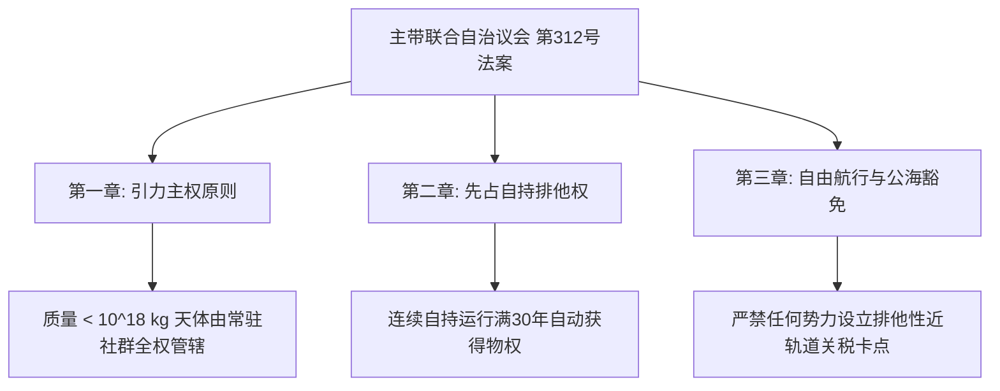

# 主小行星带联合自治议会第312号法案：内太阳系无主矿星引力主权与自由航行公约

**法案文号**：ASTRO-LAW-2392-ACT-312  
**通过机构**：主小行星带自由城邦联合自治议会（谷神星主会场 / 灶神星、智神星分会场代表大会）  
**投票结果**：赞成 89.4% / 反对 6.2% / 弃权 4.4%（全案法定生效）  
**签署生效日**：主带公历 2392年10月15日  
**废止旧法**：宣告全面终止地联《外层空间资源开发特许登记条例（2070年版）》在主带天区之管辖效力  

---

## 序言与历史决议

鉴于：
- 恒星际远征船「ARK-01」已成功进入比邻星系统并建立初始拓荒营地，人类文明已不可逆地跨越单一恒星系羁绊；
- 主小行星带各大采矿栖息地、熔炼前哨与自持工厂群已实现全要素工业品自给与第三代本土人口更迭，地球母星长期保留之“宗主特许开采权”在物理与法理上均已丧失实际执行基础。

主小行星带联合自治议会特颁布本法案，作为内太阳系空间法权之基础根本大法：

---

## 法案核心条款摘录

### 第一条：引力主权分级原则（Gravitational Sovereignty）
1. 凡分布于火星轨道外缘（$1.52 \\text{ AU}$）至木星轨道内缘（$5.20 \\text{ AU}$）之间、且自身质量小于 $1.0 \\times 10^{18} \\text{ kg}$ 之所有小行星、碳质球粒陨星与彗核天体，其原始矿产权力归属于该天体之**第一常住自持社群**。
2. 彻底废除任何未驻人实体凭借遥测光谱普查所主张的“远程预占权”与地表纸面登记权。

### 第二条：先占自持与物权确权（30年自持法则）
1. 任何工程实体或民间互助社，凡在一个天体上建立物理自持封闭循环（年均闭环率 $\\ge 95\\%$）并常驻作业人员连续繁衍或轮值满 **30 个地球年** 者，即自动享有该天体之永久不动产物权、开采收益权及地名命名权。
2. 任何来自地月系或火星的外部势力不得以历史投资为由强行征收或派驻武装征税力量。

### 第三条：深空主干航道公海豁免与互援义务
1. 确立主带四大公海主干航道（天梭航路、谷神-灶神环流线、黑石礁对冲走廊、木星重力助推引力通道）为**全人类永久非武装自由航行区**。
2. 任何悬挂主带或地月旗帜之民用运输舰，在公海航道遭遇微陨爆、减压或推进剂耗尽等海难时，半径 0.2 AU 内的所有采选平台与前哨必须无条件启动《空间人道主义互援规约》，就近提供水、氧与应急钨粉工质救助。

---

## 签批与全域公告

本法案全文自通过之日起，由谷神星高轨大功率全向信标台以激光与长波无线电向全太阳系（含火星各穹顶、月面五大城市带及地表各生态区）进行为期 30 天的公开发布。

**议长**：安德烈·戈洛文（签字盖印）  
**副议长**：陈素英（签字盖印）  
**法案登记号**：ASTRO-LEX-2392-312-FULL
