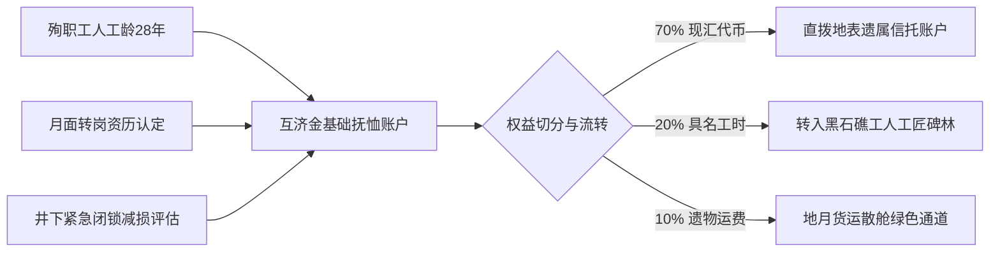

# 主小行星带黑石礁采矿联合体互助金第19号抚恤批复与遗物封存移交清单

**批复文号**：HJM-MUTUAL-2069-019  
**签发机构**：主小行星带黑石礁矿区劳工互助互济理事会  
**申请事项**：工号 `MB-2041-0812`（王铁柱，原籍中国山东济宁）因公殉职抚恤金拨付与随身物资封存移交  
**事故简述**：2069年09月14日 04:12，第 101955 号小行星南区 3 号旋流碎矿漏斗发生高压液压管微陨爆冲击，王铁柱在手动闭锁高压阀门过程中遭受破片穿透防护服失压殉职，享年 58 岁（在带工龄 28 年）。  

---

## 一、互助金核算与抚恤拨付明细

依据《主小行星带民间互济互保章程（2065年修订版）》第 14 条及《深空特种作业抚恤互保细则》，核定如下：

1. **基础身故抚恤金**：黑石礁互济基金拨付 180,000 标准水冰对冲结算代币（折合地表 UBI 平准金 240 个月基数）。
2. **特殊技能与减损嘉奖津贴**：因其闭锁动作保护了 3 号主分选炉免遭减压损毁，追加拨付 45,000 代币。
3. **拨付路径**：70% 经由地月-主带大宗物资结算网络电汇至其位于地表山东济宁的指定直系遗属（长女 王晓梅）信托账户；30% 留存为黑石礁公墓深空等离子体火化与长周期铭刻基金。

---

## 二、死者随身行李与工作遗物清点移交册

经矿区互济会治安组与第七采矿工队共同启封，现场清点并铅封遗物如下：

| 序号 | 物品名称与规格 | 现状描述 | 处理意见与处置去向 |
|:---:|:---|:---|:---|
| 01 | **第二代灌铅磁吸重工作靴（双）** | 标称自重 12.0 kg，鞋底内置可充退磁钢圈。跟部钢印已磨损，左靴跟外侧有手工电烙印记 `0419-C`（系 2040 年代自月面工友陈初九处受赠转让件）。靴底有 17 处熔渣飞溅灼痕。 | **按遗嘱留存矿区工史馆陈列** |
| 02 | 纸质纪念品及单据（1 铁盒） | 内含 2038 年月球静海先行区第一食堂饭菜配给票 2 张（面额：合成大豆蛋白餐券，已发霉硬化）、长兴岛船坞工牌 1 枚。 | 密封后随地月邮政包裹寄还遗属 |
| 03 | 机械手表（机械发条式） | 2028 年地表产老式上海牌机械表，表蒙有放射状刮痕，发条游丝完好，走时偏快 14 秒/日。 | 随地月邮政包裹寄还遗属 |
| 04 | 个人储物柜手作木雕 | 采用地表樟木边角料雕刻之微型龙舟 1 件（长 8 cm），表面涂覆工业环氧清漆。 | 寄还遗属 |
| 05 | 专用特种工具包 | 14 件套钛合金防磁工具组，其中一把 24 号开口扳手有严重扭矩变形。 | 矿区工具库残值折价回收（折近代币 120 点入抚恤账） |

---

## 三、后事安排与公证结论

- **遗体处置**：依据王铁柱生前签署之《深空矿工身后物质循环自愿书》，其遗体已于 2069 年 09 月 18 日在黑石礁 1 号工业感应炉完成真空等离子体热解。残余钙磷灰分（共计 2.41 kg）已全部移交矿区水培农业二区作为基质肥料；提纯之微量钛金属（0.18 kg）已熔铸为纪念铜牌一枚，嵌于黑石礁 01 号殉职矿工纪念崖壁。
- **结案签认**：遗属代表通过深空视讯公证链路完成异地签认，本案互助金执行完毕。

---

**互济会执事长**：徐长春（签章）  
**采选工队见证人**：第七采矿队队长 孙铁柱（代签）  
**公证备案号**：AST-NOTARY-2069-1008-019
