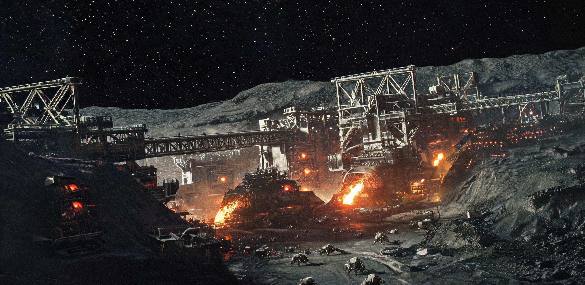

# 主带工业群2408年度产出决算与对地大宗贸易结构公报

**公报文号：** 带工贸公字〔2408〕第 042 号 ｜ ISEX-ISIC-2408-TRAD  
**统计周期：** 公元 2408 年 01 月 01 日 00:00 至 2408 年 12 月 31 日 24:00（日心标准时 UTC）  
**统计与联合发布机构：**  
- 内太阳系工业联合体（ISIC）产业发展与物资统筹署  
- 内太阳系大宗资源交易所（ISEX）日心统一清算中心  
- 环带航运自治联合会（BFAG）深空重载运力调配局  
- 地球环境与外空贸易协调理事会（EEOTC）清算事务司  

**抄送机构：** 谷神星第一总港调度总署、灶神星南极深冷水务总厂、101955号黑石礁采选总厂、忒弥斯重核聚变工质联合体、日地L4天枢大宗集运货栈、日地L5天璇保税转运中心、地月空间环境保育理事会  
**发文密级：** 全域行业公开档 ｜ **档案管理号：** ISIC-STAT-2408-A  

---

> **编制说明与清算基准：**  
> 1. **核算单位与价值锚定：** 本公报全部财务数据统一采用“内太阳系标准清算单位（ISAU）”编制。1.00 ISAU 严格对应 1.00 千瓦时（kWh）受控核聚变日心基底保障电当量（1 kWh-eq）。  
> 2. **统计空间口径：** 覆盖主小行星带内侧（2.1 AU）至外侧（3.3 AU）全部在册采矿天体、自转栖息地、移动炼化前哨及特洛伊群前沿站，总计 196 个固定工位与 1,624 座独立核算工业单元。  
> 3. **全要素自持率定义：** 依《主带工业群调度章程（第九版）》，以 4,812 项 F 类基础工业与维持要素为基准，统计主带内部具备完全自主合成与机械复制能力的品类比率。

---

## 一、收支计数总表（2408 年度决算值）

兹将主带工业群 2408 年度产出决算与对地大宗贸易结构汇列如后。公元 2408 年度，主带工业群满负荷稳态运行。地表高能耗冶炼与重型结构制造已移向外圈空间，主带为内太阳系重工业基底与初级、高纯材料供应源。全部计数入下两表，散在各段者一并收入。

### 表 1.1：2408年度主带工业群综合运行指标总表

| 指标项目 | 2408年度决算值 | 较上世纪（2308）同比 | 统计范畴与测算说明 |
| :--- | ---:| ---:| :--- |
| **在册工业设施总量** | **1,624 座** | +142.6% | 采选 380 / 冶炼 342 / 化工 260 / 制造 410 / 能源 232 |
| **覆盖天体工位** | **196 个** | +88.5% | 涵盖谷神星、灶神星、智神星、司理星及特洛伊群主要矿区 |
| **年原料矿石与冰开采量** | **39,420.0 万吨** | +98.4% | 富铁镍矿、硅酸盐原矿、水冰及碳质挥发分入料口径 |
| **年产出成品工业物资** | **9,860.0 万吨** | +115.2% | 高纯结构材、耐磨砖、基础化工品、同位素及重型设备 |
| **工业群总并网负荷** | **34.80 TW** | +82.2% | 聚光菲涅尔阵列供电 58.4% + 氦-3磁约束聚变堆 41.6% |
| **常住产业人口** | **48.62 万人** | +36.8% | 分布于 18 个主自转栖息环带与各厂站常驻值守点 |
| **全要素品类自持率** | **99.71%** | +18.42 pct | 4,812 项 F 类要素中 4,798 项实现主带原位制造（缺 14 项） |
| **工业产值全域清算总额** | **2,938.40 亿 ISAU** | +104.7% | 按日心统一基准电价折算之全品类总产出净货值 |

```
[2408年度主带物资流转拓扑（单位：万吨）]
原矿/水冰采掘 39,420.0 ──┬──> 原位熔炼与重整 ──> 结构材/板材/工字钢 4,120.0 ──┬──> 主带自持基建 8,204.8 (83.2%)
                          ├──> 挥发分提取与精炼 ──> 推进剂/水务/化学品 5,280.0 ──┤
                          └──> 同位素离心分离 ──> 氦-3/超导合金/微电子 460.0 ──┴──> 对地月出口 1,655.2 (16.8%)
```

### 表 1.2：2408年度对地月系进出口与清算轧平计数

| 项 | 计数 |
| :--- | ---: |
| 出口总货值 | 347,080.00 万 ISAU（34.708 亿 ISAU） |
| 进口总货值 | 347,080.00 万 ISAU（34.708 亿 ISAU） |
| 综合清算净差额 | 0.00 ISAU |
| 出口物理量 | 1,655.20 万吨＋服务 |
| 进口物理量 | 453.20 万吨＋资产 |
| 实物过驳 | 184 艘次 |

轧平一栏，登记簿逐笔勾稽，值班员签认，签名略。

---

## 二、对地月系大宗贸易进出口决算总账

2408 年度，主带对地月系（含近地轨道物流网、月球工业区及各拉格朗日点货栈）大宗实物贸易分工互补。出：超大规模结构材、耐辐射装甲、聚变重核同位素、深冷工业工质。进：高活性生物菌剂、分子医药、亚纳米级极紫外光学元件母机部件、古典文化版权流。

全年通过 BFAG 日心货运班列（500 米级聚变重载推船编组）完成实物过驳共计 184 艘次，两端进出口结算总额严格轧平于 **34.708 亿 ISAU**。计数见表 1.2，逐笔仓单、提货凭证与磅单入卷。

### 表 2.1：主带对地月系出口大宗物资清单（EXP-2408）

| 货物代码 | 货物名称与规格标准 | 来源主要产区 | 交付物理量 (万吨) | 结算单价 (ISAU/t) | 货值小计 (万 ISAU) | 终端用途与流向 |
| :--- | :--- | :--- | ---:| ---:| ---:| :--- |
| **EXP-01** | 超高纯发泡钛与钪铝复合结构梁 | 谷神星重工联合体 | 420.00 | 280.00 | 117,600.00 | 地月 L2 超大口径阵列与地轨货网扩建 |
| **EXP-02** | 碳化硅/氮化硼复合抗辐射装甲砖 | 101955号黑石礁总厂 | 650.00 | 160.00 | 104,000.00 | 地球近地轨道防御环与各空间站外装甲 |
| **EXP-03** | 反应堆级精炼液氦-3 (LHe-3 原生液) | 忒弥斯重核联合体 | 1.20 | 19,500.00 | 23,400.00 | 地月高密度磁约束聚变堆基底发电加注 |
| **EXP-04** | 高纯原生深冷水冰浆与重水浓缩液 | 灶神星水冰矿业总厂 | 580.00 | 32.00 | 18,560.00 | 月背生态水体平衡与 L4 天枢贮运库调配 |
| **EXP-05** | 铂族稀散金属合金冷压锭 (PGM-999) | 智神星深空采掘基地 | 4.00 | 15,360.00 | 61,440.00 | 地表微电子重构与高选择性催化剂基质 |
| **EXP-06** | 跨轨道霍曼重载推船引航与调姿服务 | 环带航运自治联合会 | 184 艘次 | 1,200,000.00/艘 | 22,080.00 | 500米级重载货船编组日心轨道保障 |
| **出口合计** | **主带出港大宗物资与服务总计** | **—** | **1,655.20 万吨+服务** | **—** | **347,080.00** | **出口总值 34.708 亿 ISAU** |

### 表 2.2：主带自地月系进口物资与权益清单（IMP-2408）

| 货物代码 | 货物名称与规格标准 | 来源地 / 承制机构 | 交付物理量 (万吨) | 结算单价 (ISAU/t) | 货值小计 (万 ISAU) | 主带接收与分配节点 |
| :--- | :--- | :--- | ---:| ---:| ---:| :--- |
| **IMP-01** | 特种人工合成代谢酶与高活性菌株 | 沪郊生物工程联合体 | 48.00 | 2,400.00 | 115,200.00 | 谷神星/灶神星人居穹顶闭环农业与合成蛋白 |
| **IMP-02** | 超分子仿生柔性自愈合气密薄膜 | 珠江口高分子试验所 | 85.00 | 1,150.00 | 97,750.00 | 18 个自转环带居住舱段微穿孔快速密封 |
| **IMP-03** | 亚纳米极紫外光学物镜组 (含F-4417备件) | 海南超精密光学实验室 | 0.20 | 265,000.00 | 53,000.00 | 主带微电子晶圆厂（依赖清单仅存项目） |
| **IMP-04** | 原生态熟化土壤腐殖质基质与冻干胚轴 | 西南生态保育大区 | 320.00 | 95.00 | 30,400.00 | 新建自转栖息地农业区土壤微生物菌群建植 |
| **IMP-05** | 地球古典人文数字典籍与版权交互带宽 | 全球联合数字图书馆 | 无形资产 | 协议核定 | 28,000.00 | 主带公共教育网络与科研院所定期同步 |
| **IMP-06** | 地月清算署多边贸易信用差额准备金 | 地球环境与外空贸易局 | 货币对冲 | 轧差平准 | 22,730.00 | 冲抵跨轨道物流综合保险与退税保证金 |
| **进口合计** | **主带进港物资与服务资产总计** | **—** | **453.20 万吨+资产** | **—** | **347,080.00** | **进口总值 34.708 亿 ISAU** |

进出口两端账面完全轧平，校验计数见表 1.2，不另立一图。

---

## 三、两百年跨轨道贸易结构演化（2075—2408）

2070 年代主带第一代水冰远期合约建立，至 2408 年主带工业群高度自持，内太阳系大宗物资流结构性逆转。三格对比如下：

### 表 3.1：主带—地月贸易两百年关键节点对比表

| 对比维度 | 2075年度（ISEX 设立初） | 2125年度（三环航线成形） | 2408年度（主带工业群成熟） |
| :--- | :--- | :--- | :--- |
| **结算价格基准** | 水冰 38.50 ISAU/t | 水冰 38.50 ISAU/t | 水冰 32.00 ISAU/t（成熟化下浮） |
| **主带出口核心品类** | 原生水冰、粗铁镍冷压块 | 水冰、工字钢、粗液氦-3、SiC 装甲 | 高纯钛合金梁、SiC砖、精炼氦-3、PGM |
| **主带进口核心品类** | 采掘机械母机、水氧补给、高单价粮食 | 推进剂（液氢）、中子吸收膜、半导体 | 生物菌剂、柔性高分子、超精密光学镜组 |
| **年实物贸易规模** | 约 480 万吨（单向输入地月为主） | 约 65 万吨（三环中继过驳） | 2,108.4 万吨（双向高强度对流） |
| **全要素自持状态** | < 35%（严重依赖地球重工配件） | 约 81.5%（基本工业母机已自给） | 99.71%（仅剩 14 项极高纯/特种物项） |
| **重载推进技术** | 第一代小型磁约束等离子体推船 | 第二代磁约束脉冲推船（300米级） | 500米级重载磁约束聚变编组（在途升华回充） |

**结构演化三格：**  
1. **水冰价格：** 原生水冰 2075 年完成“千倍成本崩塌”，两百年间由 38.50 ISAU/t 微降至 32.00 ISAU/t，随采矿自动化与核聚变电网普及而定。今为内太阳系公用基底品。  
2. **物质流向：** 2070 年代地球向太空单向输送钢铁与机械；至 2408 年，地表去重工业化与生态再野化完成，每年需从主带输入 1,070 万吨以上的特种结构梁与装甲砖以维持轨道基础设施。  
3. **依赖品类：** 主带对地球的依赖品类由 2075 年的 3,100 余项收敛至 2408 年的 14 项，外购依赖货值占主带总产值比重降至 1.18%。十四项逐行列册，见下节清册。

---

## 缺项清册（十四项，末一联摘录）

> **主带工业群外购依赖清册　卷内 缺项-2408-十四**
> 基准：4,812 项 F 类要素（《主带工业群调度章程（第九版）》）。
> 原位制造 4,798 项，勾选讫。缺 14 项，逐行列册；登记簿与表 1.1 自持率一行对号。
> 摘录一行——
> 　品名：亚纳米极紫外光学物镜组（含 F-4417 备件）
> 　承制：海南超精密光学实验室　交付：0.20 万吨
> 　流向：主带微电子晶圆厂　对号：表 2.2 IMP-03 一行
> 余十三项另册，本联不列。
> 清册骑缝，经手签名略，照准。

---

## 四、航道物流、在途工质损耗与泊位调度

2408 年度，往返于主带与地月系之间的 BFAG 联合船队共投入 42 组「玄武级」500 米重载聚变推船，采用标准化日心霍曼转移轨道与连续低推力等离子体弧段运行。

```
[重载推船日心货运编组工况 · 2408]
推船尺度：长 520 米，主聚变推力器 4 联装，额定比冲 48,000 s
货运挂载：标准化磁悬浮耐压货箱 24 组 + 外挂自保形深冷水冰球（外覆 16 层高反光绝热被）
在途蒸发补偿机制：
  水冰在途升华率控制在 0.26%（单程 290 天日心转移）；
  升华水汽经由货舱集气管自动收集，直接送入主推力器辅助电离室作为姿控微喷工质，
  实现航渡全周期工质零浪费（升华即推力）。
```

### 表 4.1：主要过驳港站 2408 年度吞吐与交收台账

| 港站名称 | 空间位置 | 挂靠艘次 (艘) | 年物资吞吐量 (万吨) | 仓储利用率 | 关键交割品类 |
| :--- | :--- | ---:| ---:| ---:| :--- |
| **谷神星第一总港** | 谷神星赤道自转解耦轴 | 112 | 1,240.0 | 88.2% | 发泡钛梁、水冰、居住区轻工物资 |
| **101955黑石礁泊位** | 101955小行星采选区 | 54 | 680.0 | 92.4% | SiC装甲砖、铁镍压块、重工母机 |
| **日地 L4「天枢」站** | 日地拉格朗日 L4 点 | 184 | 1,820.0 | 94.6% | 内外圈大宗物资总换乘与检疫过驳 |
| **日地 L5「天璇」站** | 日地拉格朗日 L5 点 | 96 | 840.0 | 79.5% | 稀散金属保税仓储与氦-3同位素储备 |

---

## 提货凭证存根（附一件，以见全年一百八十四艘次）

> **提货凭证存根　卷内 提凭-2408-末艘**
> 港站：日地 L4「天枢」站（日地拉格朗日 L4 点）。挂靠：本年度第 184 艘次，末艘次。
> 仓储利用率栏：94.6%。交割品类：内外圈大宗物资总换乘与检疫过驳。
> 过秤：磅单三联，一联随货，一联存港，一联入卷。过秤读数与磅单合。
> 交接单：港站与船方各执一联，骑缝。
> 结算：入两端轧平 34.708 亿 ISAU 之列，净差额 0.00 ISAU。
> 提货人签名略。港站值班员签认，照准。
>
> 四港站交收台账见表 4.1。184 艘次逐艘立凭证，此为其末。

---

## 五、联合公证书与签署备案

本公报经内太阳系工业联合体、内太阳系大宗资源交易所、环带航运自治联合会及地球环境与外空贸易协调理事会四方联合核算审定。数据已同步上链至内太阳系不可篡改分布式清算账本，相关实物仓单与提货凭证即日起由各枢纽港站执行。四方骑缝，缺一联不成卷。

**联合签章：**  
- 内太阳系工业联合体物资统筹署署长：**程越海**（印，签名略）  
- 内太阳系大宗资源交易所清算总长：**夏侯衡**（印，签名略）  
- 环带航运自治联合会重载调度长：**巴图尔·苏赫**（印，签名略）  
- 地球环境与外空贸易协调理事会专员：**顾青曼**（印，签名略）  

**公证机构：** 日心地月空间大宗商事联合仲裁院（印）  
**记录人：** 产业发展与物资统筹署统计处（签名略）  
**复核：** 日心统一清算中心值班员签认，照准  
**发文日期：** 公元 2408 年 04 月 18 日  
**存档处所：** 谷神星中央档案馆经字第 08 柜 / 日地 L4 天枢货栈数字档案库 / 地球外空贸易局历史文献中心  
**卷内计数：** 表六张、拓扑图一幅、工况记录一段、清册一联、存根一联  

（清算中心注：进出口两端各 34.708 亿 ISAU，净差额 0.00。账面轧平，本卷即止。缺项十四，另册在第 08 柜，明年再点。）

---
