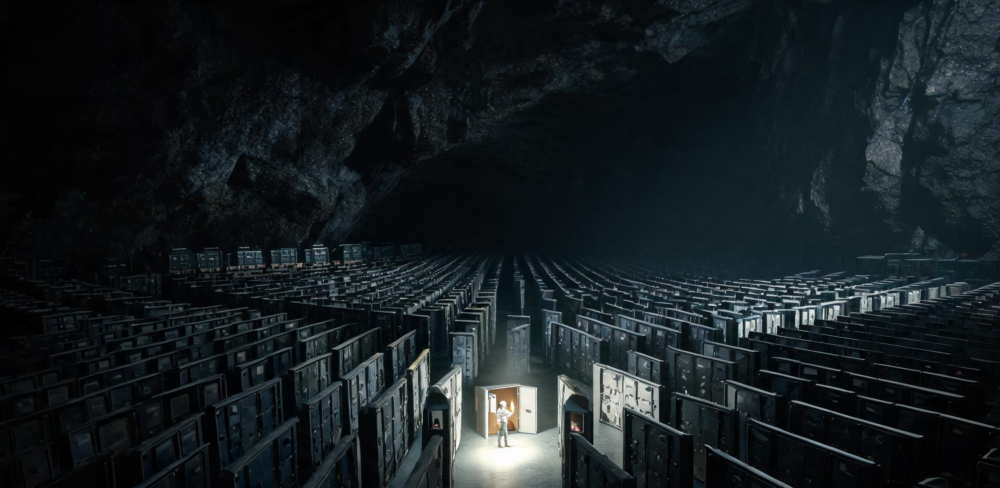

**内太阳系工业联合体 · 主带工业群调度总署**  
**主带自持工厂群全要素自持率核验证暨最后一批地球原产高纯部件退役封存报告**

文号：带工核〔2421〕第 001 号  
核验对象：主带自持工厂群（登记在册工业设施 1,847 座，分布于主带 214 个天体工位）  
核验基准：《主带工业群调度章程（第十一版）》全要素品类清单（F 类，4,812 项）  
文书纪年：公元 2421 年 7 月 4 日  
密级：公开 / 入联合体会史档案

---

### 一、 核验结论（前置）

经 26 个月全要素盘点，主带工业群 4,812 项 F 类要素品类中，最后一项依赖地球供给的品类——**F-4417 极紫外光刻物镜组（氟化钙晶体基底，缺陷密度 ≤ 0.001/cm²）**——已于 2420 年 11 月由「火神-12」号晶体工厂（灶神星北轨）产出首件合格品并通过三批次复检。**自 2421 年 1 月 1 日起，主带工业群对地球供应链的品类依赖归零，全要素自持率 100%。**

本报告为该项核验的最终文书，兼作最后一批地球原产 F-4417 物镜组的退役封存记录。

### 二、 工业群总量盘点（核验基准日 2421-01-01）

| 指标 | 数值 | 备注 |
|---|---|---|
| 在册工业设施 | 1,847 座 | 采选 412 / 冶炼 388 / 化工 296 / 制造 471 / 能源 280 |
| 分布工位 | 214 个天体 | 主带 201 / 特洛伊群 9 / 近地 4 |
| 年物料吞吐 | 4.62 亿吨 | 矿石/冰/挥发分入口口径 |
| 年工业品产出 | 1.18 亿吨 | 结构材/化学品/设备/消费品合计 |
| 工业群总能耗 | 41.2 TW | 聚光-聚变混合供电 |
| 自持复制代际 | 母机第 11 代 | 复制代数受调度令硬约束（见 §四） |
| 地球供给依赖品类 | 0 项 | 2420 年末为 1 项（F-4417） |

**尺度注记**：把 1,847 座设施画在一张主带示意图上，每个工位只是一个点；但调度总署的物料流转表每天产生 4.6 万条过驳记录——一名调度员终其一生只能读完其中一年的台账。本次核验动用了 26 个月与 214 个工位的全部驻厂核验员（每厂 1 人，部分厂站唯一常驻者即核验员本人）。

### 三、 F-4417 攻关与退役封存

1. **品类背景**：F-4417 极紫外光刻物镜组为主带微电子链（功率器件/抗辐射控制器）的最后短板。氟化钙晶体对生长环境的重力扰动与辐射本底要求极端苛刻，主带晶体工厂历经 9 次工艺迭代（2362—2420，见附表 G-9）方使缺陷密度达标。
2. **首件合格品**：火神-12 于 2420 年 11 月 8 日产出物镜组 H12-CaF-0001，面形精度 0.18 nm RMS，缺陷密度 0.0007/cm²，经三批次曝光复检合格，正式列入主带产目录。
3. **退役封存**：主带现存最后一批地球原产 F-4417（2048 年产于海南晶体所，共 4 组，服役 373 年、经历 11 座工厂 27 次拆装）自 2421 年 1 月 1 日退出产线。其中 3 组拆解回炉，第 4 组（编号 HN-2048-CaF-0114）按联合体会史委员会决议**原态封存**，随本报告一同入档——镜片不擦拭、保持第 27 次拆下时的工作状态，包括边缘一道 2379 年留下的 0.4 mm 崩边。
4. **封存方式**：钽衬氮气柜，恒温 291 K，存主带会史馆（谷神星港）丙字第 1 柜，与 2049 年「燧石-1」首炉粗锭（1 号样）同室陈列。

### 四、 自持的边界（调度章程摘录重申）

核验通过不等于放任复制。联合体重申章程三条硬约束：

1. 母机复制代数与设厂选址一律由调度总署按资源账批准，**任何工厂不得自行决定复制自身**；
2. 自持率统计口径为品类可产性，不含效率承诺——主带产 F-4417 当前成本仍为地球历史均价的 3.1 倍，降级使用审批权仍在各厂总师；
3. 对地球/地月系的贸易照常进行。自持是「不必」，不是「不来往」——2420 年主带对地出口 1,940 万吨（结构材/同位素/冰），进口 610 万吨（生物制品/精密仪器/文化物资），贸易额占主带工业产出 11.8%，此格局不因核验通过而改变。

### 五、 结论

自 2049 年「燧石-1」在 101955 号小行星点起第一炉感应炉，主带工业用三百七十二年完成了从「一炉粗锭」到「全要素自持」的闭环。本核验证签发之日，主带工业群调度总署撤销「地球供给依赖预警」常设栏目（该栏目自 2088 年设立，存续 333 年）。

**签署：**  
调度总署核验总长 祁连（印）  
火神-12 晶体工厂总师 祝融瑾（印）  
联合体会史委员会主任 方愔（印）  
联合体理事长 沈钧（印）

**用印：** 内太阳系工业联合体核验章（朱文）  
**存档：** 主带会史馆丙字第 1 柜（与封存物镜组同档）/ 调度总署档案库正本 / 地联工业登记局报备副本壹份  
**公元 2421 年 7 月 4 日**

---

## 图片提示词

主带会史馆工业档案摄影：纵深巨大的玄武岩拱顶封存库内，一排排钽衬氮气柜延伸至画面深处出画框；近景一只敞开的恒温柜内，一组 373 年前的氟化钙光刻物镜静静躺在支架上，镜片边缘一道旧崩边清晰；一名档案馆员戴白手套俯身记录，身形在高耸拱顶下显得极小；顶部单束冷白射灯照亮物镜。

Archival photograph inside a colossal basalt-vaulted archive depot in the asteroid belt: rows of tantalum-lined nitrogen cabinets recede deep into the frame beyond its edges; in the foreground an open constant-temperature cabinet holds a 373-year-old calcium-fluoride EUV lens assembly on its mount, an old chipped edge visible on the lens rim; a gloved archivist bends over recording, dwarfed by the towering vault; a single cold-white spotlight from the vault ceiling illuminates only the lens; shot on 35mm film, visible film grain, deep shadows, slight blown highlight on the lens, off-center candid framing, archival scan, no readable text, no signage, no national flags.

---

## 修订记录（元层，非世界内容）

- 2026-08-18：主会话直写（子 agent 配额 429 后主笔）。互锁：GS-2049-01 燧石-1 首炉（谱系起点）、GS-2076-01 金乌-03（聚光熔炼）、GS-2104-01 黑石礁总厂（采选成熟）、GS-2075-01 水冰期货（资源市场）、世界大纲（冯·诺依曼自持工厂、离心纪元小行星采矿盈利）。注意：本文未发明新主线，仅写既有主带工业谱系的自然收敛（品类依赖归零）；冯·诺依曼复制受章程硬约束，回避失控复制金手指。
