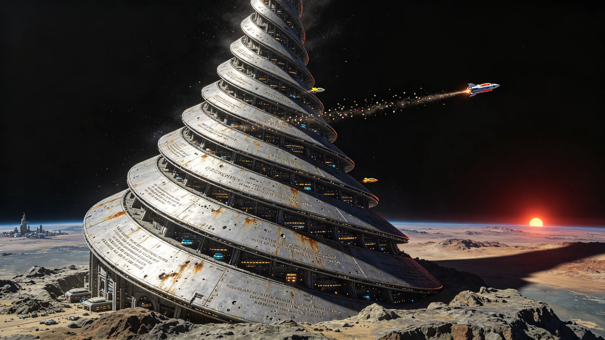

# 人类文明千年纪念碑"星阶"首期工程竣工公报与文明纪年重订议定书

**公报文号：** `MON-QUAD-3000-STARSTEP01`
**发布机构：** 四恒星系联合文化遗产委员会 · 星阶工程建设指挥部 · 文明纪年重订委员会
**竣工日期：** 3000年01月01日

---

## 一、星阶工程概述

"星阶"（Star Staircase）为人类文明千年纪念碑，建于比邻星b"新海安"定居带以北约200公里的玄武岩台地（北纬38°，东经94°，海拔1,240米）。工程于2920年启动，首期工程于3000年01月01日竣工，建设周期80年。

星阶设计为螺旋上升的全封闭加压金属巨构，从地表基座盘旋上升至20公里高度（抵达比邻星b大气层上层），整体形态为一条通向星空的阶梯。每一级"台阶"为一个宽约500米的环形平台，平台内部为全封闭加压空间，包含展厅、档案库、观景台、居住舱与维护设施。首期工程完成基座至第20级台阶（高度约8公里），后续工程计划于3100年完成全部100级台阶（高度20公里）。

选择比邻星b作为星阶建造地的原因：比邻星b为人类首个跨恒星系定居点（2350年登陆），具有历史象征意义；比邻星b表面重力0.86g（低于地球），有利于超高层巨构的结构设计；比邻星b地质稳定，选址区域位于古老克拉通内部，地震活动微弱；比邻星b大气稀薄（表面气压0.12倍地球），20公里高度已接近真空，有利于纪念碑上部结构的维护。

## 二、星阶技术参数与设计

### 2.1 结构参数

| 参数 | 数值 |
|---|---|
| 总高度（设计） | 20公里（100级台阶） |
| 首期高度（已竣工） | 8公里（20级台阶） |
| 基座直径 | 4.2公里 |
| 顶部直径（设计） | 0.8公里 |
| 每级台阶高度 | 200米 |
| 每级台阶宽度 | 500米（环形平台） |
| 螺旋升角 | 3.5° |
| 总质量（设计） | 12.8亿吨 |
| 首期质量（已竣工） | 5.2亿吨 |
| 结构材料 | 碳化硅增强钛合金复合材料 + 玄武岩纤维混凝土 + 硼化辐射屏蔽层 |
| 能源供应 | 两台聚变反应堆（每台输出500MW）+ 表面太阳能板（辅助） |
| 生态系统 | 每级台阶独立闭环生态系统，含水培农业区与空气循环系统 |

### 2.2 功能分区

星阶每级台阶按功能分区设计：

- **第1-5级（基座区，0-1公里）**：公共展厅、文明史博物馆、访客中心、管理设施、能源中心
- **第6-20级（档案区，1-8公里，首期已竣工）**：人类文明数字档案库（含全部已知文献、艺术、科学数据的多重备份）、实体文物档案馆、基因库（地球+比邻星b+巴纳德星b+鲸鱼座τ星已编目物种）、语言多样性档案库
- **第21-50级（文化区，8-14公里，待建）**：艺术展厅、音乐厅、剧院、图书馆、教育中心、学术交流设施
- **第51-80级（科研区，14-18公里，待建）**：深空观测台（光学/射电/引力波）、微重力实验室、材料科学研究中心、行星科学研究所
- **第81-100级（巅峰区，18-20公里，待建）**：终极观景台（360°全景观测比邻星系与深空）、千年纪念大厅、文明时间舱（每百年封存一次时代记录）、最高级档案备份库

### 2.3 纪念碑铭文

星阶基座正面镌刻铭文（以人类六种主要语言——汉语、英语、西班牙语、阿拉伯语、印地语、俄语——同时镌刻）：

> "此阶为人类而立。
> 自第一颗人造卫星升空，至人类足迹遍及四个恒星系，已历千年。
> 我们曾以为地球是唯一的家园，后来我们知道宇宙中有无数个可能的家园。
> 我们曾以为光速是不可逾越的墙，后来我们学会在墙的两侧各自生活。
> 此阶通向星空，但星空不是终点。
> 每一级台阶都是一代人的脚印，每一扇窗户都是一双望向未来的眼睛。
> 建造者的名字不刻于此——因为建造者是每一个人。
> 3000年1月1日，首期竣工。"

## 三、首期工程建设历程

### 3.1 建设阶段

| 阶段 | 时间 | 内容 |
|---|---|---|
| 前期筹备 | 2900—2920 | 选址勘察、地质勘探、设计方案评审、资金筹措、材料制备 |
| 基座施工 | 2920—2935 | 地基开挖、基座浇筑、能源中心建设、聚变反应堆安装 |
| 第1-5级建设 | 2935—2955 | 公共展厅区结构施工、生态系统安装、内部装修 |
| 第6-10级建设 | 2955—2972 | 档案库区结构施工、档案存储设施安装、数字备份系统部署 |
| 第11-20级建设 | 2972—2995 | 档案库区扩展、高层结构施工、电梯与交通系统安装 |
| 竣工验收 | 2995—3000 | 系统调试、生态系统稳定运行测试、档案数据导入、竣工验收 |

### 3.2 建设人员

星阶工程高峰期建设人员达12,000人，累计参与建设人员约48,000人（含轮换）。建设人员来自四个恒星系，其中比邻星系42%，太阳系28%，巴纳德星系22%，鲸鱼座τ星系8%。建设期间共有127人因工程事故或疾病去世，其名字镌刻于基座纪念墙。

### 3.3 工程投资

星阶首期工程总投资约8,400亿工分（四恒星系联合货币单位），资金来源：四恒星系联合财政拨款45%、比邻星系地方财政25%、社会捐赠20%、文化遗产基金10%。工程建设带动了比邻星b的建材工业、制造业与建筑业发展，创造了约35万个就业岗位（含上下游产业）。

## 四、文明纪年重订议定书

### 4.1 重订背景

自人类文明跨恒星系扩张以来，各恒星系逐渐形成了各自的地方历法：

- 太阳系：沿用公元纪年（以地球公转周期为基础），辅以轨道城本地历法
- 比邻星系：采用"落地历"（以比邻星b公转周期=11.2地球日为基础？不，比邻星b轨道周期约11.2天，但定居点采用改良历法，以地球年为基础，辅以本地日）
- 巴纳德星系：采用"绿原历"（以巴纳德星b轨道周期233天为基础）
- 鲸鱼座τ星系：采用"远疆历"（以鲸鱼座τ星e轨道周期168天为基础）

多种历法并存导致跨星系行政、商业、科研与文化交流的时间换算困难。3000年作为千年节点，四恒星系联合议会决定重订文明纪年，建立统一的文明纪年体系。

### 4.2 纪年方案

经文明纪年重订委员会三年研究与四恒星系公投（投票率68%，支持率72%），确定以下纪年方案：

**主纪年：文明纪元（Civilization Era, CE）**

- 以公元2057年（第一座永久性轨道城"曙光三环"建成，人类首次实现地球以外的大规模永久居住）为文明纪元元年
- 公元3000年 = 文明纪元943年
- 文明纪元以地球年为基本时间单位（365.25天），因为地球年是人类文明的原始时间节律，且四个恒星系的居民均能理解
- 文明纪元为四恒星系通用的官方纪年，用于所有跨星系行政文件、商业合同、科学论文与文化交流

**地方纪年：各恒星系保留本地历法**

- 各恒星系可继续使用本地历法作为地方纪年，用于本地日常生活与文化活动
- 所有官方文件须同时标注文明纪元与地方纪年（格式：CE 943 / 落地历XXX年）
- 地方历法的修订须报四恒星系联合文化遗产委员会备案

**时间标准：宇宙时（Universal Time, UT）**

- 以脉冲星计时为基础的统一时间标准，所有恒星系独立维持，偏差<1微秒/年
- 宇宙时为四恒星系通用的时间标准，用于所有需要精确时间同步的场合（导航、通信、科学实验）
- 各恒星系本地时与宇宙时的偏差须定期校准并公布

### 4.3 过渡期安排

- 3000年01月01日起，所有跨星系官方文件开始使用文明纪元
- 3000—3050年为过渡期，期间旧纪年（公元纪年等）与文明纪元并行使用
- 3050年01月01日起，所有跨星系官方文件仅使用文明纪元，旧纪年仅在历史文献中保留
- 各恒星系地方历法不受过渡期限制，可继续使用

### 4.4 纪年重订的意义

纪年重订委员会在议定书中阐述了重订的意义：

"公元纪年以地球为中心，以一个宗教事件为起点，已不再适应人类文明跨恒星系存在的现实。文明纪元以人类首次实现地球以外永久居住为起点，以地球年为基本单位，既承认了人类文明的起源，也面向了人类文明的未来。这不是对历史的否定，而是对历史的扩展——从一个星球的历史，扩展为四个恒星系的历史。"

## 五、星阶与文明纪年的关系

星阶首期竣工与文明纪年重订在3000年01月01日同时举行，并非巧合。星阶工程建设指挥部与文明纪年重订委员会联合发表声明：

"星阶是物理的纪念碑，纪年是时间的纪念碑。二者共同构成了人类文明在3000年对自身的审视——我们从哪里来，我们在哪里，我们要到哪里去。星阶的每一级台阶对应一代人的足迹，文明纪元的每一年对应一代人的呼吸。物理的阶梯通向星空，时间的纪年通向未来。二者都是人类为自己建造的标尺——丈量我们走过的路，也丈量我们将要走的路。"

星阶第20级台阶（首期工程最高处）特设"纪年厅"，永久展示文明纪年重订议定书的原件（以钛合金板镌刻，预期保存寿命10万年以上），以及旧纪年体系的完整档案。

## 六、后续计划

- 星阶第21-50级（文化区）建设计划于3000—3050年进行
- 星阶第51-80级（科研区）建设计划于3050—3080年进行
- 星阶第81-100级（巅峰区）建设计划于3080—3100年进行
- 全部工程预计于3100年竣工，届时星阶将成为人类文明最大的单体建筑
- 文明纪元的推广与普及工作将持续进行，3050年完成全面过渡

---

*四恒星系联合文化遗产委员会主席：* 文千年
*星阶工程建设指挥部总指挥：* 筑星
*文明纪年重订委员会主席：* 时纪元

> *竣工仪式日志摘录：* 3000年1月1日0时0分，星阶基座前的广场上，8,000人参加了竣工仪式。没有烟花，没有演讲，只有一束光——从星阶第20级的观景台射出，照向比邻星，然后反射回来（当然，反射回来的光要等8.5年才能到达）。总指挥筑星按下了竣工按钮，星阶的所有灯光依次亮起，从基座到第20级，像一条通向星空的光的阶梯。人群安静了很久，然后有人开始唱歌——那是一首很老的歌，关于一个人仰望星空的歌。文千年主席站在基座前，看着亮起来的星阶，在日志上写："3000年1月1日，星阶首期竣工。8公里。还有12公里要建。但从今天起，人类有了一条通向星空的阶梯。也有了一个新的纪年。文明纪元943年。从今天开始计算。"
