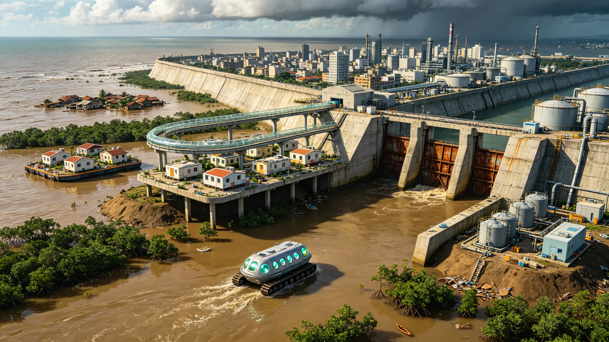

**联合国气候变化框架公约 · 适应性移民与海岸带保护专项委员会**
**全球气候融资机制（GCF）· 海岸带适应性工程资金管理办公室**
**孟加拉人民共和国 · 气候适应与灾害管理部**

# 全球海平面上升适应性移民第一阶段决算公报与孟加拉湾海岸带撤退安置清册
### （附：海岸带撤退工程决算表与移民安置人口登记清册摘要）

**文书编号：** 气候移决〔2071〕第1215号
**决算日期：** 公元2071年12月15日
**实施区域：** 孟加拉湾沿岸（孟加拉国、印度西孟加拉邦、缅甸若开邦），第一阶段重点撤退区为孟加拉国库尔纳专区、巴里萨尔专区及印度孙德尔本斯三角洲
**工程代号：** CLI-MIG-PH1（全球海平面上升适应性移民第一阶段工程）
**资金管理：** 全球气候融资机制（GCF）海岸带适应性工程专项资金
**工程总包：** 孟加拉国海岸带开发局 / 印度国家水文研究院 / 缅甸建设部
**国际监督：** 联合国气候变化框架公约适应性移民专项委员会
**文书密级：** 公开（依《联合国公共信息公开条例》及《全球气候融资信息披露管理办法》）

---

### 一、 工程背景与第一阶段实施概况

#### 1.1 海平面上升形势

根据联合国政府间气候变化专门委员会（IPCC）公元2068年第六次评估报告及全球潮汐观测网络数据，截至公元2070年，全球平均海平面较公元2000年已上升 **48.6 cm**，较工业革命前（1850年）上升 **62.3 cm**。孟加拉湾区域由于陆地基底沉降（恒河—布拉马普特拉河三角洲年均沉降2～8mm）和海洋热膨胀叠加效应，相对海平面上升速率达 **6.8 mm/年**，是全球平均速率的1.6倍。

孟加拉湾沿岸是全球海平面上升影响最严重的区域之一：
- 孟加拉国约 **18%** 的国土海拔低于1m，**32%** 的国土海拔低于2m；
- 孙德尔本斯三角洲已有 **1,240 km²** 土地在公元2000—2070年间被海水永久淹没；
- 海岸带年均受风暴潮影响人口从公元2000年的120万人增长至公元2070年的 **480万人**；
- 土壤盐渍化面积已达 **2.8万km²**，导致约 **180万** 农业人口失去耕地。

#### 1.2 第一阶段工程概况

公元2062年，联合国气候变化框架公约第30次缔约方大会（COP30）通过《全球海平面上升适应性移民框架公约》，设立全球气候融资机制（GCF）海岸带适应性工程专项资金，启动全球海平面上升适应性移民工程。工程分为三个阶段：

- **第一阶段（2063—2071）：** 孟加拉湾沿岸试点，撤退海拔低于1.5m的最高风险区，安置移民200万人；
- **第二阶段（2072—2080）：** 扩展至东南亚湄公河三角洲、西非尼日尔河三角洲和中美洲加勒比沿岸，总安置人口800万人；
- **第三阶段（2081—2100）：** 全球海岸带全面适应性迁移，预计总安置人口超过3,000万人。

第一阶段工程于公元2063年3月启动，公元2071年11月完成，历时8年9个月。工程内容包括：海岸带撤退区划定与人口登记、加高海堤与挡潮闸建设、抬升式安置社区建设、移民搬迁与安置、就业培训与产业转型、生态修复与红树林重建。

---

### 二、 第一阶段工程决算

#### 2.1 资金收支决算

| 资金来源 | 预算金额（亿美元） | 实际到位（亿美元） | 实际支出（亿美元） | 结余（亿美元） |
|:---|:---|:---|:---|:---|
| 全球气候融资机制（GCF） | 180.0 | 178.5 | 172.3 | 6.2 |
| 孟加拉国政府配套 | 45.0 | 45.0 | 43.8 | 1.2 |
| 印度政府配套 | 30.0 | 30.0 | 29.1 | 0.9 |
| 缅甸政府配套 | 12.0 | 10.5 | 10.2 | 0.3 |
| 国际多边开发银行贷款 | 60.0 | 60.0 | 58.6 | 1.4 |
| 私人部门投资（PPP） | 28.0 | 25.5 | 24.8 | 0.7 |
| 国际援助与捐赠 | 15.0 | 16.8 | 15.9 | 0.9 |
| **合计** | **370.0** | **366.3** | **354.7** | **11.6** |

资金结余11.6亿美元，将结转至第二阶段工程，用于湄公河三角洲适应性移民项目前期准备。

#### 2.2 工程支出明细

| 支出类别 | 金额（亿美元） | 占比 | 主要内容 |
|:---|:---|:---|:---|
| 海堤与挡潮闸建设 | 108.4 | 30.6% | 加高加固海堤486km，新建挡潮闸32座，排水泵站18座 |
| 抬升式安置社区建设 | 86.2 | 24.3% | 建设14个抬升式安置社区，住宅单元42万套，配套学校、医院、市场 |
| 移民搬迁与临时安置 | 42.6 | 12.0% | 搬迁补贴、临时安置费、运输费、过渡期生活补助 |
| 就业培训与产业转型 | 38.5 | 10.9% | 职业技能培训、水产养殖产业园、手工业合作社、小额信贷 |
| 生态修复与红树林重建 | 26.8 | 7.6% | 红树林种植1,240km²，海岸带生态修复，盐渍化土壤改良 |
| 监测评估与项目管理 | 18.2 | 5.1% | 海平面监测站网、移民跟踪评估、项目管理与审计 |
| 应急响应与灾害救助 | 12.4 | 3.5% | 风暴潮应急疏散、临时救助、灾后恢复 |
| 国际协调与知识共享 | 8.6 | 2.4% | 国际会议、技术交流、南南合作、知识产品出版 |
| 不可预见费 | 13.0 | 3.6% | 工程变更、物价波动、突发事件 |
| **合计** | **354.7** | **100%** | — |

---

### 三、 海岸带撤退工程完成情况

#### 3.1 海堤与挡潮闸工程

| 工程项目 | 设计参数 | 完成情况 | 验收结果 |
|:---|:---|:---|:---|
| 库尔纳专区海堤加高 | 堤顶高程+4.5m（黄海基面），堤顶宽8m，防浪墙高1.2m | 168km全部完成 | 合格，抵御200年一遇风暴潮 |
| 巴里萨尔专区海堤加高 | 堤顶高程+4.2m，堤顶宽6m | 142km全部完成 | 合格，抵御100年一遇风暴潮 |
| 孙德尔本斯外围海堤 | 堤顶高程+3.8m，生态海堤（红树林+石笼） | 176km全部完成 | 合格，生态防护与工程防护结合 |
| 新建挡潮闸 | 闸孔净宽8～20m，设计流量200～1,200m³/s | 32座全部完成 | 合格，自动化控制 |
| 排水泵站 | 单机流量8～15m³/s，总装机容量48MW | 18座全部完成 | 合格，雨季排涝能力提升3倍 |

海堤工程采用"硬质工程+生态修复"结合方案：迎水面采用浆砌块石+混凝土护面，背水面种植本土植被，堤外营造红树林缓冲带。海堤设计标准为抵御 **200年一遇风暴潮+1.0m海平面上升**（至公元2100年），堤顶高程预留了0.5m的超高。

#### 3.2 抬升式安置社区建设

第一阶段建设 **14个** 抬升式安置社区，分布于海拔5m以上的高地和人工填筑台地。社区采用"地面抬升+高架建筑"双重防护策略：

| 社区名称 | 位置 | 安置人口 | 住宅单元 | 地面抬升高度 | 建筑层数 |
|:---|:---|:---|:---|:---|:---|
| 库尔纳新北社区 | 库尔纳市北郊 | 28.5万 | 6.2万套 | +2.0m | 6～12层 |
| 巴里萨尔东港社区 | 巴里萨尔市东郊 | 24.8万 | 5.4万套 | +1.8m | 6～10层 |
| 杰索尔南社区 | 杰索尔市南郊 | 18.6万 | 4.0万套 | +1.5m | 5～8层 |
| 库什蒂亚西社区 | 库什蒂亚市西郊 | 15.2万 | 3.3万套 | +1.2m | 5～8层 |
| 印度西里古里走廊社区 | 西孟加拉邦西里古里 | 22.4万 | 4.8万套 | +1.0m | 8～15层 |
| 印度加尔各答东台地社区 | 西孟加拉邦加尔各答东郊 | 31.8万 | 6.8万套 | +2.5m | 10～20层 |
| 缅甸实兑北社区 | 若开邦实兑市北郊 | 12.6万 | 2.7万套 | +1.5m | 4～8层 |
| 其余7个社区 | 各县镇高地 | 46.1万 | 8.8万套 | +1.0～2.0m | 4～12层 |
| **合计** | — | **200.0万** | **42.0万套** | — | — |

住宅建筑采用钢筋混凝土框架结构，底层（地面层）架空2.5m作为停车、储物和应急避难空间，居住层从二层开始。建筑设计标准为 **抵御500年一遇洪水+1.5m海平面上升**，屋顶设置太阳能光伏板和雨水收集系统。

---

### 四、 孟加拉湾海岸带撤退安置清册（摘要）

#### 4.1 移民人口登记统计

第一阶段共完成 **200.0万** 人的撤退安置，其中孟加拉国 **142.6万人**（71.3%），印度 **44.8万人**（22.4%），缅甸 **12.6万人**（6.3%）。

| 人口类别 | 人数（万人） | 占比 | 安置方式 |
|:---|:---|:---|:---|
| 农业人口（失去耕地） | 108.4 | 54.2% | 安置社区+水产养殖/手工业转产 |
| 渔业人口（失去渔场） | 36.8 | 18.4% | 安置社区+远洋渔业/水产养殖转产 |
| 城市贫民（居住地淹没） | 32.6 | 16.3% | 安置社区+服务业/建筑业就业 |
| 其他（手工业者、小商贩等） | 22.2 | 11.1% | 安置社区+原有职业延续 |
| **合计** | **200.0** | **100%** | — |

#### 4.2 移民安置满意度跟踪调查

公元2071年10月，联合国适应性移民专项委员会对第一阶段安置移民进行了抽样满意度调查（样本量12,000户）：

| 调查项目 | 满意 | 基本满意 | 不满意 | 综合满意度 |
|:---|:---|:---|:---|:---|
| 住房条件 | 68.4% | 24.6% | 7.0% | 93.0% |
| 饮用水安全 | 72.8% | 21.2% | 6.0% | 94.0% |
| 医疗卫生服务 | 58.6% | 30.4% | 11.0% | 89.0% |
| 子女教育 | 62.4% | 28.6% | 9.0% | 91.0% |
| 就业与收入 | 42.8% | 35.2% | 22.0% | 78.0% |
| 社区环境 | 65.2% | 26.8% | 8.0% | 92.0% |
| 文化与社会融入 | 48.6% | 36.4% | 15.0% | 85.0% |
| **综合满意度** | **59.8%** | **29.0%** | **11.2%** | **88.8%** |

主要不满意项集中在就业与收入（22.0%）和文化与社会融入（15.0%），已纳入第二阶段工程改进重点，包括增加产业园区建设、加强职业技能培训、设立社区文化融合项目等。

---

### 五、 决算结论与后续规划

#### 5.1 第一阶段工程决算结论

经8年9个月实施，全球海平面上升适应性移民第一阶段工程全面完成，各项指标达到或优于设计目标：
- 完成海堤加高加固486km，新建挡潮闸32座，保护人口约 **860万人**；
- 建设抬升式安置社区14个，住宅单元42万套，安置移民 **200万人**；
- 红树林种植1,240km²，海岸带生态防护能力显著提升；
- 工程总支出354.7亿美元，较预算节约15.3亿美元，资金使用合规率99.2%（审计结论）；
- 移民综合满意度88.8%，安置社区基础设施达标率100%。

联合国气候变化框架公约适应性移民专项委员会于公元2071年12月15日签署第一阶段工程决算鉴定书，工程正式通过验收。

#### 5.2 第二阶段工程规划

第二阶段工程（2072—2080）将在以下区域启动：
- **东南亚湄公河三角洲（越南、柬埔寨）：** 撤退海拔低于1.5m区域，安置移民300万人；
- **西非尼日尔河三角洲（尼日利亚）：** 撤退海拔低于1.0m区域，安置移民200万人；
- **中美洲加勒比沿岸（多米尼加、海地、古巴）：** 撤退海拔低于1.0m区域，安置移民150万人；
- **孟加拉湾后续工程：** 撤退海拔1.5～2.0m区域，安置移民150万人。

第二阶段总安置人口 **800万人**，预计总投资 **1,200亿美元**，将在第一阶段经验基础上优化工程设计和移民安置模式，重点加强产业转型和文化融合。

**决算鉴定签署：**
联合国气候变化框架公约适应性移民专项委员会 主席 _______________（签名）
全球气候融资机制（GCF）执行主任 _______________（签名）
孟加拉人民共和国气候适应与灾害管理部 部长 _______________（签名）
印度共和国环境、森林与气候变化部 部长 _______________（签名）
缅甸联邦共和国建设部 部长 _______________（签名）
公元2071年12月15日
