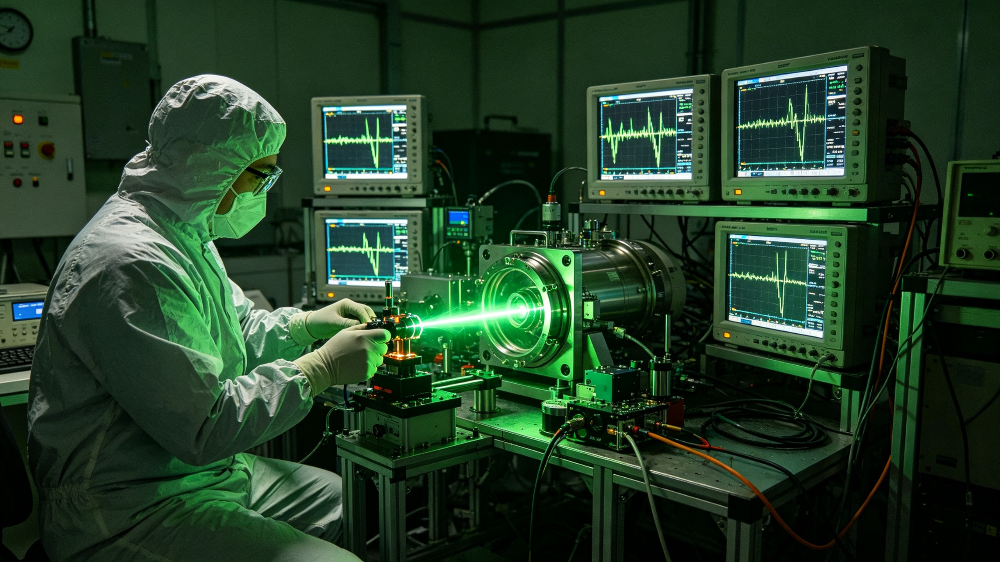

# 内太阳系小行星轨道交会测量激光雷达网纳秒级测距误差校准公报

**公报编号**：GEOD-LIDAR-2037-NEA01
**发布机构**：国家深空测绘局、地月空间时间频率重点实验室
**校准周期**：2037年05月01日至05月30日，连续 30 天闭环
**基准测量靶标**：近地小行星 2037-TA1（表面已锚定激光角反射器棱镜阵列）
**存卷**：规格牌拓片、平账表原件、校准日志、签认存根俱在局档案室，调阅编号同公报号。

## 一、台站规格牌（钉于地月 L1 主测站光学平台立柱）

| 项 | 参数 |
|---|---|
| 台址 | 地月 L1 点主测站；火星前哨副测站 |
| 激光工作波长 | 双色脉冲，主频 1,064 nm，偏频 532 nm，脉宽 25 ps |
| 单向测距最大距离 | 4,500,000 km（内太阳系近地交会有效覆盖区） |
| 等离子体延迟消除 | 双波长折射率色散差，太阳风带电粒子对光速的微滞后消除 100% |
| 星历交会误差 | 入轨交会预测误差椭球半长轴压至 0.85 米 |
| 本月闭环精度 | ±15.0 mm，等效时间同步残差 ≤0.050 ns |

牌面下沿有一道划痕，为转运吊装时留下，未修。

## 二、误差平账表（2037 年 5 月决算，单位纳秒，逐项签核）

1. 地月几何直线光行时（双向往返 RTT，均值） 30,021,450.85 ns
2. 广义相对论太阳重力场微弯曲夏皮罗延迟修正 +12.45 ns
3. 太阳风等离子体双频消色散补偿 −4.20 ns
4. 测站接收机硬件皮秒延迟校正 −18.25 ns

净测距闭环残差（Jitter）：±0.045 ns。

评定：满足全自动无人飞船厘米级自主交会对接标准。四项逐行留有值班员签认位，残差一行栏位空白——残差不再拆，账到此平。

## 三、校准日志（原行摘录，照录不改）

> 05-01 06:12　首轮闭环。RTT 读数入表，残差带超 ≤0.050 ns 限。接收机皮秒延迟未校。
> 05-09 14:35　硬件延迟校正项 −18.25 ns 入表，残差收窄。值班工程师签认。
> 05-21 03:07　太阳风扰动，双频消色散补偿 −4.20 ns 生效，偏频 532 nm 通道增益复位一次。
> 05-30 18:00　第 30 日闭环收束。测距 ±15.0 mm，残差 ±0.045 ns。评定合格。
>
> 日志无复核栏。平账表既经签核，不再复录。

## 四、交会测绘需求（查）

查 2030 年代末内太阳系自主矿石驳船日增，高速轨道交会相对速度 4—8 km/s，测距精度须自微波时代的十米级收至厘米级。兹以 2037-TA1 为靶标，行连续 30 天闭环测距，双色皮秒雷达网两台站对发对收，逐日平账。

## 五、签认存根

> 总测绘师：**钱学明**（高级工程师）　签认 05-30
> 测绘局公章验讫：GEOD-SPACE-2037
> 平账表第四项旁一处涂改，原值划去，改后 −18.25 ns，涂改处压骑缝章；原件存地月空间时间频率重点实验室。
> 经办人：主测站值班组　记录人：（签名略）

准此，本月校准合格，公报自签发日起生效。特此公布。

> 测绘科注：三十天，一块石头，一组棱镜。光走过去再走回来，账平在 30,021,450.85 纳秒上，残差 ±0.045。尺不在虚空里，在这张平账表里。档案记到此为止。
