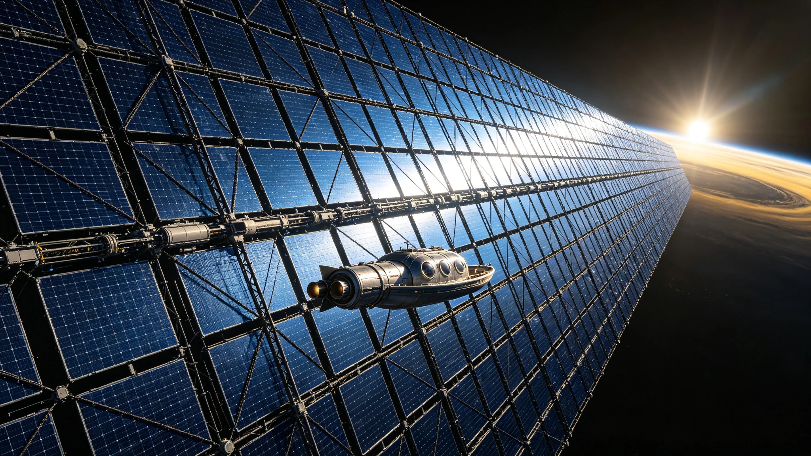

# 内太阳系戴森云节点群首期平方公里级光帆阵列并网公报

**签发单位**：恒星级能源工程总署 · 内太阳系戴森云节点群建设指挥部
**公报编号**：DYS-ISS-2053-001
**签发日期**：2053年5月30日

---

## 一、项目概况

内太阳系戴森云节点群（Dyson Swarm-Inner Solar System，简称DYS-ISS）首期平方公里级光帆阵列，于2053年5月28日14时22分（UTC）完成最后一批光帆模块的轨道部署与微波输电校准，5月29日通过72小时连续并网考核，5月30日正式宣布并网运行。

本阵列位于金星轨道内侧（0.62 AU）的类黄道轨道，由12,500块独立光帆模块组成，总展开面积1.02 km²，设计总发电功率1.8 GW。这是人类首个位于地球轨道以外的规模化轨道太阳能发电设施，也是戴森云节点群规划的首期工程。

| 阵列参数 | 数值 |
|---|---|
| 部署轨道 | 0.62 AU（金星轨道内侧），近圆轨道，倾角2.1° |
| 光帆模块数量 | 12,500块 |
| 单块光帆面积 | 81.6 m²（9 m × 9.07 m） |
| 单块光帆质量 | 42 kg |
| 总展开面积 | 1.02 km² |
| 总质量 | 525吨 |
| 光伏转换效率 | 34.2%（多结砷化镓，聚光5倍） |
| 设计总发电功率 | 1.8 GW（0.62AU处太阳常数约3,680 W/m²） |
| 微波输电频率 | 5.8 GHz |
| 输电目标 | 内太阳系能源中继卫星群（3颗，位于0.75AU轨道） |
| 端到端输电效率（设计） | 48% |
| 设计寿命 | 25年（光帆材料微流星与紫外老化设计） |

## 二、部署过程

| 阶段 | 时间 | 内容 |
|---|---|---|
| 模块批量生产 | 2051.3—2052.8 | 月面澄海建材基地生产光帆基板与光伏膜，共13,200块（含700块备件） |
| 模块发射入轨 | 2052.2—2052.12 | 虹湾质量投射器分42批发射至地月L2门户站，每批约300块 |
| 轨道转移 | 2052.6—2053.3 | 由离子推进拖船分批从L2转移至0.62AU部署轨道，共18次转移任务 |
| 逐块展开部署 | 2053.1—2053.5 | 自主展开机构在目标轨道逐块释放展开，平均每天部署80—100块 |
| 微波输电校准 | 2053.4—2053.5 | 分批校准各模块微波发射天线指向，与中继卫星建立链路 |
| 全阵列并网考核 | 2053.5.26—5.29 | 72小时连续满功率运行测试 |

## 三、并网考核运行数据

### 3.1 发电与输电

| 监测项 | 设计值 | 实测值 | 偏差 | 判定 |
|---|---|---|---|---|
| 总发电功率（阳面峰值） | ≥1.8 GW | 1.84 GW | +2.2% | 合格 |
| 微波发射总功率 | ≥1.5 GW | 1.51 GW | +0.7% | 合格 |
| 中继卫星接收功率 | ≥0.86 GW | 0.84 GW | -2.3% | 合格 |
| 端到端输电效率 | ≥48% | 45.7% | -2.3% | 基本合格 |
| 模块在线率 | ≥98% | 98.6%（12,325/12,500） | — | 合格 |
| 单模块平均输出 | 144 kW | 147 kW | +2.1% | 合格 |

### 3.2 模块状态统计

| 状态 | 数量 | 占比 | 原因 |
|---|---|---|---|
| 正常运行 | 12,325 | 98.6% | — |
| 输出偏低（>10%） | 87 | 0.70% | 展开不完全（32块）、微流星擦痕（55块） |
| 通信中断 | 42 | 0.34% | 微波发射天线指向机构故障，待远程修复 |
| 完全失效 | 46 | 0.37% | 微流星贯穿（28块）、电气故障（18块） |
| **合计** | **12,500** | **100%** | — |

### 3.3 轨道与姿态控制

| 监测项 | 数值 | 备注 |
|---|---|---|
| 轨道半长轴 | 0.620 AU | 偏差±0.003 AU |
| 轨道偏心率 | 0.012 | 设计<0.02 |
| 光帆平均倾角（对太阳） | 0.8° | 太阳光压致轨道缓慢外移，年均约0.001 AU |
| 姿态控制精度 | ±0.15° | 设计±0.2° |
| 微流星撞击事件（>1mm） | 累计83次 | 其中28次导致模块完全失效 |
| 太阳光压轨道维持Δv | 约0.4 m/s/年 | 由模块边缘姿态微调补偿 |

## 四、人员与物资

| 类别 | 数量 | 备注 |
|---|---|---|
| 建设高峰期在轨人员 | 68人 | L2门户站组装34人、离子拖船乘员18人、地面测控16人 |
| 并网运行期值守人员 | 22人 | 地面运行控制中心18人、L2中继站4人 |
| 累计发射次数 | 42次（虹湾质量投射器） | 2052.2—2052.12 |
| 离子推进拖船 | 6艘 | 其中4艘用于转移任务，2艘备用 |
| 累计消耗推进剂（氙气） | 约18吨 | 离子拖船轨道转移用 |

## 五、经济效益

| 项目 | 数值 | 备注 |
|---|---|---|
| 首期阵列总投资 | 约186亿元 | 含研发、制造、发射、部署 |
| 年发电量（满负荷） | 约14.2 TWh | 按0.62AU处年有效发电时间7,800小时计 |
| 输电至内太阳系中继后可用电力 | 约6.5 TWh/年 | 端到端效率45.7% |
| 度电成本（全寿命期） | 约0.08元/kWh | 按25年寿命、折现率3%计 |
| 相比地面聚光太阳能 | 成本降低约40% | 0.62AU处太阳常数为地面3.6倍，无昼夜与天气 |

## 六、存在问题与改进

1. **端到端输电效率偏低**：实测45.7%，比设计值48%低2.3个百分点。主要原因是中继卫星接收天线口径比设计小8%（因发射重量限制），以及部分模块微波发射天线指向精度不足。计划2054年发射第二颗大口径中继卫星，预计效率可提升至49%以上。
2. **微流星损伤率高于预期**：部署5个月内完全失效率0.37%，按此推算25年寿命期内累积失效率可能达18%，高于设计预期的12%。计划后续批次增加光帆模块的多层屏蔽层，并在阵列中预留10%的备件模块。
3. **太阳光压轨道漂移**：光帆受太阳光压作用，轨道半长轴以年均约0.001 AU的速率外移。当前通过模块姿态微调（将光帆边缘转向太阳方向产生反向推力）进行补偿，但这会减少约1.5%的发电时间。长期方案是在阵列中增加少量专用轨道维持拖船。

## 七、后续建设计划

| 时间 | 计划 | 目标 |
|---|---|---|
| 2053年Q4 | 首期阵列扩容至2 km² | 总功率3.6 GW |
| 2054年 | 第二期阵列部署（0.55 AU轨道） | 面积3 km²，功率6 GW |
| 2055年 | 第三期阵列部署（0.48 AU轨道） | 面积5 km²，功率12 GW |
| 2056年 | 戴森云节点群总装机 | 面积约10 km²，总功率约22 GW |
| 2060年（远期） | 戴森云节点群中期目标 | 面积约100 km²，总功率约200 GW |

---

**签发人**：戴森云节点群建设指挥部总指挥 沈伟光（电子签名）
**抄送**：恒星级能源工程总署、国家航天局、内太阳系资源开发管理局、聚变能源示范堆项目办
**归档**：恒星级能源工程档案库 · 卷号DYS-ISS-2053-A01
