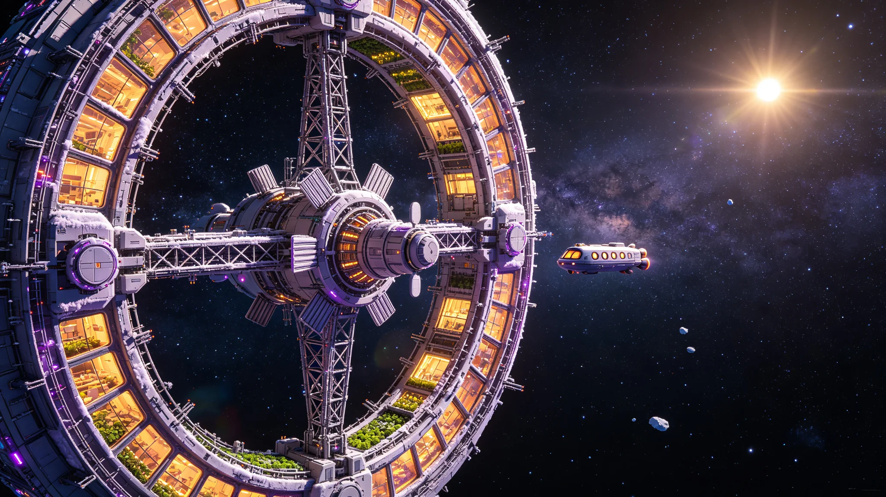

# 内奥尔特云"玄冥-01"母港第三期生命维持环扩建工程公报与深空驻留人员轮换清册

**公报文号**：OORT-XM-2115-008
**签发单位**：深空探测总署 · 内奥尔特云母港建设与运营指挥部
**签发日期**：2115年11月5日
**轮换清册编号**：ROSTER-XM-2115-W18（第18批轮换）

---

## 第一部分：第三期生命维持环扩建工程公报

### 一、工程概况

玄冥-01母港位于内奥尔特云1,000 AU日心轨道（黄道面倾角2.3°，轨道周期约31,600年），是人类部署最远的永久性深空设施。母港于2087年完成首期主桁架合拢与裂变堆阵并网（常驻12人），2098年完成第二期科考舱扩建（常驻48人）。第三期生命维持环扩建工程于2111年3月启动，2115年9月20日完成全部模块对接与生态系统启动，10月15日通过竣工验收。扩建后母港常驻人员编制由48人增至120人，具备完整的闭式生态循环能力（空气/水/食物自给率≥90%），成为内奥尔特云区域的深空驻留、科考与后勤枢纽。

### 扩建前后核心参数对比

| 参数项 | 二期（扩建前） | 三期（扩建后） | 增量 |
|:---|:---:|:---:|:---:|
| 母港总质量 | 142,000 t | 318,500 t | +176,500 t |
| 桁架构型 | 主桁架长120 m | 主桁架长120 m + 生命维持环（直径120 m） | 新增旋转环 |
| 加压舱总容积 | 18,400 m³ | 62,800 m³ | +44,400 m³ |
| 人工重力段 | 1×旋转段（半径8 m，0.15 g） | 1×旋转段 + 生命维持环（半径60 m，转速1.5 rpm，0.15 g） | 新增大环 |
| 常驻人员编制 | 48人 | 120人 | +72人 |
| 裂变堆阵 | 3×50 MWt（总电功率18 MWe） | 5×50 MWt（总电功率30 MWe） | +2堆 |
| 散热面积 | 8,000 m²（液滴辐射器） | 22,000 m²（液滴辐射器） | +14,000 m² |
| 空气自给率 | 65%（电解水补氧+CO₂吸附） | 92%（高等植物光合+微藻补氧） | +27% |
| 水自给率 | 72%（冷凝回收+过滤） | 95%（完整水循环+冷凝灌溉） | +23% |
| 食物自给率 | 12%（水培蔬菜补充） | 68%（水培+气雾栽培+昆虫蛋白） | +56% |
| 通信延迟（对地） | 5天13小时（1,000 AU光速单程） | 同左 | — |
| 设计寿命 | 30年（核心设备可更换） | 50年（三期扩建后延寿） | +20年 |

---

### 二、生命维持环构造与生态系统

第三期扩建核心为直径120 m的旋转生命维持环，环截面为椭圆形（长轴12 m，短轴8 m），环内总面积约4,520 m²（可使用面积约3,600 m²）。环以1.5 rpm旋转，环内壁产生0.15 g人工重力（与二期旋转段相同，便于人员适应）。

生命维持环内部分为6个扇区，每扇区圆心角60°：

| 扇区 | 功能 | 面积 | 核心设备/作物 |
|:---|:---|---:|:---|
| A区 | 水培蔬菜舱 | 600 m² | 多层水培架（12层），种植生菜、菠菜、小白菜、番茄、黄瓜 |
| B区 | 气雾栽培主食舱 | 600 m² | 气雾栽培马铃薯、红薯、大豆；LED补光（红蓝光比4:1，光强300 μmol/m²·s） |
| C区 | 微藻与蛋白舱 | 400 m² | 封闭光生物反应器（螺旋藻、小球藻），黄粉虫养殖架（蛋白来源） |
| D区 | 水循环与净化舱 | 300 m² | 反渗透净水机组（2×5 m³/h），超滤+活性炭+紫外消毒，冷凝水收集系统 |
| E区 | 空气处理与气候舱 | 300 m² | CO₂吸收塔（MEA化学吸收+生物固定），O₂电解备用槽，温湿度控制（22°C/55%RH） |
| F区 | 居住与公共活动区 | 1,400 m² | 60间单人居住舱（每间6 m²），食堂（120座），健身房，医疗室，娱乐室，通讯室 |

### 生态循环关键指标（三期达标实测）

| 指标 | 设计目标 | 实测值（运行30天均值） |
|:---|:---:|:---:|
| O₂产出速率 | ≥120 kg/天 | 132 kg/天（高等植物85 kg + 微藻47 kg） |
| CO₂吸收速率 | ≥145 kg/天 | 158 kg/天（高等植物110 kg + 微藻48 kg） |
| 水循环回收率 | ≥95% | 96.2%（冷凝+洗涤+排泄回收） |
| 日净水产量 | ≥6 m³/天 | 7.2 m³/天 |
| 蔬菜日产量 | ≥60 kg/天 | 78 kg/天 |
| 主食日产量（干重） | ≥25 kg/天 | 28 kg/天（马铃薯18 kg + 大豆10 kg） |
| 昆虫蛋白日产量 | ≥5 kg/天 | 6.2 kg/天（黄粉虫幼虫） |
| 食物热量自给率 | ≥60% | 68%（人均日摄入2,200 kcal中1,496 kcal自产） |
| 舱内微生物浓度 | ≤100 CFU/m³ | 42 CFU/m³（高效过滤+紫外消毒） |
| 舱内VOC浓度 | ≤0.5 mg/m³ | 0.21 mg/m³（活性炭吸附+植物降解） |

---

### 三、扩建工程关键节点

| 节点 | 日期 | 内容 |
|:---|:---|:---|
| 扩建模块发射 | 2109-03至2110-08 | 生命维持环6个扇区模块、2台裂变堆、散热系统由地月L1造船厂分批发射，经木星/土星/海王星多次重力助推抵达1,000 AU（航程约4年） |
| 环段在轨组装 | 2111-03至2112-11 | 由在轨组装机器人完成6个扇区模块的环向对接，环体合拢，旋转驱动机构安装 |
| 裂变堆4号、5号并网 | 2113-01 | 新增2台50 MWt裂变堆并网，总电功率提升至30 MWe |
| 生态系统启动 | 2113-06至2114-12 | 分批种植水培蔬菜、气雾栽培主食，接种微藻，引入黄粉虫，生态系统逐步建立（历时18个月达到稳定循环） |
| 水循环与空气处理联调 | 2114-08至2014-12 | 水循环系统与空气处理系统全负荷联调，闭环运行测试 |
| 全系统验收测试 | 2115-03至2015-09 | 120人满负荷驻留测试（模拟运行30天），各项指标验证 |
| 竣工验收 | 2115-09-20 | 验收委员会签署竣工验收证书 |
| 正式投入运行 | 2115-11-01 | 生命维持环正式投入运行，第18批轮换人员进驻 |

---

### 四、深空驻留健康保障体系

三期扩建后，玄冥-01母港建立完整的深空驻留健康保障体系，针对1,000 AU极端深空环境（通信延迟5天13小时、银河宇宙线通量高、微重力/低重力、完全封闭环境）制定专项保障措施：

| 保障领域 | 措施 | 指标 |
|:---|:---|:---|
| 辐射防护 | 居住舱水层屏蔽（环外壁储水层厚度30 cm，等效约15 g/cm²），核心舱额外聚乙烯屏蔽（20 cm），人员佩戴个人剂量计 | 舱内剂量率≤0.2 mSv/h，年累计≤500 mSv（实际约380 mSv/年） |
| 骨密度维护 | 人工重力环每日驻留≥16小时，阻力训练每日≥1小时，维生素D+钙补充（每日钙1,200 mg，维生素D 800 IU） | 骨密度年流失率≤1.5%（二期为3.2%） |
| 肌肉维护 | 阻力训练+有氧运动每日≥1.5小时，蛋白质摄入≥1.2 g/kg体重/天 | 肌肉量年流失率≤2%（二期为5%） |
| 视觉监测 | 每季度眼底检查（视神经盘水肿、脉络膜皱褶），颅内压监测（每月） | 视觉障碍发生率≤5%（二期为12%） |
| 心理健康 | 每日自主情绪量表（PHQ-9/GAD-7），每月与地球心理医生视频咨询（延迟5天13小时，异步通信），站内心理咨询师1名（常驻），虚拟自然环境体验室（模拟地球森林/海滩场景，每日可使用30分钟） | 抑郁筛查阳性率≤8%（二期为15%） |
| 睡眠保障 | 居住舱独立睡眠区（光声屏蔽），模拟地球昼夜节律（光照16h/暗8h，色温6500K→2700K渐变），白噪音系统 | 睡眠效率≥85%，失眠发生率≤10% |
| 医疗保障 | 站内医疗室（2名医生+3名护士，配备手术台、X射线机、超声、血液分析仪、基本药品库），远程医疗会诊（异步，延迟5天13小时），应急药品储备（≥2年用量） | 常见疾病站内处置率≥95%，需后送率≤1%/年 |
| 营养保障 | 自产食物+储备食物搭配，每日食谱由营养师制定，定期营养指标检测（血常规、电解质、微量元素） | 营养不良发生率≤3% |

---

## 第二部分：深空驻留人员轮换清册

### 五、第18批轮换人员编制与安排

三期扩建后，玄冥-01母港常驻人员编制120人，采用"六班四运转"工作制（每班20人，工作8小时/班）。驻留周期为30个月（因通信延迟与补给周期限制，轮换周期较长），每批轮换40人（1/3人员轮换，保持工作连续性）。第18批轮换于2115年11月1日执行，轮换人员由"深空渡轮-07"号货运客运飞船运送（航程约4年，2111年从地球出发）。

### 第18批轮换人员清册（40人）

| 序号 | 岗位 | 人数 | 专业要求 | 驻留周期 | 备注 |
|:---|:---|---:|:---|:---|:---|
| 1 | 母港站长 | 1 | 深空工程管理，15年以上深空设施运营经验 | 30个月 | 接替第15批站长 |
| 2 | 副站长（工程） | 1 | 航天器工程，裂变堆系统经验 | 30个月 | — |
| 3 | 副站长（科考） | 1 | 行星科学/天体物理，博士学位 | 30个月 | — |
| 4 | 裂变堆工程师 | 4 | 核工程，空间裂变堆运行执照 | 30个月 | 5台堆维护 |
| 5 | 生命维持系统工程师 | 6 | 环境工程/生物技术，闭式生态系统经验 | 30个月 | 含2名生态学家 |
| 6 | 机电维修工程师 | 5 | 机械/电子工程，深空设施维修经验 | 30个月 | — |
| 7 | 桁架与结构工程师 | 2 | 结构工程，空间桁架维护经验 | 30个月 | 含舱外活动资质 |
| 8 | 通信与数据工程师 | 3 | 通信工程，深空天线与数据处理经验 | 30个月 | — |
| 9 | 推进与轨道工程师 | 2 | 航天推进，离子推进与轨道力学经验 | 30个月 | — |
| 10 | 科考队员（天文） | 3 | 天体物理/天文学，博士学位 | 18个月 | 奥尔特云天体观测 |
| 11 | 科考队员（行星科学） | 2 | 行星科学/地质学，博士学位 | 18个月 | 内奥尔特云天体采样分析 |
| 12 | 科考队员（天体生物） | 1 | 天体生物学/微生物学，博士学位 | 18个月 | 深空环境微生物监测 |
| 13 | 医生 | 1 | 全科医学/航天医学，5年以上临床经验 | 30个月 | 站内2名医生轮换1名 |
| 14 | 护士 | 2 | 护理学，3年以上临床经验 | 30个月 | — |
| 15 | 心理咨询师 | 1 | 临床心理学，深空心理保障经验 | 30个月 | — |
| 16 | 营养师 | 1 | 营养学，封闭环境膳食管理经验 | 30个月 | — |
| 17 | 厨师/后勤 | 2 | 烹饪/后勤管理，封闭环境餐饮经验 | 30个月 | — |
| 18 | 安保与应急 | 1 | 安全管理/应急救援，深空设施安全经验 | 30个月 | — |
| **合计** | — | **40** | — | — | — |

### 六、轮换交接安排

1. **交接期**：第18批人员抵达后，与第15批出港人员进行30天工作交接（2115年11月1日至11月30日），交接期间母港实际驻留160人（超编40人，生命维持环临时扩容至160人容量，已通过验收测试）。
2. **交接内容**：各岗位一对一交接，包括设备状态、操作规程、未完成任务、注意事项、个人工具。交接完成后签署《岗位交接确认书》，由站长审核。
3. **出港安排**：第15批出港人员40人于2115年12月1日搭乘"深空渡轮-07"号返程（航程约4年，预计2119年抵达地球）。返程期间人员处于低工作负荷状态（每日工作4小时，主要为飞船维护与科考数据分析）。
4. **健康检查**：出港人员在返程前进行全面健康检查（骨密度、肌肉量、视力、心血管、心理状态），数据存档并发送至地球深空医学研究中心。抵达地球后进行为期6个月的重力再适应康复（人工重力逐步增加至1 g）。
5. **下一批轮换**：第19批轮换人员40人预计于2118年5月抵达（2114年从地球出发），轮换第16批人员。

---

**签发人**：内奥尔特云母港建设与运营指挥部 总指挥 （电子签章）
**清册审核**：深空探测总署人事司 / 深空医学研究中心 / 玄冥-01母港站务委员会
**会签**：深空探测总署工程司 / 地月L1造船厂（渡轮运营） / 深空驻留人员保障中心
**抄送**：外太阳系工业化协调委员会 / 柯伊伯带远疆-01巡天阵 / 海王星特里同-01补给站 / 天王星天青-01前哨站
