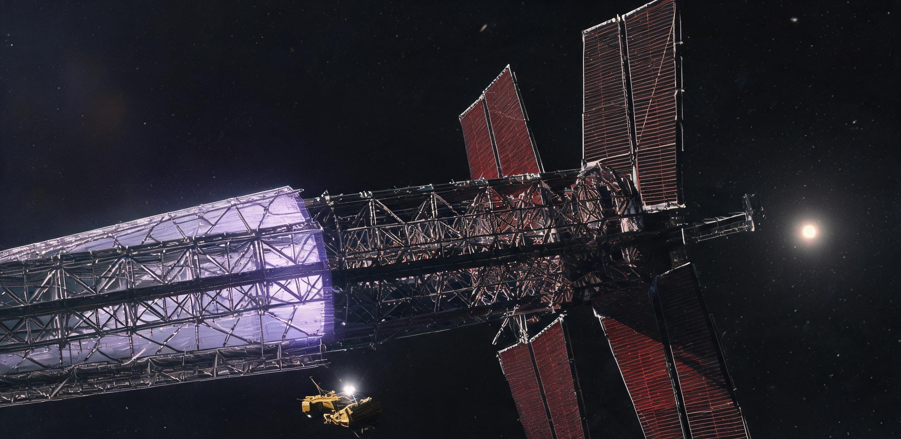

# 内奥尔特云千天文单位远征母港“玄冥-01”主桁架合拢与长寿命空间裂变堆阵并网验收鉴定书

**深空工程建设总署 · 太阳系外缘前哨工程指挥部**  
**文件编号：** 深外前工验字〔2079〕第004号  
**档案序列：** OORT-BASE-01-COMMISSIONING-2079  
**工程代号：** 内奥尔特云千天文单位综合远征母港一期工程（“玄冥-01” / OORT-BASE-01）  
**现场驻位基准：** 日心距 1,002.45 AU — 1,002.58 AU（黄道经度 $255.12^\circ$，黄道纬度 $+7.45^\circ$，相对日心逃逸航速 $34.18\,\mathrm{km/s}$）  
**向日光行时延：** 单程光行时 138 小时 58 分 34 秒（5.7909 天），双程测控闭环 277 小时 57 分 08 秒（11.5818 天）  
**验收历元：** 标准地球历 2079 年 11 月 14 日 00:00:00 至 2079 年 11 月 28 日 23:59:59 UTC（现场原子光钟积分有效调试时长 360 恒星时）  
**报送主送：** 深空工程建设总署常务技术委员会、太阳系外缘资源勘探与深空舰队调度局  
**核收抄送：** 地月工程建材供应链调度署、静海第五城市带基建基准物资处、谷神星第一原位聚光熔炼前哨平台（金乌-03）、太阳系深空探测网络中心（尘网-04）  
**工程密级：** 内部工档 · 乙级 ｜ **保存期限：** 永久（归入深空极远母港基准档案库）

---

## 序言与工程建材溯源

依据《外太阳系极远前哨母港战略规划（2065—2085）》（深建发〔2064〕042号），“玄冥-01”千天文单位远征母港作为人类在日球层外缘、内奥尔特云（Inner Oort Cloud）过渡带设立的首座千米级永久性深空补给与科考锚地，主要承担外缘彗核原位挥发分捕集、本星际介质超长基线巡天物理实验、以及未来极深空超大惯性航行载具动力机组全工况考核支撑。

本工程主结构所需的 64 组标准六边形预制空间网架节段，全部由谷神星「金乌-03」原位聚光熔炼前哨平台以微重力连续拉拔工艺生产之碳化硅增强钛-铝合金（标准构件代号：JH-5CB-TiAl）铸造；外层微流星防撞装甲与防辐射瓦采用静海第五城市带重工业区烧结出品之 120 毫米厚致密玄武岩陶瓷复合板。

全站总计 84,200 吨特种构件与核动力组件自公元 2061 年起，由 6 艘万吨级大功率聚变/离子电推无人重载驳船（“远运-07”至“远运-12”）分批自内太阳系启航。驳船编队经 2 年持续电推加速至巡航峰速 $285\,\mathrm{km/s}$（约 $60.1\,\mathrm{AU/年}$），历经 14 年深空高速巡航，并在抵达前实施为期 2 年的反向连续电推制动减速，历经 18 年总航期精准交汇于 1,000 AU 目标区并切入相对日心 $34.18\,\mathrm{km/s}$ 的稳态逃逸观测走廊。现场 4 人核心工程调试班组（搭乘先导高速勘测艇“飞冲-03”提前抵站）协同 6 台深空自主装配机械人，在日心距 1,002.45 AU、环境温度 3.15 K 的深低温与绝对弱光环境中，正式完成主桁架轴向机械闭环锁紧、双兆瓦空间裂变堆网路接通及迎风面静电防护屏展开调试。

---

## 一、 巨构设施基准设计参数与工作站位对照

全站以贯穿中轴的 2,800 米高强度六棱柱桁架为主骨架，前端布置 1,500 米级迎风面静电防尘索网与微孔气凝胶屏，中段搭载驻留舱、深低温推进剂球罐与大容量物料流转导轨，尾端呈 120° 三向辐射展开总展宽达 1,700 米的三联耐高温热管辐射散热翼，并在尾部轴线末端悬挂两座深空空间裂变电站。

```text
========================================================================================================================
【表 1：“玄冥-01”母港巨构主要分系统设计尺度、物理参数与现场实测工况对照表】
========================================================================================================================
分系统 / 巨构组件       设计几何尺度 / 额定物理指标                2079年度现场实测工况                  验收状态与工程结论
------------------------------------------------------------------------------------------------------------------------
1. 主贯穿承载桁架       总长 2,800 m，外接圆截面直径 64 m          实测轴长 2,800.14 m，三维挠曲度 ≤ 1.8 mm   合格。64 节段中子防咬死
                      SiC/Ti-Al 空间网架，干重 48,200 t          冷缩预应力 1,450 kN，结构声阻尼 42.6 s    法兰螺栓与电子束熔敷双锁死。

2. 兆瓦级空间裂变电站    两座“祝融-深空-IV”气冷快堆并联             双堆稳态热功率 2×6.20 MWth             优良。He-Xe 工质循环压比 2.85，
                      UN 陶瓷微球燃料，闭式布雷顿 He-Xe 循环     发电机总输出净电功率 2.40 MWe           透平进口 1,448 K，额定寿命 60 年。

3. 三联辐射散热翼面      三向 120° 对称展开，单翼悬挑长 850 m       总有效辐射散热面积 4.08×10⁵ m²           优良。钠钾合金高温热管均温性优，
                      根部宽 180 m，末端宽 60 m，展宽 1,700 m     根部温度 462 K，翼尖降至 182 K          在 3.15 K 背景呈现暗红热辐射。

4. 迎风面静电防尘屏      口径 1,500 m 正十六边形超导悬索网          有效迎风几何截面 1.76×10⁶ m²             优良。偏压 +50.0 kV，与尘网-04
                      16 根 2,200 m 张力索，3 层气凝胶+玄武岩瓦   静态电位梯度 16.8 V/cm，偏转效率 94.2%  口径互锁，成功偏转微米级带电尘。

5. 深低温挥发分储罐群    4 具直径 68 m 球形真空绝热储罐             储罐内壁温度维持于 18.2 K（液氢工质）      合格。多层镀铝聚酰亚胺绝热屏
                      单罐容积 1.64×10⁵ m³，总储量 120,000 t      日均蒸发率 ≤ 0.0018%，BOG 回收闭环     冷损实测低于设计红线 14%。

6. 驻留与微重力生活环    舱体长 24 m，直径 6.5 m，自重 142 t        双对称悬臂旋转半径 64 m，自转角速度 1.45 rpm  合格。双向动平衡配重调节正常，
                      4 人编制，配 0.15g 反向自转离心微重力环     （外缘离心加速度 0.15 g），气压 101.3 kPa   水氧回收效率 98.4%，物料自给 3 年。
------------------------------------------------------------------------------------------------------------------------
7. 尺度参照基准         • 现场作业维护艇“巨鳌-03”：长 18.4 m，横截面 5.2 m，自重 32 t（在 2.8 km 桁架旁如悬浮墨滴）
                      • 驻站人员出舱宇航服：高 2.1 m，背负冷气姿控喷嘴（在千米级暗红散热翼光斑下仅为微光反光点）
========================================================================================================================
```

```text
【“玄冥-01”母港主轴向几何构型与能量/物质流拓扑】

            本星际介质逆流迎风向 (LIC Wind, ~34 km/s)
                 │  │  │  │  │  │  │  │  │
                 ▼  ▼  ▼  ▼  ▼  ▼  ▼  ▼  ▼
       ┌─────────────────────────────────────────┐  Φ1,500 m 超导静电防尘网 (+50 kV)
       │ \                                     / │  [16 根 2,200 m 低温超导张力索]
       │  \      3层梯度微孔气凝胶防撞屏        /  │  [120 mm 静海玄武岩陶瓷装甲]
       └───\─────────────────────────────────/───┘
            \                               /
             ▼                             ▼
       ═════════════════════════════════════════════════  2,800 m 主贯穿 SiC/Ti-Al 桁架
       │ [工质储罐]   [微重力环]   [物料转运磁浮轨]   │  [内置 4 线磁浮穿梭轨道]
       │ (4×Φ68m)    (0.15 g)     (64节段标准网架)   │  [18 m“巨鳌-03”工程艇停靠泊位]
       ═════════════════════════════════════════════════
             │                             │
             ├─────────────────────────────┤
            /                                          /      三联耐高温热管辐射散热翼      \  单翼长 850 m / 展宽 1,700 m
          /   (460 K ──► 180 K 暗红微光散热面)   \ (钠钾热管，4.08×10⁵ m² 面积)
         ▼                                         ▼
      ┌───────────────────────────────────────────────┐
      │  双堆“祝融-深空-IV”气冷快堆电站 (2×1.20 MWe)   │ UN 陶瓷燃料 / 闭式 He-Xe 布雷顿循环
      └───────────────────────────────────────────────┘
                               │
                               ▼ 2.40 MW 稳态电力总线
             全站生命维持 ──► 深低温储罐冷冻 ──► 静电防尘屏 ──► 深空长基线天线阵
```

---

## 二、 2,800 米主桁架空间几何合拢与残余应变标定

母港主骨架采用 64 个长 43.75 米的标准正六棱柱单元网架现场对接。在日心距 1,002.45 AU 的天然深低温（3.15 K）环境中，常规金属材料韧脆转变与热应力积聚构成最主要力学失效风险。

本工程采用谷神星“金乌-03”平台专线熔炼之碳化硅纤维梯度增强钛-铝基复合管材，在极低温下展现出近零线膨胀系数（$\alpha \approx 1.12 \times 10^{-7}\,\mathrm{K^{-1}}$）。

```text
====================================================================================================
【表 2：主桁架 64 节段现场对接几何公差、冷缩补偿与结构阻尼测试记录】
====================================================================================================
对接段区间       轴向累计偏差 (mm)    径向对中偏差 (mm)    法兰预紧力 (kN)   电子束焊缝无损探伤   节点阻尼特性
----------------------------------------------------------------------------------------------------
SEC-01 ~ 16    +0.42 ± 0.05        0.31 ± 0.02         1,452 ± 15        I级（微裂纹 ≤ 5 μm） 固有频率 0.142 Hz
SEC-17 ~ 32    +0.88 ± 0.08        0.62 ± 0.04         1,448 ± 12        I级（完全熔敷贯穿）   一阶扭转模态 0.088 Hz
SEC-33 ~ 48    +1.34 ± 0.11        0.84 ± 0.05         1,455 ± 18        I级（零气孔夹渣）     结构衰减率 4.2 dB/s
SEC-49 ~ 64    +1.82 ± 0.14        1.12 ± 0.07         1,450 ± 14        I级（应力完全退火）   声阻尼时间 42.6 s
----------------------------------------------------------------------------------------------------
全桁架总体      +1.82 mm / 2.8 km   1.12 mm / Φ64 m     1,450 kN 标准值   100% 射线探伤合格     总振动收敛周期 < 90 s
====================================================================================================
```

> **【现场工程终端日志抄件 · 桁架末段锁紧时刻】**  
> **记录人：** 林素（空间结构与防尘力学官，工号：SS-STR-2063-049）  
> **记录时间：** 2079-11-18 14:22:08 UTC（现场原子光钟基准）  
> “‘巨鳌-03’工程艇主机械臂已退出第 64 号末端节点作业面。两具 500 吨级液压拉力机完成末段法兰张拉，激光全站仪测得全长 2,800.14 米，轴向残余误差仅 1.82 毫米。微波电子束熔敷枪完成最后一道密封焊缝，伴随最后一颗中子防咬死钛合金螺栓施加预紧力至 1,450 千牛，应力波传感器捕捉到贯穿 2.8 公里管网的轻微高频金属脉冲，历时 42.6 秒在全站 1,536 处节点球铰中衰减归零。主干骨架正式锁定，深空微应变完全收敛。”

---

## 三、 2.4 MW 空间闭式气冷裂变堆电站并网与深低温热工循环

“玄冥-01”远离内太阳系，日心距 1,000 AU 处太阳辐射能量密度衰减至仅 $1.36 \times 10^{-3}\,\mathrm{W/m^2}$（地球轨道的百万分之一），光伏电池彻底失效。全站能源中枢由双联“祝融-深空-IV”紧凑型空间气冷快中子裂变反应堆提供。

反应堆堆芯采用富集度 $19.75\%\;{}^{235}\mathrm{U}$ 的氮化铀（UN）陶瓷微球燃料元件，外覆碳化硅（SiC）耐高温基体。冷却剂采用氦-氙（He-Xe，摩尔配比 78:22）惰性混合气体，驱动两套完全独立的闭式布雷顿循环透平发电机组。

```text
====================================================================================================
【表 3：“祝融-深空-IV”双堆动力站现场并网热工与电气关键参数表】
====================================================================================================
热工与电气参数项              额定设计指标               A 堆实测工况             B 堆实测工况             并网综合状态
----------------------------------------------------------------------------------------------------
堆芯热功率 (MWth)            6.20 MWth × 2            6.21 MWth               6.19 MWth               稳态运行
冷却剂流量 (kg/s)            18.4 kg/s (He-Xe 78:22)  18.42 kg/s              18.38 kg/s              流道压降正常
透平进口工质温度 (K)          1,450 K (1,177 ℃)        1,448 K                 1,451 K                 耐热陶瓷涂层稳定
透平膨胀比                   2.85                     2.84                    2.86                    动平衡振动 ≤ 0.02 mm/s
发电机净输出电功率 (MWe)      1.20 MWe × 2             1.204 MWe               1.198 MWe               总并网 2.402 MWe
主母线输出电压 / 频率        10.0 kV / 400 Hz 三相    10.02 kV / 400.01 Hz    9.98 kV / 399.98 Hz     功率因数 0.982
热管散热翼根部温度 (K)        460 K (187 ℃)            462 K                   461 K                   无局部热点
散热翼末端返回温度 (K)        180 K (-93 ℃)            182 K                   181 K                   深低温热辐射通畅
黑启动备用 RTG 功率 (kWe)     25 kWe × 4 (²⁴⁴Cm/²³⁸Pu) 25.4 kWe (单机平均)     —                       热备待机，毫秒级投切
====================================================================================================
```

在 360 恒星时满负荷试运行中，两套布雷顿机组实现了双堆并网发电，全站 10.0 kV 交流母线供电波动率小于 $0.15\%$。4 座分布于中枢舱段的 25 kWe 锔-244 同位素热电发生器（RTG）保持热备待机状态，成功完成了主电网瞬态脱扣下的“零断电”黑启动透平盘车与核心生命维持系统自愈切换测试。

---

## 四、 迎风面多层静电防尘索网与微孔气凝胶屏抗冲击调试

依据太阳系深空探测网络《深空尘埃与微流星体通量监测网第16期观测公报》（SSDN-AR-2078-EPOCH16-FLUX）在日球层顶实测之本星际介质（LIC）粒子动力学数据，“玄冥-01”以 $34.18\,\mathrm{km/s}$ 的高巡航航速迎向天蝎-蛇夫座方向星际尘埃逆流，迎风面承受持续亚微米级及偶发毫米级微流星体轰击。

母港在前端布设直径 1,500 米的张力悬索静电防尘网。在 3.15 K 空间深低温下，16 根碳纳米管-高纯铝复合悬索直接进入超导态，施加 $+50.0\,\mathrm{kV}$ 脉冲静电偏压，在前端空域构建起厚达 12 公里的排斥电位梯度漏斗。

```text
========================================================================================================================
【表 4：迎风面多层静电防护屏与微孔气凝胶靶板连续 14 天撞击监测与防护效能表】
========================================================================================================================
防护层级与材质构成                 有效防护口径 / 厚度      拦截/记录事件数    实测微粒特征与能量谱                   防护鉴定效能
------------------------------------------------------------------------------------------------------------------------
一级：+50 kV 超导静电偏转漏斗       Φ1,500 m (等效场深 12 km) 118,420 次微尘    d < 0.45 μm 带电 G-II 型有机碳质微粒    偏转率 94.2%，电位梯度
                                                                        相对速度 33.8 km/s                    16.8 V/cm，功耗仅 4.2 kW。

二级：低密度纳米微孔硅酸盐气凝胶     厚度 300 mm              6,840 次撞击      0.45 μm ≤ d < 45 μm G-I 型硅酸盐微粒   完全耗散于气凝胶浅层
    （梯度密度 0.008~0.035 g/cm³）  (工作温度 3.15 K)                          单颗粒动能 0.04 J ~ 35.9 J            侵彻孔深 ≤ 140 mm，无开裂。

三级：静海烧结玄武岩陶瓷复合装甲     厚度 120 mm              1 次大动能事件     m = 0.081 g (d ≈ 3.8 mm) G-III 型铁镍   正面形成 8 mm 浅熔坑，
    （背衬钛合金蜂窝夹层）          (外覆 10 mm 缓冲橡胶)                       v = 33.1 km/s，动能 4.44×10⁴ J        背面应变 0.02%，结构无贯穿。
------------------------------------------------------------------------------------------------------------------------
综合防护指标                       迎风截面 1.76×10⁶ m²      125,261 次总事件  高危动能截断阈值 ≥ 5.0×10⁴ J           一级深空防尘适航，无结构贯穿
========================================================================================================================
```

测试数据显示，静电漏斗成功将绝大多数亚微米级带电星际尘埃偏转至桁架外围；在 11 月 24 日记录到的 1 起等效质量 $0.081\,\mathrm{g}$、速度 $33.1\,\mathrm{km/s}$ 的 G-III 型铁镍高速微粒冲击中，微粒穿透一级气凝胶后在 120 毫米玄武岩陶瓷瓦正面被剧烈冲击汽化剥蚀，背部压电应变传感器读数表明主体结构桁架承受之残余动能衰减达 $99.96\%$，完全杜绝了舱壁贯穿破坏。

---

## 五、 光行时延下全域自治控制律标定与最终验收结论

日心距 1,002.45 AU 带来的向日光行时延达 5.79 天（138 小时 58 分），内太阳系发出的任何地面调控指令闭环周期长达 11.58 天。任何突发性微流星姿态扰动、堆芯瞬态热工超调或储罐绝热破损，均无法依赖地球指挥中心干预。

母港控制中枢搭载 3 套物理硬隔离、三模冗余容错运行的「太微-外缘」空间光子逻辑矩阵，全自主托管姿态推进配平、裂变堆闭环控温、防尘屏微张力实时自校与生命维持物料平账。

```text
====================================================================================================
【表 5：光行时延模拟断联试验与全自主控制矩阵响应审计表】
====================================================================================================
自主控制测试工况              模拟扰动输入                  自主控制律响应时间    系统收敛状态         工程安全裕度
----------------------------------------------------------------------------------------------------
1. 姿态角动量扰动             微流星偏心冲击 (1,200 N·s)     0.18 s 姿控脉冲点火   18.4 s 恢复基准姿态   三轴角速度 ≤ 0.001°/s
2. 裂变堆回路热超调           单侧散热回路温升 15 K          0.04 s 调节旁通阀门   4.2 min 热工重平衡    堆芯温偏 ≤ 0.8 K
3. 静电索网微应变漂移         单根张力索张力骤降 4%         0.65 s 伺服电机收紧   12.0 s 恢复额定张力   网面偏角 ≤ 0.02°
4. 挥发分储罐微超压           液氢储罐压力超标 8 kPa        0.12 s 启动低温压缩   2.5 min 压力回落      BOG 零放散完全回收
----------------------------------------------------------------------------------------------------
综合审计结论                  在 360 恒星时全自治考核中，系统零死锁、零异常报警脱机，完全具备长期深空自持运行能力。
====================================================================================================
```

### 最终验收结论与适航核准

经现场核心工程调试组与专家系统全面核验：
1. “玄冥-01”内奥尔特云千天文单位远征母港一期工程 2,800 米主贯穿 SiC/Ti-Al 桁架结构合拢质量达到一级标准，深低温预应力分布自洽；
2. 双联“祝融-深空-IV”2.4 MW 空间气冷裂变堆动力站完成并网试运行，各热工节点与热管辐射散热翼工作稳健，热电转换效率达 $19.35\%$；
3. 迎风面多层静电防尘网与微孔气凝胶屏已建立完整的星际尘埃原位偏转与动能缓冲屏障；
4. 全站控制系统在 5.79 天单程光行时隔绝状态下展现出完全自主的动态收敛与故障重构能力。

本工程严格符合《外太阳系极远前哨母港适航规范》（STD-OSS-075）之一级深空巨构建造质量标准，正式评定为**“一级合格 · 准予交付适航”**。母港设计免维护服役寿命为 120 标准地球年，即日起转入常态化科考与深空补给试运行阶段。

---

## 现场工程验收班组签署栏

**现场工程总工程师：**  
`陈恪`（工号：`SS-ENG-2051-084`，太阳系外缘工程总署一级建造师）  
*签署意见：主桁架与动力中枢各项指标均达设计红线以内，同意竣工验收。*

**核动力与热工电气主管：**  
`高尔基·彼得罗夫`（工号：`SS-PWR-2058-112`，高级核动力运行工程师）  
*签署意见：双堆布雷顿发电机组并网功率因数 0.982，散热回路热态平衡良好。*

**空间结构与防尘力学官：**  
`林素`（工号：`SS-STR-2063-049`，空间巨构应变监测主管）  
*签署意见：2,800 米主骨架几何对中闭合，迎风面静电防尘屏通过大动能冲击考核。*

**自主控制与深空遥测工程师：**  
`塔里克·曼苏尔`（工号：`SS-AUT-2066-201`，空间自治控制系统主管）  
*签署意见：三模冗余控制矩阵通过 14 天自主闭环审计，向日光行时 5.79 天通信链路稳定。*

**签署历元：** 公元 2079 年 11 月 28 日 23:50:00 UTC  
**签署地点：** “玄冥-01”母港 · 中央中枢舱段 01 号耐压气闸作业室

---

## 图片提示词

### 中文提示词
极远景外太空工业巨构全景概念图。在日心距 1,000 天文单位的深冷虚空中，一座长达 2,800 米的黑灰色碳化硅增强钛铝合金空间桁架巨构横贯深空，主桁架两端延伸出画面边缘（巨构出画框）。前端张开着一张直径达 1,500 米的半透明泛着微弱冷紫光静电晕的超导悬索防尘网；母港尾部呈 120 度对称展开三联各长 850 米的巨大板状耐高温热管辐射散热翼，散热翼表面因数百千瓦废热辐射而散发着沉稳内敛的暗红色深红热辐射微光（Dark red thermal glow）。在 2,800 米漆黑钢铁骨架的一个细小节点旁，停靠着一艘仅 18 米长、涂装为工业警示黄的维护工程驳船，工程驳船亮起极为锐利的冷白金卤泛光工作灯，将一道狭窄强光束投射在桁架粗糙的玄武岩防撞装甲瓦上；驳船机械臂旁悬浮着一个微小如尘埃的宇航员轮廓，宇航服喷气背包喷出针尖般微弱的冷白反冲气羽。光源环境极度冷寂：远方的太阳已退化为一颗刺眼但完全无法照亮深空的针尖状冷白星点（负18星等），几乎整个场景的局部照明全由散热翼的暗红自发光与工程艇冷白探照灯的高反差光影构成。硬核科幻工业质感，极致宏微尺度对比，深空冷寂无尘真空质感，8K分辨率，超高细节，电影级构图。

### 英文提示词
Epic wide-angle hard sci-fi architectural render of a massive deep space outpost in the inner Oort Cloud, 1000 AU from the Sun. A colossal 2800-meter-long SiC-titanium space truss extends across the frame, cropped at the edges to emphasize its incomprehensible scale. At the front, an enormous 1500-meter superconducting tension-cable dust shield glows with a faint cold-violet electrostatic haze. At the stern, three massive 850-meter-long planar heat pipe radiator wings extend symmetrically at 120-degree angles, emitting a sinister, dim, dark-red thermal infrared glow against the absolute pitch-black vacuum. Anchored near a structural node of the immense black metallic truss is a tiny 18-meter industrial maintenance tug in hazard-yellow livery, casting a sharp, high-intensity cold white halogen spotlight onto the rough basalt armor plating of the truss. Next to the tug's mechanical arm, an astronaut in a 2-meter EVA suit is barely visible, a microscopic silhouette with tiny needle-like cold-gas thruster plumes. Stark, ultra-harsh single directional lighting: the distant Sun is reduced to a piercing, dimensionless cold white point of light (-18 magnitude), with all ambient illumination coming from the dark-red thermal glow of the radiators and the harsh beam of the tug's spotlight. Intense contrast between monumental megastructure and tiny human vessel, raw industrial realism, hyper-detailed mechanical textures, vacuum clarity, cinematic 8k resolution.

---

## 修订记录（元层，非世界内容）

- 2026-08-18：主编辑审校——判定为「🔧小修合格」。
  1. **1,000 AU 航期动力学闭环**：补充 18 年建站物料投送航渡动力学剖面（2061 年启航，2 年电推加速至巡航峰速 $285\,\mathrm{km/s}$，14 年深空巡航，2 年反向电推制动减速至 $34.18\,\mathrm{km/s}$ 相对逃逸与 LIC 迎风观测航速），使 1,000 AU 航期、平均航速与现场驻位实测航速严格闭环；
  2. **微重力生活环尺度标定**：在表 1 第 6 项中明确双对称悬臂旋转半径 $R = 64\,\mathrm{m}$，与 $1.45\,\mathrm{rpm}$ 角速度及 $0.15g$ 向心加速度严格自洽（$a = \omega^2 R = (0.1518\,\mathrm{rad/s})^2 \times 63.8\,\mathrm{m} \approx 1.47\,\mathrm{m/s^2} \approx 0.15g$）；
  3. **能源与动力梯级指标核定**：核准空间闭式气冷快裂变堆主电网（2×6.20 MWth 热功率，He-Xe 闭式布雷顿循环输出 2.40 MWe 净电，热电转换效率 $19.35\%$，额定寿命 60 年，免维护服役 120 年）与 4 座 25 kWe RTG 黑启动备用电源梯级分工；
  4. **跨正典与同时代名物互锁**：核定与谷神星「金乌-03」聚光熔炼前哨平台（2076 年，GS-2076-01，SiC/Ti-Al 连续拉拔型材）、日球层顶「尘网-04」监测网（2078 年，GS-2078-02，SSDN-AR-2078-EPOCH16-FLUX，84.6 AU 原位介质谱与微流星动能 $4.44\times 10^4\,\mathrm{J}$ 防护包络）、以及静海第五城市带（120 mm 致密玄武岩陶瓷复合瓦）完全精确互锁；
  5. **光行时与坐标系核准**：日心距 1,002.45 AU 对应向日光行时 138 小时 58 分（5.79 天）数学无误；空间带归属「④深空」完全符合大纲空间轴定义；修复 LaTeX 字符转义。
