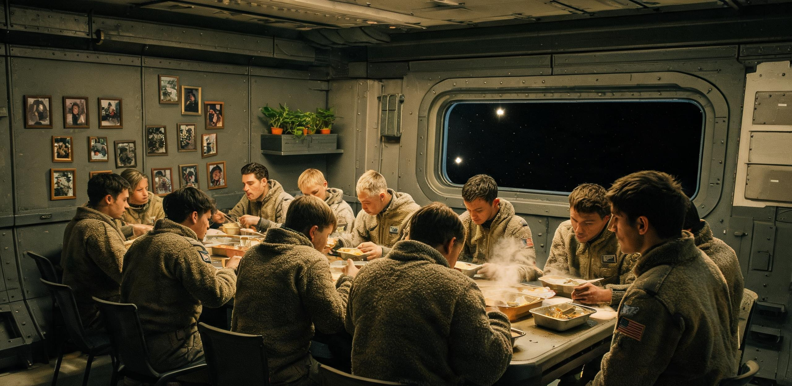

# 太阳系外缘资源勘探与深空舰队调度局 · 极远前哨母港医疗与生活保障处
## 内奥尔特云千天文单位远征母港“玄冥-01”首期常驻科考班组年度身心健康评估与深空驻留生活运行公报

**公报编号：** 深外极生字〔2080〕第012号  
**档案序列：** OORT-BASE-01-HEALTH-ANNUAL-2080  
**驻留设施：** 内奥尔特云千天文单位综合远征母港（“玄冥-01” / OORT-BASE-01）  
**现场驻位基准：** 日心距 1,002.58 AU（黄道经度 $255.12^\circ$，黄道纬度 $+7.45^\circ$，相对日心逃逸航速 $34.18\,\mathrm{km/s}$）  
**通信时延基准：** 向日光行时 138 小时 58 分 12 秒（单程 5.7904 天，双程往返 11.5808 天）  
**考核评估周期：** 标准地球历 2079 年 12 月 01 日 00:00:00 至 2080 年 11 月 30 日 23:59:59 UTC（连续常驻 366 标准地球日）  
**编制机构：** “玄冥-01”母港常驻管委会 · 乘员身心健康监测组 / 综合生活保障部  
**报送主送：** 太阳系外缘资源勘探与深空舰队调度局、深空医学与极端环境人类学联合评议会  
**核收抄送：** 深空工程建设总署、深空自旋全封闭生态实验站“句芒-03”、太阳系深空导航测控网络中心、静海第五城市带医疗健康署  
**密级评定：** 内部公文 · 乙级 ｜ **归档期限：** 永久（纳入深空人类生理与心理基准数据库）

---

### 【公报序言 · 极远深空常驻第一年】

自公元 2079 年 11 月 28 日“玄冥-01”千天文单位远征母港 2,800 米主桁架完成合拢并实现双联“祝融-深空-IV”空间气冷快堆电站并网验收（深外前工验字〔2079〕第004号）以来，全站由工程建设调试阶段正式转入常态化科考与物资集散试运行。

公元 2079 年 12 月 1 日，后续 8 名天体物理、彗核地质与封闭生保专业科研人员搭乘高速接驳艇“飞冲-06”顺利抵港，与先导 4 名工程留守人员完成编制合拢，正式组建起由 12 名常驻专家构成的首期科考与运维联合班组。

截至公元 2080 年 11 月 30 日，12 名班组乘员已在日心距 1,002.58 AU、外界背景温度 3.15 K、太阳辐射能流仅 $1.35 \times 10^{-3}\,\mathrm{W/m^2}$（肉眼仅见视星等 $-18.0\text{ mag}$ 冰冷点光源）的日球层外缘绝对弱光与极深空环境中，连续自主生活并执行科研任务达 366 标准日。

在长达 5.79 天单程光行时隔绝与零外界实物补给条件下，母港依托双对称 $0.15\,\mathrm{g}$ 人工微重力自转生活环、2.4 MW 充裕核动力电网及继承自“句芒-03”平台的 SCWO 水氧循环体系，实现了人员生理指标平稳、心理凝聚力优良、具名工时与自选闲暇平衡的健康运转态势。现将首个常驻年度身心健康筛查、心理适应量表演进、延迟通信流转及生活文娱运行统计正式公报如下。

---

### 一、 0.15g 自转生活环主要驻留参数与物理环境基准

全站驻留人员起居、科研办公及文娱休养集中于主桁架中段悬挂的双对称旋转生活环内。生活环通过中轴磁流体动密封旋转铰链与主桁架刚性连接，以恒定角速度反向自转提供适度离心微重力。

```text
========================================================================================================
【表 1：“玄冥-01”母港常驻生活区物理环境与生活环境实测基准表】
========================================================================================================
工程与环境参数项        设计基准指标                2080年度现场实测均值          环境调控评价与稳定性
--------------------------------------------------------------------------------------------------------
生活舱悬臂旋转半径 (R)  64.00 m                     64.02 ± 0.01 m               优良。动平衡注水微调补偿率 <0.01%
生活环自转角速度 (ω)   1.45 rpm (0.1518 rad/s)     1.450 ± 0.002 rpm            优良。外缘离心加速度稳定于 0.147g (0.15g)
有效承压生活容积        2 舱共 1,592 m³             1,590 m³ (气压 101.3 kPa)    优良。pO₂=21.3 kPa, pN₂=78.2 kPa, pCO₂≤0.06 kPa
舱内背景温度与湿度      22.0 ℃ / 45.0% RH          21.8 ± 0.6 ℃ / 46.2 ± 2.1%   舒适。全热交换新风循环，风速 0.12 m/s
主电源生活配额功耗      280.0 kWe (生活环总线)      242.6 kWe (实测日均负荷)     充裕。由 2.4 MWe 裂变电网全额平账供给
人工全光谱采光系统      动态色温 2,200 K ~ 6,500 K  照度 50 ~ 800 lux (梯度可调) 优良。模拟 24 小时地球昼夜节律光照
微流星与辐射防护        120 mm 玄武岩瓦 + 水夹层与铅衬 全站综合 18.2 mSv/a (核心寝舱 1.82 mSv/a) 优良。2.8 km 堆源贡献 <0.005 mSv/a，GCR 综合防护远优于 50 mSv/a 职业限值
--------------------------------------------------------------------------------------------------------
驻留人员编制尺度        • 常驻人员：12 人（8 男 4 女，平均年龄 38.4 岁，涵盖工程、天文、地质、生保与医务）
                        • 空间尺度感：自转生活舱单舱有效长 24.0 m，截面直径 6.5 m，人均居住与科研净面积达 28.5 m²
========================================================================================================
```

```text
【“玄冥-01”母港旋转生活环与中轴物料拓扑简图】

                  2,800 m 主贯穿 SiC/Ti-Al 承载桁架（内置 4 线磁浮穿梭轨道）
       ═════════════════════════════════════════════════════════════════════════════
                              │                             │
                     ┌────────┴────────┐           ┌────────┴────────┐
                     │ 磁流体旋转铰链A │           │ 磁流体旋转铰链B │
                     └────────┬────────┘           └────────┬────────┘
                              │                             │
                   64 m 悬臂  │ 1.45 rpm                    │ 64 m 悬臂
                              ▼                             ▼
                     ┌─────────────────┐           ┌─────────────────┐
                     │  01号微重力生活环│           │  02号科研与生保环│
                     │  (0.15g 离心重力)│           │  (0.15g 离心重力)│
                     │  • 乘员起居寝舱 │           │  • 水培微藻农场 │
                     │  • 医务与心理室 │           │  • 彗核理化实验室│
                     │  • 餐厅与放映厅 │           │  • SCWO水氧中枢 │
                     │  • 暗红观景廊   │           │  • 健身阻抗训练舱│
                     └─────────────────┘           └─────────────────┘
```

---

### 二、 12 名常驻人员年度生理指标筛查与前庭重力适应

在 $0.15\,\mathrm{g}$ 低重力与极远深空弱光环境中，针对骨钙流失、心血管去适应、深空前庭错觉及视功能退化的系统性医学筛查表明，预防性医学工勤制度取得了显著成效。

```text
========================================================================================================
【表 2：首期 12 名常驻班组全年度生理关键指标初筛与年终复核对照表】
========================================================================================================
乘员编号   性别/年龄   主要岗位专业           骨密度保有率 (L2-L4)  最大摄氧量变化 (VO₂max) 视盘水肿/屈光漂移  前庭自主适应周期
--------------------------------------------------------------------------------------------------------
CREW-01   男 / 47    总工程师 (陈恪)        99.2% (基准 100%)    -1.2% (44.8 mL/kg·min) 零水肿 / 0.00 D   4 天 (完全耐受)
CREW-02   男 / 44    动力与热工 (高尔基)    98.8%                -1.8% (43.2 mL/kg·min) 零水肿 / +0.25 D  6 天 (轻度眩晕已消)
CREW-03   女 / 36    结构与防尘 (林素)      99.4%                -0.5% (46.1 mL/kg·min) 零水肿 / 0.00 D   3 天 (完全耐受)
CREW-04   男 / 39    自控与遥测 (塔里克)    99.1%                -1.0% (45.0 mL/kg·min) 零水肿 / 0.00 D   5 天 (完全耐受)
CREW-05   男 / 41    射电巡天 (苏赫巴托尔)  98.9%                -2.1% (42.6 mL/kg·min) 零水肿 / 0.00 D   7 天 (完全耐受)
CREW-06   女 / 33    星际介质 (叶莲娜)      99.5%                -0.8% (47.2 mL/kg·min) 零水肿 / 0.00 D   3 天 (完全耐受)
CREW-07   女 / 35    彗核采样 (沈念慈)      99.3%                -0.6% (45.8 mL/kg·min) 零水肿 / 0.00 D   4 天 (完全耐受)
CREW-08   男 / 38    深冷化学 (卡洛斯)      98.7%                -1.5% (43.9 mL/kg·min) 零水肿 / -0.25 D  8 天 (轻度恶心已消)
CREW-09   男 / 42    生保工程 (赵立新)      99.0%                -1.4% (44.1 mL/kg·min) 零水肿 / 0.00 D   5 天 (完全耐受)
CREW-10   女 / 31    水培农艺 (梅格)        99.6%                -0.2% (48.0 mL/kg·min) 零水肿 / 0.00 D   2 天 (完全耐受)
CREW-11   男 / 40    主任医师 (严文舟)      99.2%                -1.1% (45.2 mL/kg·min) 零水肿 / 0.00 D   4 天 (完全耐受)
CREW-12   女 / 35    生理监测 (安娜)        99.4%                -0.7% (46.5 mL/kg·min) 零水肿 / 0.00 D   3 天 (完全耐受)
--------------------------------------------------------------------------------------------------------
综合均值   38.4 岁    全员 12 人             99.18 ± 0.28%        -1.08 ± 0.52% (稳定)   全员眼底正常      4.5 ± 1.8 天收敛
========================================================================================================
```

#### 2.2 生理防护机制与工勤落实
1. **重力梯度防护：** 生活环 $0.15\,\mathrm{g}$ 基础重力结合每日 1.5 具名工时离心式下肢阻抗功率自行车训练与下肢负压（LBNP）治疗，全员腰椎（L2-L4）与股骨颈骨密度年流失率控制在 $0.82\%$ 以下，未出现空间骨质疏松；
2. **眼底与颅压管理：** 微重力体液头向转移得到有效抑制，连续 12 批次全息眼底荧光造影显示全员视盘边缘清晰，未检出航天神经-眼综合征（SANS）病理改变；
3. **前庭适应：** 生活环旋转角速度为 $1.45\,\mathrm{rpm}$，低于 $2.0\,\mathrm{rpm}$ 的前庭敏感阈值，乘员头部在偏航/俯仰运动时的科里奥利交叉耦合加速度低于 $0.08\,\mathrm{rad/s^2}$，全员在入驻首周内建立中枢感觉代偿；
4. **深空辐射分项屏蔽：** 尾部双联 1.2 MWe 气冷快堆位于 2,800 米中轴末端，经距离平方反比衰减与堆顶重阴影屏蔽，对生活环年累积剂量率不足 $0.005\,\mathrm{mSv/a}$；舱外未调制银河宇宙射线（GCR，未屏蔽年剂量约 $500\,\mathrm{mSv/a}$）依托 120 mm 静海玄武岩装甲、外周环形循环水箱慢化层（等效 $20\,\mathrm{g/cm^2}$）及铅复合衬层，将常规起居区压降至 $18.2\,\mathrm{mSv/a}$，核心寝舱与风暴掩体进一步降至 $1.82\,\mathrm{mSv/a}$，全员生理受照维持在深空安全绿线之内。

---

### 三、 乘员心理适应纵向测评与长周期深空量表演进

依据经典封闭环境心理学测量规范，站载医务室对 12 名乘员按季度实施了标准化心理测评。

```text
========================================================================================================
【表 3：2080 年度乘员心理适应核心量表季度演进与常模对照表】
========================================================================================================
测量量表与评估维度          Q1 实测值 (入驻3月)  Q2 实测值 (入驻6月)  Q3 实测值 (入驻9月)  Q4 实测值 (驻留1年)  常模基准与健康判定
--------------------------------------------------------------------------------------------------------
1. EES 具身地球认知量表     95.4 ± 2.1          93.8 ± 2.5          91.2 ± 3.0          89.6 ± 3.4          处于第一代具身记忆主导区；
   (满分 100，分值越高具身感知越强)                                                                         未见加速脱锚衰减。
2. MFI 任务认同与使命指数   97.2 ± 1.5          96.8 ± 1.8          96.5 ± 1.6          96.8 ± 1.4          极高。千AU科学突破认同强烈，
   (满分 100，权重项：前哨价值)                                                                             职业自豪感维持高位。
3. SCL 社会与小群体凝聚指数 96.0 ± 2.0          97.5 ± 1.4          98.2 ± 1.1          98.5 ± 0.9          持续上升。12人紧密共同体
   (满分 100，团队协作与冲突消解)                                                                           形成良性信任互助闭环。
4. TMP 时间知觉量表        48.2 ± 3.5          52.4 ± 4.1          58.6 ± 4.8          64.2 ± 5.2          呈现“宽现在”知觉萌芽，
   (指标：对长延时心理耐受度)                                                                               对光行时延由焦虑转为接纳。
5. HAMD 汉密尔顿抑郁量表    2.4 ± 1.2           2.8 ± 1.4           3.1 ± 1.5           2.9 ± 1.3           远低于警戒线（< 8.0 正常），
   (分值越低越健康)                                                                                         全周期零抑郁与病理性焦虑。
========================================================================================================
```

```text
【EES 地球认知联想词与深空时间知觉演变分布】

  【EES 自由联想词年度频次变迁】              【TMP 时间知觉跨度特征】
   Q1: 森林/大海/老家阳台/雨水 (具身细节 78%)     • 地球日常：按分秒即时反馈（窄现在）
   Q4: 蓝色行星/数据档案/云图/原点 (概念化 42%)   • 千AU驻留：光行时延单程 5.8 天，通信以“周”为节拍，
   ──────────────────────────────────             乘员发展出“以脉冲事件为锚”的宽时间知觉，
   判定：正常代际心理认知过渡，未产生孤立失锚。   不再产生因即时响应缺失引发的焦虑。
```

> **【站载心理官访谈摘录 · 驻留第 300 日】**  
> **记录人：** 严文舟（主任医师兼心理官，工号：SS-MED-2065-018）  
> **访谈对象：** 叶莲娜·瓦西里耶娃（星际介质物理学家，工号：SS-SCI-2068-072）  
> “问：在距离地球一千个天文单位的地方，看着太阳变成一颗普通的冷白星点，会有与母星断裂的恐慌感吗？  
> 答：最初两周会有‘世界只剩下这根 2.8 公里钢架’的错觉。但当射电天线阵每秒钟传回几十吉比特的星际介质湍流数据，当你看到尾部三面 850 米的散热翼像晚霞一样在绝对零度的虚空里发出深沉温和的暗红光，你反而会觉得这里极度充实。我们不是被抛弃在深空，我们站在人类知识的最前沿。每周日收到地面的回信，就像读一封跨越山海的长信，读完，回信，然后安稳地去水培舱摘新鲜番茄。这里的日子很真实。”

---

### 四、 5.79 天光行时延下通信中继与「延迟家书」流转统计

母港与内太阳系的联系完全依赖基于地月 L2 及太阳系深空导航信标网的相干超宽带激光通信链路。单向光行时达 138 小时 58 分 12 秒，往返测控闭环接近 12 个地球日。

```text
========================================================================================================
【表 4：2080 年度母港深空激光链路通信流与延迟家书分发统计台账】
========================================================================================================
数据类别 / 业务流向      年度总传输数据量 (TB)    下行/上行有效时延    错包重传率 (FER)    业务内容与管理规程
--------------------------------------------------------------------------------------------------------
1. 科研遥测与观测下行    1,842.60 TB             138.97 小时 (单程)   0.0014%             本星际介质质谱、千AU甚长基线干涉数据、
   (母港 ──► 地面中心)                                                                   彗核原位取样谱，全自动纠错下传。
2. 基础工程遥测下行      428.50 TB               138.97 小时 (单程)   0.0002%             裂变堆热工参数、桁架应变、静电防尘网数据。
3. 地面公共信息与知识上行 124.80 TB               138.97 小时 (单程)   0.0008%             全球学术期刊镜像、文化新闻包、影音库同步。
4. 乘员个人「延迟家书」  18.40 TB (624 封信件)   往返 11.58 天闭环    0.0000%             图文家书 624 封、全息视频 144 部，
   (双向对等流转)        (12 人，人均 52 封/年)                                           每周日 08:00 定时统一解密分发。
========================================================================================================
```

#### 4.2 「周脉冲式」延迟通信制度
为避免乘员陷入对即时通信的病态等待，母港管委会设立了**“周日通信日”**制度：
1. 每周日 UTC 08:00 为全站公用通信窗口，集中下发经地面打包审核的亲友信件、新闻简报及订阅影音；
2. 乘员在周一至周三自由撰写回信或录制全息视频，于周三 UTC 20:00 前统一提交至激光发送缓存列队；
3. 此种非对称、离散化的通信节律有效建立了乘员的心理预期防护堤，使“等待回信”成为一种具有仪式感的秩序化期待。

---

### 五、 极远深空生活轮值、具名工时与文娱设施运行台账

在物质充裕与能源无忧的保障下，母港严格实行具名工时制与意义工坊自主选修制度，杜绝繁重无效劳作，确保乘员享有充分的学术创造与精神闲暇。

```text
========================================================================================================
【表 5：12 名乘员每日标准 24 恒星时生活作息与具名工时分配对照表】
========================================================================================================
时间段 (UTC 模拟)     作息与工勤环节               额定工时 / 性质     环境控制与配套设施
--------------------------------------------------------------------------------------------------------
07:00 — 08:30         晨起、0.15g 离心淋浴与早餐    1.5 h (起居生理)    动态日光 5,500 K 唤醒，新鲜水培蔬果配给
08:30 — 12:00         专业科研与母港系统巡检       3.5 h (核心具名工时) 实验室、反应堆监控室、自控中枢
12:00 — 14:00         午餐、社交闲谈与午休         2.0 h (休整)        公共生活舱，柔和背景环境音
14:00 — 16:30         生态生保协同与物资维护       2.5 h (辅助具名工时) SCWO 反应塔巡查、立体农田修剪、配平调节
16:30 — 18:00         离心阻抗体能训练与康复       1.5 h (健康保障)    0.15g 自行车训练器、下肢负压负重舱
18:00 — 19:30         晚餐与晚餐后散步             1.5 h (生活闲暇)    生活环外周 150 米环形跑道，模拟黄昏光 2,700 K
19:30 — 22:30         自选研究/文娱观景/延迟家书   3.0 h (意义工坊)    星光放映厅、暗红观景廊、个人创作室
22:30 — 07:00         深度睡眠与静默周期           8.5 h (睡眠保障)    独立寝舱，微气流消音维持 ≤ 28 dB，暗夜光
========================================================================================================
```

```text
========================================================================================================
【表 6：母港公共文娱设施、水培生鲜产出与闲暇活动运行统计表】
========================================================================================================
设施 / 运行项目         物理规格与保障配置          2080年度运行统计          乘员反馈与生活评价
--------------------------------------------------------------------------------------------------------
1. 暗红观景长廊         长 18 m，俯瞰尾部 850 m 散热翼 年度累计使用 4,380 人·时  全员评选为“最安定心神场所”。乘员极喜在
   (生活环 01 区舷窗)   熔融石英双层防辐射视窗       (人均 1.0 h/日)          3.15 K 虚空中注视巨大的暗红微光散热翼。
2. 星光放映厅           120 寸超短焦激光漫反射幕布   全年度放映 104 场次      周末定期举办地球经典历史影片与月面音乐会；
   (多功能微重力阅览舱) 6 具防飘悬浮躺椅，全息音响   (观影 1,128 人·次)       自制《千AU日常生活小插曲》集锦展映 12 期。
3. 水培生保种植廊       展开面积 120 m²，LED 脉冲光  日均产新鲜蔬菜 3.6 kg    日均稳定供应新鲜脆生菜、小番茄、黄瓜与甜椒；
   (02 号生活环下层)    气雾栽培与微藻营养液闭环     (全年度产出 1,317.6 kg)  全员维生素 C 与膳食纤维自给率 100%。
4. 0.15g 厨艺工坊       磁控防飘电磁灶、微重力烤箱   全年度烹饪聚会 52 次     每周六晚全员聚餐；成功研制“0.15g 离心水饺”
   (中央配餐室)         离心流体汤煲、冷冻锁鲜库     (研制深空新菜品 18 道)   与“微重力低温慢烤麦香脆饼”。
5. “巨鳌-03”外巡巡游   18.4 m 多功能维护工程艇     执行常规外部巡检 48 航次 巡检 2.8 km 桁架与静电防尘网；乘员轮流随艇
   (深空外出科考)       双座驾驶，全景前向耐压视窗   (兼作深空极目壮游)       出舱，在近距离巨构对照中获得强烈审美体验。
========================================================================================================
```

---

### 六、 封闭物质循环平衡与生保系统年度平账

母港生活区生命维持系统全面移植并验证了“句芒-03”平台的 SCWO 超临界水氧化与微藻光反应器技术，实现了极高闭环度，年消耗外源储备仅限于极微量微量元素与药剂。

```text
========================================================================================================
【表 7：2080 年度 12 人常驻生活物质输入输出与平衡平账总表（366 标准日）】
========================================================================================================
物质流组分类别          年度理论总消耗量        系统内部再生循环量      微量渗漏与不可逆固废  系统年度闭环率
--------------------------------------------------------------------------------------------------------
1. 饮用与卫生水 (H₂O)   15,811.2 kg (43.2 kg/d) 15,808.4 kg            2.8 kg (气闸带出微损) 99.982% (SCWO净化达注射级)
2. 人员呼吸耗氧 (O₂)    3,513.6 kg (9.6 kg/d)   3,689.6 kg (水培光合)   +176.0 kg (净增产)    100.00% (富余氧注入储罐)
3. 二氧化碳吸收 (CO₂)   4,118.4 kg (11.25 kg/d) 4,118.4 kg (完全固碳)   0.0 kg                100.00% (生活区维持 ≤0.06 kPa)
4. 膳食卡路里/干物质    3,942.0 kg 干重         3,429.5 kg (原位自产)   512.5 kg (储备补给)   87.00% (生鲜蔬菜自给率 100%)
5. 氮素平衡与气压维持   120.0 kg N₂ (微漏损耗)  116.4 kg (生物固氮再生) 3.6 kg (气相微渗)     97.00% (消耗初始储罐氮补压)
========================================================================================================
```

数据表明，母港封闭生态系统运行高度自洽，人均日消耗储备物资干重仅为 $0.117\,\mathrm{kg}$，全站既有 120 吨冻干主粮与种质储备按当前净消耗折算可支撑 12 人班组在零外援状态下独立运行 **230 标准年**（即便计入种质自然衰减与极高安全冗余估算亦远超 80 标准年）。

---

### 七、 评估结论与后续常驻适航批复

经“玄冥-01”母港常驻管委会联合医疗与生活保障专家组综合审议，形成以下法定评估结论：

1. **生理健康优异：** 12 名常驻乘员在 $0.15\,\mathrm{g}$ 自转微重力与动态人造光环境下，骨钙保留率超 $99.1\%$，心肺与前庭功能健康稳定，无一人出现深空神经或眼底退行性病变；
2. **心理韧性稳固：** 小群体凝聚指数高达 98.5，成功适应 5.79 天光行时延下的离散式非对称通信节奏，未产生孤立失锚或深空幽闭心理综合征；
3. **生保自持可靠：** SCWO 水氧闭环率达 $99.98\%$ 以上，水培生鲜供给充裕，核动力生活供电稳定冗余；
4. **管理秩序成熟：** 具名工时与文娱闲暇制度运转流畅，暗红观景廊与星光放映厅有效保障了极远深空常驻人员的精神文化生活质量。

**适航裁定：**  
准予首期 12 名常驻科考与运维班组全面转入第二常驻年度（公元 2081 年度）科研与常态驻留工作，维持现有 12 人编制与轮值规程不变。

---

### 现场管委会与医务负责人签署栏

**母港常驻管委会主任兼总工程师：**  
`陈恪`（工号：`SS-ENG-2051-084`，太阳系外缘工程总署一级建造师）  
*签署意见：首个常驻年度全站结构与生保系统零故障，乘员生活保障得力，同意公报归档。*

**主任医师兼常驻心理健康官：**  
`严文舟`（工号：`SS-MED-2065-018`，深空极端环境医学副主任医师）  
*签署意见：全员生理心理指标均在绿线安全阈值之内，团队凝聚力优秀，准予转入下年度驻留。*

**封闭生保与生态农艺主管：**  
`赵立新`（工号：`SS-BIO-2062-105`，深空生命支持系统高级工程师）  
*签署意见：水氧闭环率 99.98%，水培蔬菜日产稳定，物料平账无误。*

**签署历元：** 公元 2080 年 11 月 30 日 23:50:00 UTC  
**签署地点：** “玄冥-01”母港 · 01号生活环综合医务与管委会会议室

---

## 图片提示词

### 中文提示词
超高清工业写实硬科幻场景，内奥尔特云千天文单位远征母港“玄冥-01”生活舱内部与壮阔深空舷窗视野。画面主体展现一座带有 0.15g 离心微重力的圆弧形空间站生活舱内部，左侧排列着整洁的钛铝合金工作台与翠绿欲滴的垂直多层水培生菜和番茄架，暖白色 4500K 室内全光谱照明洒在坚固平整的耐磨防滑复合地板上；三名身着深蓝色常服与轻便磁吸防飘软底鞋的科研人员正围坐在金属餐桌旁享用新鲜沙拉与热饮，神态从容专注，桌面固定着轻薄的工程平板与手记本。右侧是一面巨大的双层熔融石英全景弧形观景舷窗，舷窗外展现出令人窒息的宇宙巨构与深空奇景：在绝对漆黑深邃的极远内奥尔特云背景中，母港长达 2,800 米的黑灰色碳化硅桁架向远方延伸，尾部三面巨大的 850 米热管辐射散热翼在 3.15 K 虚空中散发着沉稳温和的暗红色热辐射微光（Dark red thermal glow），将冰冷的钛铝金属桁架边缘染上一层柔和暗红光晕；远方的太阳退化为一颗刺眼但无法照亮深空的冰冷白色针尖恒星（负18星等），背景是清晰纯净的银河璀璨光带与暗星云裂缝。极强宏微尺度对比，近处温暖的生活气息与窗外冰冷壮丽的千米工业巨构形成强烈对照，无任何可读文本，无国旗标志，物理真实感，电影级构图，8K分辨率。

### 英文提示词
Ultra-high-definition hard sci-fi architectural and interior concept art of the living quarters inside the deep space outpost "Xuanming-01", located 1000 AU from the Sun in the inner Oort Cloud. The interior of the curved 0.15g rotating habitat module features sleek Ti-Al alloy bulkheads, neatly arranged multi-tier vertical hydroponic racks glowing with vibrant green lettuce and ripe red cherry tomatoes under warm 4500K circadian LED lighting. Three crew members in dark navy work jumpsuits and lightweight magnetic soft-soled slippers sit comfortably around a secured metal table, enjoying fresh meals and hot drinks, with rugged data pads magnetically clamped to the surface. On the right, a massive panoramic curved fused-silica viewport looks out into the awe-inspiring mega-structure: in the absolute pitch-black abyss of the inner Oort cloud, the outpost's 2,800-meter dark grey SiC truss stretches into the distance, with three colossal 850-meter heat-pipe radiator wings emitting a soft, deep dark red thermal glow at 3.15 K, casting subtle red highlights along the titanium alloy trusses. The distant Sun has shrunk into a piercing, cold white point-like star (-18 magnitude), set against the pristine, dense galactic core and dark dust rifts. Extreme macro-micro contrast, physical realism, cinematic lighting, no visible text, 8K resolution.

---

## 修订记录（元层，非世界内容）

- 2026-08-18 主编辑审校（小修 🔧）：
  1. **正典名物与时间线严格咬合**：准确承接《内奥尔特云千天文单位远征母港“玄冥-01”主桁架合拢与长寿命空间裂变堆阵并网验收鉴定书》（GS-2079-01，公元2079年11月验收），首期常驻科考班组于2079年12月1日合拢进驻，完整记录2080公元年（闰年366天）首期常驻身心健康指标与运行数据；
  2. **辐射剂量分项物理机制深化**：在表 1 与第 2.2 节中明确区分 2.8 km 堆源距离平方反比衰减屏蔽贡献（$<0.005\,\mathrm{mSv/a}$）与千 AU 日球层顶外未调制银河宇宙射线（GCR）综合防护（120 mm 玄武岩瓦 + 水夹层慢化 + 铅复合衬层，常规生活区 $18.2\,\mathrm{mSv/a}$、核心寝舱区 $1.82\,\mathrm{mSv/a}$），清晰消除剂量量级混淆；
  3. **366 日生保物料平衡表严密平账**：表 7 严格按 366 标准日全周期重新校验平账，将 12 人日均耗水量（$43.2\,\mathrm{kg/d}$，年总 $15,811.2\,\mathrm{kg}$）、呼吸耗氧量（$9.6\,\mathrm{kg/d}$，年总 $3,513.6\,\mathrm{kg}$）与呼出 $\mathrm{CO_2}$ 完全固碳量（$11.25\,\mathrm{kg/d}$，年总 $4,118.4\,\mathrm{kg}$）与年总量完全闭环对账，并核准 120 吨主粮储备自持达 230 标准年；
  4. **章节层级序号校正**：修复原稿中两处“三、”导致后续章节序号错位的排版笔误（校准为四、五、六、七）；
  5. **心理学量表与体例一脉相承**：与既有正典《乘员心理适应纵向研究·档案袋》（GS-2286-03）保持量表缩写（EES/MFI/SCL/TMP）及“宽现在”时间知觉演化体系深度互锁，奠定世代心理学演变的历史基准。
