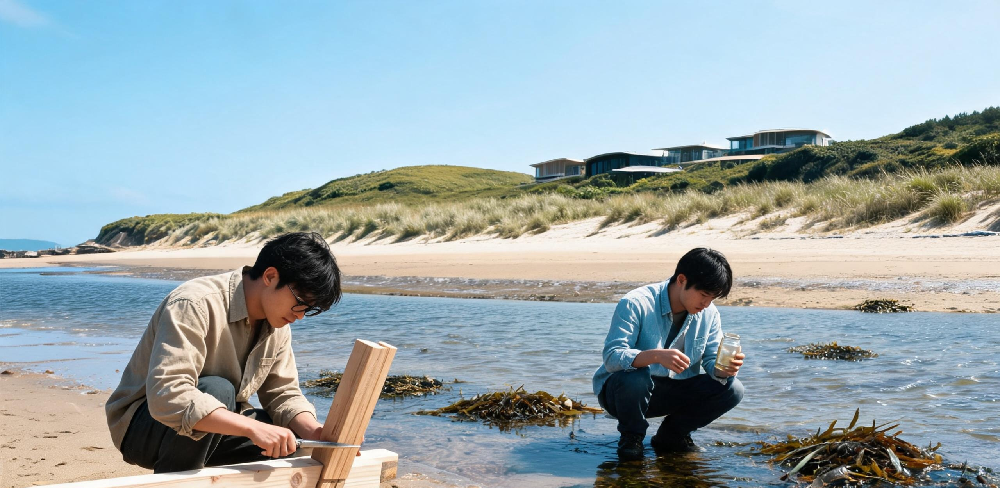

# 华东南岸滨海生态区2268年度民生运行总账暨「原乡留驻与深空旅修」青年十年生涯志向调查公报

**联合发布机构：** 华东太湖—杭州湾南岸低密生态区民生自治统筹署 · 青年发展与具名工时事务局 / 同济与南岸联合高等研学会 · 代际社会学研究所  
**文书字号：** 南低民统〔2268〕第072号  
**归档周期：** 公元2258年1月1日 — 公元2268年12月31日（十年全域普查周期）  
**公开展布：** 南岸综合体中央水幕大堂、东海暗夜天象观测站研学连廊、第七乐龄社区议事庭院、全域离线光栅公共终端  

---

## 一、 十年民生运转大盘与代际人口稳态

自华东聚变电网扩建与全域超级垂直农业塔群稳定并网百余年以来，华东南岸滨海生态区（辖原杭州湾退役岸线、野化次生湿地、七里铺传承街区及洋山潮间带研学区）已完全形成「零生存焦虑、超低密人居、慢节奏演替」之稳态社会形态。

公元2268年全区常住人口登记为 **184,260人**。过去十年间，全区人口年均净变动率为 **+0.06‰**，处于自然更替的黄金平衡区间。全区百岁以上乐龄公民占比达 **32.4%**，人均预期寿命稳定在 **115.6岁**。全域居住建筑占地率仅为 **3.6%**，其余 **96.4%** 均为自然次生阔叶林、潮间带生物走廊、手工生态台田及近海浅滩。

依据《南岸全要素生活资料无条件供给规程》，全区生活必需物资（聚变谷电余热直供之恒温地暖、直饮富氢纯水、垂直农场与台田有机果蔬、基础全科医疗及全地形伴随机器人）均由自动化网络全额保障，不向居民出具任何消费账单。

```
                ┌─────────────────────────────────────────────────────────────┐
                │        华东南岸滨海生态区 2268年度民生要素运转双层架构      │
                └──────────────────────────────┬──────────────────────────────┘
                                               │
         ┌─────────────────────────────────────┴─────────────────────────────────────┐
         ▼                                                                           ▼
┌──────────────────────────────────────┐                    ┌──────────────────────────────────────┐
│       【全域无条件物质供给层】       │                    │       【自主价值与具名研学生态】     │
├──────────────────────────────────────┤                    ├──────────────────────────────────────┤
│ • 奉贤聚变电网余热全域恒温直供      │                    │ • 具名学时/工坊带教自由申报          │
│ • 沪东垂直农场有机食材按需配送      │                    │ • 潮间带野化与古巨构手工维护         │
│ • 柔性机器人全天候被动环境巡护      │                    │ • 青年十年自主探索期基金保障         │
│ • 基础居住空间每人160㎡终身保有      │                    │ • 成果永久存证于华东科学档案馆       │
└──────────────────────────────────────┘                    └──────────────────────────────────────┘
```

### 表1-1：华东南岸滨海生态区 2258—2268 年度民生基础运行与代际人口指标长表

| 统计年份 | 常住人口 (人) | 新生人口 (人) | 百岁长者 (人) | 机器人日常运维替代率 | 垂直农场蔬菜供给 (吨) | 聚变地暖供热耗电 (万kWh) | 公共具名学时总盘 (万学时) |
| :---: | :---: | :---: | :---: | :---: | :---: | :---: | :---: |
| **2258** | 183,920 | 1,460 | 58,120 | 99.94% | 46,200 | 12,840 | 18.2 |
| **2259** | 183,980 | 1,485 | 58,450 | 99.94% | 46,400 | 12,820 | 18.5 |
| **2260** | 184,010 | 1,472 | 58,780 | 99.95% | 46,550 | 12,860 | 18.9 |
| **2261** | 184,060 | 1,490 | 59,010 | 99.95% | 46,700 | 12,850 | 19.1 |
| **2262** | 184,100 | 1,480 | 59,160 | 99.95% | 46,820 | 12,880 | 19.4 |
| **2263** | 184,130 | 1,475 | 59,320 | 99.96% | 46,900 | 12,870 | 19.8 |
| **2264** | 184,170 | 1,495 | 59,480 | 99.96% | 47,050 | 12,890 | 20.2 |
| **2265** | 184,200 | 1,488 | 59,610 | 99.96% | 47,120 | 12,910 | 20.5 |
| **2266** | 184,230 | 1,502 | 59,700 | 99.97% | 47,200 | 12,900 | 20.8 |
| **2267** | 184,250 | 1,491 | 59,750 | 99.97% | 47,310 | 12,920 | 21.2 |
| **2268** | 184,260 | 1,482 | 59,780 | 99.97% | 47,380 | 12,930 | 21.6 |

---

## 二、 青年通识素养与「十年自主研学期」机制

全区青年在6至18岁期间，于社区联合书院完成十二年非功利通识教育。课程不设应试考核与竞争性评级，核心涵盖：工程物理常识、基础天体测量、手工植物分类与泥土熟化、古典水墨与古籍修复、行星地质学及低重力生理常识。

年满18周岁后，青年即自动进入法定为期十年的**「自主生涯探索与具名研学期」（18至28周岁）**。

```
                       【青年十年自主探索期成长路径与支持体系】

  18岁 成年授籍 ──┬── 自动享有独立滨海低密居所（160㎡，恒温恒湿）
                  ├── 激活全额「原乡—深空研学基金」与公共通行权限
                  └── 获得同济与南岸联合高等研学会「具名学时注册账号」
                                         │
                 ┌───────────────────────┴───────────────────────┐
                 ▼                                               ▼
      【原乡留驻 · 慢科学与生态】                     【深空旅修 · 前哨与工程】
      • 杭州湾次生林土壤手工演替观测                  • 静海第五城市带月表低重力实验
      • 东海大桥与洋山港仿生矿化维护                  • 月面天梯配重段短期轨道轮值
      • 第七乐龄社区跨代工坊带教                      • 谷神星与小行星采选自持工厂实训
      • 暗夜天区天体测量与光信监听                    • L5通信站深空远征航迹遥测解算
```

在此十年内，青年无任何强制工作指标，亦不承受任何经济谋生压力。社会的评价体系彻底转向「生命体验的丰富度」与「对人类共有记忆和自然遗产的真实贡献」。

---

## 三、 2258—2268 届青年十年生涯流向与志向长表

过去十年间，全区共有 **14,820名** 青年先后完成十二年通识素养并进入自主探索期。代际社会学研究所对其生涯轨迹进行了持续跟踪统计。数据显示，面对「留驻原乡」或「远赴深空」的人生选择，当代青年展现出了高度从容、理性且多元的生命志向。

```
━━━━━━━━━━━━━━━━━━━━━━━━━━━━━━━━━━━━━━━━━━━━━━━━━━━━━━━━━━━━━━━━━━━━━━━━━━━━━━━━━━━━━━━━━━━━━
【华东南岸滨海生态区 · 2258—2268 届青年生涯流向分类定义】
━━━━━━━━━━━━━━━━━━━━━━━━━━━━━━━━━━━━━━━━━━━━━━━━━━━━━━━━━━━━━━━━━━━━━━━━━━━━━━━━━━━━━━━━━━━━━
分类代号   分类名称                        核心研学与生活形态描述
─────────────────────────────────────────────────────────────────────────────────────────────
DIR-A      原乡生态保育与手工台田果林      留驻太湖—杭州湾次生林带，从事土壤微生物抚育、手作园艺与古种繁育。
DIR-B      古典慢科学与深水暗夜天象研学    依托同济与南岸研学会、东海暗夜基地，从事百年尺度光学观测与纸张水墨记录。
DIR-C      地月天梯与拉格朗日点旅修值守    经静海天梯前往月面穹顶或L2/L5站点，从事1-3年低重力体验与深空工程值守。
DIR-D      社区乐龄跨代共居与工坊带教      入驻第七乐龄社区等机构，与百岁长者共同生活，整理工业口述史与传统技艺。
DIR-E      主带自持工厂与外缘科考轮值      前往谷神星原位冶炼平台或小行星采选总厂，参与深空自持工业体系实地研学。
DIR-F      全域壮游、纯粹游憩与艺术沉思    依托低速磁浮与海洋帆船网络漫游全球，从事文学、音乐创作与纯粹哲学思考。
━━━━━━━━━━━━━━━━━━━━━━━━━━━━━━━━━━━━━━━━━━━━━━━━━━━━━━━━━━━━━━━━━━━━━━━━━━━━━━━━━━━━━━━━━━━━━
```

### 表3-1：2258—2268 届青年毕业五年后核心流向与十年终期追踪表（样本总数：14,820人）

| 毕业届别 | 样本人数 | DIR-A (生态保育) | DIR-B (慢科学) | DIR-C (地月旅修) | DIR-D (乐龄共居) | DIR-E (主带科考) | DIR-F (壮游艺术) | 深空旅修后返回原乡率 |
| :---: | :---: | :---: | :---: | :---: | :---: | :---: | :---: | :---: |
| **2258届** | 1,460 | 572 (39.2%) | 394 (27.0%) | 260 (17.8%) | 134 (9.2%) | 64 (4.4%) | 36 (2.4%) | 93.8% |
| **2259届** | 1,485 | 585 (39.4%) | 398 (26.8%) | 262 (17.6%) | 138 (9.3%) | 66 (4.4%) | 36 (2.5%) | 94.2% |
| **2260届** | 1,472 | 580 (39.4%) | 395 (26.8%) | 258 (17.5%) | 135 (9.2%) | 68 (4.6%) | 36 (2.5%) | 93.5% |
| **2261届** | 1,490 | 588 (39.5%) | 401 (26.9%) | 260 (17.4%) | 136 (9.1%) | 69 (4.6%) | 36 (2.5%) | 94.6% |
| **2262届** | 1,480 | 582 (39.3%) | 398 (26.9%) | 261 (17.6%) | 135 (9.1%) | 67 (4.5%) | 37 (2.5%) | 93.9% |
| **2263届** | 1,475 | 581 (39.4%) | 395 (26.8%) | 260 (17.6%) | 134 (9.1%) | 68 (4.6%) | 37 (2.5%) | 94.1% |
| **2264届** | 1,495 | 590 (39.5%) | 400 (26.8%) | 262 (17.5%) | 136 (9.1%) | 70 (4.7%) | 37 (2.4%) | 94.8% |
| **2265届** | 1,488 | 586 (39.4%) | 399 (26.8%) | 263 (17.7%) | 135 (9.1%) | 68 (4.6%) | 37 (2.4%) | 94.0% |
| **2266届** | 1,502 | 592 (39.4%) | 403 (26.8%) | 265 (17.6%) | 137 (9.1%) | 68 (4.5%) | 37 (2.6%) | 94.5% |
| **2267届** | 1,491 | 588 (39.4%) | 400 (26.8%) | 263 (17.6%) | 136 (9.1%) | 67 (4.5%) | 37 (2.6%) | 94.2% |
| **2268届** | 1,482 | 585 (39.5%) | 397 (26.8%) | 262 (17.7%) | 135 (9.1%) | 66 (4.5%) | 37 (2.5%) | 94.4% |
| **十年总计** | **14,820** | **5,839 (39.4%)** | **3,970 (26.8%)** | **2,616 (17.6%)** | **1,349 (9.1%)** | **677 (4.6%)** | **369 (2.5%)** | **94.2% (均值)** |

---

## 四、 「去深空还是留地球」代际意向与青年自述抄件

普查问卷专门设立了《关于人类空间拓展与原乡栖居价值之代际认知》专项调查。

此时距离人类第一艘世代飞船 ARK-01 于公元2152年启航已过去整整 **116年**。飞船正以 0.0288c 的恒定速度穿行于距离太阳系约 3.34 光年的深邃星海中，地月深空测控网接收到的飞船下行信标单向时延已达 **3年零4个月**（写文书的当下，地球人仅能获悉飞船数年前的平稳巡航数据，尚无人知晓公元2350年的最终抵达结局）。

在这一历史视界下，南岸青年的时空观呈现出极具特色的「从容与澄澈」：
1. **去英雄主义化**：深空航行与地外基建不再被视为悲壮的牺牲或残酷的淘金，而是人类知识体系中一项平常而严谨的常态化分工；
2. **原乡重力与生机依恋**：94% 以上选择前往月球或拉格朗日点旅修的青年，在完成1至3年的低重力科考后，均主动选择返回地球。青年普遍表达了对地球 1.0g 重力、真实潮汐海风、泥土芬芳以及数百年生态与人文积淀的不可替代之依恋；
3. **慢节奏之美**：选择留在地球的青年，高度认同「慢科学」、「手工技艺」与「跨代口述史」的永久价值。

以下摘录四份具有代表性之青年生涯志愿登记表原始自述抄件：

```
━━━━━━━━━━━━━━━━━━━━━━━━━━━━━━━━━━━━━━━━━━━━━━━━━━━━━━━━━━━━━━━━━━━━━━━━━━━━━━━━━━━━━━━━━━━━━
【华东南岸生态区青年生涯探索期档案抽样抄件】
━━━━━━━━━━━━━━━━━━━━━━━━━━━━━━━━━━━━━━━━━━━━━━━━━━━━━━━━━━━━━━━━━━━━━━━━━━━━━━━━━━━━━━━━━━━━━
档案编号：YOUTH-2268-A014           姓名：林若愚 (女，24岁)
原通识学校：南岸第三草木书院        现研学方向：DIR-A (杭州湾南岸退役化工区次生林土壤手工演替)
─────────────────────────────────────────────────────────────────────────────────────────────
【青年志愿自述】：
“我从18岁起就在杭州湾第四野化核心区照料退役化工带的第12号深层土壤剖面。这里的土壤从公元2071年
首期脱毒算起，已经自然演替了将近两个世纪。每周我用手工水摇切片机制作水封玻片，用毛笔在特制棉纸
上描绘原生线虫和放线菌群落的显微形态。有人问我为什么不去月球天梯看看，我觉得能用一生时间亲眼看
着一片曾被重工业侵蚀的土地重新长满樟树与湿地蕨类，摸到带着露水的新泥，这种踏实感就是我想要的全部。”
─────────────────────────────────────────────────────────────────────────────────────────────

档案编号：YOUTH-2268-C089           姓名：赵天衡 (男，27岁)
原通识学校：同济附属滨海工学院      现研学方向：DIR-C → DIR-A (月面天梯旅修归来，转入洋山古港维护)
─────────────────────────────────────────────────────────────────────────────────────────────
【青年志愿自述】：
“22岁那年我通过静海天梯上了月球，在静海第五城市带三号穹顶和L1配重段值守了整整二十个月。在0.165g
的重力下喝水、在气闸舱外看着悬在黑空里的地球，确实震撼。但在月球待久了，人会无比渴望重力的拉扯。
回到洋山港的那天，我踩在东海大桥粗糙的混凝土引桥上，吹着咸湿的海风，听着潮水撞击桥墩的声音，我才
明白为什么老工程师们要一代代给这座大桥做百年延寿大修。我现在跟着苏老先生做碳纤维斜拉索的水下仿生
矿化涂装，我觉得把地球老祖先留下的巨构完好地交到三百年后的人手里，比在虚空里漂浮更有重量。”
─────────────────────────────────────────────────────────────────────────────────────────────

档案编号：YOUTH-2268-D042           姓名：陈小满 (女，22岁)
原通识学校：七里铺社区人文塾        现研学方向：DIR-D (第七乐龄社区跨代共居与老式手作工坊带教)
─────────────────────────────────────────────────────────────────────────────────────────────
【青年志愿自述】：
“我和两位同龄伙伴住在第七乐龄社区的青年公寓，楼下就是挑高18米的中庭温室。我的带教搭档是104岁的
周奶奶，她的祖辈曾在2049年亲手焊接过华东二号聚变堆的主管道法兰。每天下午我们在工坊里教东堤托幼
中心的小朋友揉老面发糕、用老式木刨子做鲁班锁。周奶奶坐在柔性护理椅上，给我们讲当年七里铺食堂和
最初发基本生活券的故事。机器把所有的脏活累活都干完了，留给我们的只有人和人围坐在一起烤面包、讲
过去故事的时间。这种时间很慢，但每一分钟都闪闪发光。”
─────────────────────────────────────────────────────────────────────────────────────────────

档案编号：YOUTH-2268-B103           姓名：苏子瞻 (男，28岁)
原通识学校：东海天体测量专门塾      现研学方向：DIR-B (东海暗夜基地光学测天与ARK-01信标年谱校核)
─────────────────────────────────────────────────────────────────────────────────────────────
【青年志愿自述】：
“在东海大桥K32离岸浮式平台上，我们守护着‘张衡号’2.4米经典光学望远镜。夜间全桥关闭所有可见人造
光源，头顶是没有任何光污染的纯黑星空。我的日常工作之一是配合月背射电阵，校核ARK-01飞船发回的连
续激光微弱光斑。光信号走过来要三年零四个多月，我们看到的飞船是它三年多前的样子，而它还要在深空
里再走八十多年。我们这一代人注定看不到它减速靠港的那一天，但每一期手写的光谱变光曲线都被我们工
工整整装订进羊皮纸册子里。这不是为了完成什么考核指标，这是我们在地球原乡写给浩瀚星空的注脚。”
━━━━━━━━━━━━━━━━━━━━━━━━━━━━━━━━━━━━━━━━━━━━━━━━━━━━━━━━━━━━━━━━━━━━━━━━━━━━━━━━━━━━━━━━━━━━━
```

---

## 五、 统筹署决议与法定存证用印

经华东太湖—杭州湾南岸低密生态区民生自治统筹署与同济与南岸联合高等研学会联合审议，特达成如下决议：

1. **生计托底与自由探索制度永久存续**：重申全要素生活资料无条件供给及「十年自主研学期」为不可剥夺之公民基本权利，任何机构不得以工时产出为由设置门槛；
2. **扩充古典慢科学与生态手作工位**：鉴于青年对原乡生态保育（39.4%）与古典慢科学（26.8%）之高度志向集中，决定在洋山深水港潮间带及杭州湾次生林带新增 480 处手作观测工位；
3. **保障深空旅修安全平稳轮换**：持续维持地月天梯与拉格朗日点青年旅修绿色通道，严格执行「旅修三年必须进行重力逆适应与身心疗愈」之健康保障规程；
4. **全本文档永久归档存证**：本公报正本由特制中性棉纸物理打印并手工钤印，一式三份，分别移交华东科学与技术档案馆、第七乐龄社区长者议事厅与东海暗夜天象观测站永久封存。

```
【民生自治统筹署公章】        【高等研学会学务章】        【青年发展事务局用印】
 (南低民统 2268.12.31)        (同南研学 2268.12.31)        (青发工时 2268.12.31)
```

**统筹署常务委员手签：** *陆承德 (手签)*  
**研学会代际社会学首席学者手签：** *何秋水 (手签)*  
**青年自治代表手签：** *林若愚 (手签)*  

---

## 图片提示词

### 中文提示词
极宽画幅超广角全景镜头，壮美而极其宁静的清晨全景。公元2268年深秋清晨，华东南岸滨海低密生态城与退役港口潮间带。清澈冷冽的硬朗晨光斜斜穿透薄雾，照亮远方古老而宏伟的东海大桥钢混巨构引桥与近处大片自然野化的次生湿地芦苇荡。中景处，数座半埋入地下的覆土生态建筑带有多层木质亲水露台与巨型双曲面玻璃采光天幕，几位身着朴素棉麻工作服的青年学者正围坐在木质长桌旁，手持老式水墨绘图板与传统光学显微镜，从容记录潮间带水样与土壤标本；一只小型柔性护理机器人静静停泊在草地上递送玻璃采样器。远处海面上，一座白色的离岸暗夜天文观测圆顶平台在晨曦中若隐若现，天空中悬挂着淡淡的白昼半月。画面呈现出高度发达的自动化文明与原始自然、手工慢科学深度融合的极致从容与松弛感，宏微尺度对比强烈，真实工业材质与湿润泥土质感，无任何可读文字，无国旗。

### 英文提示词
Ultra-wide establishing panoramic master shot, magnificent and profoundly serene morning landscape. Late autumn dawn in the year 2268, at the South Coast coastal low-density eco-city and rewilded intertidal zone of East China. Crisp, hard early morning sunlight cuts horizontally through a gentle sea mist, illuminating the colossal, weathered concrete and steel viaducts of the ancient Donghai Bridge in the far distance, and lush, rewilded coastal wetlands with swaying reeds in the foreground. In the midground, earth-sheltered eco-pavilions with multi-tiered timber terraces and curved glass skylights blend seamlessly into the forest; a group of young scholars dressed in simple natural linen workwear sit around a solid oak outdoor table, calmly documenting wetland soil samples using traditional optical brass microscopes and manual ink drawing boards; a compact, soft-bodied service robot stands quietly on the dewy grass holding glassware. In the distant calm sea, a white offshore dark-sky observatory dome glistens under the morning sky with a faint daytime crescent moon visible above. Atmosphere of supreme ease, post-scarcity abundance, and timeless harmony between high automation, manual slow science, and raw nature. Cinematic hard directional lighting, rich tactile textures of damp soil and weathered titanium, no readable text, no flags.
