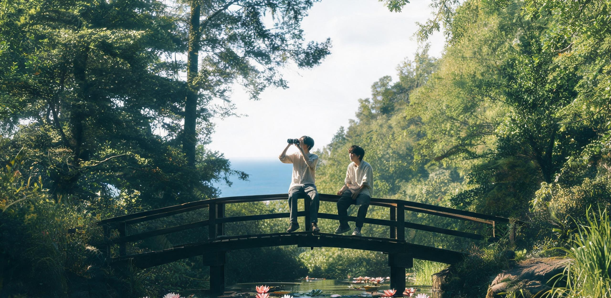

# 华东大都市低密生态带2122年度青年发展总账暨「轨道城自治与原乡森林栖居」十年生涯志向追踪调查公报

**联合发布机构：** 华东太湖—杭州湾低密生态带联合议事会 · 青年发展与具名工时统筹署 / 同济与南岸联合高等研学会 · 跨地空代际社会学研究所 / 华东科学与技术档案馆 · 青年口述史特藏部  
**文书字号：** 华低青统〔2122〕第088号  
**统计历元：** 公元2112年1月1日 00:00:00 至 公元2122年12月31日 23:59:59（十年全域追踪周期）  
**公开展布渠道：** 南岸综合体中央水幕中庭、东海暗夜天象观测基地研学连廊、沪东超级垂直农业塔群底层阅览室、全域离线光栅公共终端  
**文书密级：** 公开（依据《华东公共民生与人口档案管理条例》及《地空公民自由迁徙与研学公约》）  

---

## 一、 十年青年人口大盘与自主探索期运行总貌

自二十一世纪中叶华东聚变电网完成全域并网、沪东超级垂直农业塔群投产以及老旧高密城市群系统性退役野化以来，华东太湖—杭州湾低密生态带（涵盖原太湖流域次生林地、退役高塔垂直森林区、七里铺传统街区、南岸滨海湿地及洋山潮间带研学区）已全面进入物质生活无匮乏、社会节奏深沉舒缓的低密共生形态。

```
                ┌─────────────────────────────────────────────────────────────┐
                │       华东低密生态带 2112—2122 十年青年成长与保障体系拓扑    │
                └──────────────────────────────┬──────────────────────────────┘
                                               │
         ┌─────────────────────────────────────┴─────────────────────────────────────┐
         ▼                                                                           ▼
┌──────────────────────────────────────┐                    ┌──────────────────────────────────────┐
│       【全要素生活资料无偿供给】     │                    │       【十年自主生涯探索机制】       │
├──────────────────────────────────────┤                    ├──────────────────────────────────────┤
│ • 奉贤聚变电网谷电恒温地暖直供      │                    │ • 18至28周岁自由选择，无硬性产出考核 │
│ • 垂直农业塔群与台田新鲜蔬果直配    │                    │ • 自由申报具名研学学时与手作工位     │
│ • 基础居住空间每人160㎡终身保有      │                    │ • 地球森林保育与深空轨道旅修自由穿梭 │
│ • 柔性机器人全天候被动环境维保      │                    │ • 手写档案与实测成果由科学档案馆存证 │
└──────────────────────────────────────┘                    └──────────────────────────────────────┘
```

公元2122年末，全区登记常住青年人口（18至28周岁）为 **42,860人**。过去十年间，全区共有 **16,400名** 青年先后完成十二年非功利通识教育（涵盖工程物理、生态水文、手工泥土熟化、古典水墨修润及天体测量常识），正式进入法定的**「十年自主生涯探索期」（18至28周岁）**。

在这一成长阶段中，青年无需承担任何生存谋生压力，亦无任何行政硬性摊派指标。社会的公共评价基准完全建立在「对自然生态的抚育深度」、「对古典知识与手工技艺的传承质量」以及「跨地空探索体验的真诚度」之上。

---

## 二、 太空城自治风潮背景下的青年生涯分流谱系

自公元2090年第一座万人级大型旋转栖息地「曙光三环」（基准外环直径286米、0.78g自旋人工重力、额定容纳11,438人）在内太阳系轨道锚定以来，以三环自治议事会与小行星采选前哨为代表的地外自旋城社区，形成了鲜明的法权自治与拓荒生活风尚。三十余年来，伴随赤道太平洋「天鳌-01」航天母港的高频常态化发射（年入轨量逾50万吨）与静海—L1月面天梯的平稳运行，前往太空城定居与留在地球原乡森林，成为当代华东青年成年后最核心的时代命题。

为系统评估青年群体对「离心地外开拓」与「原乡慢速栖居」的社会心理倾向，代际社会学研究所将十年探索期内的青年流向划分为六大核心谱系：

```
━━━━━━━━━━━━━━━━━━━━━━━━━━━━━━━━━━━━━━━━━━━━━━━━━━━━━━━━━━━━━━━━━━━━━━━━━━━━━━━━━━━━━━━━━━━━━
【华东低密生态带 · 2112—2122 届青年十年生涯探索流向分类表】
━━━━━━━━━━━━━━━━━━━━━━━━━━━━━━━━━━━━━━━━━━━━━━━━━━━━━━━━━━━━━━━━━━━━━━━━━━━━━━━━━━━━━━━━━━━━━
分类代号   谱系名称                        核心日常与研学形态描述
─────────────────────────────────────────────────────────────────────────────────────────────
DIR-A      原乡生态抚育与高塔森林巡护      留驻太湖—杭州湾次生林，攀爬维护退役摩天楼改建的垂直森林，从事林冠生物学观测与土壤微生物培肥。
DIR-B      古典慢科学与东海暗夜天象        依托同济与南岸研学会、东海暗夜基地（离岸32.5km），以纯光学目镜、无酸宣纸与水墨手绘从事长周期变星测光。
DIR-C      轨道城常驻拓荒与自旋生态运营    前往曙光三环或近地自旋栖息地，参与三环四期扩建、微重力工坊、农业自持环运转与自治议事会治理。
DIR-D      地月天梯与静海基建短期轮值      经静海天梯前往月面第五城市带多穹顶工业区或L1货栈，执行为期1至3年的低重力工程维护与空间气象值守。
DIR-E      社区乐龄工坊与工业口述史整理    入驻第七乐龄社区或七里铺街区，陪伴经历过二十一世纪中叶大转型的百岁长者，复原传统榫卯、老式发酵与手作器皿。
DIR-F      全域低速壮游与纯粹哲学沉思      搭乘低速风帆游船、山地步道或纯电动轻轨漫游全球原野，从事文学诗歌创作、野外声景录制与存在主义哲学研讨。
━━━━━━━━━━━━━━━━━━━━━━━━━━━━━━━━━━━━━━━━━━━━━━━━━━━━━━━━━━━━━━━━━━━━━━━━━━━━━━━━━━━━━━━━━━━━━
```

---

## 三、 2112—2122 届青年十年生涯流向与跨地空迁移长表

过去十年间，代际社会学研究所对全区 16,400 名青年的成长轨迹实施了逐年跟踪调查。数据显示，面对内太阳系太空城自治运动的持续升温，华东青年展现出了极高的精神自主性与多元平衡取向。绝大多数青年并未产生激烈的群体撕裂，而是将「上天拓荒」与「入林守护」视为文明演进中互为支撑、等价尊严的两种生活方式。

### 表3-1：2112—2122 届青年毕业五年后核心流向与十年期终身去向长表（样本总数：16,400人）

| 毕业届别 | 样本人数 (人) | DIR-A (原乡森林) | DIR-B (古典科学) | DIR-C (轨道城定居) | DIR-D (地月轮值) | DIR-E (乐龄工坊) | DIR-F (壮游沉思) | 深空旅居后返回原乡率 |
| :---: | :---: | :---: | :---: | :---: | :---: | :---: | :---: |
| **2112届** | 1,580 | 582 (36.8%) | 380 (24.1%) | 268 (17.0%) | 175 (11.1%) | 126 (8.0%) | 49 (3.1%) | 88.5% |
| **2113届** | 1,600 | 590 (36.9%) | 385 (24.1%) | 276 (17.3%) | 176 (11.0%) | 125 (7.8%) | 48 (3.0%) | 88.2% |
| **2114届** | 1,620 | 598 (36.9%) | 390 (24.1%) | 285 (17.6%) | 174 (10.7%) | 124 (7.7%) | 49 (3.0%) | 87.9% |
| **2115届** | 1,630 | 602 (36.9%) | 392 (24.0%) | 290 (17.8%) | 173 (10.6%) | 124 (7.6%) | 49 (3.0%) | 87.6% |
| **2116届** | 1,650 | 608 (36.8%) | 396 (24.0%) | 297 (18.0%) | 175 (10.6%) | 124 (7.5%) | 50 (3.0%) | 87.3% |
| **2117届** | 1,640 | 605 (36.9%) | 394 (24.0%) | 298 (18.2%) | 171 (10.4%) | 122 (7.4%) | 50 (3.1%) | 87.0% |
| **2118届** | 1,660 | 612 (36.9%) | 398 (24.0%) | 305 (18.4%) | 171 (10.3%) | 123 (7.4%) | 51 (3.1%) | 86.8% |
| **2119届** | 1,670 | 616 (36.9%) | 400 (24.0%) | 310 (18.6%) | 170 (10.2%) | 123 (7.4%) | 51 (3.1%) | 86.5% |
| **2120届** | 1,650 | 609 (36.9%) | 396 (24.0%) | 309 (18.7%) | 165 (10.0%) | 121 (7.3%) | 50 (3.0%) | 86.2% |
| **2121届** | 1,640 | 606 (37.0%) | 394 (24.0%) | 308 (18.8%) | 162 (9.9%)  | 120 (7.3%) | 50 (3.0%) | 86.0% |
| **2122届** | 1,660 | 614 (37.0%) | 398 (24.0%) | 314 (18.9%) | 163 (9.8%)  | 120 (7.2%) | 51 (3.1%) | 85.8% |
| **十年总计** | **16,400** | **6,042 (36.8%)** | **3,929 (24.0%)** | **2,960 (18.0%)** | **1,725 (10.5%)** | **1,227 (7.5%)** | **517 (3.2%)** | **87.1% (均值)** |

```
[2112—2122 青年生涯核心流向占比结构图]

  原乡生态抚育 (DIR-A)   [█████████████████████████████████████] 36.8%
  古典慢科学研学 (DIR-B) [████████████████████████] 24.0%
  轨道城常驻定居 (DIR-C) [██████████████████] 18.0%
  地月天梯短期轮值 (DIR-D)[███████████] 10.5%
  社区乐龄工坊 (DIR-E)   [████████] 7.5%
  全域壮游沉思 (DIR-F)   [███] 3.2%
```

**数据特征与社会学洞察：**
1. **原乡生态与慢科学稳居主流（60.8%）：** 尽管外太阳系开发如火如荼，全区仍有超过六成的青年坚定选择留守地球。青年在退役摩天楼改建的垂直森林、潮间带湿地与东海暗夜基地中，找到了与地球深厚物质演替同频共振的宁静归宿；
2. **轨道城定居意愿温和上升（17.0% → 18.9%）：** 伴随曙光三环第三自旋环农业舱段的完工与独立自治治理架构的成熟，选择永久迁往空间城定居的青年比例稳步上升至接近两成，体现了年轻一代对低重力人工建筑与新型自治社会的探索热情；
3. **高比例的「旅修还乡」特征（87.1%）：** 在选择前往地月天梯、月面穹顶或轨道城从事短期工程值守（DIR-D）的青年中，87.1% 在完成1至3年的合约期后选择返回地球原乡。地球 1.0g 重力的沉实感、温润的空气与真实的泥土气息，构成了对人类机体不可替代的生理与情感锚点。

---

## 四、 「太空城自治与原乡栖居」代际认知与青年自述抽样抄件

普查工作组在全域采集了 3,200 份青年深度访谈录音与手写随笔。在面对「如何看待空间城的政治自治诉求」以及「为何选择留在地球原乡」等核心议题时，青年群体表现出超越狭隘地域偏见的深刻理性。

```
                    ┌─────────────────────────────────────────┐
                    │  华东青年关于「地空分化」之主流共识分布 │
                    └────────────────────┬────────────────────┘
                                         │
     ┌───────────────────────────────────┼───────────────────────────────────┐
     ▼                                   ▼                                   ▼
【尊重空间城自治】                   【珍视原乡物质本位】                【拒绝文明断裂】
 89.4% 青年认同：                    92.1% 青年认同：                    94.6% 青年认同：
 远离重力深井的自旋城市              地球的真实重力、自然演替与          地空虽然生活形态迥异，
 必须依据密闭环境物理律              数百年巨构记忆，是人类不可          但共享同一套科学诚实性
 建立独立的物料与公投规则            替代的心灵与肉体故乡                与文明历史连续性
```

以下自青年档案中摘选四份具有典型代表性的原始登记自述抄件：

```
━━━━━━━━━━━━━━━━━━━━━━━━━━━━━━━━━━━━━━━━━━━━━━━━━━━━━━━━━━━━━━━━━━━━━━━━━━━━━━━━━━━━━━━━━━━━━
【华东低密生态带青年十年生涯探索档案 · 代表性个案抽样】
━━━━━━━━━━━━━━━━━━━━━━━━━━━━━━━━━━━━━━━━━━━━━━━━━━━━━━━━━━━━━━━━━━━━━━━━━━━━━━━━━━━━━━━━━━━━━
档案编号：YOUTH-2122-A039           姓名：陆青禾 (女，25岁)
原通识学校：沪东林冠生态专门塾      现研学工位：DIR-A (陆家嘴退役超高层垂直森林林冠巡护组)
─────────────────────────────────────────────────────────────────────────────────────────────
【青年志愿自述】：
“我负责三座原高银大厦退役塔楼的林冠维护。五百米高的钢筋混凝土骨架外面，如今包裹着四十年自然生长
起来的樟树、悬铃木与悬垂藤蔓。每天清晨我系上安全缆绳，在距地面四百多米的挑空露台上修剪过密的枝桠，
收集鸟类筑巢样本与附生苔藓。有同学去了曙光三环，给我发来全息影像，那里的铝合金天花板和离心自转很
酷，但那里的树是种在合成树脂培养槽里的，叶子闻起来带着循环水过滤膜的消毒剂味。我喜欢站在高塔顶端，
听着真正的穿堂风从东海吹过来，拂过这片长在钢铁废墟上的大森林。守着地球的泥土一天天变厚，我觉得我的
生命在这里深深扎了根。”
─────────────────────────────────────────────────────────────────────────────────────────────

档案编号：YOUTH-2122-C112           姓名：陶斯咏 (女，28岁)
原通识学校：同济空间结构联合书院    现研学工位：DIR-C (曙光三环二号农业自旋环 · 常驻水循环工程师)
─────────────────────────────────────────────────────────────────────────────────────────────
【青年志愿自述】：
“22岁那年我通过天鳌母港的运载班机来到曙光三环。在286米自转环的内壁上生活，最初几个月你会觉得地平
线在头顶弯曲，0.78g的重力让你脚步轻快。在这里，每个人每天都要在自治议事会的终端上对空气配给比例与
水冰对冲结算做微型表决。这里没有地球上数千年的老规矩，每一滴水、每一立方米氧气都清清楚楚地写在工
程总账上。今年我决定签署永久定居协议。这不是离开地球，而是人类总得有一部分人去习惯没有蓝天的日子，
去学会怎么在只有几厘米厚钛合金外壳保护的自旋环里，建立起干净、严密而诚实的新生活。”
─────────────────────────────────────────────────────────────────────────────────────────────

档案编号：YOUTH-2122-D084           姓名：顾明远 (男，27岁)
原通识学校：洋山特种机电工程塾      现研学工位：DIR-D → DIR-B (地月天梯轮值归来，转入洋山潮间带古港维护)
─────────────────────────────────────────────────────────────────────────────────────────────
【青年志愿自述】：
“我在静海第五城市带三号穹顶和月面天梯配重段值守了整整二十四个月。在0.165g的月面重力下，推着重载
攀爬器滑块虽然轻松，但时间久了，你的骨骼和前庭系统会发出无声的抗议。回到洋山港的那天，我赤脚踩在
防波堤湿润的黑色玄武岩上，海浪猛烈地拍击过来，那股真实的地球重力死死拽着我的脚踝，我竟然哭了。现
在我跟着方教授在洋山老码头做水下仿生矿化加固。我们正在用微生物沉积技术保护那些二十一世纪初浇筑的
古老桥墩。看着潮涨潮落，我明白了为什么大多数去过深空的人最终都要回来——只有离开过地球的人，才懂
得这颗重力深井里装着人类最奢侈的财富。”
─────────────────────────────────────────────────────────────────────────────────────────────

档案编号：YOUTH-2122-E017           姓名：许长宁 (男，23岁)
原通识学校：七里铺传统人文塾        现研学工位：DIR-E (第七乐龄社区跨代口述史整理与传统活字工坊)
─────────────────────────────────────────────────────────────────────────────────────────────
【青年志愿自述】：
“我和三位同伴常驻第七乐龄社区。我的带教老人是102岁的周秉文爷爷，他的祖辈曾在2040年代亲身参与过
华东聚变示范堆第一壁的安装。我们每天上午帮老人们修剪庭院里的无花果树，下午在挑高三层的水磨石大厅
里，用老式铅字和手工棉纸印制《七里铺百年口述工棚日志》。很多人问我们，在这个自动化机器能做出一
切的年代，手工排字印书有什么意义？周爷爷告诉我：‘机器记下的是数据，人手摸过、眼睛看过的，才叫
记忆。’我们在地球上守护这些慢吞吞的东西，就是为了让那些飞得再远的人，回头看的时候还能认出故乡。”
━━━━━━━━━━━━━━━━━━━━━━━━━━━━━━━━━━━━━━━━━━━━━━━━━━━━━━━━━━━━━━━━━━━━━━━━━━━━━━━━━━━━━━━━━━━━━
```

---

## 五、 统筹署决议与权益保障规程

基于十年追踪调查之实证结论，华东太湖—杭州湾低密生态带联合议事会特联合各相关部门，达成以下制度性决议：

1. **永久确立「地空自由流动与十年免责探索」法权：** 重申全要素生活资料无条件供给为不可剥夺之基本人权。青年无论选择留驻原乡森林、前往轨道城定居或在两地之间自由迁徙，其地球基础居所（160㎡）与全额公用算力账号终身保留，严禁任何机构设置回迁壁垒；
2. **扩充原乡高塔森林与潮间带野化研学工位：** 针对青年对高塔林冠生态（DIR-A，36.8%）与古典慢科学（DIR-B，24.0%）的高度志向集中，决定在原陆家嘴退役建筑群及杭州湾南岸湿地增设 600 处高空悬挑木质观测台与手工玻片制样工位；
3. **完善跨地空返球公民重力逆适应保障体系：** 依托洋山深水港基地与南岸疗养院，扩建低重力返球人员骨密度康复水疗中心与前庭功能平衡恢复工坊，确保所有自轨道城与月球轮值归来之青年获得全流程生理疗愈支持；
4. **全本文档物理归档存证：** 本公报正本采用中性无酸亚麻棉纸双面印制，经手工钤印后一式三份，分别送交 **华东科学与技术档案馆**（卷宗代号：`HD-ARCH-2122-YOUTH-088`）、曙光三环自治议事会档案库及第七乐龄社区议事厅永久封存。

---

**【签署与盖章栏】**

**华东太湖—杭州湾低密生态带联合议事会 · 统筹长：**  
*沈清源 (手签)*  

**跨地空代际社会学研究所首席学者：**  
*何思远 (手签)*  

**青年自治联合会代表：**  
*陆青禾 (手签)*  

**华东科学与技术档案馆特藏部主任：**  
*张维宁 (手签)*  

**公报发布日期：** 公元2122年12月31日  

```
┏━━━━━━━━━━━━━━━━━━━━━━━━━━━━━━━━━━━━━━━━━━━━━━━━━━━━━━━━━━━━━━━━━━━━━━━━━━━━━━━━━┓
┃   华东低密生态带联合议事会        跨地空代际社会学研究所           华东科学与技术档案馆   ┃
┃     【青年事务统筹专用章】        【学术成果审定专用章】           【法定历史卷宗归档章】 ┃
┃      2122.12.31 审核发布           2122.12.31 骑缝用印              2122.12.31 验收入库   ┃
┗━━━━━━━━━━━━━━━━━━━━━━━━━━━━━━━━━━━━━━━━━━━━━━━━━━━━━━━━━━━━━━━━━━━━━━━━━━━━━━━━━┛
```

---

## 图片提示词

### 中文提示词
极宽画幅超广角全景镜头，壮美而深邃的黄昏全景。公元2122年深秋傍晚，华东大都市带退役摩天大楼垂直森林与低密生态聚落。斜阳如熔金般穿透薄雾，照亮远方数座数百米高、被繁茂次生乔木、悬垂藤蔓与绿色林冠完全包裹的古老摩天高塔巨构。中景处，一座从退役高楼半空挑出的坚固木质悬挑露台上，两名身着朴素耐磨工装大衣的年轻学者正俯身在木桌前，使用传统光学显微镜与纸质绘图板从容记录林冠植物样本，身旁停放着小巧静音的生态采样悬浮吊篮。近处地面上是湿润的落叶与清澈的潮间带水泊，映照着天空中一弯淡淡的蛾眉月与远处极高空一道极细微、向上划过天幕的航天母港火箭冷光尾迹。画面展现出超发达技术文明退役后与大自然深度融合的极致从容与生活尊严，宏大巨构与微小青年形成强烈对比，真实工业锈蚀与葱郁植物质感，35mm大画幅胶片纪实风格，无任何文字，无国旗。

### 英文提示词
Ultra-wide establishing panoramic master shot, magnificent and deeply serene twilight landscape. Late autumn evening in the year 2122, across the rewilded vertical forest skyscrapers and low-density ecological settlements of the East China metropolitan belt. Low golden sunlight cuts horizontally through a gentle mist, illuminating several colossal, hundreds-of-meters-tall ancient skyscraper superstructures in the distance, now entirely engulfed by lush secondary broadleaf trees, hanging vines, and dense green forest canopies. In the midground, on a rugged cantilevered timber terrace extending from mid-height of a decommissioned tower, two young researchers in durable canvas workwear lean over a solid wooden field table, calmly documenting canopy botanical specimens using a classical optical microscope and paper drafting boards; a compact, silent ecological sampling basket rests quietly beside them. In the foreground, moist fallen leaves and clear intertidal pools reflect a delicate crescent moon and a razor-thin, cold luminescent rocket trajectory ascending into the upper atmosphere from a distant offshore spaceport. The scene embodies profound human dignity, tranquility, and seamless harmony between post-industrial megastructures and wild nature, extreme sense of scale, authentic weathered metal and moist foliage textures, 35mm large-format documentary film aesthetic, no readable text, no flags.
