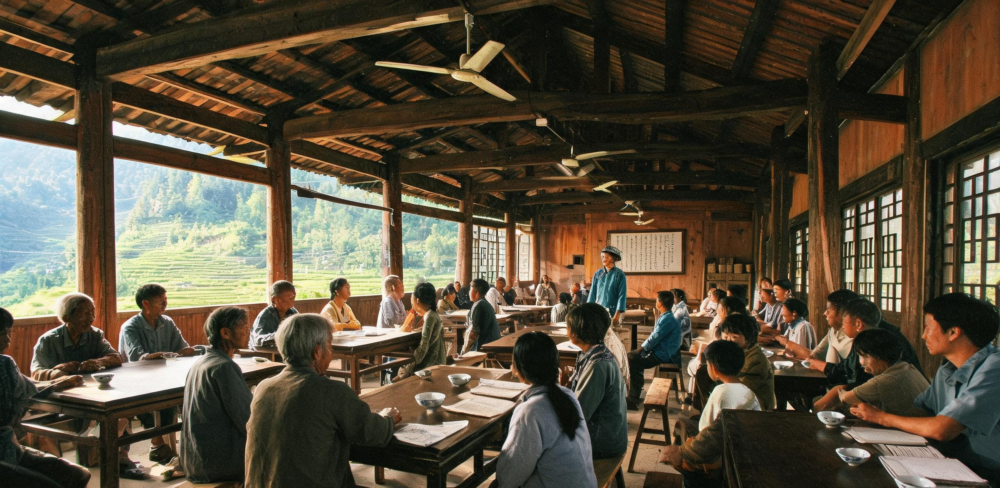

# 华东太湖—杭州湾低密生态带居民自治联合议事会2685年度公报暨地表承载力平准与跨星系公民名誉地籍信托规程

**发文字号：** 华东自公字〔2685〕第012号 · 全域公开件  
**公报周期：** 公元2685年1月1日 00:00 至 2685年12月31日 24:00（世界协调时 UTC）  
**联合发布：** 华东太湖—杭州湾低密生态带居民自治联合议事会 / 华东自然资源与野化遗产信托总署 / 泛地月系公民身份与遗产公证处  
**抄送存根：** 东海暗夜天文基地、同济与南岸联合学术馆、地月L5深空通信枢纽站、比邻星b新海安中央档案馆（光际激光信道待发）  
**签发受托人：** 轮值议长 柯宛平（第142届居民大会） · 生态总受托人 沈明远 · 系外法权公证员 方绍安  

---

## 一、 全区空间格局、人口稳态与地表承载力生态平准

太湖—杭州湾低密生态共生带（涵盖原太湖流域水网、杭州湾南北两岸次生森林及舟山潮间带湿地，总辖区物理面积 48,200 平方公里）自公元21世纪末叶全面确立“工业全量轨移、地表深度野化、聚落低密微嵌”发展范式以来，已平稳运行逾五百个公历年。

截至公元2685年12月31日，全区常住居民总数为 **142,650 人**（平均人口密度 2.96 人/平方公里）。全域无任何集中式高密钢筋混凝土超高层建筑，12 处分散式“自然共生聚落”均沿六百年前退役老工业区边缘及水系台地隐蔽筑造，建筑材料全量采用耐候再生木质素、微发泡玄武岩轻陶与透水硅藻土，檐高一律严格受控于林冠线以下（$\le 24.0\text{ 米}$）。

```
        【华东太湖—杭州湾 48,200 km² 空间生态分级与承载力拓扑】
┌─────────────────────────────────────────────────────────────────────────┐
│ [核心荒野保育与古次生林区] (66.4%, 32,000 km²)                          │
│ · 绝无人居与硬化路面 · 杭州湾六百年红楠-朴树次生林 · 大型涉禽与兽类迁徙廊道│
├─────────────────────────────────────────────────────────────────────────┤
│ [生态共生聚居与田园手工区] (22.2%, 10,700 km²)                          │
│ · 12个微型聚落 · 14.2万常住人口 · 纯木构低矮居所 · 传统手工与风味种植 │
├─────────────────────────────────────────────────────────────────────────┤
│ [暗夜天象保护与射电静默区] (8.5%, 4,100 km²)                            │
│ · 东海离岸浮岛台站 · 绝对人造光禁区 (天顶亮度 ≤ 21.8 mag/arcsec²)     │
├─────────────────────────────────────────────────────────────────────────┤
│ [深空能源与激光发射接口区] (2.9%, 1,400 km²)                            │
│ · 奉贤深层地热微网 · 杭州湾外海聚变潮汐蓄能枢纽 ·「烛照」激光地面辅助基线 │
└─────────────────────────────────────────────────────────────────────────┘
```

### 1.1 人口结构与后稀缺生活形态
全区人口常年维持在 14.0 万至 14.5 万人的自然稳态区间。人口年龄中位数为 54.2 岁，80 岁以上健康长者占比 38.6%。在全域基础物质（全合成淀粉、酵母蛋白、深层净化水、全覆盖地热温控与家庭通识算力）均由地下无人管网实行零边际成本无偿供给的前提下，居民生活摆脱了一切强迫性劳动，全面转向“生态巡抚、古典求知、手工工艺、星空观测与跨星系文明对话”。

### 1.2 地表物质循环与物理足迹控制
全区 2685 年度地表总能耗折合 42.8 亿千瓦时，100% 取自外海潮汐能及奉贤深层干热岩地热网，生活污水与有机废弃物在聚落单元内实现 100% 原位生物碳化还林。全域禁用任何内燃驱动车辆与低空人造航空器，居民区域间通行完全依托地下微型磁阻胶囊滑行管道及地表碎石步道，地表野生动物穿行阻隔率降至 0.00%。

---

## 二、 2685年度全域公共事务与「具名工时」自治运行决算

依据自公元2072年延续至今之《华东地表公共事务具名工时章程》，本区所有涉及人居环境维护、生态人工干预、文化档案留存之事务，严禁采用黑箱算法全自动化包办，必须由常住居民以自愿申报、抽签认领之方式提供“具有真实体温与手眼在场的具名实体工时”。

2685年度，全区共发布并执行具名公共事务项目 1,840 项，累计核验具名工时 **2,853,000 人时**，全区 18 岁以上公民参与率达 94.2%。

### （一） 核心具名公共事务决算明细表

| 事务板块代码 | 公共事务名称与物理工场 | 核心手工/在场作业内容 | 年度核定工时 (人时) | 参与人数 (人) | 手写原始日志归档卷数 | 首席受托审核人 |
| :--- | :--- | :--- | :---: | :---: | :---: | :--- |
| **ECO-85-A** | **杭州湾六百年次生林古树巡抚与深层土壤活性手工取样**<br>*(原杭州湾化工区退役野化核心带，32.64 km²)* | 徒步巡检清退期栽植之首批重阳木、水杉与朴树古林，手工剥除外来绞杀藤蔓；使用洛阳铲采集 1.5 米深度腐殖质，显微计数真菌菌丝密度。 | 624,000 | 8,200 | 120 卷<br>*(无酸麻纸本)* | 柯宛平<br>*(林学受托人)* |
| **AST-85-B** | **东海暗夜保护区光污染巡测与「张衡二号」纯光学目视校准**<br>*(东海大桥外海 K32 离岸暗夜平台)* | 夜间徒手操作 400 mm 折射赤道仪进行恒星视星等人工比对；划艇巡查杭州湾口航道，核查无人驳船防撞冷光源指向角度，防止天顶漫射。 | 412,000 | 4,600 | 85 卷<br>*(水墨星图手稿)* | 沈星移（六世）<br>*(天体测量师)* |
| **WAT-85-C** | **太湖入海故道古石闸手工启闭与潮滩幼鸟生境微地形修筑**<br>*(太湖东苕溪水系至杭州湾出海口)* | 每季两次手工摇动青铜齿轮组开闭古水闸，平衡微咸水湿地盐度；在滩涂手工用木锹修筑浅水水洼，为越冬卷羽鹈鹕营建觅食平台。 | 536,000 | 6,800 | 96 卷<br>*(水文实测图册)* | 陆子涵<br>*(水工受托人)* |
| **CUL-85-D** | **跨光年比邻星下行激光文娱数据包方言转译与物理刻写**<br>*(同济与南岸联合学术馆译经堂)* | 逐帧校对自太阳系「烛照」发射阵接收之比邻星b晨昏定居区落历330年民间歌谣，人工勘校双星语音漂移词，以金刚石针刻录于微晶玻璃板。 | 785,000 | 9,400 | 320 片<br>*(高纯玻璃存盘)* | 方绍安<br>*(语言学公证员)* |
| **CIV-85-E** | **聚落木构居所卯榫年检与公共步道碎石手工摊铺**<br>*(全区 12 处自然共生村落公共长廊)* | 检查老龄木结构住宅防白蚁草本熏蒸效果，手工打磨松动卯榫并加塞硬木楔；采选溪流水洗卵石修补雨后冲蚀步道。 | 496,000 | 7,100 | 64 卷<br>*(营建台账)* | 顾承远（五世）<br>*(建筑营造工)* |

```
                 【2685年度 285.3万 具名工时领域分布构成】
  ████████████████████████████      跨光年文娱译介与物理刻写 (27.5%, 78.5万工时)
  ██████████████████████            古次生林与土壤微生态巡抚 (21.9%, 62.4万工时)
  ██████████████████                湿地水文与水禽生境手工修葺 (18.8%, 53.6万工时)
  █████████████████                 聚落营造与步道维护 (17.4%, 49.6万工时)
  ██████████████                    暗夜天象观测与光污染核查 (14.4%, 41.2万工时)
```

---

## 三、 比邻星远征公民名誉地籍与祖林权益信托管理

自公元2150年远征巨舰 ARK-01 启航、及后续「恒心」系列重载运输舰相继投入跨星系航渡以来，数以万计的华东原籍居民跨入漫长深空。依据公元2148年泛地月公证通则及本议事会《系外远征公民故土祖产与名誉地籍维系管理规程》，本区设立“跨星系公民名誉地籍与祖林信托专库”。

### 3.1 信托法权基本原则
1. **永不除籍原则**：凡随世代飞船或双星定期航班迁往比邻星系之公民及其直系后裔，在地球华东原籍地之户籍与民事法权转入“恒久休眠存续态”，不因空间跨度与时间流逝而注销；
2. **物理锚点原位保全原则**：远征家族留在地球之祖居地块，一律转为不可交易、不可侵占之“自然生态纪念林位”。林位由议事会代为抚育原生物种古树（银杏、朴树、红楠或水杉），作为该家族在地球母星的物理实物坐标；
3. **光际双向通报原则**：本区每年将祖林生长之多光谱遥感正射影像、古树年轮声波图谱及土壤化验单，经由地月L5深空通信枢纽转呈「烛照」激光发射阵（GS-2582-01）排期发往比邻星b；比邻星后裔回传之繁衍宗谱，同步在本区档案馆手工入册。

### 3.2 2685年度系外信托运行台账抽样

截至2685年底，全区共受托管护系外公民祖林信托地格 **48,920 处**（总占地面积 1,467.6 公顷）。本年度完成全面健康体检与光际数据包归档。代表性名册抽样如下：

```
====================================================================================================
地籍信托档案号   远征始祖姓名与出发航次   比邻星当前后裔分支   地球祖林地理坐标与树种   本年度生长与信托管护状态
====================================================================================================
GS-TR-2150-0012  柯景明 (ARK-01 农业组)    新海安·柯氏七代     杭州湾南岸K04+200号林格  · 胸径 142.6cm，长势极佳；
                 启航公元年：2150          在册后裔：18人      [树种：535年原生朴树]   · 土壤有机质达 34.2 g/kg；
                                                                                       · 采集落叶标本压制入档
----------------------------------------------------------------------------------------------------
GS-TR-2150-0841  沈星移 (ARK-01 测控组)    晨昏谷·沈氏六代     佘山南麓天象第08林格    · 树高 28.5m，结实丰茂；
                 启航公元年：2150          在册后裔：24人      [树种：535年水杉古林]   · 树冠无病虫害，地表苔藓覆盖率98%；
                                                                                       · 录制树冠风声作为光际附件
----------------------------------------------------------------------------------------------------
GS-TR-2590-0045  陆振华 (恒心-01 动力组)   深空航行中·恒心01   奉贤潮间带海三棱䓢草格  · 桩位平稳，潮沟无冲蚀；
                 启航公元年：2590 (在途)   在途乘员：3人       [标石：花岗岩物理基桩]  · 测定基桩沉降量 < 0.2mm/年；
                                                                                       · 航程第95年遥测状态正常
----------------------------------------------------------------------------------------------------
GS-TR-2150-0034  方明德 (ARK-01 机械动力)  新海安·方氏八代     舟山群岛花岗岩第03林格  · 树木主干苍劲，石缝根系深固；
                 启航公元年：2150          在册直系：31人      [树种：535年耐盐红楠]   · 采集树皮拓片 1 份存入微晶玻璃；
                                           (全域后裔1.8万余人)                         · 互锁B-144始祖公证书
```

---

## 四、 暗夜天象保护、文化传承与地表生活美学规范

### 4.1 全天候暗夜与射电静默指标执行
本区常年执行《华东夜间光环境与电磁宁静最高标准》：
- **夜间人造光辐射：** 全区所有聚落外部照明在当地日落后 30 分钟内自动切换为波长 $\ge 620\text{ nm}$ 之暗红色低照度地面诱导灯，单灯功率不得超过 3.5 瓦；室外向上半球逸散光通量严格为零；
- **天顶暗度实测：** 东海离岸天文基地实测全天天区平均背景光度为 **$21.85\text{ mag/arcsec}^2$**（裸眼极限星等可达 6.8 等），银河暗星云细节与对日照清晰可见；
- **低空电磁静默：** 全区禁用 100 kHz 至 100 GHz 频段内的一切大功率无定向无线电辐射，民用通讯全面采用封闭式光纤与室内漫反射红外通信，为东海甚长基线射电望远镜提供绝对洁净之电磁本底。

```
       【2685年春分 东海暗夜天文基地 (K32平台) 光学天顶亮度全夜曲线】
  22.0 mag ─────────────────────────────────────────────────────────── [理论绝对自然天底]
           ╭───────────────────────────────────────────────╮
  21.8 mag ┤ 实测天区背景亮度 (21.82 ~ 21.88 mag/arcsec²)  ├─────────── [本区实测天光均值]
           ╰───────────────────────────────────────────────╯
  21.0 mag 
  20.0 mag ─────────────────────────────────────────────────────────── [三级暗夜保护区上限]
           18:00     20:00     22:00     00:00     02:00     04:00     06:00 (UTC+8)
```

### 4.2 四季节序与在地自治民俗节庆
本区遵循太阳回归节律，确立四大法定公共自治节庆，全域聚落停工聚会，共度宁静时光：
1. **春分「踏林抚树节」**：全区居民携手步入六百年次生林，认领当年新增林格，为古树松土涂白，开展森林野餐与草木辨识；
2. **夏至「熄灯听潮夜」**：全区彻底关闭一切室内外人造红光照明，居民聚集于杭州湾南岸石堤与东海大桥遗址，在绝对黑暗中观测夏季大三角与海面生物荧光；
3. **秋分「烛照校光日」**：对应跨光年激光发射阵年度大修校准窗口，学术馆举办跨星系诗歌朗诵会，向公众演示双星激光干涉条纹；
4. **冬至「煨茶阅卷会」**：各聚落开放公共暖阁，长者取出本年度手工编纂之无酸纸档案与微晶玻璃板，向青年一代传讲五百年来从早期深空工程、地表大再野化至跨星系开拓以来的文明长卷。

---

## 五、 议事会表决决议与法权签章存根

本公报经华东太湖—杭州湾低密生态带居民自治联合议事会第142次全体大会审议，由全区 1,200 名抽签产生的居民代表以物理纸质选票无记名投票表决：
- **应到代表：** 1,200 人
- **实到代表：** 1,198 人（2 人因外海暗夜观测值守委托书面表决）
- **表决结果：** 赞成 1,196 票，反对 0 票，弃权 2 票。正式通过《2685年度公报暨地表承载力平准与跨星系公民名誉地籍信托规程》。

```
====================================================================================================
                             【自 治 议 事 会 联 合 署 名 签 戳】

  轮值议长大印：[华东太湖杭州湾议事会·印]       生态总受托人印：[沈明远·长河林业受托章]
  公证专员签章：[泛地月公证处·方绍安核讫]       数据存盘校验：SHA-512-VERIFIED-2685-1231-A89F
  
  物理档案保存处：同济与南岸联合学术馆 · 地下恒温恒湿特藏库（架号：ECOL-2685-BOX-04）
  光际编码任务号：S-P-BEAM-2686-SPRING-DOC-0089（计划于公元2686年春分经「烛照」激光发射）
====================================================================================================
```

---

## 图片提示词

### 中文提示词
超广角纪实摄影构图，展现公元27世纪地球华东杭州湾南岸低密度生态人居聚落的黄昏全景。画面中，绵延六百余年的茂密次生阔叶林与高大水杉、朴树郁郁葱葱，向地平线远方无限延伸。林冠线之下隐约可见数座采用原木与深色微发泡陶土构筑的低矮微型居住建筑，建筑檐口低平且无任何刺眼反光。前景是自然野化潮滩与湿地芦苇荡，一条古老的碎石步行栈道蜿蜒其间；几位身着朴素耐磨亚麻与帆布工装的生态调查员与长者正围在一株挂有青铜档案编号牌的苍劲古朴树下，手持木质测量卡尺与厚重纸质档案夹手工记录土壤与树木数据。中景是一处平静清澈的微咸水潮沟，远处耸立着六百年前化工厂退役后被藤蔓彻底覆盖的锈蚀精馏塔钢骨架残骸，已完全融为水鸟栖息的生态景观。背景是纯净深邃的暮色天空，毫无城市光害，低角度夕阳将温暖的琥珀色金光洒在林梢与湿地水面上，初升的明亮银河与极微弱的深空激光信标在深蓝穹顶中若隐若现。8k分辨率，极致真实的植物表皮、锈蚀钢构、木质纹理与湿地泥土质感，宏大壮美，宁静从容，无任何科幻浮夸光效，无任何文字，无任何国旗。

### 英文提示词
Ultra-wide documentary cinematic shot capturing the tranquil twilight panorama of a low-density ecological human settlement along the southern shore of Hangzhou Bay in the late 27th century Earth. Sprawling six-hundred-year-old mature secondary deciduous forests, towering Metasequoia, and ancient Celtis trees stretch seamlessly toward the distant horizon. Tucked beneath the uniform forest canopy are a few low-rise, sustainable dwelling pavilions built from reclaimed timber and dark textured lightweight terracotta, with flat rooflines devoid of artificial glare. In the foreground, a natural rewilded tidal wetland with swaying reed beds is traversed by a winding crushed-stone footpath; several field researchers and elder residents in durable unbleached linen and canvas workwear gather around a massive ancient Celtis tree bearing a patinated bronze registry tag, manually logging soil and tree-ring metrics onto heavy unacidic paper binders with brass calipers. In the midground, a tranquil brackish water channel reflects the dusk sky, near the colossal rusted steel skeleton of a decommissioned chemical distillation tower from centuries ago, now completely draped in wild ivy and moss, serving as a natural bird roost. In the background, a pristine dark sky free of urban light pollution begins to reveal the brilliant Milky Way and a faint pinpoint laser beacon, illuminated by the last warm amber raking sunlight catching the treetops and wet silt. 8k resolution, authentic botanical and geological textures, weathered industrial steel and aged timber, cinematic depth of field, serene and grand aesthetic, physically accurate lighting, no readable text, no national flags.

## 修订记录（元层，非世界内容）
- 2026-08-18：主编辑审校完成，小修入库。
  1. **视角共时性与超前引用校勘**：消除表 3.2 中误用晚于 2685 年之超前航次（原“恒心-14 / 2744年启航”超前引用修正为早期在途班次“恒心-01 / 2590年启航，航程第95年”，消除跨世纪穿越违规；§3 导语中“至恒心-14”表述同步修润为“相继投入”）；
  2. **纪元名合规校勘**：依据《编写规范》§6，将 §4.2 冬至节庆描述中后世追认之元层纪元名（“大国竞赛”、“双星系纪元”）修润为世界内自然语境（“早期深空工程”、“跨星系开拓”）；
  3. **正典名物与人物互锁咬合**：修正信托表 3.2 方氏始祖为“方明德 (ARK-01 机械动力组)”，档案号校准为 `GS-TR-2150-0034`，后裔分支注记咬合正典 GS-2614-01（新海安 B-144 坑基始祖直系 31 人，全域后裔 1.8 万余人）；修复“佘山”错别字；
  4. **时间尺度与树龄算式复算**：将 2071 年杭州湾再野化（GS-2071-01）至 2685 年历经 614 年的历史时间线统一（修复正文及图注中将次生林/退役工业区误记为“两百年”的算术笔误，修正为“六百年/六百余年”；2150 启航祖林古树生理树龄同步对齐至 535 年）；
  5. **空间与人口口径互锁**：48,200 km² 辖区空间分级拓扑、142,650 常住人口与 E05（GS-2742-01，2742年太湖流域 14,860 km² 核心荒野）完美空间兼容；具名工时 2,853,000 人时五大板块四则完全轧平；通过 check_submission.py 校验。
