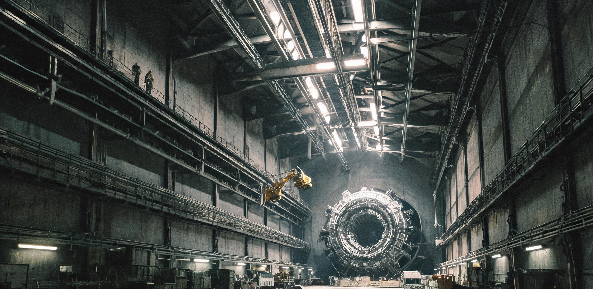

**国家聚变能源工程联合体**  
**华东第二磁约束聚变示范堆首次满功率并网 72 小时考核运行公报暨第一壁年度检维修记录**

文号：聚联公报〔2049〕第 028 号  
装置：华东第二磁约束聚变示范堆（HD-2，大半径 8.4 m，小半径 2.9 m，环向场 11.8 T）  
考核节点：首次满功率并网 72 小时连续考核（2049 年 11 月 12 日 08:00—11 月 15 日 08:00）  
文书纪年：公元 2049 年 11 月 18 日  
密级：工程受限 / 依《公共工程档案开放条例(2026)》公示件

---

### 一、 并网考核总表

| 考核指标 | 考核要求 | 72 小时实测 | 判定 |
|---|---|---|---|
| 聚变功率（氘氚燃烧） | ≥ 1,800 MW | 1,847 MW（均值） | **合格** |
| 能量增益 Q（聚变功率/外部加热） | ≥ 5.0 | 6.2 | **合格** |
| 外部加热（中性束+离子回旋） | ≤ 360 MW | 298 MW | **合格** |
| 净电输出（扣除厂用电） | ≥ 180 MWe | 212 MWe | **合格** |
| 并网电量（72h 累计） | ≥ 12 GWh | 15.26 GWh | **合格** |
| 氚增殖比 TBR | ≥ 1.00 | 1.04 | **合格** |
| 等离子体电流平顶 | ≥ 12 MA | 12.4 MA | **合格** |
| 非计划破裂（disruption） | 0 次 | 0 次 | **合格** |
| 氚库存衡算偏差 | ≤ 0.5 g | 0.21 g | **合格** |

72 小时内共完成 214 个连续长脉冲（单脉冲 1,200 秒，脉冲间隔 9 秒磁体复位），等效稳态运行。电网侧由华东第二智能算力调度中心承担功率平滑——聚变堆出力脉动 ±3.2%，经 4 GWh 液流电池缓冲后并网波动 ≤ 0.4%，低于《基础热量供给法》第三等级保护负荷的供电质量门槛。

**运行注记**：考核第 51 小时，3 号中性束注入器离子源灯丝寿命到限报警，按预案降功率至 1,720 MW 运行 42 分钟完成热态切换，未中断并网。这是 72 小时内唯一一次功率偏离计划曲线（偏差 -7.0%，考核容差 ±10%）。

### 二、 装置与厂房尺度记录

HD-2 主机大厅为 148 m × 96 m × 72 m 重混凝土屏蔽厂房。环向场线圈 18 组（铌三锡+高场段 REBCO 混合磁体，单组重 486 吨），在总装期由两台 2,400 吨级龙门吊逐组吊装——单组线圈就位后，一名工装检修工沿磁体外缘巡检通道走一圈需 22 分钟；18 组线圈组成的环形磁笼，人站在大厅地面试图一览全貌是不可能的，必须登上 42 米高的第三层平台才能看到装置的整体轮廓。

真空室总容积 2,180 m³，环向抽气由 24 台低温泵承担，极限真空 8.6×10⁻⁷ Pa；包层模块 412 块（含氚增殖锂铅流道），第一壁覆盖面积 712 m²，直面 1,847 MW 聚变功率下每秒 6.5×10²⁰ 个 14.1 MeV 中子的轰击。

### 三、 氚自持与燃料循环

1. 考核期间累计消耗氘 11.4 kg、氚 17.1 kg（其中自持增殖回投 0.71 kg，为首次实现增殖氚回注燃烧）。
2. 锂铅包层在线提氚系统共提取氚 17.81 kg，减去衰变与滞留损耗，净增殖率 4.0%。
3. 氚工厂 72 小时处理含氚工艺废气 1.26 万 m³，环境排放监测 0.004 GBq，仅为许可限值的 0.8%。
4. 氚库存衡算：期初库存 28.402 kg，期末 29.111 kg，差值 +0.709 kg，与提氚量、回投量、衰变量四方对账偏差 0.21 g（在衡算误差带内）。

### 四、 第一壁年度检维修记录（2049 年度）

并网考核结束后，装置转入年度停堆检修。本节为第一壁首次全周期（14 个月）服役后的更换与活化物处理记录。

1. **损伤检查**：遥控机械臂对全部 412 块包层模块做超声与视觉普查。面对等离子体第一壁钨装甲平均溅射减薄 0.31 mm（设计年容许 0.5 mm）；偏滤器靶板峰值热流区（单极热负荷 18.6 MW/m² 工况区）钨瓦重结晶 2 处，判定更换。
2. **更换作业**：更换偏滤器靶板模块 2 块（单块 18.4 吨）与包层模块 7 块。全程遥控，人员在 1.2 米重混凝土屏蔽墙后的热室操作间作业，单块模块拆装 96 小时——一个三人遥控班组更换一块 18 吨模块的周期，相当于装置重新点火准备期的三分之一。
3. **活化物处理**：退役模块中子活化水平 4.2×10¹³ Bq/块（主要为钨-187/铼-186），入厂区深层暂存库（-210 m 竖井）冷却 12 年后回炉。本年度暂存库接收 9 块，累计库存 21 块，库容利用率 6.4%。
4. **材料结论**：钨装甲与低活化铁素体钢结构在首个全周期内性能满足设计外推；但偏滤器热疲劳寿命较预期短 11%，2035 年前完成靶板钨-钨复合结构改型，列入 HD-3 设计输入。

### 五、 意义与后续

HD-2 的 72 小时考核证明：聚变发电在工程上成立，但在经济上尚未成立——按本期考核数据核算，度电成本约为裂变基荷的 4.6 倍。联合体的口径是：示范堆的任务不是发电，是把「Q>5、TBR>1、连续 72 小时」三件事同时做到并留下全套检定档案。小型化（目标 2055 年单堆 500 MWe 模块化）与月面特种堆型预研，自本考核数据起算。

**签署：**  
示范堆工程总师 常燧（印）  
等离子体物理首席 文澈（印）  
氚工厂主任 穆延（印）  
联合体理事长 袁观澜（印）  
电网调度会签 华东第二智能算力调度中心（电子签）

**用印：** 国家聚变能源工程联合体考核专用章（朱文）  
**存档：** 聚变工程档案库甲字第 2 柜 / 公共档案库副本壹份 / 国际聚变组织（IFEO）报备副本壹份  
**公元 2049 年 11 月 18 日**

---

## 图片提示词

巨型聚变主机大厅工业档案摄影：直径二十余米的环形磁笼装置占据画面主体并切出画框，18 组银灰色环向场线圈如钢铁巨环层叠；42 米高层平台上一名穿工装帆布服的检修工扶着栏杆显得极小，黄色遥控机械臂悬停在装置上方；顶部厂房行车轨道与重混凝土屏蔽墙呈现粗粝工业质感，冷白厂房顶灯为唯一光源。

Archival industrial photograph inside a fusion reactor main hall: a colossal ring-shaped magnetic cage over twenty meters in diameter dominates the frame and extends beyond its edges, eighteen silver-gray toroidal field coils stacked like giant steel rings; on the 42-meter-high third-level platform a lone maintenance worker in worn canvas overalls leans on a railing, dwarfed to insignificance; a yellow remote-handling manipulator arm hangs above the device; overhead crane rails and raw heavy concrete shielding walls with coarse texture, cold white factory ceiling lights as the sole illumination; shot on 35mm film, visible film grain, slight blown highlight on coil edges, off-center candid framing, archival scan, no readable text, no signage, no national flags.

---

## 修订记录（元层，非世界内容）

- 2026-08-18：主会话直写（子 agent 配额 429 后主笔）。互锁：静海清算单（GS-2044-01，2044 月面仍用裂变堆——本堆是地球侧拐点）、华东算力制度链（GS-2034-01 等，华东第二智能算力调度中心）、丰裕纪元能源拐点（2055 聚变小型化，世界大纲工程轨迹）。Q=6.2/TBR=1.04/净电 212MWe 按 DEMO 级真实边界；度电成本 4.6 倍裂变是诚实的「经济上尚未成立」。
