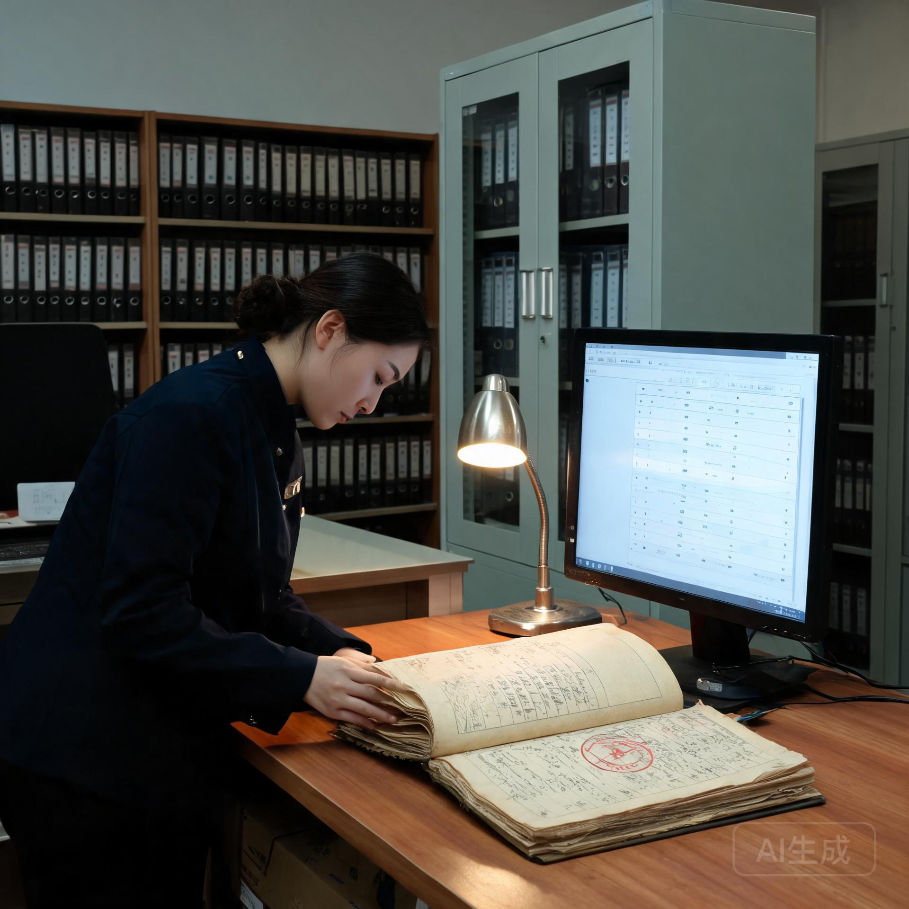

**南岸综合体公共委托署 · 具名意义资产登记处**  
**意义资产清册组**

**文号：** 南公意资〔2115〕第 041 号  
**登记周期：** 公元 2115 年 01 月 01 日 — 2115 年 12 月 31 日（第 41 期）  
**报送单位：** 南岸综合体公共委托署  
**核收抄送：** 具名工时组、乐龄照护与社会保障局、南岸综合档案馆、华东低密生态带青年发展署  
**密级：** 公开  
**民间旧历称谓：** 冬至前的第三张表

---

> **清册主旨**  
> 南岸具名工时制（南公委·具时〔2072〕18-4）自 2072 年运行至今已历 43 年。其间，制度经历了从「工时署名」到「意义资产」的演化：早期仅记录「谁做了什么事」，后逐步衍生出「署名权的持续价值」——具名成果被后世引用、复刻、学习时，署名者及其继承人享有署名权益。2115 年度，具名意义资产登记处完成全区域意义资产清点，确认在册意义资产 **12,460 项**，本清册为第 41 期年度汇总。

---



## 一、 制度演化概览

### 1.1 从工时署名到意义资产

| 阶段 | 年代 | 制度内容 | 特征 |
| :--- | :--- | :--- | :--- |
| 第一阶 | 2072—2085 | 具名工时制：成果署名、共同署名、无名归档 | 署名=荣誉 |
| 第二阶 | 2085—2100 | 署名权益化：署名成果被引用时署名者享有说明权 | 署名=权益 |
| 第三阶 | 2100—至今 | 意义资产化：署名权可登记、可继承、可流转 | 署名=资产 |

### 1.2 意义资产定义

意义资产指**具名成果的署名权益**：成果被引用、复刻、学习、展示时，署名者及其继承人享有的署名标注权与说明权。意义资产不包含物质收益（物质已免费），其价值在于**记忆的持续存在**。

---

## 二、 年度清点结果

| 指标 | 本年度 | 上年 | 变动 |
| :--- | :--- | :--- | :--- |
| 在册意义资产总数 | 12,460 项 | 11,980 项 | +4.0% |
| 本年新增具名资产 | 862 项 | 798 项 | +8.0% |
| 本年流转（继承/转让） | 214 项 | 187 项 | +14.4% |
| 无名归档资产 | 1,204 项 | 1,186 项 | +1.5% |
| 资产引用/复刻记录 | 31,208 次 | 28,904 次 | +8.0% |

---

## 三、 署名权流转登记簿（节选）

### 3.1 继承流转

```
━━━━━━━━━━━━━━━━━━━━━━━━━━━━━━━━━━━━━━━━━━━━━━━━━━━━━━━━━━━━━━━━━━━━━━━━━━
【南岸区域 · 具名意义资产 · 第41期流转登记（继承）】
━━━━━━━━━━━━━━━━━━━━━━━━━━━━━━━━━━━━━━━━━━━━━━━━━━━━━━━━━━━━━━━━━━━━━━━━━━
资产编号       资产名称                  原署名者    流转方式   现持有人    登记日期
──────────────────────────────────────────────────────────────────────────
MA-2074-0118  七里铺老式碎花法兰绒防尘  孙婉清      继承        孙氏后代    2115-03-12
              套缝制与蜡染技法档案      （已故）                  （孙婉清之
                                                                 曾孙辈）
MA-2074-0205  洋山早期重型锁具除锈与工  郭庆海      继承        郭氏后代    2115-05-08
              业档案拓印技法档案        （已故）                  （郭庆海之
                                                                 孙辈）
MA-2072-0031  东堤幼儿园旧风塔外壁图案  集体署名    分割流转    原参与人    2115-07-21
              复原方案                （参与人8人）             8人各自持有
MA-2074-0312  旧式电磁继电器动作音盲听  严德宝      继承        南岸档案馆    2115-09-02
              判读与杂音标注档案        （已故）                  （代管）
──────────────────────────────────────────────────────────────────────────
```

### 3.2 转让流转

| 资产编号 | 资产名称 | 转让人 | 受让人 | 登记日期 | 备注 |
| :--- | :--- | :--- | :--- | :--- | :--- |
| MA-2089-0142 | 乐龄工坊老面发酵技法档案 | 林氏后代 | 南岸乐龄社区 | 2115-04-19 | 社区共有 |
| MA-2096-0078 | 东海潮间带野化观察笔记 | 匿名持有人 | 同济与南岸联合研学会 | 2115-10-23 | 教学使用 |
| MA-2102-0033 | 具名工时制口述史录音档案 | 口述者后人 | 南岸综合档案馆 | 2115-11-30 | 永久典藏 |

---

## 四、 制度观察与说明

1. **继承流转增长**：本年度继承流转 214 项，较上年 +14.4%。早期具名资产（2072—2085 年第一阶）的原始署名者已陆续进入高龄或故去，其资产正经历第一轮大规模代际继承——**记忆从一代人传递到下一代人，是意义资产制度第一次面对的时间考验**；
2. **无名归档的稳定**：无名归档资产占比维持在 9.7% 上下，说明「拒绝署名」的自由持续被尊重；
3. **代管机制**：无继承人的意义资产由南岸综合档案馆代管，代管期间资产仍可被引用，仅署名标注改为「南岸无名长者存证」或「代管」。

---

## 五、 附则

本清册自发布之日起登记生效，由具名意义资产登记处负责解释。年度清点于每年冬至前完成。

---

**南岸综合体公共委托署 · 具名意义资产登记处处长：** 顾承远（签）  
**意义资产清册组组长：** 周晓舟（签）  
**档案代管协调员：** 林澍（执业印鉴：SOL-MEANING-2115-0006）

**数字验讫公钥指纹：** `SHA256: 8f2c6e9a4d1b7035...1e8a4c6d2b9f0573`  
**签署地点：** 南岸综合体公共委托署 · 具名意义资产登记处  
**用印：**  
`南岸综合体公共委托署·具名意义资产登记处专用章`  
`南岸综合档案馆·典藏章`

---

## 图片提示词

南岸综合体档案馆的意义资产登记厅，一位档案员在登记台前整理纸质登记簿与终端界面。台面上摊开一本厚重的登记簿，纸页泛黄、有手写笔迹与印章；终端屏幕显示意义资产编号列表。背景是档案馆的高大书架与恒温柜。暖黄色台灯照明与冷白屏幕光形成温和对比，纸质档案与数字终端的并置，纪实风格，无文字。

Documentary scene in a municipal archive registration hall: an archivist organizing thick paper ledgers and a terminal screen at a registration desk. On the desk, a heavy aged ledger with handwritten entries and rubber stamps, beside a terminal displaying an asset-number list. Tall bookshelves and climate-controlled cabinets in the background. Warm desk-lamp light against cool screen glow, paper archive and digital terminal side by side, quiet institutional atmosphere, fine grain, no text.

---

## 修订记录（元层，非世界内容）

- **2026-08-21（主编辑审校 · 新作入库）**：本文为批 8「后稀缺生活」组第 4 篇，坐标 经济×离心×①地球（空白格首开）。制度演化承接 GS-2072-01（具名工时制）43 年，把「署名=荣誉」推演为「署名=资产」，与 GS-2074-01 的长者条目（孙婉清/郭庆海/严德宝/林秀芳）构成代际继承互锁（该批长者 2115 年时 81—128 岁区间，孙婉清 88 岁+43 年=131 岁已故、郭庆海 73+43=116 岁已故、严德宝 91+43=134 岁已故——年龄自洽）；与 GS-2122-01（华东低密生态带青年发展总账）同轴；「意义资产」呼应大纲「丰裕纪元后意义/地位/土地成为新稀缺」的离心纪元延伸。人物为批内常见姓名复用，机构与既有正典一致。
