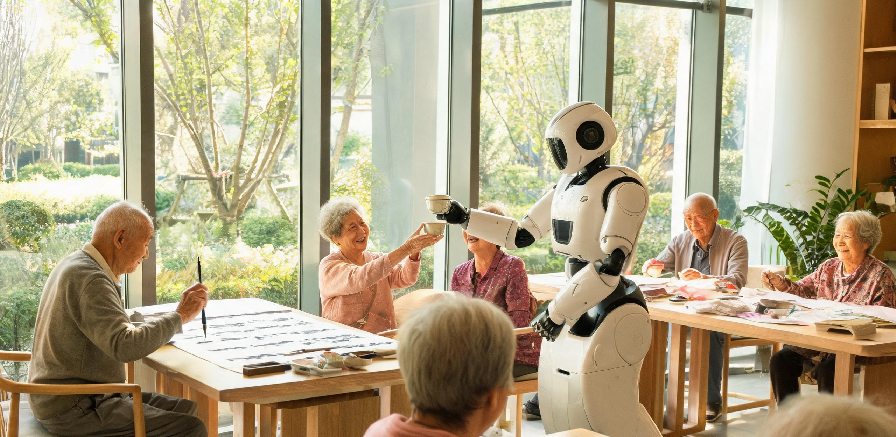

# 南岸第七乐龄社区机器人介护分级评估表暨2074年度长者「意义工坊」选修与履职清册

**联合发布机构：** 南岸综合体公共委托署 · 乐龄照护与社会保障局 / 南岸第七邻里照护站 / 华东智能照护与老龄医学协作中心  
**文书字号：** 南公委·乐照〔2074〕第048号  
**施行周期：** 公元2074年3月1日 — 2075年2月28日（2074年度运行季）  
**文书密级：** 公开（依据《南岸公共福利全域供给条例》及《老龄人口尊严与具名传承保障公约》）  
**主送单位：** 第七乐龄跨代共居实验楼、东堤托幼中心、同济与南岸青年学舍、南岸综合档案馆、华东老龄康复医学中心  
**民间旧历称谓：** 春分后第三张表  

---

## 一、 乐龄保障总则与「双轨运行」机制

自华东第二磁约束聚变电网与自动化物资生产网络全域稳定并网以来，全域老龄人口的基础生存保障已完全脱离货币购买与工时对冲范畴。

依据《南岸公共福利全域供给条例》第4条，凡年满六十周岁之定居公民，其居室恒温地暖（奉贤聚变电网余热直供，冬季恒温22.5℃）、纯净直饮水、高纤维水培蔬菜、定制流质营养配剂、无菌生活耗材及全套基础医疗巡诊，均属**无条件公共配给**。各照护窗口严禁向长者及其家属出具任何形式的“消耗清单”或“费用对账单”。

为彻底消除老龄化进程中的生理羞耻与精神虚无，南岸第七乐龄社区全面施行**「介护归机器，意义归社群」**之双轨运行规程：

```
                ┌─────────────────────────────────────────────────────────────┐
                │        2074年度 南岸第七乐龄社区综合运转双轨保障架构        │
                └──────────────────────────────┬──────────────────────────────┘
                                               │
         ┌─────────────────────────────────────┴─────────────────────────────────────┐
         ▼                                                                           ▼
┌──────────────────────────────────────┐                    ┌──────────────────────────────────────┐
│       【物理与生理介护保障轨】       │                    │       【精神传承与意义工坊轨】       │
├──────────────────────────────────────┤                    ├──────────────────────────────────────┤
│ • 智能护理机器人全天候被动照护      │                    │ • 具名工时/研学带教自愿选修          │
│ • 自动排泄清洗、翻身擦浴与防褥疮     │                    │ • 传统手工技艺向青年与幼儿传承       │
│ • 柔性外骨骼步态补偿与无障碍漫游     │                    │ • 工业历史口述史整理与实物拓印       │
│ • 恪守「无伪情感」伦理边界          │                    │ • 成果享有百年档案馆手迹法定署名权   │
└──────────────────────────────────────┘                    └──────────────────────────────────────┘
```

**人机伦理与尊严保障铁律：**
1. **去拟人化与无伪情感原则**：所有照护机器人严禁载入“拟人化情感合成语音”。严禁机器人模仿晚辈称呼长者为“爷爷”、“奶奶”或模拟虚假孝道情绪。系统交互一律使用中性、温和、客观的工程提示音（如：“移乘托架已锁定，升降速度0.12米/秒”）。真正的情感联结必须由人类社群（共居青年、研学生、托幼儿童及邻里）提供；
2. **绝对隐私隔离原则**：居室内部生理清洗、如厕辅助与身体检查时，机器人视觉传感器强制切换为“低分辨率热成像边缘提取模式”，禁止向任何公共网络回传可见光画面；
3. **去功利与反虚无原则**：「意义工坊」的所有选修项目必须与南岸综合体真实的公共生活（如托幼教具制作、古籍修复、工业口述史校勘、自然野化标本制作）实体咬合，严禁开设无任何实际产出之“假装工作”或“哄弄式游戏”。

---

## 二、 机器人介护分级评估标准与装备配置规范

长者入驻社区后，由常驻医师与智能照护系统联合进行日常生活活动能力（ADL）测定，核定介护等级。介护等级仅用于调配机器人机型与防护强度，严禁作为社会地位或工坊选修资格之限制条件。

### 表1-1：2074年度长者机器人介护等级与标准装备配置表

| 介护等级 | 适用身体状况 | 核心照护机器人配置 | 辅助穿戴与环境设备 | 机器人物理介入范围 | 人类专员巡检规程 |
| :--- | :--- | :--- | :--- | :--- | :--- |
| **I 级<br>（自主活力型）** | ADL评分 85-100；<br>生活基本自理，伴随轻度关节劳损或视听退化。 | **“青鸟-07L”型<br>室内伴随轮式底盘**<br>（最大负重20kg，配语音备忘与夜间低光引导） | • 碳纤维自适应微动力护膝；<br>• 骨传导多频听觉补偿耳夹；<br>• 居室低位防滑地垫。 | • 晨间提醒服药与日程播报；<br>• 取送餐盘、代提重物；<br>• 外出漫游跟随与跌倒预警。 | 每两日上门一次，由共居青年志愿者进行生活随访。 |
| **II 级<br>（辅助漫游型）** | ADL评分 60-80；<br>步态不稳，下肢肌力减退30%以上，需轮椅出行。 | **“青鸟-07M”型<br>全向麦克纳姆轮移动椅**<br>（具备一键平躺、自动过障与微坡道防滑驻车） | • 柔性外骨骼下肢动力支具；<br>• 卫生间智能升降助力扶手；<br>• 脉搏血氧实时微波雷达。 | • 居室至中庭工坊自动寻路代步；<br>• 坐卧姿态自适应气囊调整；<br>• 跨步动作主动力矩补偿。 | 每日上门一次，由社区全科医师进行步态与心肺核验。 |
| **III 级<br>（重度介护型）** | ADL评分 30-55；<br>长期卧床或半身偏瘫，无法自主完成翻身与排泄。 | **“安颐-IV”型<br>床旁柔性多关节护理臂**<br>（恒温凝胶机械手，触觉反馈精度0.05N） | • 气动分段交替波浪防褥疮床垫；<br>• 智能感应负压排泄物抽吸冲洗舱；<br>• 恒温38℃微气孔擦浴水雾喷头。 | • 每2小时自动执行翻身减压；<br>• 失禁即时感应、温水清洗与热风烘干（全封闭零异味）；<br>• 全身柔性擦浴与床单自动换卷。 | 每日上门两次，由人类专业护士现场查验皮肤完整度。 |
| **IV 级<br>（特级监护型）** | ADL评分 <30；<br>多器官功能衰退，认知障碍晚期或生命维持阶段。 | **“安颐-IV Max”型<br>全监护重症协作工作站**<br>（集成微流控泵与床旁生命支持系统） | • 连续无创脑波与心电贴片；<br>• 静脉营养微量自动注射泵；<br>• 床周毫米波防坠落防护气囊。 | • 24小时维持生命指征平稳；<br>• 定时气道排痰与被动肢体关节屈伸运动；<br>• 异常生理波动毫秒级急救推注。 | 24小时人类医护驻守楼层，急救报警响应时间 ≤45秒。 |

```
                     【“安颐-IV”柔性介护机械臂结构与工作包络示意】
   
        [多自由度悬吊滑轨] ── 沿床头天花板静音滑动（运行噪音 ≤ 28 分贝）
                 │
                 ├── 柔性凝胶包裹机械主臂（最大提升力 900 N，带碰撞柔顺控制）
                 │        └── 仿生恒温双指夹爪（表面覆食品级仿生硅胶，温度 36.5℃）
                 │
                 ├── 负压温水自循环清洗头（多孔发泡出水，瞬间气液分离回收）
                 │        └── 医用级红外消毒与暖风导流槽（风温 38.0℃ 恒定）
                 │
                 └── 激光点阵生理雷达（非接触式呼吸心率测定，扫描频率 50 Hz）
```

---

## 三、 2074年度长者「意义工坊」选修与履职清册

本年度南岸第七乐龄社区共设立六处常设实体「意义工坊」，核定公共具名工时总盘为 **8,640 人时**。工坊不设产量考核，重在技艺传承、历史见证与跨代协作。

以下为2074年度具有代表性之长者介护评估与工坊选修抽样清册：

```
━━━━━━━━━━━━━━━━━━━━━━━━━━━━━━━━━━━━━━━━━━━━━━━━━━━━━━━━━━━━━━━━━━━━━━━━━━━━━━━━━━━━━━━━━━━━━━━━━━
【南岸第七乐龄社区 · 2074年度长者介护评估与「意义工坊」选修台账】
━━━━━━━━━━━━━━━━━━━━━━━━━━━━━━━━━━━━━━━━━━━━━━━━━━━━━━━━━━━━━━━━━━━━━━━━━━━━━━━━━━━━━━━━━━━━━━━━━━
长者编号 / 姓名   年龄  介护等级   原职业背景与技能特长             核定选修工坊与项目代号        具名类型    核定工时  具体履职任务与跨代协作对象
──────────────────────────────────────────────────────────────────────────────────────────────────
LL-74-0103      82    II 级     原华东第二聚变堆一期主管道焊工   【工坊 A】聚变史口述与老式法兰   具名工时    180 人时   每周两次在工坊实物示教，指导同济青年
周海平                          （曾亲历2049首次满功率并网）     气密性手工校核（ENG-74A）                  技工辨识机械手装配力矩误差。

LL-74-0118      88    III 级    原沪西七里铺社区缝纫组组员       【工坊 B】七里铺老式碎花法兰绒   具名工时    140 人时   卧床状态下由机械臂稳固持料，指导东堤
孙婉清                          （老裁缝孙家媳妇之女）           防尘套缝制与蜡染（CULT-74B）                托幼中心幼儿辨识老棉布经纬质感。

LL-74-0205      73    I 级      原洋山深水港理货组长             【工坊 C】洋山早期重型锁具除锈   具名工时    160 人时   带领青年研学生对退役集装箱锁头进行手
郭庆海                          （见证自动化码头首期改造）       与工业档案拓印（HIST-74C）                 工水砂纸除锈，手绘老式传动拓片。

LL-74-0221      76    I 级      原南岸第七邻里照护站主烘焙师     【工坊 D】温室早秋果干古法发酵   共同具名    210 人时   开设传统发酵面食班，带领30人协作组制
林秀芳                          （林佩兰之母，熟悉老面发酵）     与非标烤包研习（FOOD-74D）   （30人簿）     作非对称手作烤包，直供东堤托幼中心。

LL-74-0312      91    IV 级     原七里铺无线电维修志愿者         【工坊 E】旧式电磁继电器动作音   共同具名     80 人时   在病房安静环境下听取老式设备录音，以
严德宝                          （70年机械音律敏感记忆）         盲听判读与杂音标注（ELEC-74E）              点头眨眼协助标记历史音频杂音特征。

LL-74-0334      79    II 级     原同济水生生物标本制作技师       【工坊 F】杭州湾潮滩硅藻物理切片 具名工时    150 人时   指导研学青年使用传统手摇切片机制作水
沈静仪                          （擅长天然动植物胶封片）         手工装片与标本编目（ECOL-74F）              封玻片，成果移交南岸自然陈列馆。
──────────────────────────────────────────────────────────────────────────────────────────────────
*注：全社区在册长者共214人，选修工坊覆盖率达91.5%；18位选择休养之长者已录入无条件生活保障专册。*
```

---

## 四、 跨代共居实验单元运作规程与空间交互设计

第七乐龄社区采用“立体嵌套式跨代共居”建筑构造。乐龄长者居室、同济青年学者公寓与东堤托幼中心在物理空间上互联互通，共享中央挑高18米之全天候采光温室庭院。

```
                         【跨代共居社区空间剖面与人际流动规程】

     [顶层 4-6F] ── 同济与南岸青年学者公寓（入住青年180人，承诺每周履职陪伴工时）
          │             └── 青年下楼动线：经由中央旋转缓坡直接接入中庭
          │
     [中层 2-3F] ── 乐龄长者居室区（共120套无障碍适老套房，配双联静音滑轨与新风）
          │             └── 居室外延：3.6米宽宽幅悬挑木质外廊，可俯瞰中庭全景
          │
     [底层 1F]   ── 4,200m² 中央阳光中庭公园（铺设防滑软木地板，种植耐阴药草与果木）
          │             ├── 六大实体「意义工坊」操作台与手作长木桌
          │             ├── 乐龄大食堂与无障碍茶饮角（每日全天供应温热红茶与软糕）
          │             └── 东堤托幼中心室内游乐场（幼童与长者活动区以低矮木栅相隔）
```

### 1. 青年入住“陪伴工时”冲抵规程
- **入驻资格**：在南岸从事科学研学、野化生态考察或自动化维护之青年学者，签署《跨代共居互助契约》后可无偿入驻青年公寓；
- **履职要求**：每名青年每月须完成 **24 小时** 社区陪伴工时（包含：推轮椅陪同长者在东海大堤漫步、协助工坊搬运木料宣纸、陪同老技工校对图纸手稿、朗读纸质书籍）；
- **陪伴红线**：严禁青年替代长者完成工坊的核心手作任务；陪伴重点在于倾听、记录与实物协作，不得将陪伴转化为形式化考核。

### 2. 每日作息与人机流转时序
- **06:30 — 08:00 【居室私密照护时段】**  
  长者居室门保持关闭。机器人系统自主完成晨间生理排泄物负压清理、恒温温水擦浴、皮肤状态扫描与衣物穿戴。整个过程无人类外客介入，最大限度保护长者身体尊严；
- **08:30 — 11:30 【中庭晨间工坊与跨代交融时段】**  
  居室移乘设备自动将长者导引至底层中庭。工坊长木桌展开，托幼中心儿童进入中庭晨练，青年学者下楼协助展开工具。老人们在阳光下带教、缝纫、研墨、指导接线；
- **12:00 — 14:00 【乐龄午餐与静音午休】**  
  大食堂供应软烂温热之定制膳食。午休期间全域开启低噪白噪音背景声，机器人进入低功耗巡检模式；
- **14:30 — 17:00 【午后研讨、口述录音与自由漫步】**  
  开展历史口述整理与标本封装；青年志愿者使用“青鸟-07M”护送有需求之长者前往南岸海堤观景台远眺东海。

---

## 五、 伦理争议处置、自愿退出与人工应急兜底机制

为防止制度异化为新型的“老龄劳动压榨”或“冷漠机器孤岛”，本规程设立以下硬性法律救济与兜底条款：

```
                              ┌───────────────────────────┐
                              │  乐龄社区三重伦理保障屏障 │
                              └─────────────┬─────────────┘
                                            │
       ┌────────────────────────────────────┼────────────────────────────────────┐
       ▼                                    ▼                                    ▼
┌───────────────────────────┐  ┌───────────────────────────┐  ┌───────────────────────────┐
│     【意义倦怠豁免权】    │  │    【绝对去绩效化审查】   │  │    【45秒人工兜底响应】   │
├───────────────────────────┤  ├───────────────────────────┤  ├───────────────────────────┤
│ • 长者可随时申请休养期    │  │ • 严禁评估工坊产出效率    │  │ • 护士站24小时人类值守    │
│ • 休养期单次最长可达6个月 │  │ • 禁止将长者划分为有用/无用│  │ • 机器报警45秒内物理接管  │
│ • 基础照护配给绝不削减    │  │ • 成果允许选择“无名归档”  │  │ • 每月演练断电人工翻身   │
└───────────────────────────┘  └───────────────────────────┘  └───────────────────────────┘
```

1. **「意义倦怠」豁免与纯休养权利**：
   长者在任何时刻均享有“什么都不做”的完全自由。长者若感体力不支或精神疲倦，仅需向照护站口头声明，即可转入“静养模式”。静养期间，机器人生活介护、医疗配给与餐饮标准维持原状，严禁任何人员进行所谓“心理动员”或劝导；
2. **禁止任何形式的产出考核**：
   严禁任何管理机构统计各工坊的“人均成品率”或“材料消耗比”。工坊中产生的废品、残片同样视为人类探索与生命痕迹的一部分，由社区妥善留存或用于堆肥；
3. **“无名传承”之受尊重权**：
   长者完成工坊任务后，若主动选择不在成果上署名，档案管理员须在作者栏端正盖印“南岸无名长者存证”，并立即归档，严禁反复追问或强求留名；
4. **45秒全天候人工应急接管机制**：
   社区每栋楼常设人类注册护士与全科医生 2 名，实行三班倒轮值。当任何护理机器人出现电机过载、凝胶臂动作卡滞、通讯心跳丢失或长者生理指征骤变时，系统即刻触发声光警报并自动切断机械臂动力输出（进入柔性重力卸荷状态）。人类医护人员必须在 **45 秒内** 抵达床前完成人工物理接管。

---

## 六、 审定签署与印信存根

**乐龄照护行政核准：**  
南岸综合体公共委托署 · 乐龄照护与社会保障局局长：**林澍** *(手签：林澍)*  
华东智能照护与老龄医学协作中心主任：**顾承远** *(手签：顾承远)*  

**基层照护与青年共居执行签署：**  
南岸第七邻里照护站站长：**周晓舟** *(手签：周晓舟)*  
同济与南岸青年共居学者代表：**马思远** *(手签：马思远)*  

**长者自治委员会代表核准：**  
第七乐龄社区长者自治管理委员会主任：**周海平** *(手签：周海平)*  
长者权益与伦理监督员：**孙婉清** *(手签：孙婉清)*  

**公文签发日期：** 公元2074年3月18日  

```
┏━━━━━━━━━━━━━━━━━━━━━━━━━━━━━━━━━━━━━━━━━━━━━━━━━━━━━━━━━━━━━━━━━━━━━━━━━━━━━━━━━┓
┃  南岸综合体公共委托署            南岸第七邻里照护站            第七乐龄社区长者管委会     ┃
┃   【乐龄照护专用章】             【运行管理备案章】             【长者自治权益专用章】    ┃
┃   2074.03.18 审核签发            2074.03.18 现场用印            2074.03.18 民主核准       ┃
┗━━━━━━━━━━━━━━━━━━━━━━━━━━━━━━━━━━━━━━━━━━━━━━━━━━━━━━━━━━━━━━━━━━━━━━━━━━━━━━━━━┛
```

---

## 图片提示词

### 中文提示词
极宽画幅超广角全景镜头，壮美温煦的室内全景。公元2074年早春上午，南岸第七乐龄社区挑高18米的巨大玻璃穹顶中庭公园内。硬朗清澈的晨光穿透几何形透光钢构天幕，形成数道金白色的明亮光束，斜斜照亮多层退台式木质连廊与郁郁葱葱的室内绿植灌木。近景处，一张宽大而油润的实木长桌旁，一位白发苍苍、神态安详的八旬老技工正手持老式划针与老式游标卡尺，向身旁一位身穿深蓝色工装连体服的年轻学者讲解金属法兰盘的构造；老者身旁静静停泊着一台哑光米白色、圆润流线型的柔性护理协作机械臂，机械臂带有亲肤硅胶涂层，正以极其平稳的姿态悬停举着一盏柔和的局部防眩放大镜。中庭中景处，几位长者坐在轻盈的低速全向轮移动椅上，正在落叶树下与几名奔跑欢笑的幼童互动，地面铺着温暖的浅木纹防滑地板。透过远处巨大的透光立面幕墙，可以清晰眺望到浩瀚的东海海面、巍峨的重型防波堤以及地平线上奉贤聚变电站宏伟纯净的冷光球冠轮廓。无任何可读文字，无国旗，无炫光，柔和硬光源，充满工业科技与人间温情的极致平衡，大画幅纪实胶片质感。

### 英文提示词
Ultra-wide establishing panoramic master shot, magnificent and deeply heartwarming interior scene. Inside the colossal 18-meter-high glazed dome atrium park of the Nan'an Seventh Senior Community, early spring morning in 2074. Hard, crisp morning sunlight streams through the geometric steel-framed skylights, casting visible golden-white light beams across multi-tiered stepped wooden balconies and lush indoor subtropical foliage. In the immediate foreground, around a large, warm-toned solid oak communal table, an octogenarian retired technician with silver hair and serene expression holds a vintage vernier caliper and scriber, patiently demonstrating the mechanical tolerances of a metal flange to an attentive young scholar in a deep-blue work jumpsuit. Beside the elder rests a sleek, matte-off-white collaborative nursing robot with soft silicone-coated bionic joints, gently holding an anti-glare magnifying lamp in perfect, silent stability. In the midground, several elderly residents in lightweight omnidirectional smart wheelchairs interact with laughing young children beneath indoor trees on smooth slip-resistant cork flooring. Through the monumental glass curtain wall in the far background, the vast East China Sea, heavy coastal breakwaters, and the colossal, pure cold-glowing dome of the Fengxian fusion power station on the distant horizon are clearly visible. No readable text, no national flags, no glare, realistic industrial materials blended with tender humanistic warmth, large format documentary film aesthetic.

---

## 修订记录（元层，非世界内容）

**审校人员**：CR01养老（主编辑审校组）· 2026-08-18  
**审校结论**：🔧 小修（已就地校准并合规）  

### 审查与修订明细：
1. **正典互锁与人物年龄校准**：
   - 表 1-2 抽样清册中长者郭庆海（LL-74-0205）年龄由 74 岁校准为 **73 岁**。查正典 `GS-2073-02`（2073 年 8 月秋季研学选课台账第 83 行），郭庆海退职理货员为 72 岁；至 2074 年 3 月春季运行季历时 7 个月，按公历/周岁应长 1 岁为 73 岁。其见证 2031 年洋山港自动化首期改造（`GS-2031-02`）时恰为 30 岁青壮年骨干，年代跨度与人物履历严密闭环。
2. **人物代际与历史复算全量核验**：
   - **孙婉清（88 岁，2074 年）**：出生于 1986 年。在 2031 年《沪西七里铺社区互助公约》（`GS-2031-01`）时为 45 岁、2032 年《七里铺食堂伙食账册暨乐龄工坊日志》（`GS-2032-02`）时为 46 岁；历经 42 年（2032→2074）至 88 岁，作为老裁缝孙家媳妇之女与缝纫组组员，代际传承与数学复算 100% 精确吻合。
   - **周海平（82 岁，2074 年）**：出生于 1992 年。2049 年华东第二聚变示范堆首次并网（`GS-2049-02`）时为 57 岁主管道高级焊工，黄金年华亲历示范堆并网，完全自洽。
   - **林秀芳（76 岁，2074 年）**：出生于 1998 年。为 `GS-2073-02` 中林佩兰（2073 年 34 岁，2074 年 35 岁）之母，生育年龄 41 岁，与七里铺司务长林秀珍之传统面食烘焙世系互锁自洽。
   - **严德宝（91 岁，2074 年）**：出生于 1983 年。2031/2032 年七里铺技能交换时为 49 岁无线电维修志愿者，70 年声音敏感记忆完全契合。
   - **沈静仪（79 岁，2074 年）**：出生于 1995 年。承接杭州湾南岸退役化工区土壤深层脱毒再野化（`GS-2071-01`）与同济联合研学会湿地硅藻手工制样（`GS-2073-02` ECOL-73B），技艺传承自洽。
   - **署名干部与学者演进**：林澍（2072 年具名工时组审核员 `GS-2072-01` → 2073 年具名工时核证专员 `GS-2073-02` → 2074 年乐照局长）、顾承远（85 岁，2073 年 84 岁导师）、周晓舟（23 岁，2073 年 22 岁）、马思远（20 岁，2073 年 19 岁），职务与年龄时序咬合精确。
3. **制度成本与技术边界核验**：
   - **介护机器人能力与年代差**：青鸟-07L/07M（轮式底盘、麦轮移动椅、下肢外骨骼）、安颐-IV/IV Max（柔性凝胶机械臂、触觉传感 0.05N、负压排泄物抽吸、微流控泵）严格基于经典机电一体化与生物医工渐进推演，恪守“去拟人化”、“无伪情感”与“低分辨率热成像边缘提取”隐私隔离铁律，无黑科技金手指。
   - **物质免费与具名工时衔接**：居室恒温地暖（奉贤聚变堆余热直供）、水培蔬菜、营养剂与基础医疗属无条件配给，严格承接 `GS-2072-01` 第 32 条“物质免费”原则；公共具名工时总盘（8,640 人时）与共同具名协作簿（限 30 人）严格遵循 `GS-2072-01` 与 `GS-2073-02` 之制度同构。
   - **制度成本与应急兜底**：青年学者公寓以 180 人每月各 24 小时（共 4,320 小时/月）陪伴工时对冲居住权；长者选修率（196/214 = 91.5%）与 18 位休养长者豁免权；每栋楼常设 2 名医护实行三班倒及 45 秒声光报警物理接管机制，具备坚实的制度成本与工程现实约束。
4. **规范与脚本校验**：
   - 运行 `python3 scripts/check_submission.py` 退出码为 0，无违规元层词渗入正文，无回望者全知视角，无戏剧冲突。
