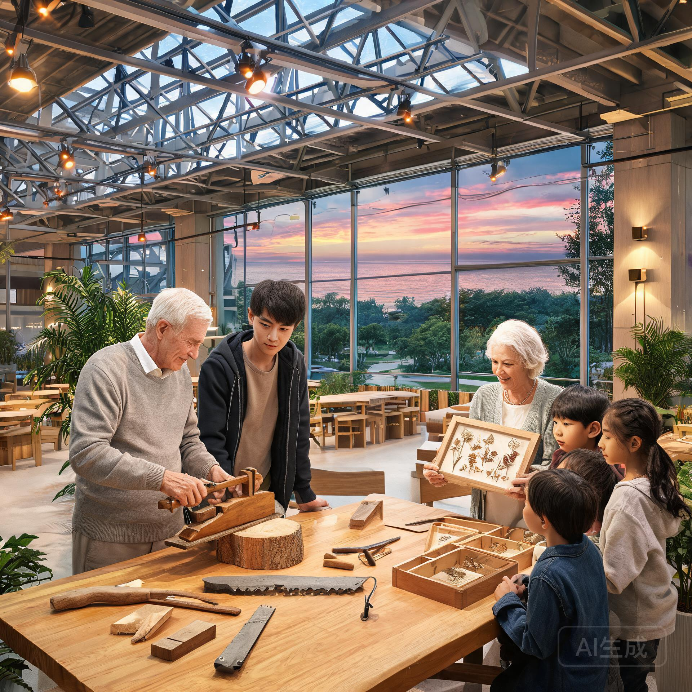

**南岸综合体公共委托署 · 公共文化司**  
**盈余时间项目组**

**文号：** 南公文〔2072〕第 021 号  
**规划周期：** 公元 2072 年 04 月 01 日 — 2073 年 03 月 31 日（2072 年度运行季）  
**报送单位：** 南岸综合体公共委托署  
**核收抄送：** 各邻里文化站、具名工时组、乐龄照护与社会保障局、区域档案馆  
**密级：** 公开  
**民间旧历称谓：** 谷雨后的第一张表

---

> **规划主旨**  
> 自聚变电网与自动化生产网络全域稳定并网以来，南岸综合体居民的**物质生存时间**已压缩至每周约 12 小时（基础维护、照护、即时调度轮值）。随之而来的不是「空闲」，而是此前任何一代人都不曾面对的问题：**每个成年人每周约 156 小时的盈余时间，应该如何被组织？**  
> 本规划不回答「人应该做什么」——那是每个人的自由。本规划回答的是「公共文化司应当提供什么」：当物质不再稀缺，公共文化机构的职责从「分配资源」转向「维护盈余时间的意义生态」。依据《南岸公共福利全域供给条例》与具名工时制（南公委·具时〔2072〕18-4），特制定本年度规划。

---



## 一、 盈余时间的基本认识

### 1.1 什么是盈余时间

盈余时间指扣除生存必需时间（工作轮值、睡眠、进食、个人卫生）后的可支配时间。2072 年度南岸综合体成年居民周均盈余时间为 **156.3 小时**。

### 1.2 盈余时间的三重风险

1. **空洞化**：无结构、无产出、无社交的时间堆积，可能转化为无意义消耗；
2. **内卷化**：盈余时间被重新投入「地位竞争」——具名工时申请、技艺竞赛、文化声望争夺；
3. **断代化**：不同年龄段的盈余时间结构差异（长者重传承、青年重探索、幼童重游戏），若缺乏跨代组织，将加速社群断裂。

### 1.3 公共文化司的定位

公共文化司不评判个人如何度过盈余时间，但负有**维护盈余时间生态多样性**的职责：确保每个人都能找到适合自己的意义结构，且这些结构之间保持可流通、可对话。

---

## 二、 年度项目规划

### 2.1 跨代共建项目

| 项目代号 | 项目名称 | 目标人群 | 周期 | 说明 |
| :--- | :--- | :--- | :--- | :--- |
| SUR-72-01 | 旧手艺档案库 | 长者 × 青年 | 全年 | 长者的传统手艺（缝纫/木作/金属加工/园艺）由青年记录建档，成果入区域档案馆 |
| SUR-72-02 | 儿童天象夜 | 幼童 × 青年 | 每季一次 | 青年天文爱好者带幼童观测暗夜天象，附东海潮间带野化观察 |
| SUR-72-03 | 邻里声景采集 | 全龄 | 每季一次 | 采集南岸各邻里的日常声音（工坊、食堂、潮声），汇编为声景档案 |

### 2.2 个人探索项目

| 项目代号 | 项目名称 | 形式 | 说明 |
| :--- | :--- | :--- | :--- |
| SUR-72-11 | 一人一艺 | 个人创作 | 每人每年可申请一项个人艺术创作（绘画/乐曲/手工/写作），材料免费，成果自愿入档 |
| SUR-72-12 | 慢旅行 | 个人出行 | 南岸低密生态带慢速旅行（步行/骑行/帆船），途中须完成一份「无用观察记录」 |
| SUR-72-13 | 七十二小时实验 | 个人项目 | 72 小时内完成任意小型实验（科学/社会/艺术），不限成败，只记过程 |

### 2.3 公共仪式项目

| 项目代号 | 项目名称 | 周期 | 说明 |
| :--- | :--- | :--- | :--- |
| SUR-72-21 | 具名工时揭榜日 | 每季一次 | 具名工时项目集中揭榜，公众见证署名，强化「署名即记忆」的公共性 |
| SUR-72-22 | 无名者纪念日 | 每年一次 | 纪念所有「不具名公共工时」的参与者——那些维修、清洁、采收、值守的人 |
| SUR-72-23 | 盈余时间圆桌 | 每季一次 | 全龄圆桌，讨论盈余时间的组织方式，提案可提交公共文化司审议 |

---

## 三、 参与项目选录（2072 年度春季）

以下为 2072 年度春季（4—6 月）部分参与项目实录：

```
━━━━━━━━━━━━━━━━━━━━━━━━━━━━━━━━━━━━━━━━━━━━━━━━━━━━━━━━━━━━━━━━━━━━━━━━━━
【南岸综合体 · 盈余时间项目 · 春季参与选录】
━━━━━━━━━━━━━━━━━━━━━━━━━━━━━━━━━━━━━━━━━━━━━━━━━━━━━━━━━━━━━━━━━━━━━━━━━━
项目代号    参与者                参与形式                        备注
──────────────────────────────────────────────────────────────────────────
SUR-72-01   周海平（82岁·原聚变    每周两日在工坊实物示教聚变史    与乐龄社区 GS-2074-01
            堆主管道焊工）         口述与老式法兰气密校核          周海平条目互锁
SUR-72-01   沈静仪（79岁·原标本    指导青年使用传统手摇切片机制    与乐龄社区沈静仪条目
            制作技师）             作水封玻片，成果入自然陈列馆    互锁
SUR-72-02   马思远（20岁·青年学    组织幼童观测东海暗夜天象与      与 GS-2073-02 马思远
            者）                   潮间带野化科考观察              条目互锁
SUR-72-03   林秀芳（76岁·原烘焙    采集乐龄食堂晨间声景并配乐      与乐龄社区林秀芳条目
            师）                   注释                              互锁
SUR-72-11   严德宝（91岁·原无线电  以盲听判读旧式继电器动作音，    与乐龄社区严德宝条目
            维修志愿者）           整理成《机器之声》声景笔记      互锁
SUR-72-13   郭庆海（73岁·原洋山    七十二小时实验：退役集装箱锁    与乐龄社区郭庆海条目
            理货组长）             头的锈蚀时间差记录              互锁
──────────────────────────────────────────────────────────────────────────
```

*注：以上参与者同时为第七乐龄社区在册长者（GS-2074-01 台账），盈余时间项目与乐龄意义工坊共享参与者与成果通道，机构间数据已互认。*

---

## 四、 资源与保障

1. **材料免费**：所有参与项目所需材料由公共委托署统一配给，不设预算上限（因物质生产已自动化）；
2. **成果自愿**：所有成果自愿入档，可署名、可共同署名、可无名归档（与具名工时制同构）；
3. **退出自由**：任何参与者可随时退出项目，无任何记录或影响；
4. **禁止绩效化**：严禁统计项目「产出率」或「参与率」排名；项目的价值在于维护盈余时间的生态多样性，不在于产出。

---

## 五、 附则

本规划自发布之日起施行，由公共文化司盈余时间项目组负责执行与解释。年度末公布运行报告。

---

**南岸综合体公共委托署 · 公共文化司司长：** 林澍（签）  
**盈余时间项目组组长：** 何静姝（签）  
**跨代共建项目协调员：** 周晓舟（签）

**签发日期：** 公元 2072 年 04 月 18 日  
**用印：**  
`南岸综合体公共委托署·公共文化司专用章`  
`盈余时间项目组·运行章`

---

## 图片提示词

南岸综合体公共文化司的社区中庭，2072 年春日傍晚。宽阔的室内公共空间里，一位白发长者在木工长桌旁向青年展示传统木作工具，旁边一位老妇正在给儿童讲解标本；桌上有散落的木料、老式工具与手工标本。远处落地窗外是东海海面与低密生态带暮色。暖黄色人工照明与窗外暮色形成温和对比，工业桁架天窗、绿植与木质家具混搭，纪实抓拍风格，人物自然神态，无文字。

Candid photojournalism scene in a community atrium, spring evening 2072: a silver-haired elder demonstrating traditional woodworking tools to a young adult at a long oak table, an elderly woman showing natural-history specimens to children beside them, scattered wood offcuts and handmade tools on the table. Through the far glazing, the East China Sea and low-density ecological belt at dusk. Warm artificial lighting against the dusk sky, industrial truss skylights mixed with greenery and wooden furniture, natural unposed expressions, fine film grain, no text.

---

## 修订记录（元层，非世界内容）

- **2026-08-21（主编辑审校 · 新作入库）**：本文为批 8「后稀缺生活」组第 1 篇，坐标 文化×丰裕×①地球（第 3 篇入格）。核心制度承接 GS-2072-01（具名工时制：物质免费、署名权配给）、GS-2074-01（乐龄意义工坊：介护归机器、意义归社群）、GS-2064-01（基本生活券），并将 GS-2074-01 的长者条目（周海平/沈静仪/林秀芳/严德宝/郭庆海/马思远）全部复用于参与选录，形成跨文书人物互锁；「盈余时间」概念与 GS-2072-01「做不做工是否还有饭不作答复」的档案语气一脉相承。禁止绩效化条款与乐龄社区「绝对去绩效化审查」同构。
