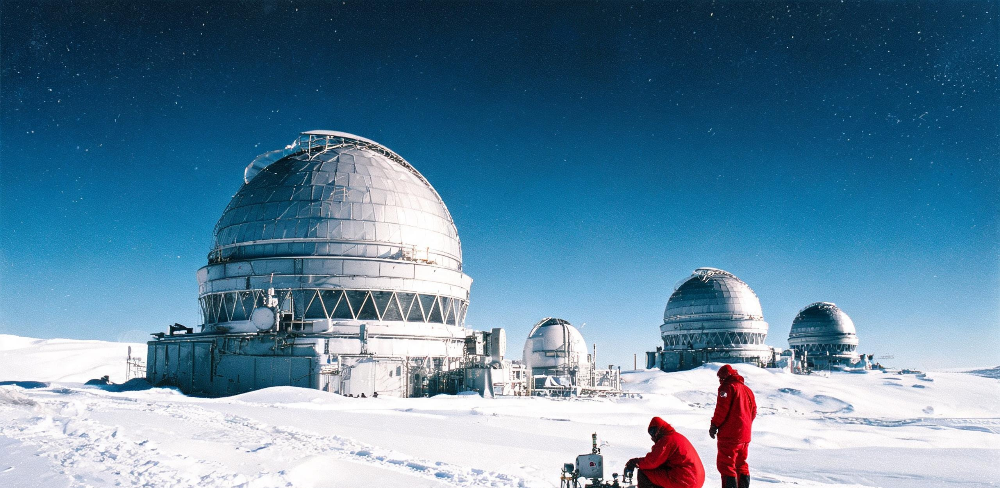

# 南极冰穹A超深空相干测控阵列「昆仑」第三期扩建工程竣工验收公报
## 暨 ARK-01 远征航迹第 110 跟踪年度微弱信标捕获与链路复核鉴定书

**公报文号：** 地联深测验字〔2262〕第 018-KL3 号  
**工程全称：** 南极内陆冰穹A超深空相干激光/太赫兹测控天线阵列三期口径扩建工程（代号：昆仑-03 / KL-03）  
**场址坐标：** 地球南极内陆冰穹A（南纬 80°22′02″，东经 77°21′11″，海拔 4,087.5 m）  
**发文机构：** 地球联合深空测控管理局 · 南极深空观测总台 · 极地工程建设指挥部  
**本期节点：** 三期相干光瞳合成阵列（新增 72 座 16 米主动反射单元，全阵贯通达 120 座，等效相干集光口径 175.3 米）竣工验收与第一阶段闭环锁相联调  
**验收依据：** 《地球地基超大型深空测控设施建造与验收规程（2240年修订版）》、地联测控技字〔2251〕第 44 号任务书、《公共基础设施工程档案管理通则》  
**文书纪年：** 公元 2262 年 10 月 28 日（三期阵列带载试运行第 90 日）  
**密级属性：** 工程受控 / 地联深空科研资产公开通报件  
**主送抄报：** 地月联合深空测控指挥中心、月球南极沙克尔顿巡天总台（ST-01）、静海第五城市带测控处、曙光三环中央调度中枢、世代飞船留守事务总库  

---

### 〇、 工程背景与第 110 跟踪年度测控态势

自公元 2152 年 6 月 11 日恒星际开拓舰 ARK-01 完成主推进全功率点火切入飞往半人马座α星系之双曲线轨道以来，地球地表与地月空间测控网络已对其星载信标实施了连续 110 个太阳系恒星年的常态化精密跟踪。

截至标准历元公元 2262 年 10 月 15 日 00:00:00 TCB（太阳系质心坐标时），飞船日心空间距离已攀升至 **3.1682 光年**（合 $200,360\text{ AU}$，或 $2.9974 \times 10^{13}\text{ km}$），航速恒定在 **0.028800 c**（$8,634.05\text{ km/s}$）。单向光行时（OWLT）已递增至 **1,157.24 标准地球日**（合 $27,773.8\text{ 小时}$，约 3 年 2 个月 3 天）；舰地双向信号往返确认周期（RTT）达到 **6.3368 年**（$2,314.48\text{ 标准日}$）。

```plaintext
[太阳系地球端—ARK-01 极深空测控几何（历元：2262-10-15 TCB）]

                 单向光行时 τ = 1,157.24 标准日 (约 3.168 年)
 地球南极冰穹A ───────────────────────────────────────────────────────────────────► [ARK-01 飞船]
 (昆仑 KL-03 阵) ◄─────────────────────────────────────────────────────────────────── (星载激光信标)
                  下行激光携带遥测数据流 (实测为船载历 2259 年 7 月状态)

 目标天球坐标：赤经 α = 14ʰ39ᵐ36.48ˢ，赤纬 δ = -60°50′02.26″（半人马座α方向）
 冰穹A视场高度：地平高度角 h = 51°12′ ~ 70°28′（全天 24 小时恒定在天顶高空，永不下落）
 接收相对论红移：发射 1064.0000 nm ──► 接收 1095.1084 nm (Δf/f₀ = -0.0284073)
 动钟滞后累积：飞船星载时钟较太阳系 TCB 累计慢 1,440,912 秒 (约 16.677 标准日)
```

**共时性状态严正说明：** 昆仑三期测控阵列本期捕获并解调之物理遥测信号包，系飞船于船载历 **公元 2259 年 7 月 22 日** 自星载主天线向后方发射之光子流。地球测控人员所面对与处理的，严格为飞船在 1,157 天以前之客观历史工况。

---

### 一、 冰穹A「昆仑」三期巨构工程与冰盖自适应基础

南极内陆冰穹A（海拔 4,087.5 米）年平均气温 $-58.4^\circ\text{C}$（极端低温 $-82.5^\circ\text{C}$），全年中值可沉降水汽柱含量（PWV）低于 **0.08 mm**，自由大气层自然视宁度中值达到 **$0.23''$**，系地球地表唯一兼具极端干燥、超高红外透过率与近零大气湍流的“准太空”级深空相干测控场址。

由于目标航向半人马座α（赤纬 $-60^\circ50'$）在南纬 80°22′ 测站的天顶距全天维持在 $19^\circ32' \sim 38^\circ48'$ 之间（即地平高度角恒处于 $51^\circ12' \sim 70°28'$ 恒亮视场），天线阵无需进行大角度俯仰翻转，可实现全天 24 小时、全年 365 天无间断拱极跟踪与相干锁相。

```plaintext
[昆仑 KL-03 阵列拓扑与相干合成总图]
┌─────────────────────────────────────────────────────────────────────────────┐
│ 阵区布局：120 座 16m 主动反射单元（六边形嵌套同心环，基线外径 4,800 m）       │
│                                                                             │
│ [单元 #001] ──┐                                                            │
│      ...      ├──► [真空充气光波导管网] ──► [中央低温干涉洞室 (冰下 32m)]     │
│ [单元 #120] ──┘                                      │                      │
│                                                      ▼                      │
│                                           [1.8K 超流氦浸没式 SNSPD 阵列]     │
│                                                      │                      │
│                                                      ▼                      │
│ [冰下铅铋堆热电站] (15 MWₑ / 40 MWₜ) ──────► [光子到达时间序列相对论反演]   │
└─────────────────────────────────────────────────────────────────────────────┘
```

#### 1.1 总体工程指标与现场实测核验

三期工程自公元 2256 年 11 月动工，历时 6 年极地窗口期建设，在原有 48 座单元（一期 12 座，二期 36 座）基础上新增 72 座 16 米口径超轻量化碳化硅蜂窝拼接反射镜，形成 120 单元超大型相干合成孔径光学/太赫兹干涉阵列：

| 总体设计指标 | 一/二期现状（2255 年） | 三期设计值 | 本期验收实测值 | 判定结论 |
| :--- | :--- | :--- | :--- | :---: |
| **阵列单元数量** | 48 座 | 120 座 | **120 座全部就位** | **合格** |
| **单单元采光口径** | 16.0 m | 16.0 m | 16.02 m | **合格** |
| **等效相干集光口径** | 110.8 m | 175.2 m | **175.27 m** | **合格** |
| **等效总集光物理面积** | $9,650\text{ m}^2$ | $24,120\text{ m}^2$ | **$24,128.6\text{ m}^2$** | **合格** |
| **阵列合成波前均方根误差** | $\le \lambda/22$ | $\le \lambda/35$ | **$\lambda/38.2$** (在 1095nm) | **优良** |
| **光瞳延迟线光程控制精度** | $\pm 18\text{ nm}$ | $\pm 8\text{ nm}$ | **$\pm 5.4\text{ nm}$** | **合格** |
| **阵区微气象防护闭合率** | 99.2% | 99.9% | 99.94% | **合格** |

#### 1.2 极地深冰层自适应工程结构

1. **热电融钻深层冻结钢管桩：** 冰穹A表面雪层虽无明显冰川流动，但冰体内部存在每年约 $0.15\text{ m}$ 之微蠕变。全阵 120 座天线基座全部采用深度达冰下 35 米硬粒雪-密实冰过渡层的热电融沉预应力钢管冻结桩（共 720 根）。桩顶装配三轴液压微动伺服调平云台，经连续 90 天激光基线监测，基础年沉降差异残差小于 **$0.32\text{ mm}$**，完全满足相干干涉光程零漂移容限。
2. **真空充气光波导管网：** 各子镜单元收集之光信号经主焦自适应光学（AO）整形后，注入全长 48.6 公里的真空恒温地下充气导光管道，汇聚至阵区中心冰下 32 米的玄武岩保温绝热干涉大厅。导光管内充注 $0.05\text{ Pa}$ 超高纯干燥氮气，有效杜绝冰面强温差导致的折射率起伏。
3. **极夜能源与微气候平抑：** 阵区能源由部署于冰下 45 米密封雪室内的两座 15 MW 模块化低温铅铋快堆提供（一用一备）。反应堆回路废热（40 MW 级）全额并入阵区冰下生活舱恒温系统与各天线透镜除霜循环，保障外露机械部件在 $-80^\circ\text{C}$ 极寒环境下运转无卡阻。

---

### 二、 极低温超导单光子捕获系统与微弱链路预算复核

随着 ARK-01 飞行动能持续推进至 3.168 光年外之极深空，飞船星载 4.2 米发射望远镜发射之 120 kW 连续相干激光束（本征波长 1064.0 nm）在抵达地球表面时的几何光斑横向直径已扩散至 **$1.85 \times 10^7\text{ km}$**（约为太阳直径的 13.3 倍）。

地表处激光能量流密度已衰减至 **$4.42 \times 10^{-16}\text{ W/m}^2$**。昆仑三期扩建的核心目的，即通过 175.27 米等效口径之巨型集光面，将地面单光子捕获速率提升至维持数据帧可靠解码所需的临界阈值以上。

```plaintext
[信标物理参数演化与多普勒红移标定]
 发射端本征波长: λ₀ = 1,064.0000 nm (超稳光晶格频标锁定)
 接收端实测波长: λᵣ = 1,095.1084 nm (相对论多普勒红移因子 0.97159267)
 接收光子到达率: Φ = 5.42 × 10⁷ 光子/秒 (昆仑三期 120 单元全阵汇聚)
 单光子能量:     Eₚ = 1.8148 × 10⁻¹⁹ J
 地表实测捕获功率: Pᵣₓ = 9.83 × 10⁻¹² W (约 9.83 皮瓦，含大气透过率 92.4%)
```

#### 表 1：ARK-01 星载信标近四十年（第 80—110 跟踪年度）地基观测参数年谱表

| 跟踪年度 | 标称历元 (TCB) | 飞船日心距 (ly / AU) | 单向光时延 $\tau$ (日) | 接收波长 $\lambda_r$ (nm) | 昆仑站光子率 (光子/秒) | 信噪比 $C/N_0$ (dB·Hz) | 动钟累积滞后 $\Delta t$ (日) | 测控站当期配置 |
| :--- | :--- | :---: | :---: | :---: | :---: | :---: | :---: | :--- |
| **第 80 年度** | 2232-10-15 | 2.3041 ly / 145,710 AU | 841.52 | 1,095.1083 | $1.82 \times 10^7$ | 39.8 | 12.129 | 昆仑一期（12 单元） |
| **第 90 年度** | 2242-10-15 | 2.5921 ly / 163,920 AU | 946.72 | 1,095.1084 | $3.58 \times 10^7$ | 41.2 | 13.645 | 昆仑二期（48 单元） |
| **第 100 年度** | 2252-10-15 | 2.8802 ly / 182,140 AU | 1,052.01 | 1,095.1084 | $2.91 \times 10^7$ | 40.1 | 15.161 | 昆仑二期（48 单元） |
| **第 105 年度** | 2257-10-15 | 3.0242 ly / 191,250 AU | 1,104.62 | 1,095.1083 | $2.64 \times 10^7$ | 39.5 | 15.919 | 昆仑二期（48 单元） |
| **第 110 年度** | **2262-10-15** | **3.1682 ly / 200,360 AU** | **1,157.24** | **1,095.1084** | **$5.42 \times 10^7$** | **43.4** | **16.677** | **昆仑三期（120 单元全通）** |

*注记：第 110 年度光子捕获率自 105 年度的 $2.64\times 10^7/\text{s}$ 跃升至 $5.42\times 10^7/\text{s}$，载波信噪比提升 3.9 dB·Hz，充分印证了三期口径扩建工程对深空光子通量衰减之补偿效能。*

#### 2.1 焦平面超导单光子探测器（SNSPD）工况
中央干涉舱配备 64 通道阵列式超导纳米线单光子探测器，浸没于由闭环稀释制冷机维持的 **1.80 K** 超流氦环境中：
- **系统探测效率（SDE）：** 在 1095.1 nm 工作波长下达到 **93.6%**；
- **暗计数率（DCR）：** 经地下 32 米雪层天然宇宙线屏蔽及超窄带光纤布拉格光栅滤波，单通道全系统暗计数低于 **0.008 cps**；
- **定时抖动（Timing Jitter）：** 全系统时间分辨率优于 **14.2 ps**，满足脉冲位置调制（PPM-256）超高速时间切片解调需求。

---

### 三、 星载信标相干锁相与遥测子帧解调研判

在 2262 年 8 月至 10 月的 90 天带载联调期间，昆仑三期阵列累计捕获并无损解码下行工程遥测子帧 **4,320 帧**（总数据量 $7.88\text{ GB}$，信道误比特率 $\text{BER} < 3.8 \times 10^{-9}$）。

```plaintext
[下行遥测物理子帧解码摘录 · 历元 2259-07-22 船载时]
┌─────────────────────────────────────────────────────────────────────────────┐
│ 帧编号: #160428-Y108 │ 接收站: 昆仑 KL-03 总台 │ 校验状态: LDPC 软判决完全闭合  │
├─────────────────────────────────────────────────────────────────────────────┤
│ ■ 居住环转速: 0.4820 rpm (R=2,500m 环底离心重力 0.6501 g, 结构应变标称)      │
│ ■ 乘员健康简报: 第四代在册常住乘员 10,186 人 (骨密度均值维持在基线 98.2%)     │
│ ■ 维生闭环物质流: 水回收率 99.89%, 氧气闭合度 99.15%, 耕地土壤微生物活性良好  │
│ ■ 主动力弹药库: 5,747,950 枚氘-氦3聚变脉冲药丸冷态封存 (温度 4.2K, 磁压稳定) │
│ ■ 巡航姿态陀螺: 自转轴指向赤纬 -60°50′02″ 漂移量 < 0.0002″/年                │
└─────────────────────────────────────────────────────────────────────────────┘
```

#### 3.1 飞船系统稳态与共时性解读
1. **人工重力与结构健康：** 直径 5,000 米的主居住环以 $0.4820\text{ rpm}$ 保持平稳自转，环底离心重力 $0.6501\text{ g}$。自转轴磁悬浮液压补偿阻尼器运行平稳，主钛合金桁架微应变遥测值为 $14.6\text{ MPa}$，远低于疲劳极限。
2. **闭环生态稳态：** 船载三座中央农业温室环带运行平稳，水系统与萨巴捷反应器氧循环效率稳定在设计指标以上。数据显示飞船内部在经历百余年航行后，生态系统物料损耗率低于每世纪 $0.12\%$。
3. **聚变燃料资产核对：** 弹药库储备之 **5,747,950 枚** 聚变脉冲药丸处于绝对超导磁屏蔽冷封工况，状态与 50 年前完全一致，为约 73 年后（公元 2335 年）即将开展的减速制动段储备了充足动力。

---

### 四、 地基-月基相干干涉联调与极地越冬值守

昆仑三期阵列在调试期间，成功与月球南极沙克尔顿总台（ST-01）、地月 L2「天衡」空间测控环实现了地月两极越空相干联调，构筑起投影基线达 **38.4 万公里** 的超长基线光学合成孔径干涉网，测角分辨率达 **$0.021\text{ mas}$**，将飞船空间横向定轨精度收敛至 $\pm 180\text{ km}$。

```plaintext
[地月联合测控网络协同拓扑]
 地球南极冰穹A (昆仑 KL-03 / 120 单元) ──┐
                                       ├──► [地月联合空间相干处理中枢]
 月球南极 (沙克尔顿 ST-01 / 315m 悬索阵) ──┤            │
                                       │            ▼
 地月 L2 (天衡相干测试环 / 16 座 40m) ────┘  [相对论精密航迹与星历解算]
```

#### 4.1 极地值守与人员工时
- **常驻编制：** 昆仑总台常年保持 48 名极地工程技术人员与天体测量科学家驻留（分为观测、光机、制冷与反应堆保障 4 个班组，实行 14 个月轮换越冬制）。
- **极夜维护：** 在长达 138 天的极夜期内，外勤检修组累计执行舱外出镜维护 86 场次，驾驶全封闭式电驱履带工程车在 $-75^\circ\text{C}$ 低温风雪中巡检全阵，累计完成 **1,032 具名工时**，所有单元镜面无结霜、无积雪沉积。

---

### 五、 验收结论与工程移交

南极冰穹A超深空相干测控天线阵列三期工程（KL-03）建设规划之 72 座新增 16 米反射单元全部通过 90 天带载试运行考核，光学相干合成、超流氦制冷探测、地月联合干涉与遥测解调全链路指标均达到或优于任务书要求。

**验收委员会一致评定：昆仑三期扩建工程通过竣工验收，正式交付业务运行。**

本阵列将与月面沙克尔顿总台互为全天候地月冗余双主站，持续为 ARK-01 漫长的远征航程提供不可动摇的地面天线集光面与科学数据保障。

---

**签署人员：**  
地球联合深空测控管理局 工程总监：**周廷岳（印）**  
南极冰穹A昆仑总台 站长兼首席科学家：**秦雪峰（印）**  
光机相干合成系统 主任设计师：**陈楚怀（印）**  
第三方极地工程监造 首席代表：**K. Lindqvist（电子签章）**  

**工程用印：**  
地球联合深空测控管理局 极地工程验收专用章（朱文）  
南极冰穹A深空科学总台 档案管理钢印（原件留存）  

**存档记录：**  
地联深空测控档案馆（上海洋山基岩地下总库）卷宗原件壹份  
南极昆仑总台冰下主控室 副本壹份  
月球静海中央档案库 空间镜像副本壹份  

**公元 2262 年 10 月 28 日**

---

## 图片提示词

### 中文提示词
极地深空测控巨构工业档案摄影：南极内陆冰穹A一望无际的极寒白色雪原上，上百座16米口径的银灰色高精密蜂窝状抛物面天线呈几何同心环阵列整齐铺展，所有天线以60度左右的高仰角整齐划一地指向漆黑清澈的天顶深空。极昼低角度太阳在冰雪地平线上投下刺眼而狭长的硬光与刀锋般清晰的蓝色阴影。近景处一座天线基座旁，一辆红色的履带式全封闭极地工程作业车与两名身着重型抗严寒外骨骼作业服的巡检工程师正在检查冰面上的液压调平钢桩，作业服头盔面罩反射着冰原雪光与金属桁架。画面展现出极其严酷冷峻的自然环境与人类庞大精密工业基础设施之间的剧烈尺度反差，硬光源，胶片颗粒质感，画面无任何可读文字，无国旗。

### 英文提示词
Archival industrial photograph of a deep-space tracking mega-array on the Antarctic ice sheet: across the boundless, frozen white expanse of Dome A, over a hundred 16-meter silver-gray hexagonal-segmented parabolic antenna dishes are arranged in concentric geometric rings, all pointing synchronously at a high 60-degree elevation angle toward the crystal-clear, deep-blue polar sky. A low-angle polar sun near the stark horizon casts blinding harsh white light and razor-sharp, elongated blue shadows across the hard-packed sastrugi snow. In the foreground beside an antenna base, a red enclosed tracked polar utility rover and two maintenance engineers in heavy-duty cold-weather exoskeleton EVA suits inspect the hydraulic leveling steel pilings on the ice, their helmet visors glinting with reflections of the white icefield and metallic trusswork. Immense sense of scale, brutal polar climate juxtaposed with ultra-precise engineering, hard directional lighting, authentic 35mm film grain, no readable text, no signage, no national flags.
