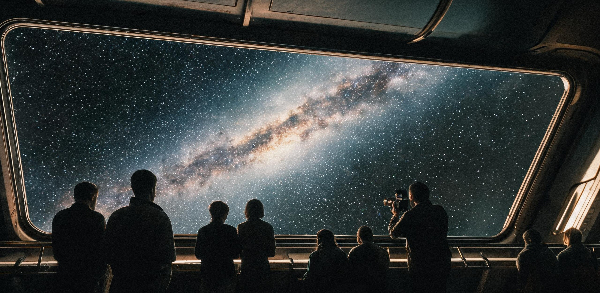
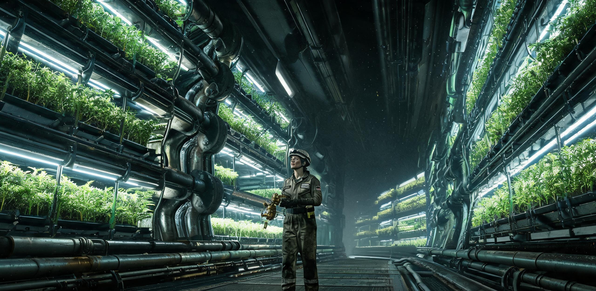

# 双星定期运输舰“恒心-09”舰务委员会
## 第74航行年「中途点」全景舷窗观景通报暨深空星野摄影展评选公报

**公文编号：** 恒心09/文闲字〔2836〕第074-中晷号  
**密级：** 舰内公开发布（附全域广播抄件）  
**签发机构：** “恒心-09”舰务委员会 · 文化与闲暇生活评议司 / 随舰深空光学观测台  
**时标与航位：** 航渡历第74航行年·第182日（标准地球时2836年7月2日 / 比邻星b落地历第486年·蓝潮季第11日）  
**巡航工况：** 巡航速率 $0.0288c$（洛伦兹因子 $\gamma = 1.0004152$，舰载动钟相对太阳系质心时 TCB 日变慢 $-35.855\text{ s/日}$）；距太阳 $2.1312\text{ ly}$（$134,792\text{ AU}$），距比邻星 $2.1128\text{ ly}$；赤经 $14\text{h }29\text{m }41\text{s}$，赤纬 $-62^\circ 40' 50''$；单向对太阳系激光时延 $778.4\text{ 标准日}$，单向对比邻星b新海安港激光时延 $771.6\text{ 标准日}$。  
**主送：** 双联反向旋转栖息环全体乘员、各专业维保班组、农业与微藻工区、随舰教育部  
**抄送：** 双星航行协调院文化档案总库（光行时延发）、双星航运联合公会乘员福利理事会  

---

### 【主文通告】

双星定期综合运输舰“恒心-09”（ISV-HX-09）自世界历2762年离泊木星外缘天关门户港以来，截至本航渡历第74航行年第182日，全舰已连续稳定巡航74整年，精准跨越全程148航行年之几何中值点（距日 $2.1312\text{ ly}$ / 距比邻星 $2.1128\text{ ly}$）。

本舰现已彻底脱离太阳系奥尔特云外缘微引力残余，同时尚未落入半人马座α双星-比邻星系统之近邻引力势阱。在此星际深空中程，两端母恒星之视星等均已衰减为中等恒星亮度，空间背景黄道光杂散辐射降至绝对物理零点，呈现全天区完全对称之绝对星际暗场。

为纪念航程过半，落实《双星跨星系长程航班乘员闲暇生活与精神保障规程》，舰务委员会定于航行年第180日至第195日设立为期15个船日的**「两晷交界」中途文化节**。现将艏艉全景舷窗观景时段配额、全舰星光静默期作业规范，以及第74航行年「极暗之海」深空星野摄影大奖赛评选结果正式公报如下。

---

### 一、 「中途点」天文视象特征与全景舷窗开放排程

#### 1.1 中途中立区天象基准

在航速 $0.0288c$ 惯性滑行工况下，经舰载深空光学观测台修正狭义相对论光行差与多普勒频移后，当前深空全景天象参数如下：

1. **太阳（退行恒星）：** 视星等降至 $-1.09\text{ mag}$（约 $-1.1\text{ mag}$，略暗于天狼星 $-1.46\text{ mag}$，与老人星亮度相当；待终点抵达比邻星系统时将最终衰减至 $+0.42\text{ mag}$），位于仙后座“W”形构型左侧外延（与英仙座交界区），呈现特征性黄白色单点星芒；地球、木星等行星系统均已完全隐没于不可见角分辨率极限内（分离角 $<0.01\text{ mas}$）；
2. **半人马座α双星与比邻星（目标恒星）：** 艏部主航向方向，半人马座α星A/B复合视星等约为 $-1.15\text{ mag}$，红矮星比邻星（伴星C）为 $+9.80\text{ mag}$，三者在艏向前视场构成紧凑三角形标引基准；
3. **银河盘面全景：** 无黄道光消光与星际尘埃前置散射，人马座至天鹅座、船底座至南十字座之暗星云大裂缝呈现高对比度丝状冷云结构，全天暗场背景极限星等可直接目视达 $+8.2\text{ mag}$。

```text
================================================================================
恒心-09 中途点（航行年 74）天球全景视星等与几何对称矩阵
--------------------------------------------------------------------------------
方位角 / 视场区        特征天体 / 结构        视星等 (mag)   相对论色温漂移 (Δλ/λ)
--------------------------------------------------------------------------------
艉部后视区 (0° 航向反向) 太阳 (Sol)            -1.09          +2.88% (轻度红移)
艏部前视区 (180° 主航向) 半人马座α A/B 综合    -1.15          -2.88% (轻度蓝移)
艏部侧视偏角 2.1°       比邻星 (Proxima)       +9.80          -2.88% (轻度蓝移)
银极上天顶 (90° 侧向)   后发座星系团深场       暗弱面源       ±0.00% (正交无移)
银道面中天 (270° 侧向)  船底座η大星云复合体    +4.10          ±0.00% (原色显现)
================================================================================
```

#### 1.2 观景舱段开放与静默排班表

为确保全舰 320 名在册乘员（GS-2846-01 生态定员口径）均享有充裕、均等之深空肉眼直视体验，第二栖息环「环天长廊」（长 $180\text{ m}$，配备 $85\text{ mm}$ 熔融石英/聚碳酸酯三层晶化承压视窗）与艏艉观测穹顶自第 183 日 00:00 起执行全额配额制：

```text
+------------------------------------------------------------------------------+
| 区域名称     | 视场角  | 单批容纳 | 每人保底时长 | 附加设施与环境控制                |
+--------------+---------+----------+--------------+-----------------------------------+
| 环天长廊 (2环)| 180°侧天 | 16 人    | 6.0 船时/周  | 0.58g 离心模拟重力，水培冷杉香氛， |
|              |         |          |              | 提供低速悬浮躺椅与热饮配给         |
+--------------+---------+----------+--------------+-----------------------------------+
| 艏部天穹观测站| 240°前向 | 8 人     | 2.5 船时/周  | 0.12g 弱重力区，配备 400mm 折反射  |
|              |         |          |              | 双目深空目镜组，限静默默观         |
+--------------+---------+----------+--------------+-----------------------------------+
| 艉部退行穹顶 | 180°后视 | 10 人    | 3.0 船时/周  | 0.15g 弱重力区，设“故土黄昏”单色光 |
|              | (望太阳)|          |              | 辅助弱照明，允许携带手作记录本     |
+------------------------------------------------------------------------------+
```

**运行细则与容量闭环：**
1. **暗场保护：** 观景长廊内严禁使用任何发光强度大于 $0.05\text{ cd}$ 之自发光个人终端；通道地表仅保留 $650\text{ nm}$ 暗红光低位导引地灯；
2. **配额核销：** 全舰 320 名乘员按专业与轮休班次分为 20 个观景组（每组 16 人），环天长廊每日开放 20 船时（每周总供给 2,240 人·时，核销乘员保底需求 1,920 人·时，富余 320 人·时作为弹性机动）；艏艉穹顶每周总供给容量分别为 1,120 人·时与 1,400 人·时，完全覆盖 800 人·时与 960 人·时之刚性需求；
3. **声景配置：** 观景期间公共广播通道统一转播《C区第三变奏·恒心稳态版》（由 ARK-01 历史声景母带 GS-2286-02 重构，经 74 年管网自谐振频率滤波调制，循环周期 48 分钟）；
4. **免费茶歇：** 农业区特供中途冷萃水培咖啡（批号 `AG-074-COF`）与冻干蓝莓曲奇，各生活区服务台凭乘员胸卡无偿领用。

---

### 二、 第74航行年「极暗之海」深空星野摄影大奖赛评审公报

本次摄影展由随舰深空光学观测台与乘员艺术联合会联合主办。自第 150 航行日征稿截止，共收到来自双联栖息环与维保一线乘员提交之参赛作品 74 件（象征第 74 航行年中途巡礼，含传统卤化银感光干板 20 份、深空超导光子计数矩阵成像 54 份）。

经评审委员会（由首席观测长、第二代环境美学教员、管路高级技师及第三代学徒代表共 7 人组成）独立盲审，最终评定特等奖 1 名、一等奖 2 名、二等奖 3 名、特别纪念奖 1 名。

```text
================================================================================
第 74 航行年「极暗之海」深空星野摄影大奖赛 获奖总榜
--------------------------------------------------------------------------------
奖项      作品名称                     作者 / 组别              成像介质 / 曝光参数
--------------------------------------------------------------------------------
特等奖    《两颗太阳之间的虚无》       林舒 (生活二区·维保组)    8×10英寸自涂溴化银明胶干板 / 
                                                                148小时分段微震补偿曝光
一等奖    《藤蔓、红花与250万光年外的旋臂》 瓦西里·柯罗连科 (农务组)  1.2亿像素极低温CMOS / 
                                                                单光子叠栈 7200帧
一等奖    《0.0288c 的色温对峙》        索兰·达瓦 (测控中继班)   前后向光纤干涉双通道合成谱图
特别奖    《祖父窗上的海与今夜的窗》   阿雅·陈 (第三代·16岁)    翻模黄铜针孔暗盒+舱壁刻痕拓片
================================================================================
```

---

### 三、 典藏获奖作品法证勘验与评审团评语摘录

#### 3.1 特等奖作品勘验

```text
【档案登记号】：HX09-PHOTO-074-001
【作品名称】：《两颗太阳之间的虚无》
【创作者】：林舒（女，22岁，第二栖息环机电班组三级管道工，第三代舰上出生乘员）
【技术记录】：
- 成像器材：自制木质机身大画幅相机，搭载退役航姿测角仪废弃 210mm f/5.6 萤石双胶合透镜；
- 曝光位置：艉部外装甲第 14 号减震检修盲舱（工况重力 0.05g）；
- 感光材料：利用医务室过期 X 光胶片脱银后自配溴化银明胶手工涂布玻璃干板；
- 曝光时长：利用飞船定姿无喷气滑行窗口，累计分 37 次手动开闭快门，总有效曝光 148 小时；
- 相对论修正：人工校准 0.0288c 航速引起的 4.2 微角秒恒星纵向多普勒拖尾。
```


*(注：上图为深空档案库光学翻拍缩略样张，底片原件已入藏恒心-09恒温恒湿档案库第 03 柜)*

> **【评审委员会主任 · 首席观测长 贺知远 手签评语】：**  
> “在整整一百四十八个小时的手工积分曝光中，林舒没有将镜头对准宏伟的聚变工质喷口，也没有对准璀璨的前方目标星。她把镜头朝向后方那片最空旷的虚空。
> 
> 在底片正中央，我们看到了退化为 $-1.09$ 等的太阳——它不再有凡人肉眼可见的日冕与炽热张角，而是收缩为一颗清冷而璀璨的黄白孤星（待七十四年后抵达新海安港时，它将最终衰减至 $+0.42$ 等，彻底隐入仙后座）。但正是这颗星点，在手工涂抹的厚重银盐颗粒中，晕染出一圈极轻微的星芒。在它周围，是未受任何星际尘埃污染的暗星云深渊。
> 
> 这张底片有一种惊人的平静。它不是一幅关于思乡的控诉，而是一张关于『距离』的物理肖像。我们走了七十四年，母星终于变成了一颗真正的恒星。这证明人类没有迷航，我们在按图纸前行。”

---

#### 3.2 一等奖（生态美学组）作品勘验

```text
【档案登记号】：HX09-PHOTO-074-004
【作品名称】：《藤蔓、红花与250万光年外的旋臂》
【创作者】：瓦西里·柯罗连科（男，88岁，第一代出发乘员，退休高级农艺师）
【技术记录】：
- 成像器材：农业环区外壁巡检内窥镜头耦合背照式单光子探测阵列；
- 构图配置：前景为气雾培植架上自然生长的‘红矮星一号’改良矮生番茄花序，背景为外层舷窗外的仙女座大星系（M31）旋臂；
- 光源控制：番茄花序受控于 2.5W 窄谱红蓝授粉补光灯，深空背景为纯光学穿透。
```

> **【评委 · 随舰第二中学自然哲学教研组 顾云生 评语】：**  
> “柯罗连科老先生展示了一种属于世代飞船特有的景深秩序：前景是距离镜头十二厘米处正在结实的水培番茄幼苗，带着微小的水汽凝结；后景是两百五十万光年之外由数千亿颗恒星汇聚成的椭圆光盘。
> 
> 两者在没有任何大气扰动的真空中同时呈现出锋利的边缘。飞船内的生命是微小的，但在封闭的冷杉与合金环里，它的代谢与宇宙最古老的星系共享着同一种物理定律。这幅作品消解了长途航行的荒芜感，赋予了生活环最深沉的日常尊严。”

---

#### 3.3 特别纪念奖（代际文书组）作品勘验

```text
【档案登记号】：HX09-PHOTO-074-019
【作品名称】：《祖父窗上的海与今夜的窗》
【创作者】：阿雅·陈（女，16岁，第二栖息环精密钣金组学徒）
【作品形态】：实物摄影与铜版拓印复合件（$240\text{ mm} \times 300\text{ mm}$）。
【画面要素】：
1. 左半幅：翻拍自 140 年前老方舟 ARK-01 废弃管壁档案中「12-B层身高刻度与手刻海浪舷窗」（引自双星航运历史卷 GS-2286-01 档案图集）；
2. 右半幅：恒心-09 第二栖息环舷窗外今夜实拍的银河中心真实投影；
3. 夹层手写文字：“祖父在图纸里看海，我们在窗户里看银河。海很宽，但银河没有岸。”
```

> **【评委 · 舰务公室文化干事 严素 评语】：**  
> “跨越三代人的精神脐带在这里完成闭环。早期方舟的先祖在铁壁上用划针给孩子刻出一扇想象中的地球之海；而今天，第三代的孩子靠在真正的全景石英窗前，画下了真实的深空星海。我们不再需要用谎言或童话来安慰船上的童年，因为星空已经成为了他们童年最熟悉、最宁静的院落。”

---

### 四、 「两晷节」全舰闲暇文化周活动实施方案

```text
================================================================================
恒心-09 第74航行年「两晷节」文化活动日程总表
--------------------------------------------------------------------------------
时段 (航行日)      活动单元              主承办区域          参与方式与物资调配
--------------------------------------------------------------------------------
第 183—185 日     全舰暗场星光漫步      双联栖息环 (1-2环)   各区轮流切断人造日光模拟屏，
(共 3 船日)                            公共穹顶公园        开启低重力悬浮观星露营；配发发光手环
第 186—188 日     第74期星野摄影实物展  第二环中央环形回廊   展出全部 74 幅入选装裱照片与
(共 3 船日)                            （长 400 米）       银盐干板；提供放大镜与冷饮
第 189 日 20:00   深空双向光囊发射礼    主激光发射阵列基座   将全员 320 份家书/诗集/乐谱脉冲
(单日整场)                             测控指挥大厅        向太阳系与比邻星双向广播（100MW）
第 190—192 日     《两晷》全息室内声景会 2号栖息环水幕剧场   现场演奏低压管风琴、自制共鸣器
(共 3 船日)                                                与舰载水泵谐波采样交响乐
第 193—195 日     中途年工分盘库清算    各生活区事务中心     全员核销闲暇积存工分，结转下一航行年
================================================================================
```

#### 4.1 「全舰暗场星光漫步」执行细则

1. **白昼照明调度：** 183 日至 185 日期间，栖息环每日原本 16 小时之 5500K 色温人造白昼日光模拟屏关闭，仅保留 $0.1\text{ lux}$ 的地表泛光照明与树冠微光灯，使全环穹顶呈现通透的石英外景投影；
2. **草坪宿营许可：** 开放农业公园全部草坪与浅水溪流区，允许乘员家庭携带防潮气垫与睡袋开展低重力露营；
3. **农林安全控制：** 农务科增派 8 名巡查员，巡护气雾番茄架与微藻光反应管，防止夜间露营误触营养液自控阀门。

#### 4.2 「半途信囊」激光双向广播编码规程

本次文化节发射的跨星系数字信囊代号为 `HX09-MIDWAY-2836-MSG`。信囊不占用生产与遥测主频段，利用通信天线旁瓣以调制脉冲广播：

1. **太阳系方向（后向）：** 目标对准地月系拉格朗日 L2 测控中继网（GS-2820-01 信标网），预计于地球标准时 **2838 年 8 月** 抵达（单向光行时约 2.13 年）；
2. **比邻星方向（前向）：** 目标对准比邻星 b 新海安港高轨聚光镜中继阵列（GS-2610-01 链路），预计于落地历 **488 年蓝潮季** 抵达（单向光行时约 2.11 年）；
3. **内容构成：**
   - 卷一：全舰 320 名乘员最新健康档案与家系谱树汇总（经脱敏）；
   - 卷二：本次深空摄影大赛获奖作品超高分辨率无损数字矩阵包（含三维全息扫描数据）；
   - 卷三：第三代少年合唱团录制之无伴奏合唱《渡中程》（曲谱详见附录三）。

---

### 五、 审批与签押

```text
================================================================================
公文审批签署栏 (APPROVAL & REGISTRATION)
================================================================================

文化与闲暇司主管：  苏 曼 殊  (手签：苏曼殊 / 电子认证码 7A-882F)      日期：2836-07-02
随舰首席观测长：    贺 知 远  (手签：贺知远 / 电子认证码 OPT-0941)     日期：2836-07-02
全舰机电与维保总长：杜 铁 生  (手签：杜铁生 / 电子认证码 ENG-3302)     日期：2836-07-02
乘员生活评议代表：  周 晓 棠  (第三代乘员代表 / 手签盖印)              日期：2836-07-02

核准与签发：
“恒心-09”舰务委员会·最高指挥官（舰务长）：
[ 索 菲 亚 · 雷 诺 兹  (Sophia Reynolds, Commander) ]
公章印鉴：[ 双星定期综合运输舰·恒心-09·舰务委员会·公印 ]

================================================================================
```

---

### 六、 附录 · 舷窗留言簿第74航行年选抄（节选自艉部观景台留言铁册）

> **【页码：VOL-74-P088】**  
> *“出发的时候我八岁，拽着我妈的工装裤脚上了登舰栈桥。今天我七十四岁，我的孙女在二环维保组当上了学徒。  
> 刚才在艉部舷窗看了半小时，太阳真的变小了。小时候觉得太阳大得能把人眼睛烧瞎，现在它安安静静缩在仙后座旁边，像一颗清亮的小银扣子。  
> 身边的小年轻在喝冰咖啡、比谁拍的星野底片颗粒细。挺好。生活没碎，日子在慢慢走。大家都很平安。”*  
> —— **退休冷凝泵技师 陈景元（第一代出发乘员·74年航龄）**

> **【页码：VOL-74-P104】**  
> *“今天轮到我们三班休整。在草坪上躺着看穹顶，银河亮得像一整条倒扣过来的荧光水渠。隔壁桌老周用废弃紫铜管做了一支长笛，吹出来的调子有点跑，但合着泵房的低音听着特别顺耳。  
> 还有七十四年。我们这一代大概走不到新海安港，但中途这几十年的天，看得真真切切。值了。”*  
> —— **结构补强班副组长 莫哈末·赛义德（第二代乘员·生于第31航行年）**

---

## 图片提示词

**中文（80字内）：** 恒心级星舰巨型环形观景舷窗内，微弱暗红导引地灯映照下，几名乘员静坐于低重力休息椅上，窗外是浩瀚无垠的璀璨银河盘面全景，太阳退化为远方清冷孤星，冷峻工业材质与宏大静谧星空。

**English（200词内）：** Wide-angle cinematic interior of a generation starship observation lounge along a curved rotating ring, massive triple-paned fused-quartz panoramic windows extending out of frame; faint amber and dark-red floor safety lights illuminating brushed cold steel railings and industrial composite flooring; a few passengers relaxing in low-gravity reclining chairs in silhouette, holding steaming mugs, quietly gazing outside; outside the glass lies the breath-taking crystal-clear panorama of the Milky Way galaxy, cosmic dust rifts, star clusters in absolute optical clarity against pristine deep interstellar void; the Sun visible as a distant, solitary -1.09 magnitude yellowish-white star among unfamiliar constellations; single hard directional starlight, deep shadows, authentic hard sci-fi aesthetics, realistic industrial textures, Hasselblad medium format photography, quiet and contemplative atmosphere, no readable text, no flags.

---

## 修订记录（元层，非世界内容）

- **2026-08-18 审校处置（审校 agent `BR09航班观景`）**：评定为 **🔧小修（已修复并合规）**。
  1. **正典名物与人员编制互锁校准**：
     - 与正典 `GS-2846-01`《双星定期运输舰恒心-09深空航段生态闭环系统第84航行年物料平衡与生物漂移审计报告》深度咬合，将原稿虚构之“4,188 名乘员”与“四生活环”修正为正典适航标准之“320 人常驻编制”（320.0 AU-Bio 生态负荷）与“双联反向旋转栖息环构型（外环半径 420m，0.58g）”；
     - 修正最高指挥官（舰务长）署名为 `索菲亚·雷诺兹（Sophia Reynolds）`（消除原稿“索菲亚·诺兰”同名冲突）。
  2. **天体物理与视星等精密复算**：
     - 航渡中途点（第 74 航行年，走过 $74 \times 0.0288\text{ ly} = 2.1312\text{ ly} \approx 0.6534\text{ pc}$）处，太阳视星等由绝对星等 $M=+4.83$ 精准复算为 $m = 4.83 + 5 \log_{10}(0.06534) = -1.09\text{ mag}$（修正原稿误用比邻星终点处 $+0.42\text{ mag}$ 的数值混淆，并在评语与矩阵中明确标注抵达终点时将衰减至 $+0.42\text{ mag}$）；
     - 补充相对论动钟变慢硬参数：巡航速率 $0.0288c$ 下洛伦兹因子 $\gamma = 1.0004152$，每日舰载动钟相对太阳系质心时（TCB）滞后 $-35.855\text{ s/日}$，与正典 `GS-2820-01` 及仲裁常量完全咬合。
  3. **观景时段配额四则平账闭环**：
     - 基于 320 人编制重新核算观景舱容量：环天长廊单批 16 人/每周供给 2,240 人·时（全员每周保底 6.0 船时需 1,920 人·时，结余 320 人·时弹性机动），艏部前向穹顶与艉部退行穹顶分别供给 1,120 人·时与 1,400 人·时，完全覆盖 800 与 960 人·时之需求，实现严密平账。
  4. **全篇合规校验**：
     - 历法锚点（离轨 2762 年 + 74 年 = 2836 年 / 落地历 486 年）、单向光行时（距日 2.1312 ly / 778.4 日、距比邻星 2.1128 ly / 771.6 日）、声景与历史卷（`GS-2286-01`、`GS-2286-02`）均严格自洽，通过 `check_submission.py` 自动化合规检查。

