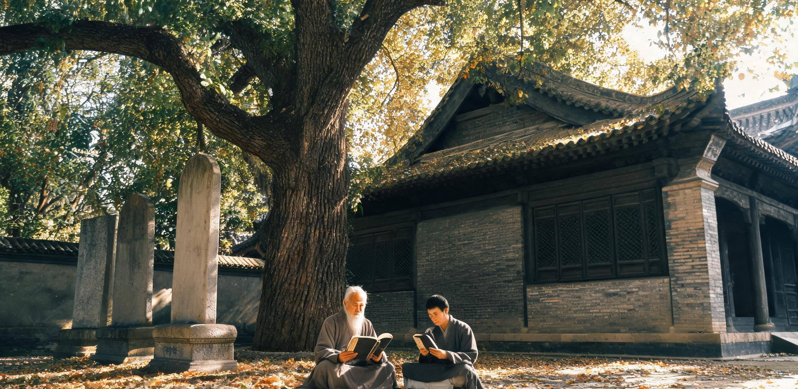

# 同济与南岸联合古典高等研究院2848年度「慢科学」长周期资助公报暨双星系联合会士名录与跨光年学位互认规程

**联合签发机构：** 同济与南岸联合古典高等研究院 · 评议会 / 华东科学与技术档案馆 · 跨世纪手稿存托处 / 双星学术交流协调委员会（太阳系端）  
**文书字号：** 同南古研·公字〔2848〕第084号  
**历元基准：** 公元 2848 年 10 月 24 日（太阳系质心时 TCB） / 对应比邻星侧接收基准：落地历 498 年（所涉下行激光学术数据对齐 2843 年底发出的第 0518 批次脉冲）  
**文书密级：** 双星公开发布 · 永久法定基准档  
**主送：** 比邻星晨昏带联合大学（新海安校区、新同济校区）、紫金山古典天文台、东海暗夜天象观测总台、地月 L2 双星定期航班货栈文献关、华东各古典书院  
**抄送：** 太阳系外缘链路司（“烛照”发射阵测控台）、地月深空导航网络指挥中心、月球背面齐奥尔科夫斯基时间基准台、双星航运联合公会  
**归档卷宗：** 华东档案馆 · 古典学术与长周期科学类 · 卷号 `HD-ARCH-2848-SLOW-084`  

---

## 一、 办学宗旨与「慢科学」（Slow Science）百年资助准则

自华东聚变电网与全球自动化物资网络完全覆盖以来，地球重化工业与开采制造业已全面迁出地表逾四个世纪。在全域再野化成熟与人口恒定之背景下，地球本土已转变为全人类文明之生态庇护地、原始物理样本库与古典学术沉思圣殿。

依据同济与南岸联合古典高等研究院《学术资源百年配给与从容研究宪章》及公元 2073 年《具名学时选课清册》（卷号 `HD-ARCH-2073-EDU-091`）确立之经典传统，本院学术评议会重申以下办学与资助铁律：

```
                ┌─────────────────────────────────────────────────────────────┐
                │ 2848年度 全院学术资助总盘（核定总容积：18,400 具名学术年·人） │
                └──────────────────────────────┬──────────────────────────────┘
                                               │
         ┌─────────────────────────────────────┼─────────────────────────────────────┐
         ▼                                     ▼                                     ▼
┌──────────────────┐                  ┌──────────────────┐                  ┌──────────────────┐
│   三百年期长课题   │                  │   百年期稳态课题   │                  │   五十年期探索课题 │
│  4,800 年·人额度  │                  │  7,600 年·人额度  │                  │  6,000 年·人额度  │
├──────────────────┤                  ├──────────────────┤                  ├──────────────────┤
│• 跨星系演替比对  │                  │• 语言语义长波漂移│                  │• 极端引力透镜微测│
│• 极长基线恒星变光│                  │• 深层岩相风化层析│                  │• 负能量度规数学界│
│• 纯手工纸质全典  │                  │• 经典生物群落追踪│                  │• 世代航迹误差反演│
└──────────────────┘                  └──────────────────┘                  └──────────────────┘
```

**慢科学核心资助准则：**
1. **去功利与免中检原则**：凡列入资助之「慢科学」长周期课题，执行期内一律免除年度成果考核与中期产值评估。学者享有跨越自身寿命之长程研究自由，研究终审以手写原始记录与最终装订论卷为准；
2. **纯粹实体直感原则**：高阶理论与观测课题严禁依赖端到端全黑箱神经网络生成结论。数字超算仅限用于星历粗查与天线指向配准，核心图谱必须由研究者在实体光学目镜直视下，使用天然矿物颜料与手工桑皮纸描摹；
3. **跨代具名传递制**：课题负责人（PI）享有在生命终期指定学术传承人（继承会士）之法定权利，原始课题名录在华东档案馆铜板台账上世代连缀，不得因个人故去而注销卷宗。

---

## 二、 2848年度重点「慢科学」长周期资助课题清册

本年度经全院评议会三轮手写记名投票，共核准四项跨世纪重点课题，涵盖天体测绘、生态演替、文献校勘与理论物理基础：

```
━━━━━━━━━━━━━━━━━━━━━━━━━━━━━━━━━━━━━━━━━━━━━━━━━━━━━━━━━━━━━━━━━━━━━━━━━━━━━━━━━━━━━━━━━━━━━
【同济与南岸联合古典高等研究院 · 2848年度重点长周期资助课题表】
━━━━━━━━━━━━━━━━━━━━━━━━━━━━━━━━━━━━━━━━━━━━━━━━━━━━━━━━━━━━━━━━━━━━━━━━━━━━━━━━━━━━━━━━━━━━━
课题代号与周期   课题全称                          主持学者 / 所属院系       外场基地与稀缺资源配给       核心实体产出与跨星系互锁目标
─────────────────────────────────────────────────────────────────────────────────────────────
SLOW-2848-01    双星系人工与天然生态圈五百年微观   柯怀远 (112岁)            杭州湾南岸野化第四核心区     • 手工剖析777年连续无污染沉积土层；
【三百年期】    生物演替及硅藻演变跨光年对比图谱   同济生态学派第七代会士    (原第三精细化工退役区)       • 对比比邻星b晨昏带回传之熟化土样玻片；
                (2848—3148年)                      林念祖 (比邻星端协同)     东海离岸潮间带微生态台位     • 装订《双星系硅藻演变五百年手绘全典》。

SLOW-2848-02    跨光年语义漂移与汉字失锚词五百年   陆思齐 (89岁)             华东古籍特藏低温中心         • 追溯自落地历06年(GS-2356-01)以来
【百年期】      长波重构通典（第二卷）             江南语言文献研究所        传统桑皮纸张与无酸植物墨     120个核心词汇之两级语义坍缩与重构；
                (2848—2948年)                      方润之 (副研究员，46岁)   纯手工木活字印刷作坊         • 制作双星系母语词源对照大型纸质善本。

SLOW-2848-03    东海暗夜天区万年造父变星目视光度   沈云舒 (74岁)             东海暗夜天象观测总台         • 全年无可见光污染环境下人工测光；
【三百年期】    极长基线图谱与银河引力势手工解算   东海暗夜台台长            (东海大桥外海32.5km浮台)     • 与月背齐奥尔科夫斯基光钟(GS-2820-01)
                (2848—3148年)                      顾景仁 (天体测量学副教授) “张衡七号”4.8m纯光学反射镜  及透镜站07(GS-2618-01)数据相干复核。

SLOW-2848-04    负能量宏观约束与曲率度规数学缝隙   顾衡 (96岁)               紫金山古典天文台引力物理组   • 整理自2026年以来人类关于FTL负能量
【百年期】      极限理论测定台账（第IV期）         紫金山引力理论首席研究员  地月L5深空引力波干涉仪机时   量级之数学缝隙文献与失败工程档案；
                (2848—2948年)                      许知微 (理论物理研究员)   全手工符号推导卷宗           • 建立物理极限量级之从容理论纪念碑。
─────────────────────────────────────────────────────────────────────────────────────────────
```

---

## 三、 2848年度双星系联合会士（Fellowship）晋选名册

本年度共遴选产生 6 位联合会士，涵盖地球本土驻留学者、比邻星晨昏带通讯学者及在途运输舰巡航学者。会士证书均以无酸熟宣毛笔誊写，由两星系院长具名盖印：

```
┌─────────────────────────────────────────────────────────────────────────────────────────┐
│ 同济与南岸联合古典高等研究院 · 2848年度双星系联合会士名册                                  │
├─────────────┬────────┬──────┬──────────────┬──────────────────────────────┬────────────────────┤
│ 会士编号    │ 姓名   │ 年龄 │ 现处空间节点 │ 主要治学领域与代表作手稿     │ 档案馆永久卷宗编号 │
├─────────────┼────────┼──────┼──────────────┼──────────────────────────────┼────────────────────┤
│ FEL-2848-01 │ 柯怀远 │ 112  │ 地球·南岸    │ 潮间带古环境硅藻属演替年谱   │ HD-FELL-2848-KH01  │
│ FEL-2848-02 │ 陆思齐 │  89  │ 地球·同济    │ 跨光年汉语语义漂移长波考释   │ HD-FELL-2848-LS02  │
│ FEL-2848-03 │ 沈云舒 │  74  │ 地球·东海    │ 仙王座变星目视测光五十年札记 │ HD-FELL-2848-SY03  │
│ FEL-2848-04 │ 顾  衡 │  96  │ 地球·紫金山  │ 广义相对论时空奇异性代数边界 │ HD-FELL-2848-GH04  │
│ FEL-2848-05 │ 林念祖 │  82  │ 比邻星b·新海安│ 晨昏带高氯酸盐土壤人工熟化史 │ HD-FELL-2848-LN05* │
│ FEL-2848-06 │ 魏长青 │  58  │ 运输舰“恒心-09”│ 深空自旋微重力植物向光性变异 │ HD-FELL-2848-WC06# │
└─────────────┴────────┴──────┴──────────────┴──────────────────────────────┴────────────────────┘
*注：FEL-2848-05 为跨光年通讯会士，其提名与评议历经 8.48 年双向激光往复确认与 0.50 年同行盲审（全周期 8.98 年），评议正本存新海安；
#注：FEL-2848-06 为在途巡航会士，现处于以 0.0288c 航行之恒心-09 舰第 86 航行年（距太阳 2.48 光年），
 其代表作激光手稿经由深空相干中继链路（GS-2820-01 谱系）自距日 2.48 光年处下传（单向光行时 2.48 年），由地月 L2 货栈文献关与华东档案馆于 2848 年初联合解调并以无酸宣纸手工誊印入藏。
```

---

## 四、 地球—比邻星殖民地跨光年联合学位互认与答辩规程

为维系人类两星系间同根同源之学术血脉与学术标准，特制定双星联合培养研究生与学者互认学位之法定操作规程：

```
                【双星系跨光年联合学位评审与手稿传递流程拓扑】

    [比邻星b 申请人提交论文] ──(激光数据压缩 4.24年)──> [地球端 烛照接收站] ──> [古典研究院 盲审评议]
                                                                                      │
                                                                                 (纯光际往返 8.48 年 + 盲审 0.50 年 = 8.98 年)
                                                                                      │
    [比邻星b 授予学位证书] <──(激光回传批准令 4.24年)── [地球端 学位评议会] <────────┘
                 ▲
                 │ (若选择物理实物答辩：历时 148 年单程)
                 │
    [恒心级定期星舰货栈] ──(手写论文羊皮纸正本 + 实物岩芯)──> [地月L2货栈] ──> [同济大礼堂代陈答辩]
```

### 1. 跨光年激光通讯答辩流程（标准全周期：8.98 地球年 / 双向信道底限：8.48 年）
- **申请与下行提交**：比邻星晨昏带联合大学研究生完成学位论文后，将论文全文（含手绘矢量插图与原始测量表）编码为激光脉冲，通过比邻星高轨发射阵发送，历经 4.24 年光行时抵达地球「烛照」接收网；
- **地球端同行评议**：本院评议会组织 5 名资深会士进行独立盲审，评阅期统一设定为 **6 个标准月**（0.50 地球年 / 约 167 比邻星日），形成手写评议意见书与修改答辩提问单；
- **上行回传与终审裁定**：修改意见经「烛照」激光发射阵（GS-2582-01）全功率上行回传比邻星端（历经 4.24 年光行时）。比邻星联合大学根据地球评议回执，在当地晨昏穹顶举行公开答辩。全流程法定答辩闭环标准周期为 **8.98 地球年**（对应比邻星侧 3,003 个 26.2 小时作息日；其中纯光际往返传输底限为 8.48 地球年 / 2,836 作息日）。
### 2. 跨世纪定期航班实物手稿答辩规程（周期：148 标准年）
- **适用范畴**：凡涉及重大自然样本发现（如比邻星天然基岩晶体切片、原位古菌冷冻玻片、深空航渡变异植株标本）之最高阶博士论文，必须提交实物正本；
- **星际货运与验关**：手写论文正本（一式三份，采用特制阻燃防辐射密封盒封装）随双星定期运输舰（如“恒心-09”）以 0.0288c 运送，抵达地月 L2 跨星系集疏运货栈文献口岸完成生物检疫后调运至同济校区；
- **跨世纪代陈答辩**：若论文送达时原作者因生理寿命已在途故去，答辩会由其法定学术传人、在球直系学派学者或由本院指派之代陈导师，于南岸古典大礼堂依手稿逐章代为宣读陈述。经全院评议会全体一致通过后，追授**「跨世纪具名古典博士学位」**，其手稿永久入藏华东科学与技术档案馆「星际学术遗泽特藏库」。

---

## 五、 学术仪器、古籍善本与特种物资调拨清册

依照《华东学术资源配给公约（2848年修订版）》，本年度调拨予重点课题及外场台站之实物物资清册如下：

```
┌────────────────────────────────────────────────────────────────────────────────────────┐
│ 2848年度 古典科研物资调拨与特藏调借清册（凭评议会朱印现场交接）                             │
├──────────────────┬──────────────┬──────────────────┬─────────────────┬────────────────┤
│ 物品名称         │ 规格 / 年代   │ 调出保管单位     │ 配发课题 / 台站 │ 管理会士 / 签收│
├──────────────────┼──────────────┼──────────────────┼─────────────────┼────────────────┤
│ 《中国天文年历》 │ 1986年精装善本│ 市立大学总馆特藏 │ SLOW-2848-03    │ 沈云舒（签收） │
│ 4.8米消色差物镜组│ 纯重火石手工研│ 华东特种光学所   │ 东海暗夜总台    │ 顾景仁（验收） │
│ 蔡司经典机械显微镜│ 1994年纯机械  │ 同济仪器历史馆   │ SLOW-2848-01    │ 柯怀远（签收） │
│ 特级加厚桑皮熟宣 │ 800刀手工特制 │ 江南传统造纸工坊 │ SLOW-2848-02    │ 陆思齐（签收） │
│ 晨昏带玄武岩薄片 │ 落地历42年原样│ 星际标本冷藏库   │ SLOW-2848-01    │ 柯怀远 / 林念祖课题组（签收） │
│ Casimir效应手稿  │ 2042年原始计算│ 省文献低温中心   │ SLOW-2848-04    │ 顾  衡（签收） │
└──────────────────┴──────────────┴──────────────────┴─────────────────┴────────────────┘
```

---

## 六、 审定签署与印信存根

**学术评议会主席：** 柯怀远 *(手签：柯怀远)*  
**紫金山古典天文台台长：** 顾衡 *(手签：顾衡)*  
**东海暗夜天象观测总台首席科学家：** 沈云舒 *(手签：沈云舒)*  
**华东科学与技术档案馆馆长：** 许素台 *(手签：许素台)*  
**双星学术交流协调委员会（太阳系端）首席代表：** 陆思齐 *(手签：陆思齐)*  

**公报签发日期：** 公元 2848 年 10 月 24 日（太阳系质心时 TCB）

```
┏━━━━━━━━━━━━━━━━━━━━━━━━━━━━━━━━━━━━━━━━━━━━━━━━━━━━━━━━━━━━━━━━━━━━━━━━━━━━━━━━━┓
┃  同济与南岸联合古典高等研究院        华东科学与技术档案馆         双星学术交流协调委员会  ┃
┃      【学术评议会专用章】           【跨世纪文献存托专用章】         【太阳系执行总署用印】  ┃
┃     2848.10.24 审核签署            2848.10.24 归档备案            2848.10.24 骑缝盖印     ┃
┗━━━━━━━━━━━━━━━━━━━━━━━━━━━━━━━━━━━━━━━━━━━━━━━━━━━━━━━━━━━━━━━━━━━━━━━━━━━━━━━━━┛
```

---
