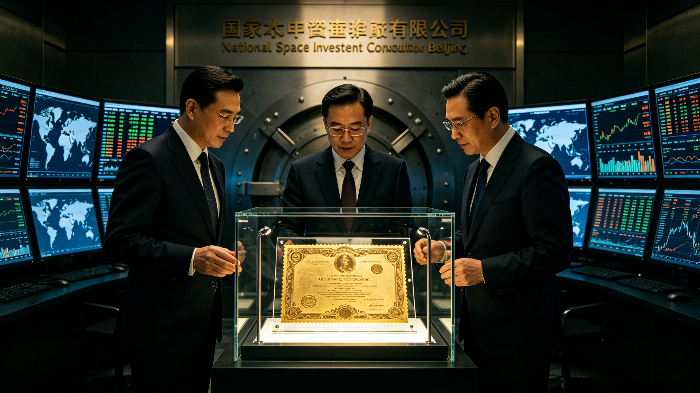

# 国家航天投资联合体关于比邻星光帆探测器超导电磁线圈专项国债发行决算书

**决算编号：** `BOND-SAIL-2047-SET01`
**发行决算日：** 2047年06月30日
**发行主体：** 国家航天投资联合体、财政部深空特别建设国债司
**债券全称：** 2047 年第一期跨恒星先导探测超导驱动基础设施专项建设国债（简称：“星帆国债一号”）
**募集总规模：** **1,200.00 亿元人民币**（30年期固息主权债券）
**卷内附证：** 两件

兹将本笔专项国债发行决算汇列如后。认购、拨付、清算三表相抵，回执存根与存柜登记附卷。

## 一、发行条款与利息偿付基线

| 条款 | 内容 |
|---|---|
| 核准发行总额 | 1,200.00 亿元（分三批次全额向全球央行及主权基金配售） |
| 票面年化固定利率 | 2.15%（由月面氦-3开采特许权税费刚性担保全额还本付息） |
| 债券存续期限 | 30 年期（2047—2077，刚好覆盖光帆制造、弹射及半途遥测） |
| 募集资金法定专款用途 | 100% 封闭用于地月L4相控阵激光器超导线圈研制与深空供电堆建造 |

为在 2049 年将人类首个微型探测器“微芒-01”加速至 0.15c 射向比邻星，地月L4轨道必须建造跨度达 1.2 公里的百兆瓦级相干激光发射相控阵。该工程需消耗超导钇钡铜氧线圈 4,200 吨、深空超薄热沉石墨烯板 18 万平方米。工程投资周期长达 15 年，常规商业风险投资无法承受无近期商业回报的漫长沉淀。国家决议发行首期“跨恒星先导专项主权国债”，依托国家信用实施代际平准化融资。

线圈工况一栏，另立规格：钇钡铜氧绕组装入杜瓦，全程由液氦与低温制冷机维持，工作温度须低于临界温度；冷却回路一断，线圈退出超导态，阵列停射。运输与存放同此温控要求，温控记录附卷。本卷所称超导，均指上述低温工况。

## 二、认购配额撮合与清算平账

| 序 | 承销认购收入项 | 金额（亿元人民币） |
|---|---|---|
| 1. | 亚洲主权财富基金（SWF）战略包销认购 | 480.00 亿元 |
| 2. | 欧洲外空科研开发联合银行定向认购 | 280.00 亿元 |
| 3. | 全球大宗矿业企业与民间商业航天企业优先配售 | 240.00 亿元 |
| 4. | 面向公众普惠发售之个人深空建设小额储蓄券 | 200.00 亿元 |
| — | 募集实收总额 | 1,200.00 亿元 |

| 序 | 工程专项建设资金拨付与冲抵项 | 金额（亿元人民币） |
|---|---|---|
| 1. | 地月L4高能相干光相控阵超导线圈烧结采购合同首付款 | 540.00 亿元 |
| 2. | 空间堆芯高浓缩核燃料棒采购与安全封装准备金 | 360.00 亿元 |
| 3. | 地面张江/西藏激光高能试验沉井配套基建拨付 | 200.00 亿元 |
| 4. | 债券发行手续费、区块链防伪公证及流动性平准储备 | 100.00 亿元 |
| — | 资金分配划拨总额 | 1,200.00 亿元 |

国债发行账务清算净差额（Balance）：0.00 亿元。

## 三、认购回执存根（附一件）

> **认购回执存根　卷内附证一**
> 券种：个人深空建设小额储蓄券（普惠发售一档，见认购表第 4. 项）。
> 券面：面额与序号打刻，编号略。骑缝处半枚戳记。
> 收款：柜台收讫，戳记一枚，墨迹一处偏斜。
> 偿付：30 年期，票面年化固定利率 2.15%，由月面氦-3开采特许权税费担保。
> 经办人签名略，认购人签名略。照准。回执交认购人收执，存根留卷。

存根联无备注栏。券既收讫，柜上不再问。

## 四、调拨清算单（原行摘录）

> 资金调拨清算单 · 2047 · 单据编号 SET01-拨-01（本卷局部号）
> 06月30日　地月L4相控阵超导线圈烧结采购合同首付款　拨付 540.00 亿元　清算：○
> 同批　线圈杜瓦与低温制冷机组运输温控记录　查两次，均在限内　○
> 收款方签收：签名略　复核：财政部深空特别建设国债司　照准
>
> 全年拨付四笔，逐笔勾稽。划拨总额与募集实收总额相抵，净差额 0.00 亿元。

## 五、到期兑付（预列）

30 年期，2047—2077。存续期内按年付息，付息凭月面氦-3开采特许权税费入账，逐期在登记簿勾选。本金到期兑付平账单于到期年度另立卷，本卷不预列。

## 六、样本券存柜登记（附一件）

> **样本券存柜登记　卷内附证二**
> 物件：镀金防伪债券样本一张，压于纯氮气展示柜内。
> 券面：刻一道自地球射向深空的细激光束。雕版与公章 `MOF-BOND-2047` 同版。
> 柜内：氮气充填，湿度读数一格，查两次，均在限内。
> 存柜人签名略。非卖品，不出柜。

## 七、签署确认

*财政部国债司司长：* **杜宪成**（公章：`MOF-BOND-2047`）
*国家航天投资联合体理事长：* **钱克勤**（签批印鉴）

两印骑缝，样本券与存根联同柜。

**记录人**：财政部深空特别建设国债司（签名略）
**日期**：2047年06月30日

（国债司注：1,200.00 亿元收讫，1,200.00 亿元拨出，净差额 0.00。券面那道细激光束，刻的是一克重帆船的头一段路；按现排期，到期那年它该已过了土星。柜里那张样本不出柜，本卷记到此为止。）
