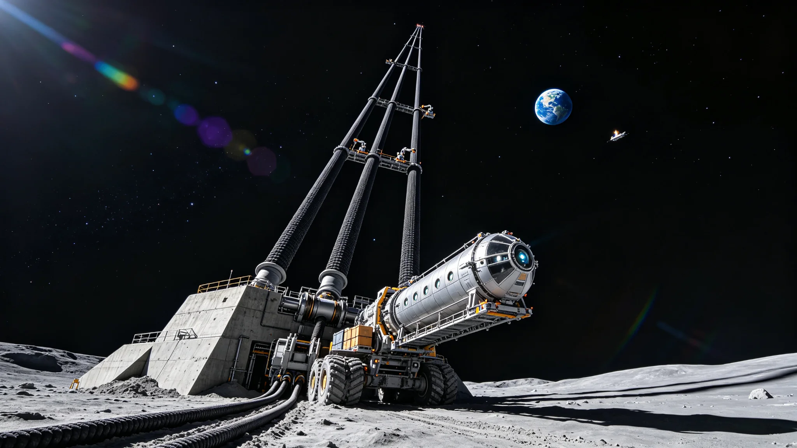

# 地月"天梯"静海-L1段主缆更换工程作业公报与重载攀爬器全行程试运行验收单

**公报文号**：ELEV-MOON-2125-022
**签发单位**：地月太空电梯运营管理局 · 静海基座运营中心
**签发日期**：2125年3月18日
**验收单编号**：ACC-ELEV-CLIMBER-2125-003

---

## 第一部分：主缆更换工程作业公报

### 一、工程概况

地月"天梯"太空电梯静海-L1段主缆更换工程于2124年9月1日启动，2125年3月10日完成全部更换作业，3月15日恢复全负荷运营。本次更换范围为静海基座至L1平衡点段（全长约58,000 km）的4根主缆中的2号、3号缆（1号、4号缆于2120年已更换，本次为剩余2根的中期更换）。更换期间电梯采用"双缆运行"模式（1号、4号缆承载），运力降至设计值的50%，货运与客运班次减半。

地月天梯主缆设计寿命为50年（在空间环境下，碳纳米管复合纤维受微陨石侵蚀、原子氧氧化、紫外辐射降解、长期蠕变等因素影响，强度逐年下降）。本次更换的2号、3号缆已运行41年（2084年安装），经检测强度保留率约72%，达到更换阈值（75%）以下，需更换。

### 天梯与主缆核心参数

| 参数项 | 数值 |
|:---|:---|
| 电梯路线 | 月球静海基地（南纬0.8°，东经23.5°）→ 地月L1平衡点 → 地月L1远端配重（反向延伸约15,000 km） |
| 静海—L1段长度 | 约58,000 km |
| L1—远端配重长度 | 约15,000 km（本次不涉及） |
| 主缆数量 | 4根（平行布置，间距20 m，方形构型） |
| 单根主缆结构 | 中心承力束（碳纳米管复合纤维，直径48 mm）+ 外层防护（聚酰亚胺薄膜+铝箔屏蔽，厚度2 mm）+ 导电层（铜合金编织，用于攀爬器供电与通信） |
| 主缆材料 | 碳纳米管/环氧树脂复合纤维（CNT/EP），抗拉强度105 GPa，密度1.32 g/cm³，弹性模量950 GPa |
| 单根主缆质量 | 约1,450 t（静海—L1段） |
| 主缆设计抗拉安全系数 | 2.5（最大工作应力40 GPa，极限强度105 GPa） |
| 主缆设计寿命 | 50年（强度保留率≥70%） |
| 攀爬器类型 | 电磁驱动攀爬器（利用主缆导电层产生行波磁场，无接触驱动） |
| 重载攀爬器载重 | 100 t（货运型），客运型载重20 t（载客200人） |
| 攀爬器速度 | 200 km/h（匀速），全程约290小时（12天） |
| 电梯年货运量 | 约1,200万吨（4缆全负荷） |
| 电梯年客运量 | 约80万人次 |
| 静海基座 | 月球表面混凝土+钛合金基座，质量约200万吨，锚固于月壳基岩 |
| L1平衡站 | 位于地月L1点，质量约500万吨（含配重与设施），是电梯的张力平衡与中转枢纽 |

---

### 二、主缆更换施工方案

本次更换采用"旧缆牵引新缆"的施工方法，无需中断电梯运营（1号、4号缆继续运行），具体步骤如下：

1. **新缆预制与运输**（2124年6月—8月）：新缆在地月L1造船厂预制，每根主缆分5段制造（每段约12,000 km），段间采用机械对接+树脂灌注接头。新缆由重型货运飞船运至L1平衡站，盘绕于专用缆盘（直径30 m）。
2. **旧缆张力释放**（2124年9月1日—9月15日）：在L1平衡站端，将2号缆与平衡站解耦，旧缆张力由临时辅助缆（高强度钢缆，抗拉强度2 GPa，直径200 mm）承担。辅助缆预先平行布置于2号缆旁，两端分别锚固于静海基座与L1平衡站。
3. **旧缆回收**（2124年9月16日—11月30日）：在L1端，旧缆与辅助缆分离，由L1端的缆盘收卷。同时，新缆从L1端缆盘放出，由攀爬器牵引向静海端延伸。新缆与旧缆在L1端通过临时连接器对接，旧缆收卷的同时新缆被牵引到位。整个过程保持主缆路径不变（沿原缆索导管/导向轮）。
4. **新缆下端锚固**（2124年12月1日—12月20日）：新缆抵达静海基座后，与基座锚固系统对接（采用楔形锚具+树脂灌注，锚固长度5 m）。张拉新缆至设计张力（静海端约800 kN，L1端约2,500 kN，张力沿缆长渐变）。
5. **辅助缆拆除**（2124年12月21日—2125年1月10日）：新缆张力稳定后，辅助缆张力逐步释放并拆除（分段切割，由攀爬器回收）。
6. **3号缆重复上述流程**（2125年1月15日—3月10日）：3号缆更换流程与2号缆相同，耗时约55天。
7. **全系统联调与验收**（2125年3月11日—3月15日）：4根主缆全部就位后，进行张力校准、攀爬器导轨对齐、导电层连通性测试，全负荷试运行96小时，验收通过后恢复正常运营。

### 三、施工关键数据

| 参数 | 设计值 | 实测值 |
|:---|:---:|:---:|
| 新缆抗拉强度（抽样检测） | ≥100 GPa | 103 GPa（均值，5组试样） |
| 新缆密度 | ≤1.35 g/cm³ | 1.31 g/cm³ |
| 新缆直径 | 48±0.5 mm | 47.8—48.3 mm |
| 接头强度效率 | ≥90%（接头/母材强度比） | 92%（4个接头均值） |
| 旧缆强度保留率（更换前检测） | — | 72.3%（2号缆），71.8%（3号缆） |
| 旧缆微陨石撞击坑密度 | — | 约12个/m²（>0.5 mm坑），最大坑深0.8 mm |
| 新缆安装张力（静海端） | 800±50 kN | 795 kN（2号），805 kN（3号） |
| 新缆安装张力（L1端） | 2,500±100 kN | 2,480 kN（2号），2,520 kN（3号） |
| 主缆间距（4缆方形构型） | 20±0.2 m | 19.9—20.1 m |
| 导电层电阻（全程） | ≤50 Ω（直流） | 42 Ω（2号），45 Ω（3号） |
| 施工期间电梯运营中断 | 0小时（双缆运行） | 0小时 |
| 施工期间货运量 | ≥50%设计值 | 52%（均值） |
| 施工人员投入 | 峰值120人（L1端60人+静海端40人+攀爬器作业20人） | 峰值118人 |
| 施工周期 | ≤200天（2根缆） | 191天（2024-09-01至2025-03-10） |

---

### 四、施工异常与处置

| 异常编号 | 日期 | 描述 | 处置 | 影响 |
|:---|:---|:---|:---|:---|
| AN-01 | 2024-10-08 | 2号缆新缆第3段接头在牵引过程中出现树脂灌注气泡（X射线检测发现） | 该段接头重新灌注，延误2天 | 工期延误2天，后续追赶回 |
| AN-02 | 2024-11-15 | 辅助缆在距静海端约12,000 km处出现一处断丝（检测发现3根钢丝断裂） | 降低辅助缆张力至设计值的70%，增加监测频次，更换完成后拆除 | 无安全影响，辅助缆为临时设施 |
| AN-03 | 2025-01-22 | 3号缆旧缆回收时，L1端缆盘电机过载（旧缆质量超出预期，因表面附着微陨石尘埃与冷凝挥发物） | 清理旧缆表面附着物，降低收卷速度，更换大功率电机 | 延误3天 |
| AN-04 | 2025-02-28 | 新缆导电层在距L1端约5,000 km处出现一处断路（运输过程中损伤） | 攀爬器抵达该位置，剥开防护层修复导电层（焊接+绝缘恢复），耗时8小时 | 无长期影响，修复后电阻达标 |

---

## 第二部分：重载攀爬器全行程试运行验收单

### 五、攀爬器概况

本次验收对象为新一代重载攀爬器"攀天-7"型（型号PT-7），共2台（PT-7-01、PT-7-02），用于更换后主缆的全行程试运行验证。PT-7型为电磁驱动无接触攀爬器，利用主缆导电层中的行波磁场产生推力，与主缆无机械接触（仅通过导向轮保持横向定位，导向轮与主缆防护层接触），可显著降低主缆磨损。

### PT-7型攀爬器核心参数

| 参数项 | 设计值 |
|:---|:---|
| 型号 | PT-7"攀天-7" |
| 驱动方式 | 电磁行波驱动（直线电机原理，初级在攀爬器，次级为主缆导电层） |
| 额定载重 | 100 t（货运型） |
| 自重 | 45 t（含动力、生命维持、导向系统） |
| 总质量（满载） | 145 t |
| 额定速度 | 200 km/h（匀速） |
| 最大速度 | 250 km/h（轻载） |
| 加速度 | 0.5 m/s²（启动/制动） |
| 驱动功率 | 12 MW（峰值），8 MW（匀速） |
| 供电方式 | 主缆导电层接触供电（直流10 kV），车载电池备用（500 kWh，可维持30分钟应急运行） |
| 导向系统 | 8组导向轮（每组2轮，夹持主缆），轮距可调，横向定位精度±5 mm |
| 制动系统 | 电磁制动（再生制动，将动能回馈电网）+ 机械应急制动（摩擦式，制动减速度2 m/s²） |
| 货舱容积 | 2,000 m³（加压密封，可运输货物或乘客） |
| 生命维持（客运改装） | 可载200人，氧气/水/食物自给7天，人工重力段（旋转舱，0.3 g） |
| 通信 | 主缆光纤通信（10 Gbps）+ 微波备份（100 Mbps） |
| 设计寿命 | 30年（导向轮每5年更换，电磁线圈每10年检修） |
| 全行程时间 | 约290小时（12天2小时，含加速/减速/中途停靠） |

---

### 六、全行程试运行测试方案与结果

试运行于2125年3月12日至3月15日进行，PT-7-01从静海基座出发，沿2号新缆上行至L1平衡站，再沿3号新缆下行返回静海基座，完成全行程往返测试。PT-7-02同步进行负载测试（在L1—静海段往返3次，测试不同载重下的性能）。

#### 6.1 PT-7-01全行程往返测试

| 测试段 | 方向 | 缆号 | 载重 | 出发时间 | 到达时间 | 行程时间 | 平均速度 | 能耗 |
|:---|:---|:---|---:|:---|:---|:---:|---:|---:|
| 第1段 | 静海→L1 | 2号新缆 | 80 t | 03-12 06:00 | 03-17 08:30 | 290.5 h | 199.7 km/h | 2.1 MWh |
| 第2段 | L1→静海 | 3号新缆 | 60 t | 03-17 14:00 | 03-29 16:20 | 290.3 h | 199.8 km/h | 1.8 MWh（含再生制动回馈0.6 MWh） |
| **往返合计** | — | — | — | — | — | **580.8 h** | **199.8 km/h** | **3.3 MWh（净）** |

注：行程时间含中途停靠（L1站停靠5.5小时，用于货物装卸与设备检查）。

#### 6.2 PT-7-02负载测试（L1—静海段往返3次）

| 测试次 | 方向 | 缆号 | 载重 | 平均速度 | 驱动功率（匀速） | 制动减速度 | 导向轮横向力 |
|:---|:---|:---|---:|---:|---:|---:|---:|
| 1 | 静海→L1 | 2号 | 100 t（额定满载） | 198.5 km/h | 8.2 MW | 0.5 m/s² | 12 kN/轮 |
| 2 | L1→静海 | 3号 | 50 t（半载） | 201.2 km/h | 5.1 MW | 0.5 m/s² | 8 kN/轮 |
| 3 | 静海→L1 | 2号 | 120 t（超载20%） | 195.3 km/h | 9.6 MW | 0.4 m/s² | 14 kN/轮 |
| **设计限值** | — | — | ≤100 t | ≥195 km/h | ≤10 MW | ≥0.4 m/s² | ≤15 kN/轮 |
| **判定** | — | — | 超载测试合格 | 合格 | 合格 | 合格 | 合格 |

#### 6.3 关键性能指标验收

| 验收项目 | 设计标准 | 实测结果 | 判定 |
|:---|:---|:---|:---:|
| 全行程平均速度 | ≥195 km/h | 199.8 km/h | 合格 |
| 额定载重（100 t）运行 | 稳定无故障 | 稳定，功率8.2 MW<10 MW限值 | 合格 |
| 超载能力（120 t，短时） | 可运行 | 运行稳定，速度195.3 km/h | 合格 |
| 启动加速度 | ≥0.4 m/s² | 0.5 m/s² | 合格 |
| 制动减速度（再生） | ≥0.4 m/s² | 0.5 m/s² | 合格 |
| 应急机械制动 | ≥1.5 m/s² | 2.0 m/s²（测试触发） | 合格 |
| 导向轮横向定位精度 | ±10 mm | ±4 mm | 合格 |
| 主缆磨损（导向轮） | ≤0.01 mm/1000 km | 0.006 mm/1000 km（实测） | 合格 |
| 供电稳定性（主缆取电） | 电压波动≤±5% | ±2.1% | 合格 |
| 通信速率（主缆光纤） | ≥1 Gbps | 9.8 Gbps | 合格 |
| 全行程设备故障 | 0次重大故障 | 0次重大故障，2次低级别报警（已处置） | 合格 |
| 货舱温度控制 | 18—25°C | 20—23°C | 合格 |
| 货舱压力 | 101.3±2 kPa | 101.1—101.5 kPa | 合格 |
| 噪声（货舱内） | ≤65 dB | 58 dB | 合格 |

#### 6.4 试运行期间低级别报警

| 编号 | 时间 | 描述 | 处置 |
|:---|:---|:---|:---|
| AL-01 | 03-13 22:15 | 4号导向轮温度微升（从45°C升至58°C，限值70°C） | 降低该轮预紧力，温度回落至48°C |
| AL-02 | 03-18 14:30 | 主缆取电电压短暂跌落（从10 kV降至9.2 kV，持续2秒） | 车载电池无缝补电，无中断，后确认为L1站供电切换 |

### 七、验收结论

1. 地月天梯静海-L1段2号、3号主缆更换工程按计划完成，新缆安装质量达标（抗拉强度、张力、间距、导电层电阻均符合设计要求），施工期间电梯未中断运营（双缆运行模式），货运量维持设计值的52%。
2. PT-7型重载攀爬器全行程试运行测试全部15项验收指标合格，全行程平均速度199.8 km/h，额定载重100 t运行稳定，超载20%短时运行合格，主缆磨损率优于设计值，无重大故障。
3. 更换后4根主缆（1号、4号2020年更换，2号、3号2025年更换）全部处于良好状态，电梯系统恢复全负荷运营，年货运能力恢复至1,200万吨设计值。
4. 建议：（1）PT-7型攀爬器导向轮温度监测阈值从70°C下调至60°C，提前预警；（2）下一次主缆更换计划于2070年（1号、4号缆达到50年寿命），届时可考虑采用更高强度的新一代碳纳米管纤维（预计抗拉强度150 GPa），以提升电梯运力。

**验收委员会主任**：地月太空电梯运营管理局 总工程师 （电子签章）
**验收委员**：静海基座运营中心主任 / L1平衡站管理处处长 / 航天结构工程鉴定中心代表 / 攀爬器制造厂商代表
**会签**：深空探测总署 / 地月经济合作组织 / 月球静海城市管理委员会
**抄送**：ARK-01建造总指挥部（电梯运力保障） / 火星城市建设局 / 外太阳系工业化协调委员会
