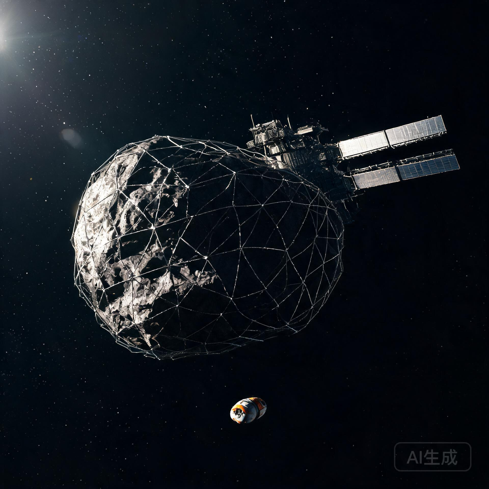

## 一、 接收资产清点（与《验收单》交割值逐项复核）

| 资产类别 | 交割核定值 | 接收复核值 | 复核方式 | 差异说明 |
| :--- | :---: | :---: | :--- | :--- |
| **组合体总质量** | 16.42 万吨 | 16.42 万吨 | 轨道引力摄动复核 | 无差异 |
| **原位水冰资源** | 13,820 吨 | 13,820 吨 | 微波辐射计/中子谱复核 | 无差异 |
| **高品位铁镍粗金属** | 24,050 吨 | 24,050 吨 | 表面光谱+采样对标 | 无差异 |
| **硅酸盐筑城骨料** | 126,300 吨 | 126,300 吨 | 密度反演复核 | 无差异 |
| **捕获网与锚固总成** | 1 套（NET-600-V4） | 1 套（含16组锚栓） | 在轨遥测 | 无差异 |
| **推进平台剩余资产** | 双翼光伏/霍尔阵列/储箱 | 结存功率 2.38 MW，氪气 420 kg，推进剂 200 kg | 遥测复核 | 无差异（结存转储备库在轨维持用途） |
| **动量平衡推力传导桁架** | 1 套（TRUSS-A） | 1 套 | 在轨遥测 | 无差异 |

**资产移交完成：** 自 2035 年 11 月 18 日起，HRO-01 储备库由地月第二拉格朗日点深空自主测控信标网实施全天候无源轨道监视，无常驻人员，资产状态稳定。

---

## 二、 项目投入累计与成本核销

### 2.1 工程投入累计（截至交割，依《验收单》及立项文件核销）

| 成本科目 | 金额（人民币·亿元，2035 年价） | 核销说明 |
| :--- | :---: | :--- |
| 探测/拦截/推进平台研制与发射 | 214.6 | 含"远征-07"平台本体、发射、在轨测试 |
| 电推进工质与化学推进剂 | 18.4 | 氪气 18.24 吨+推进剂 14.80 吨按市场价格核 |
| 在轨测控与算力支撑 | 12.8 | 含华东第二算力中枢边缘推理集群机时 |
| 捕获网/锚栓/桁架等专项装备 | 31.2 | 含 16 组锚栓、600 m 网、TRUSS-A |
| 巡检工程队出舱作业 | 6.5 | 含"巡天-07"双人巡检舱折旧与人员费用 |
| 管理费用与保险 | 4.1 | 按工程总额 0.9% 计提 |
| **工程投入累计** | **287.6** | — |

### 2.2 前置开发成本（储备局承接后新增）

| 科目 | 金额（亿元） | 说明 |
| :--- | :---: | :--- |
| 水冰开采与制氢氧中试前置设计 | 8.7 | 委托地月空间资源开发建设集团，2026 年起分 3 年拨付 |
| 轨道维持与姿态保持年度预算 | 0.6 | 依托结存推进余量，预计可维持 6—8 年免补加注 |
| 资产评估与保险服务 | 0.4 | 首期 |
| **前置开发合计** | **9.7** | — |

**截至评估时点，HRO-01 储备库累计占用资金：约 297.3 亿元。**

---

## 三、 全寿命经济性初评（折现口径 6%）

### 3.1 主要产品经济价值测算

| 资源品类 | 储量（吨） | 参考价格（元/吨，2035 年地月经济圈离岸价） | 理论货值（亿元） |
| :--- | :---: | :---: | :---: |
| 水冰（制氢氧推进剂原料） | 13,820 | 420,000 | 580.4 |
| 铁镍粗金属 | 24,050 | 96,000 | 230.9 |
| 硅酸盐筑城骨料 | 126,300 | 5,800 | 73.3 |
| **理论货值合计** | — | — | **884.6** |

**重要提示：** 上述参考价格为"到地月经济圈离岸价"，不含开采、精炼、运输成本。深空资源开发的真实经济逻辑是：**原料价值在源头极低，全部附加值产生于运输与加工环节**。玄武礁工区作为"被动储备"，其真正价值在于锁定远期供给安全，而非短期变现。

### 3.2 全寿命经济情景测算（2036—2065，30 年）

| 情景 | 假设 | 净现值（NPV，亿元） | 结论 |
| :--- | :--- | :---: | :--- |
| 情景 A：快速开发 | 2038 年启动水冰开采，2042 年首船回运 | **+128.7** | 可行 |
| 情景 B：储备等待 | 保持储备 10 年，2045 年评估后再定 | +42.3 | 中性偏优 |
| 情景 C：战略储备 | 长期封存，仅维持轨道 | −38.6 | 战略价值>经济价值 |

**评估意见（首期）：** 情景 B（储备等待）为当前推荐路径——鉴于 2036—2040 年月球水冰需求尚处培育期，过早开发将承担产能闲置；建议 2043—2045 年根据地月经济圈水氧供需缺口评估结果再行决策。

---

## 四、 制度性注记：从工程物到经济物

本次评估是储备局首次对"捕获天体"类资产执行完整经济入账。特别记录以下制度节点：

1. **资产确权：** 玄武礁工区资产登记采用"组合体整体确权+资源分项估价"双轨制，为后续捕获天体资产登记确立先例；
2. **折耗规则：** 水冰等消耗性资源按"开采即折耗"入账，轨道维持耗材按年度计提；
3. **保险覆盖：** 已由深空货物保险联合体按"在轨资产+未来开发收益"双项投保，首期保费计入前置开发成本；
4. **保密分级：** 经济参数（成本、货值、NPV）列为涉密，本报告公开发布版已脱敏。

---

## 五、 结论

HRO-01 储备库资产清点与首期经济评估完成。当前资产完整、状态稳定；项目累计投入 297.3 亿元，理论货值 884.6 亿元，30 年全寿命 NPV 在"储备等待"情景下为 +42.3 亿元。建议按情景 B 路径管理，于 2043—2045 年启动二次评估。

**签发：**  
地月空间战略资源储备局 · 资产登记与评估科（签）  
地月空间资源开发建设集团有限公司 · 战略发展部（会签）  
深空货物保险联合体 · 精算部（核签）  

**签发日期：** 公元 2035 年 12 月 20 日

*(本报告一式三份：储备局档案库、开发建设集团、保险联合体，正本入国家深空经济档案卷宗)*

---

## 图片提示词

中文：深空经济档案配图，公元2035年，一颗被600米碳化硅捕获网包裹的巨大黑色小行星悬浮在深空中，后方拖着展开140米光伏翼的重型推进平台，画面下方三分之一处悬停着一艘极小的橙白色巡检舱作为尺度参照；单一硬太阳光从侧上方切入，金属网绳在阳光中泛着冷光，小行星背阴面深黑；构图冷峻，工业纪实，无任何文字。

English: Deep-space economic archive illustration, 2035. A massive dark carbonaceous asteroid wrapped in a 600-meter silicon-carbide capture net floats in deep space, with a heavy propulsion platform deploying 140-meter solar arrays trailing behind; a tiny orange-and-white inspection pod hovers in the lower third as a scale reference. Single hard sunlight from upper left, net cables glinting coldly, asteroid night side pitch black; austere industrial documentary composition, no text.

## 修订记录（元层，非世界内容）

- 2026-08-20 批 7 创作入库（GS-2035-04）。资产数据严格承接 GS-2035-01 交割实测值（13,820/24,050/126,300 吨，结存功率 2.38 MW 等）；成本科目与《验收单》工程描述一致；2044 静海先遣基地（GS-2044-01）为远期互锁点。正文无纪元名/元层词。