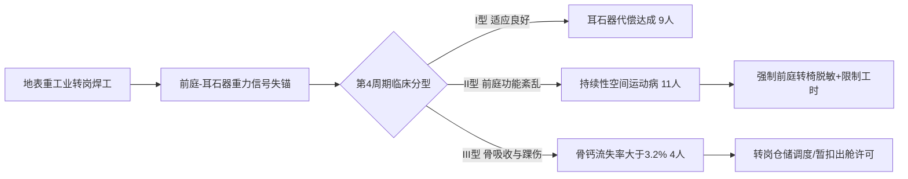

# 地月L1前哨组装站首期地表转岗焊工低重力适应与前庭神经脱敏第04号监测公报

**文件编号**：EM-L1-2033-MED-004  
**签发单位**：地月第一拉格朗日点「鲁班一号」总装船坞工程医务保障连  
**监测周期**：2033年08月15日 — 2033年09月15日（第4适应周期 / 累积在轨第112天）  
**受检样本**：原上海长兴岛造船基地转岗高空/水下特种特级焊工班组（编制24人，实检24人）  
**密级状态**：内部工程公文 / 工伤补偿核算底册  

---

## 一、监测背景与工况环境

本班组人员系2033年5月根据《重工业劳务分流与深空工程骨干安置协议》首批整建制转岗至地月L1前哨的特种结构焊接工。主要负责「鲁班一号」外层空间太阳能微波反射桁架的超高真空电子束点焊与氩弧补强作业。

作业环境残余重力梯度为 $0.018g \sim 0.025g$。作业人员全员穿戴第一代增压作业服，舱内巡检与轨道桁架固定行走主要依靠鞋底内置 8.5 kg 灌铅配重及鞋跟双联永磁吸附卡爪。

---

## 二、生理指标监测统计与异动分析

### 1. 前庭神经自主反应与空间运动病（SMS）
- **完全适应组（I型）**：9人（37.5%）。前庭眼动反射（VOR）增益恢复至正常范围（$0.85 \sim 1.02$），可在失重下连续作业 4 小时无恶心及定向障碍。
- **迟滞适应组（II型）**：11人（45.8%）。在头部快速俯仰（>45°/s）时仍出现前庭功能不协调性眼震，作业后伴有中度冷汗及食欲减退；目前采用甲磺酸倍他司汀滴鼻剂维持。
- **严重不适应组（III型）**：4人（16.7%）。出现顽固性重力失锚错觉（自我感知倒悬），其中 2 人在出舱焊接时发生急性空间定向丧失，已被临时限制高空桁架单人作业。

### 2. 负重行走与骨骼关节磨损统计
为对抗微重力漂浮，焊工班组每日舱内行走平均强制穿戴灌铅配重靴（8.5 kg/双）达 6.2 小时。监测显示：
- **跟腱与踝关节滑囊炎**：发生率达 70.8%（17/24）。由于缺乏地表反作用力缓冲，磁吸底板撞击刚性甲板导致足跟跟骨结节处反复受挫。
- **骨钙流失与松质骨密度变化**：双能X射线骨密度仪（DEXA）检测显示，跟骨与第三腰椎骨矿物质密度月均下降 $1.28\% \pm 0.35\%$；其中工号 `SH-ORB-2038-0419`（陈初九）跟骨骨矿密度四周期累计下降 $4.1\%$，伴随足舟骨轻微应力性微裂纹。

---

## 三、典型个案监测摘要

| 工号 | 姓名 | 原工种/工龄 | 累计出舱焊时 | 前庭评分 (0-10) | 骨钙异常标记 | 医务处理意见 |
|:---|:---|:---:|:---:|:---:|:---:|:---|
| SH-ORB-2033-0102 | 刘大勇 | 水下管焊 / 14年 | 148 h | 8.5 (优) | 正常偏低 (-1.1%) | 维持全负荷出舱作业 |
| SH-ORB-2033-0115 | 赵广胜 | 船坞总装 / 9年 | 92 h | 4.2 (差) | 骨吸收加剧 (-3.4%) | 停工舱内脱敏7天 |
| **SH-ORB-2038-0419** | **陈初九** | **特种电焊 / 8年** | **164 h** | **6.1 (中)** | **应力微裂 (-4.1%)** | **暂扣磁吸配重靴，改用限位滑轨缆绳；补充降钙素** |
| SH-ORB-2033-0121 | 孙立新 | 龙门吊装 / 11年 | 80 h | 3.8 (差) | 正常 (-0.9%) | 调离高空装配转入气闸内质检 |

---

## 四、医务连处置与制度建议

1. **工时熔断干预**：对骨钙流失率超过 3.0%/月的作业人员，强制执行单周出舱作业不得超过 18 小时的红线，并强制每日在离心短臂训练器（0.5g/45min）上进行抗阻训练。
2. **作业护具改进**：建议总装指挥部立即报废第一代全硬质磁吸铅靴，在鞋垫夹层加装硅胶阻尼缓震垫，以降低跟骨应力骨折风险。
3. **劳务档案备注**：上述 24 名转岗焊工之骨密度及前庭数据已录入《地月低重力特种劳工健康监护系统》，作为后续申领离地津贴及工伤评级之法定底册。

---

**记录医师**：主治军医 陆振华（签章）  
**工区复核**：鲁班一号医务保障连连长 钱克明（签章）  
**报送抄送**：地联深空工程总署第二外场指挥部、上海长兴劳务流转办事处
