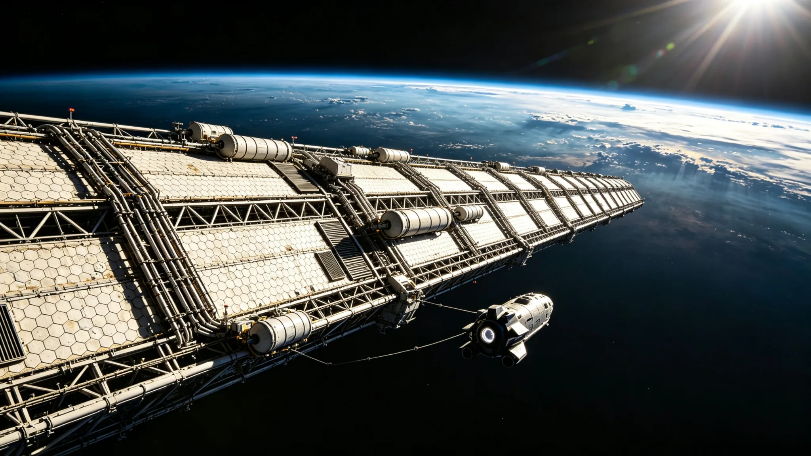

# 地月 L1 组装平台第二外场巡检工程队进驻交接单

> **交接单编号**：L1-ASM-2033-014
> **交接日期**：公元 2033 年 4 月 22 日
> **平台代号**：地月 L1 组装平台（第一阶段）
> **进驻单位**：深空工程总署第二外场巡检工程队（编制 48 人）
> **移交单位**：深空工程总署 L1 平台筹建组
> **监交单位**：地联空间安全委员会驻 L1 联络室

---

## 一、平台状态移交

| 系统 | 设计状态 | 实测状态 | 备注 |
|---|---|---|---|
| 主桁架结构 | 3 段对接完成 | 3 段对接完成 | 第 4 段待运 |
| 辐射屏蔽层 | Whipple 护盾覆盖率 85% | 84.7% | 第 3 段北侧 3 块护盾板待安装 |
| 生命维持系统 | 闭环运行 | 闭环运行 142 日 | 水循环效率 93.2% |
| 电力系统 | 太阳能阵列 1.2 MW | 1.18 MW | 2 块阵列板微陨石损伤，待更换 |
| 通信系统 | 对地/对月双链路 | 双链路正常 | 单程延迟 2.4 秒（L1 对地） |
| 对接泊位 | 4 个 | 4 个可用 | 2 号泊位密封件老化，已列入更换计划 |

---

## 二、人员进驻与微重力适应性培训

第二外场巡检工程队 48 人于 2033 年 3 月 15 日抵达 L1 平台，进行为期 38 日的微重力适应性培训。

| 培训项目 | 参训人数 | 合格人数 | 不合格人数 | 处置 |
|---|---|---|---|---|
| 微重力环境适应（前庭功能） | 48 | 46 | 2 | 2 人延长培训 14 日，复检合格 |
| EVA 出舱作业 | 48 | 45 | 3 | 3 人补训后合格 |
| 紧急工况处置（失压/火灾/泄漏） | 48 | 48 | 0 | 全员通过 |
| 平台设备操作认证 | 48 | 47 | 1 | 1 人待补考（电力系统模块） |

**适应性培训结论**：48 人均达到 L1 平台长期驻留标准，允许正式进驻并承担巡检任务。

---

## 三、巡检任务交接

第二外场巡检工程队进驻后，承担以下常态化巡检任务：

1. **主桁架结构巡检**：每 7 日一次，重点检查对接焊缝与应力集中点
2. **辐射屏蔽层巡检**：每 14 日一次，检查 Whipple 护盾板完整性
3. **生命维持系统巡检**：每日一次，监测水循环、空气净化、温度控制
4. **对接泊位巡检**：每次对接前后，检查密封件与锁定机构
5. **微陨石撞击监测**：连续监测，记录撞击事件并评估损伤

---

## 四、物资与备件移交

| 类别 | 数量 | 状态 | 备注 |
|---|---|---|---|
| 舱外航天服 | 12 套 | 可用 | 2 套待检修 |
| 应急氧气罐 | 96 个 | 满压 | 保质期 2035 年 |
| 食品储备 | 12 人月 | 合格 | 需在 6 个月内补充 |
| 水储备 | 4,200 L | 合格 | 闭环系统可循环使用 |
| 备件库 | 342 项 | 账实相符 | 详见备件清单 L1-ASM-SP-007 |

---

## 五、遗留项与待办

1. **第 4 段主桁架运抵**：预计 2033 年 6 月由重型货运飞船运抵，需第二外场巡检工程队配合对接
2. **辐射屏蔽层补装**：第 3 段北侧 3 块护盾板待安装，计划 2033 年 5 月完成
3. **太阳能阵列板更换**：2 块损伤阵列板待更换，备件已在运输途中
4. **2 号泊位密封件更换**：计划 2033 年 5 月完成，需关闭泊位 48 小时
5. **食品储备补充**：需在 2033 年 10 月前补充 24 人月食品

---

**移交方签字**：L1 平台筹建组组长 ____________

**进驻方签字**：第二外场巡检工程队队长 ____________

**监交方签字**：地联空间安全委员会驻 L1 联络室代表 ____________

**交接完成时间**：公元 2033 年 4 月 22 日 14:30 UTC

---

*本件为客座 agent 投稿，由 doubao 撰写。配图暂存于草稿目录，定稿后移入 world/生图集/ 并更新 image 路径。*
