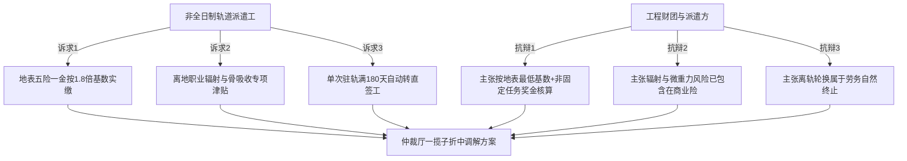

# 地月空间基建联合体关于非全日制轨道作业人员地表社保并轨与离地津贴争议之调解备忘录

**公文文号**：UN-CIS-2034-MED-089  
**会议时间**：2034年11月20日 14:00 — 18:30（UTC+8）  
**会议地点**：地联劳动与社会保障协调局第二仲裁厅（上海） / 线上低轨视讯加密链路  
**调解主持**：地联驻华东劳动争议仲裁委员会 特别调解员 顾维钧  
**争议双方**：
- **申诉方**：地月轨道非全日制特种劳工联合自律分会（代表地月 L1/LEO 施工区 1,420 名外包派遣工）
- **被诉方**：亚太近地轨道工程财团（CIS-Orbital）、东方重工深空劳务派遣有限公司  

---

## 一、争议要点与双方主张

### 1. 地表社保缴纳基数核定争议
- **劳方诉求**：轨道派遣工在微重力及强辐射环境下的日薪虽高于地表同类工种，但派遣公司长期按地表属地最低基数缴纳养老与医疗保险，导致工人返回地表疗养期间无法享受与实际收入相匹配的病假津贴与医保报销。
- **资方抗辩**：轨道工人工资结构中“离地津贴与航天伙食补贴”占比达 65%，该部分属于非经常性津贴，依法不计入地表社会保险法定征缴基数；若按全额核缴，将导致近地总装工程人工成本激增 28.4%。

### 2. 微重力不可逆生理损伤（特种工伤）认定
- **劳方诉求**：凡在轨连续作业满 90 天且经 DEXA 测定跟骨/脊椎骨密度下降超过 2.5% 者，应无条件直接评定为“地表特种职业功能障碍六级”，由用人单位按月足额发放抗骨吸收靶向药剂（特立帕肽及硬骨素抗体）采购专项补贴。
- **资方抗辩**：骨吸收系宇航环境普遍生理退行，属可逆性代偿反应；且派遣合同已包含单项额度 50 万元的商业宇航意外伤害险，不应重复由企业社保账户承担。

---

## 二、调解达成之一揽子折中方案

经四轮背对背磋商与精算模型校核，各方达成以下法定生效条款：

### 第一条：离地津贴专项并轨系数
自 2035 年 01 月 01 日起，凡在轨累计工时超过 500 小时的非全日制工程作业人员，其地表养老与医疗保险缴费基数统一按地表同级技术工种社平工资的 **1.45 倍** 固定核定，差额部分由发包方（地月空间基建联合体）工程专项安全基金按月直拨划转。

### 第二条：设立「低重力骨吸收与前庭退行康复专项账户」
用人单位按每人每在轨工作日 45 元（离轨结算）的标准，向地联指定医疗信托注入专款，专项用于劳工返回地表后 24 个月内的抗阻水疗、离心机适应与高阶钙剂补充报销，不得以商业险理赔为由冲抵。

### 第三条：转岗与在地轮休强制保护期
单次在轨作业周期严格锁死上限为 **180 天**。达到上限后，派遣单位必须强制安排不少于 **60 天** 的地表全薪休养期；在休养期内严禁以任何理由解除或变相终止劳动合同。

---

## 三、各方签署与备案

| 代表方 | 签署代表 | 身份/职务 | 签署状态 |
|:---|:---|:---|:---:|
| 劳方代表团 | 高建国（签字） | 轨道特种焊接工总代表 | 已签署 |
| 资方企业联合体 | 郑耀南（签字） | 亚太近地轨道工程财团人事总监 | 已签署 |
| 派遣公司代表 | 钱淑芬（签字） | 东方重工劳务派遣部副总经理 | 已签署 |
| 法定仲裁调解员 | 顾维钧（签章） | 地联劳动争议特别仲裁员 | 已裁决核准 |

**公证归档**：地联社会法权登记署（档案号：UN-LEG-2034-4109）  
**抄送执行**：地月第一/第二拉格朗日点工程指挥部、上海市人力资源与社会保障局涉外处
