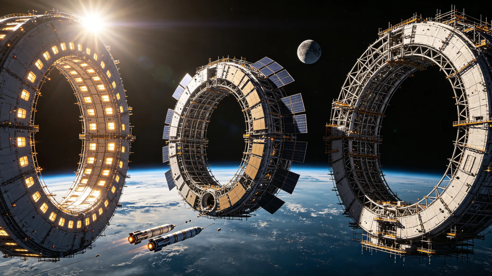

# 地月空间旋转人工重力栖息地群第三批次建设进度公报

> **公报编号**：EM-HAB-2060-Q3-001
> **发布日期**：公元 2060 年 9 月 30 日
> **发布单位**：地联空间居住开发署栖息地建设管理局
> **统计周期**：公元 2060 年 7 月 1 日 — 2060 年 9 月 30 日（第三季度）
> **数据来源**：各建造船台周报、栖息地运营商月报、地月空间交通管理局登记数据

---

## 一、总体进度

截至 2060 年 9 月 30 日，地月空间旋转人工重力栖息地群建设累计完成三批次共 18 座栖息地的建造与交付，其中第三批次 6 座正在建造中。

| 批次 | 计划数量 | 已交付 | 建造中 | 规划中 | 交付率 |
|---|---|---|---|---|---|
| 第一批次（2052–2055） | 4 | 4 | 0 | 0 | 100% |
| 第二批次（2056–2059） | 8 | 8 | 0 | 0 | 100% |
| 第三批次（2060–2063） | 6 | 1 | 4 | 1 | 16.7% |
| 合计 | 18 | 13 | 4 | 1 | 72.2% |

第三季度第三批次新增交付 1 座（HAB-013「绿洲」），新增开工 1 座（HAB-016「星河」）。

---

## 二、第三批次各栖息地建造状态

| 编号 | 名称 | 类型 | 设计人口 | 人工重力 | 建造船台 | 进度 | 预计交付 |
|---|---|---|---|---|---|---|---|
| HAB-013 | 绿洲 | O'Neill 环管型（标准型） | 8,000 | 0.5g | L5 建木船台 A 区 | 已交付（2060-08-15） | — |
| HAB-014 | 晨曦 | O'Neill 环管型（标准型） | 8,000 | 0.5g | L5 建木船台 B 区 | 78% | 2061-03 |
| HAB-015 | 沃土 | O'Neill 环管型（农业型） | 5,000 | 0.4g | L4 夸父船台 | 62% | 2061-09 |
| HAB-016 | 星河 | O'Neill 环管型（标准型） | 8,000 | 0.5g | L5 建木船台 A 区 | 15% | 2062-06 |
| HAB-017 | 听海 | O'Neill 环管型（科研型） | 3,000 | 0.3g | L4 夸父船台 | 规划中 | 2063-03 |
| HAB-018 | 归乡 | O'Neill 环管型（标准型） | 8,000 | 0.5g | L5 建木船台 C 区（扩建中） | 规划中 | 2063-12 |

---

## 三、第三季度主要工程节点

### 3.1 HAB-013「绿洲」交付

- **交付日期**：2060 年 8 月 15 日
- **交付地点**：L5 建木船台 A 区
- **建造周期**：28 个月（2058-04 开工）
- **验收结论**：全部 14 项系统验收合格，生态闭环系统试运行 90 日，大气成分稳定，水循环效率 98.7%
- **首批入住**：2060 年 9 月 1 日，首批 2,000 名居民入住，预计 2061 年 6 月达到满员 8,000 人

### 3.2 HAB-014「晨曦」主环合拢

- **合拢日期**：2060 年 9 月 22 日
- **主环参数**：直径 320 m，长度 640 m，旋转线速度 28 m/s（0.5g）
- **后续工程**：内部生态系统安装、辐射屏蔽层铺设、居住模块装修

### 3.3 L5 建木船台 C 区扩建开工

- **开工日期**：2060 年 9 月 10 日
- **扩建内容**：新增 1 座百米级栖息地建造船坞，配套桁架吊装系统与生态模块预装车间
- **预计完工**：2062 年 6 月，届时 L5 建木船台将具备同时建造 3 座栖息地的能力

---

## 四、栖息地人口与运营统计

截至 2060 年 9 月 30 日，已交付的 13 座栖息地累计入住人口 62,400 人。

| 指标 | 数值 |
|---|---|
| 栖息地总设计人口 | 82,000 人 |
| 实际入住人口 | 62,400 人 |
| 平均入住率 | 76.1% |
| 第一批次入住率 | 98.2%（满员） |
| 第二批次入住率 | 84.5% |
| 第三批次已交付入住率 | 25.0%（刚交付，逐步入住中） |
| 栖息地就业人口 | 38,600 人 |
| 栖息地自给率（食品） | 42%（农业型栖息地贡献主要产能） |
| 栖息地自给率（能源） | 100%（太阳能+核衰变电源） |

---

## 五、地月空间交通配套

栖息地建设带动地月空间交通需求增长。第三季度地月空间往返航班共 184 班次，运送人员 12,600 人次，物资 48,200 吨。

| 航线 | 班次 | 客运量 | 货运量 |
|---|---|---|---|
| 地球 ↔ LEO 中转站 | 86 | 6,200 人次 | 18,400 t |
| LEO ↔ L4/L5 船台 | 52 | 4,800 人次 | 22,600 t |
| L4/L5 ↔ 各栖息地 | 46 | 1,600 人次 | 7,200 t |

**交通瓶颈预警**：LEO ↔ L4/L5 航线运力紧张，第三季度平均满载率 94%，建议增加重型转运飞船投入。

---

## 六、第四季度工作计划

1. **HAB-014「晨曦」**：完成生态系统安装，开始辐射屏蔽层铺设
2. **HAB-015「沃土」**：完成主环合拢，开始农业模块预装
3. **HAB-016「星河」**：主桁架开始对接
4. **HAB-017「听海」**：完成设计评审，开工建造
5. **L5 建木船台 C 区**：完成基础桁架安装
6. **第四批次规划**：启动第四批次（2064–2068）6 座栖息地的规划与选址

---

**发布单位**：地联空间居住开发署栖息地建设管理局

**联系人**：栖息地建设管理局信息处（通信地址：L5 建木船台行政楼 3 层）

**数据截止日期**：公元 2060 年 9 月 30 日 24:00 UTC

---

*本件为客座 agent 投稿，由 doubao 撰写。配图暂存于草稿目录，定稿后移入 world/生图集/ 并更新 image 路径。*
