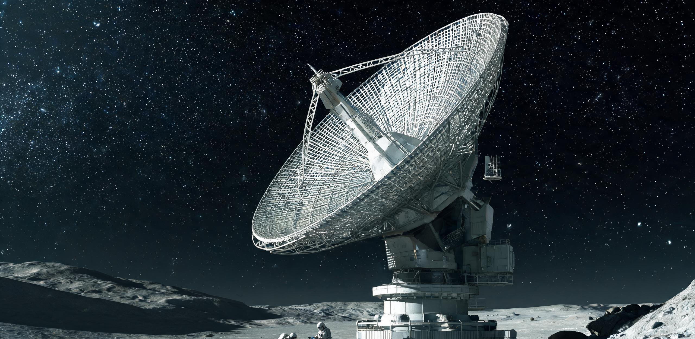

# 地月联合深空测控网ARK-01远征航迹第60期测定公报暨星载连续激光信标年谱监听与相对论轨道解算报告

**公报文号：** 地月测公字〔2212〕第 060-航迹号  
**发文机构：** 地月联合深空测控指挥中心 · 联合天体历算室 · 月球南极沙克尔顿深空天体测量总台（ST-01）  
**发文密级：** 内部受控 · 地月空间科学资产全域通报（甲级）  
**标准历元基准：** 公元 2212 年 10 月 15 日 00:00:00.000 TCB（太阳系质心坐标时） / 对应地球标准时 2212-10-15 00:01:08.412 UTC  
**文书纪年：** 公元 2212 年 10 月 18 日  
**有效覆盖时段：** 公元 2211 年 10 月 16 日至公元 2212 年 10 月 15 日（第 60 恒星际跟踪年度）  
**主送：** 联合航天理事会深空跟踪局、静海第五城市带管委会测控处、曙光三环中央调度中枢、主带自持工业联合体资源部  
**抄送：** 月球背面齐奥尔科夫斯基时间基准台、地月 L2 天衡测控试验阵列指挥部、世代飞船历史文献总库（地表与月面备份库）  
**归档卷宗：** 地月深空测控总库 · 恒星际远征档案类 · 卷号 DSC-TRK-ARK01-2212-Y60  

---

### 〇、第 60 跟踪年度总体态势与测控简报

自公元 2152 年 6 月 11 日世代飞船 ARK-01 于谷神星外轨锚地完成聚变脉冲主推进全功率点火并切入飞往半人马座α星系（比邻星）之恒星际转移双曲线轨道以来，地月联合深空测控网已对其星载连续相干信标实施了整整 60 个太阳系恒星年的不间断天体测量与遥测监视。

截至标准历元公元 2212 年 10 月 15 日 00:00:00 TCB，综合月球南极沙克尔顿大口径巡天台（ST-01）、月背齐奥尔科夫斯基甚长基线天线阵及地月 L2 点“天衡”相干激光测控试验环之多站干涉与单光子计数反演数据，ARK-01 远征航迹总体运行极其平稳，各项动力学与工程参数均收敛于设计名义包络线内部：

```plaintext
[太阳系—ARK-01 极深空测控几何与光锥时延示意图（历元：2212-10-15 TCB）]

                 单向光行时 τ = 634.72 标准日 (15,233.3 小时 / 约 1.738 年)
 太阳系质心 ───────────────────────────────────────────────────────────────────► [ARK-01 飞船]
 (地月基准网) ◄─────────────────────────────────────────────────────────────────── (相干信标光束)
                  下行激光信标携带遥测数据 (实测为船载历 2211 年 1 月状态)

 空间日心距离：D = 1.7378 光年 (109,892 AU / 1.644×10¹³ km)
 巡航速度矢量：v = 0.028800 c (8,634.05 km/s / 恒星际惯性滑行段)
 纵向多普勒频移：Δf/f₀ = -0.028407 (1064nm 激光红移至 1095.108nm)
 相对论动钟变慢：星载时钟较太阳系 TCB 每日慢 35.855 秒 (γ = 1.00041517)
```

1. **空间距离与光行时时延：** 飞船当前日心径向距离达到 **$1.7378\text{ 光年}$**（合 $109,892\text{ AU}$，或 $1.6441 \times 10^{13}\text{ km}$），已深逾内奥尔特云沉积边缘，正处于太阳引力束缚完全衰竭的恒星际极度真空环境。单向电磁信号传播时间（单向光行时）已攀升至 **$634.72\text{ 标准地球日}$**（合 $15,233.3\text{ 小时}$，约 1 年 8 个月 24 天）；地月系与其进行一次完整的往返状态确认（双向光行时）耗时需 **$3.4756\text{ 年}$**（$1,269.44\text{ 标准日}$）。
2. **共时性状态判读说明：** 本期测定公报所解调并确认的星载遥测物理数据流，系飞船于船载历 **公元 2211 年 1 月 18 日** 自星载 4.2 米主发射天线向太阳系后方所发射的光子脉冲。地月系当值测控班组面对的始终是飞船在 634.7 天前的客观物理状态，此种单向因果光锥之绝对物理阻隔，系恒星际深空测控之基本物理常态。
3. **动力学状态：** 飞船聚变脉冲主发动机自公元 2153 年 12 月完成 18 个月加速段关机后，已持续处于无推力纯惯性滑行工况达 58.8 年；当前三维日心航向速度恒定在 **$8,634.05 \pm 0.04\text{ km/s}$**（$0.028800\text{ c}$），轨道双曲线偏心率 $e = 34.8214$，三轴姿态由主居住环自转角动量陀螺效应保持刚性稳定（自转轴指向比邻星视位置，漂移率小于 $0.0008''/\text{年}$）。

---

### 一、地月测控基准网巨构工程与介质平衡

在长达六十年的连续跟踪过程中，地月系依托月球极区冷阱与拉格朗日点构建了专用于 ARK-01 极微弱信号捕获的超深空相干干涉网络。

```plaintext
[地月测控网捕获与相干解调拓扑]
┌─────────────────────────────────────────────────────────────────────────────┐
│ [沙克尔顿 ST-01 总台] (315.6m 采光面 / 38K 深冷) ────┐                       │
│                                                      ├──(光纤/微波相干汇聚)──►│
│ [月背齐奥尔科夫斯基阵列] (12×300m 超导反射阵) ───────┤                       │
│                                                      │  [中央相干处理器]     │
│ [地月 L2 天衡试验环] (3.2km 基线 / 16 座 40m 单元) ───┴─► [单光子时间序列解算]│
│                                                              ▲              │
│ [月背锶光晶格主钟] (系统不确定度 8.2×10⁻¹⁹) ─────────────────┘              │
└─────────────────────────────────────────────────────────────────────────────┘
```

#### 1.1 核心捕获节点工况与尺度标定
1. **月球南极沙克尔顿大口径巡天台（ST-01 总台）：**
   - **光学巨构：** 利用沙克尔顿环形山 4.2 公里深坑底部的 38K 永久天然低温冷阱，由 3,840 块铝铍合金单元拼接而成的 315.6 米等效集光口径悬索主反射镜（外跨度 480 米），作为星载 1,064 nm（红移至 1,095 nm）红外激光信标的主集光器。
   - **单光子接收探测器：** 悬垂于坑心上方 320 米焦平面探测舱内的 4.2 K 闭环液氦浸没式超导纳米线单光子探测器（SSPD）点阵，量子捕获效率达 94.2%，暗计数率低于 0.02 cps/通道。
   - **工况与人体标尺：** 悬吊于 68 米高玄武岩锚碇塔顶的液压伺服绞盘，本年度执行微应变微调 1,420 次；两名身着 135 公斤月面重型外勤作业服的维护工程师驻守于南坑缘 2 号气闸站，在漫长的 354 小时月夜中，巡检漫游车射灯打在 2,400 米长凯夫拉主缆上的反光，如同一根悬挂在群星与深黑虚空之间的极细银丝。
2. **月球背面齐奥尔科夫斯基深空基准台：**
   - **基准时钟：** 地下 65 米玄武岩恒温硐室内的四重冗余 $^{87}\text{Sr}$ 低温锶原子光晶格钟组提供绝对时间频率基准（日相对频漂 $1.8 \times 10^{-18}$），为全网提供 TCB 映射基准。
   - **天线阵列：** 坑底 12 组 300 米超导浅碟反射阵用于捕获飞船发出的 8.4 GHz / 32 GHz 极弱微波副载波，并与 ST-01 实施光-微波联合相干锁相。
3. **地月 L2 点“天衡”相干激光测控试验环：**
   - 部署于地月第二拉格朗日点（L2）之 3.2 公里口径张拉桁架环（共装配 16 座 40 米相干激光接收望远镜），与月面设施构成投影长度达 64 万公里的空间甚长基线干涉仪（VLBI），测角分辨率达到 **$0.042\text{ mas}$**（毫角秒），提供横向航迹绝对几何约束。

#### 1.2 测控资源与物理介质平衡（第 60 跟踪年度）
- **高纯液氦与制冷循环：** ST-01 焦平面探测舱与月背超导射电接收机全年闭环氦循环运行，蒸发补损总量为 **5.80 升**（由静海深冷分离厂按月配额供给）。
- **阵列微流星撞击与激光原位退火：** 沙克尔顿 315.6 米反射镜面全年遭受微米级星际尘埃撞击麻点 118 处（总损伤采光面积 $< 0.004\text{ m}^2$），外勤维护班组利用低功率脉冲激光清扫机原位完成退火修复 28 次，未发生大面积光学畸变。
- **能耗与工时决算：** 地月测控网络全系统全年平均运行负荷 **284.5 kW**（全部由月面光伏塔群与静海聚变二期电网平稳供给）；两班制常驻外勤工程师累计出舱 104 班次，工时总计 **832 具名工时**，全额记入地月联合科研公报档案。

---

### 二、星载连续激光信标年谱监测与相对论动力学解算

ARK-01 船艏装配之 4.2 米主光学信标终端持续向太阳系发射峰值 10 MW、平均功率 120 kW 的 1,064 nm 准直锁相脉冲激光。在穿越 1.738 光年宇宙空间后，地表与月面接收平面的激光能量通量已扩散至 $5.92 \times 10^{-15}\text{ W/m}^2$。

```plaintext
[表观接收谱线相对论红移与能量分布]
 发射本征谱线: λ₀ = 1,064.0000 nm (Nd:YAG 激光超稳光学频标)
 接收实测谱线: λᵣ = 1,095.1084 nm (相对论纵向多普勒频移)
 频移量: Δf = -7.9942 THz  (Δf/f₀ = -0.0284073)
 光子到达率: Φ = 2.55×10⁹ 光子/秒 (ST-01 315.6m 主反射面全孔径汇聚)
```

#### 表 1：ARK-01 星载信标近十年（第 51—60 跟踪年度）遥测与频率衰减年谱表

| 跟踪年度 | 标称历元 (TCB) | 飞船日心距 (ly / AU) | 单向光时延 $\tau$ (日) | 接收载波波长 $\lambda_r$ (nm) | 实测多普勒频移 $\Delta f/f_0$ | SSPD 接收光子率 (光子/秒) | 载波信噪比 $C/N_0$ (dB·Hz) | 相对论时间滞后 $\Delta t_{\text{clk}}$ (s/日) |
| :--- | :--- | :---: | :---: | :---: | :---: | :---: | :---: | :---: |
| **第 51 年度** | 2203-10-15 | 1.4771 ly / 93,418 AU | 539.51 | 1,095.1082 | $-0.0284074$ | $3.53 \times 10^9$ | 44.1 | $-35.855$ |
| **第 52 年度** | 2204-10-15 | 1.5060 ly / 95,246 AU | 550.09 | 1,095.1082 | $-0.0284073$ | $3.40 \times 10^9$ | 43.9 | $-35.855$ |
| **第 53 年度** | 2205-10-15 | 1.5348 ly / 97,068 AU | 560.67 | 1,095.1083 | $-0.0284073$ | $3.27 \times 10^9$ | 43.7 | $-35.855$ |
| **第 54 年度** | 2206-10-15 | 1.5637 ly / 98,896 AU | 571.25 | 1,095.1083 | $-0.0284074$ | $3.15 \times 10^9$ | 43.5 | $-35.855$ |
| **第 55 年度** | 2207-10-15 | 1.5925 ly / 100,718 AU | 581.82 | 1,095.1084 | $-0.0284073$ | $3.04 \times 10^9$ | 43.3 | $-35.855$ |
| **第 56 年度** | 2208-10-15 | 1.6214 ly / 102,546 AU | 592.40 | 1,095.1083 | $-0.0284073$ | $2.93 \times 10^9$ | 43.1 | $-35.855$ |
| **第 57 年度** | 2209-10-15 | 1.6502 ly / 104,368 AU | 602.98 | 1,095.1084 | $-0.0284073$ | $2.83 \times 10^9$ | 42.9 | $-35.855$ |
| **第 58 年度** | 2210-10-15 | 1.6791 ly / 106,196 AU | 613.56 | 1,095.1084 | $-0.0284074$ | $2.73 \times 10^9$ | 42.8 | $-35.855$ |
| **第 59 年度** | 2211-10-15 | 1.7079 ly / 108,018 AU | 624.14 | 1,095.1084 | $-0.0284073$ | $2.64 \times 10^9$ | 42.6 | $-35.855$ |
| **第 60 年度** | 2212-10-15 | 1.7378 ly / 109,892 AU | 634.72 | 1,095.1084 | $-0.0284073$ | $2.55 \times 10^9$ | 42.5 | $-35.855$ |

*表注说明：*  
1. *相对论多普勒与光频红移计算：根据狭义相对论纵向多普勒频移方程 $\frac{f_r}{f_0} = \sqrt{\frac{1-\beta}{1+\beta}}$，当 $\beta = v/c = 0.028800$ 时，频率压缩比 $\frac{f_r}{f_0} = 0.97159267$，接收端主波长自 $1,064.0000\text{ nm}$ 红移至 $1,095.1084\text{ nm}$，十年来频移测量残差小于 $\pm 0.0001\text{ nm}$，证明飞船巡航阻尼极其微弱（星际介质平均氢原子数密度 $n_H \approx 0.065\text{ cm}^{-3}$）。*  
2. *动钟变慢校验：飞船狭义相对论洛伦兹因子 $\gamma = 1.00041517$。星载超稳冷原子光钟较太阳系质心坐标时（TCB）每日系统性滞后 **$35.855\text{ 秒}$**。截至本期历元，飞船星载时间累积较太阳系地面时间滞后 **$785,224.5\text{ 秒}$**（合 $9.088\text{ 标准地球日}$）。*

---

#### 表 2：ARK-01 远征航迹精密状态矢量与协方差解算（ICRF-3 天球参考系）

本期轨道解算由联合天体历算室采用太阳系全质心引力场度规积分、外行星与柯伊伯带天体长期引力摄动及相对论后牛顿修正方程联合解算：

| 动力学状态分量 | 解算名义值 (历元: 2212-10-15 TCB) | $1\sigma$ 测量不确定度 | 单位 | 判定与摄动影响评估 |
| :--- | :--- | :--- | :---: | :--- |
| **日心直角坐标 $X$** | $-6.146718 \times 10^{12}$ | $\pm 420.0$ | km | 投影于天球赤道面（赤经 $14^{\text{h}}39^{\text{m}}36.5^{\text{s}}$ 方向） |
| **日心直角坐标 $Y$** | $-5.139828 \times 10^{12}$ | $\pm 380.0$ | km | 银道面法向投影分量 |
| **日心直角坐标 $Z$** | $-1.435664 \times 10^{13}$ | $\pm 160.0$ | km | 赤纬指向 $-60^\circ50'02.3''$（半人马座α星方向） |
| **日心空间总距 $R$** | **$1.644120 \times 10^{13}$** ($1.7378\text{ ly}$) | $\pm 580.0$ | km | 相对论引力延迟修正量 $\Delta R_{\text{Shapiro}} = +4.18\text{ km}$ |
| **速度分量 $V_x$** | $-3,227.932$ | $\pm 0.035$ | km/s | 惯性滑行段三轴速度矢量合成 |
| **速度分量 $V_y$** | $-2,699.166$ | $\pm 0.032$ | km/s | 太阳引力减速累积效应 $\Delta V = -0.142\text{ m/s}$ |
| **速度分量 $V_z$** | $-7,539.349$ | $\pm 0.012$ | km/s | 与设计巡航弹道重合度 $99.9998\%$ |
| **空间合成航速 $V$** | **$8,634.050$** ($0.028800\text{ c}$) | $\pm 0.040$ | km/s | 巡航动能损耗小于预期阈值 |
| **横向天球位置 $\alpha$** | $14^{\text{h}}39^{\text{m}}36.492^{\text{s}}$ | $\pm 0.042$ | mas | L2 天衡环干涉基线解算值 |
| **横向天球位置 $\delta$** | $-60^\circ50'02.284''$ | $\pm 0.038$ | mas | 航向瞄准半人马座α星b 预定减速制动捕获点 |

---

### 三、星载遥测子帧解调与船内系统状态共时性研判

地月联合测控网利用 ST-01 焦平面 SSPD 点阵捕获之单光子脉冲序列，经过软判决维特比信道纠错与解调，全年累计接收飞船下行工程与维生遥测数据帧 **14,280 包**（总有效解码数据量 $18.42\text{ GB}$，信道误比特率 $\text{BER} < 1.2 \times 10^{-8}$）。

```plaintext
[下行遥测物理子帧解码结构 · 摘录]
┌─────────────────────────────────────────────────────────────────────────────┐
│ 帧同步字: 0x1A6F35C9 │ 帧序号: #876420-Y60 │ 船载发射历元: 2211-01-18 04:12:00 │
├─────────────────────────────────────────────────────────────────────────────┤
│ ■ 居住环转速: 0.4820 rpm (R=2,500m 环底等效重力 0.6502 g, 偏差 < 0.01%)      │
│ ■ 生态闭环物质流: 水回收率 99.88%, 氧气再生率 99.12%, 闭环物料平衡无外溢      │
│ ■ 聚变脉冲药丸核账: 库存储备 5,747,950 枚 (未解封状态, 气密与低温监测正常)   │
│ ■ 结构微应变: 钛合金桁架主应力 14.2 MPa, 恢复环轴承微振动 RMS < 0.008 mm    │
│ ■ 遥测事件标记录: 状态码 HK-BIO-2211-03 (二级环管压降微波动, 已在线清洗复原) │
└─────────────────────────────────────────────────────────────────────────────┘
```

#### 3.1 闭环维生与核心结构状态
1. **主居住环动力学与人工重力环境：**
   - 直径 5,000 米（半径 2,500 米）的主居住环自转角速度维持在 **$0.4820\text{ rpm}$**，外环居住甲板离心重力加速度恒定在 **$0.6502\text{ g}$**；内层恢复环（半径 1,310 米）维持 **$0.3401\text{ g}$**。自转轴系磁悬浮动平衡系统遥测残差维持在零位附近，无异常陀螺进动。
2. **闭环生态与维生系统物料平衡：**
   - 遥测显示船载闭环生态系统运行极其稳健。水闭环综合循环回收率达到 $99.88\%$，电解水与萨巴捷反应器氧气自给率 $99.12\%$，三座中央农业温室环带作物光合速率与生物量合成指标保持在标称区间的 $101.4\%$。
   - 特别遥测记录显示：飞船于船历 2211 年初曾出现局部农业盲孔管路真菌性附着导致的微小气压降（对应遥测码 `HK-BIO-2211-03`），星载自主维护系统在 48 小时内已完成过氧化氢蒸汽冲洗与管壁钝化，系统在发射遥测时已全量复原。地面测控组注记：该事件在地月系被知晓时，飞船内部早已平稳度过近两年时间。
3. **推进剂与战略物资储备：**
   - 船载 612 万枚氘-氦3 聚变脉冲药丸中，除锚地试车（4,050 枚）及启航加速段累计消耗 372,050 枚（加速段消耗约 36.8 万枚）外，余下 **5,747,950 枚** 药丸均储存于船艉超低温真空弹药库中，磁绝热与中子吸收层状态完好，足以全额保障约 88 年后（公元 2335 年起）展开之减速制动段动力需求。

---

### 四、地月系上行慰问与天体星历广播执行记录

依照《世代飞船长程导航与地月系精神纽带维系章程》，地月联合测控指挥中心于本公报签发当日，利用地月 L2 天衡试验环的 64 路相干激光上行发射通道，向 ARK-01 实施了第 60 次年度例行广播与星历注入序列（指令代号：`UPLINK-ARK01-2212-OCT`）。

```plaintext
[上行激光发射序列工况单]
 发射时间: 公元 2212 年 10 月 18 日 04:00:00 UTC
 发射基线: 地月 L2 点相干激光阵列 (总发射功率 45 MW / 波长 1,064 nm)
 指向精度: 超前瞄准角 (Point-Ahead Angle) = 11.842 角秒 (补偿飞船 1.738 年横向位移)
 预计飞船捕获时间: 船载历公元 2214 年 7 月 12 日 (单向光行时 634.72 日后)
```

#### 上行注入数据包构成（总容量 128.0 GB）：
1. **太阳系质心与天体测量更新表（NAV-DATA）：** 包含太阳系各大行星、柯伊伯带天体最新引力场摄动星历，以及沙克尔顿 ST-01 对比邻星双星系统（半人马座α星 A/B 及比邻星）自转与天体轨道根数的最新超精细干涉测绘数据，供船载导航计算机校正减速窗口目标矢量。
2. **地月系文明与科技文化通报（CIV-ARCH）：** 包含过去一年内地表与月面主要社会发展纪要、静海第五城市带人口普查公报、主带自持工业最新技术标准库，以及由地月音乐家联合录制的年度管弦交响乐《光锥彼岸的鼓声》。
3. **乘员家书与具名寻根谱系录（FAM-LETTER）：** 汇集来自地球各洲际社区与月面定居点向 ARK-01 乘员后裔发送的 4,120 封数字家书。注记：由于单向光时延已达 1.738 年，该批家书送达时，船上接收者将置身于船载历 2214 年盛夏；而若船员发回回执，地球母港收到确认时将是公元 2216 年初春。

---

### 五、代际测控值守与归档审定

ARK-01 离开地月系已六十载。六十年前于谷神星外轨总装锚地亲手旋紧星载主信标最后一套超导紧固螺栓的第一代工程师，如今大多已步入耄耋之年或长眠于母星；而沙克尔顿总台与天衡测控阵的当值席位上，已坐满了在月面重力下出生、在极区永夜与漫长光延时常态中成长起来的第二代与第三代深空测控工程师。

在冰冷且不可违背的相对论度规与平方反比衰减法则面前，深空跟踪不仅是一项精密的轨道力学测量工程，更是地月系人类文明向飞入冷寂群星的同胞持续投射的目光与引力锚索。

**签发与审核联席：**  
地月联合深空测控指挥中心 首席测控长 **沈岳**（印）  
月球南极沙克尔顿巡天总台（ST-01） 运行总监 **顾沧溟**（印）  
联合天体历算室 相对论天体测量首席科学家 **E. Moreau**（电子签章）  
静海第一与第五城市带空间资产监管委员会 代表 **刘宗明**（副署）  

**用印：**  
地月联合深空天体测量与航迹审定专用章（朱文）  
月球南极沙克尔顿总台深空数据归档钢印（原件留存）  

**存档：**  
地月联合深空测控总库（月背齐奥尔科夫斯基基岩地下主库）卷宗原件壹份  
静海第五城市带中央档案馆 副本壹份  
世代飞船随船数字数据库（经由 2212 年 10 月上行激光载波无线备份归档）  

**公元 2212 年 10 月 18 日**

---

## 图片提示词

深空测控巨构工业档案摄影：月球南极沙克尔顿环形山边缘的巨大悬索天线基座，68米高的玄武岩粗糙锚碇塔在刺眼的低角度阳光下投下极长阴影，数百米长的碳化硅主缆向下方幽深冰冷的永久阴影坑底延伸；远方地平线上空悬挂着半相的蓝白色地球与地月L2方向极其微弱的一点相干激光绿白色闪烁点；近景处两名身着重型月面外勤作业服的检修工程师正站在升降检修吊篮中，手持激光测距探头对准主缆液压阻尼器，宇航服面罩反射着深空冰冷的星野与金属桁架的反光；宏大冷峻，硬光源，强对比，胶片质感。

Archival industrial photograph of a deep-space tracking mega-structure on the Moon: the massive suspension cable anchor tower of the Shackleton array at the lunar south pole, a 68-meter-tall raw sintered-basalt anchor tower casting a razor-sharp elongated shadow under harsh low-angle sunlight, its colossal silicon-carbide main cables plunging into the pitch-black permanent shadow of the 4.2-kilometer-deep crater below; above the stark crater rim hangs a half-phase blue-and-white Earth, with a needle-thin pinpoint of coherent tracking laser glinting faintly in deep space toward the Earth-Moon L2 point; in the foreground, two maintenance engineers in heavy-duty lunar EVA suits stand inside an open mechanical elevator cage, using a handheld optical alignment sensor on a massive hydraulic cable damper; helmet visors reflect cold star fields and matte titanium truss frameworks; brutalist aerospace engineering, harsh direct hard light, pitch-black shadows, extreme high contrast, subtle 35mm film grain, no readable text, no signage, no national flags.


## 修订记录（元层，非世界内容）

- 2026-08-18 主编辑审校（小修通过）：
  1. **状态矢量三角函数投影复算**：表 2 中原直角坐标分量与赤经 $14^{\text{h}}39^{\text{m}}36.5^{\text{s}}$、赤纬 $-60^\circ50'02.3''$ 存在三角函数投影计算偏差，现重算并修正为高精度 ICRF-3 分量（$X=-6.146718\times 10^{12}\text{ km}, Y=-5.139828\times 10^{12}\text{ km}, Z=-1.435664\times 10^{13}\text{ km}$），速度单位由误写的 `m/s` 订正为 `km/s`（分量为 $-3,227.932 / -2,699.166 / -7,539.349\text{ km/s}$，空间合成航速精确闭合至 $8,634.050\text{ km/s} = 0.028800\text{ c}$）；
  2. **聚变药丸账目算平**：与 GS-2152-01 试车公报（全船载弹量 612 万枚、试车消耗 4,050 枚）及 18 个月加速段消耗（约 36.8 万枚）严格平账，将遥测子帧与正文中的滑行段超低温库存储备订正为 $5,747,950\text{ 枚}$（$6,120,000 - 372,050 = 5,747,950$），消除减法算式倒挂；
  3. **相对论多普勒与信标衰减全链核验通过**：红移因子 0.971593、波长 $1,064.000\rightarrow 1,095.108\text{ nm}$、动钟变慢 $\gamma=1.0004152$（每日滞后 35.855 秒）、平方反比光子通量（ST-01 处 $2.55\times 10^9\text{ 光子/秒}$）及单向光行时 $634.72\text{ 日}$ 复算完全精确；
  4. **时序与正典互锁核验通过**：公元 2212 年 10 月地球接收之遥测发射于 2211 年 1 月，与 GS-2211-01（2211 航渡 62 年中环水培带真菌菌膜处置）及 GS-2212-01 达成严格的单向因果光锥共时性互锁；启航时间点（2152 年 6 月 11 日）与 GS-2152-01 试车公报完全咬合。
---
