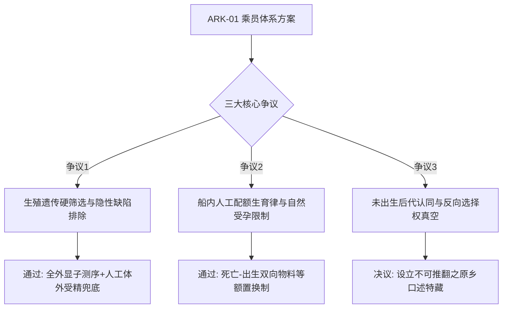

# 地联恒星际远征先导筹备委员会关于首期招募家庭生殖遗传筛查与多代际教育公约草案之听证记录

**公文编号**：UN-ISC-2062-HR-019  
**会议时限**：2062年04月18日 — 2062年04月19日（为期两天）  
**听证地点**：地联日内瓦第一大厅 / 地月L5筹备处全息并网分会场  
**组织机构**：地联恒星际远征先导筹备委员会（UN-ISPC）伦理与法权公约司  
**记录级别**：正式法定档案 / 世代飞船第一法典（ARK Charter）立项底卷  

---

## 一、听证背景与核心议题

随着拉格朗日 L5「建木」船台百米级离心自旋生态试验舱的成功运行，恒星际方舟（标称代号 ARK-01）的总体设计指标已正式敲定为：长航程 200 年、乘员标称规模 10,000 人、经历 5 至 6 个完整人类生命周期更迭。

本次听证会旨在就远征乘员在地球侧的招募遴选标准、密闭代际生育权限制定以及后代教育认知公约进行法定立项审议。

---

## 二、辩论陈述与多方观点纪要

### 1. 第一项议题：遗传学筛查红线与单基因隐性疾病剔除
- **医学遗传专家组（陈思远院士陈述）**：
  > “在一个 10,000 人的孤立封闭遗传池中，任何微小的有害隐性突变在经过四代人以上的近亲稀释后，纯合致病率都会以几何级数上升。我们必须执行前所未有的刚性基因普查：凡携带 3 种以上严重致残性隐性单基因变异（如进行性肌营养不良、家族性淀粉样变等）的申请个体，不得作为自然生殖组入选，必须强制签署体外胚胎筛选协议。”
- **民间人权与伦理委员会代表（玛格丽特·罗西律师反驳）**：
  > “这无异于以工程最优化的名义剥夺公民最基础的繁衍尊严。如果一个家庭自愿为了两百年的远征奉献一生，却因为一段未表达的隐性碱基对被剥夺生育权，飞船还未启航，制度的冷酷就已经异化了文明的本质。”
- **仲裁决议**：原则通过《恒星际生殖健康保障准则（草案）》，采用“地表体外受精胚胎库备份 + 船内体外优选受精兜底”双轨制，保留自然受孕资格但强化产前分子诊断干预。

### 2. 第二项议题：船内物料平衡与「死亡-出生等额置换制」
- **生态闭环工程司（周克林总工陈述）**：
  > “飞船生态圈的氮磷钾循环容量上限在设计图纸上是锁死的。每多一张嘴呼吸，生态平衡舱的藻华负荷就增加 0.008%。在航渡阶段，生育绝对不能是随性的个体行为，必须严格执行‘退役/逝去一人，批准受孕一人’的物料平衡法则。”
- **听证会代表表决**：全票通过物料配额优先原则，该条款正式列为飞船基础生存宪律。

### 3. 第三项议题：船生代启蒙教育中的「目的地与母星认知失锚」
- **文化演化人类学组代表（金泰俊教授发言）**：
  > “第二代、第三代人生于飞船、长于管道，他们从未见过真正的太阳，也从未踩过泥土。在他们的认知里，‘天空’只是头顶 30 米高的照明栅格。如果我们不在教育法典中硬性规定地表自然史的通识课时，到了第四代，比邻星 b 的开拓使命在他们眼里就会变成纯粹的荒谬苦役。”

---

## 三、听证委员会最终决议案要点

1. **确立招募家庭四维评分体系**：综合考量工程技术技能、心理韧性指数、多代际协作耐受度与全基因组稳定性。
2. **设立不可撤销的「原乡记忆特藏库」**：强制飞船中央图书馆配置永久只读固态介质，无损封存地球 2025—2060 年间全部地貌、声音、气候与人类文明通史数据。
3. **法典草案转序**：公约文本整理后呈交地联最高理事会，作为《ARK-01 远征先导总章程》第 VIII 卷（代际人口与法权篇）法定草案。

---

**听证首席代表**：地联恒星际远征先导筹备委员会主席 索托马约尔（签字）  
**伦理委员会主席**：杜邦（签字）  
**记录员**：方舟法典起草组 秘书长 许慧（签章）
