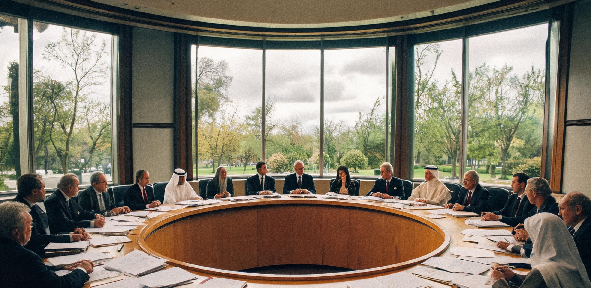

# 地联航天理事会关于内太阳系自决诉求处置与关税双轨结算规程的政策备忘录

**发文机构：** 地球联合体（UN）航天理事会常务执行局、地联财政与贸易统筹署、地联海事组织（UN-IMO）深空管治特别委员会  
**联合会签：** 洋山—天鳌母港海关管治局、地月联合航行安全监察署、地联驻深空全权特使代表团  
**文件编号：** UN-SPC-2124-MEMO-089 / TCL-HQ-2124-POL-114  
**成文历元：** 公元 2124 年 9 月 12 日 10:00:00 UTC（地表标准时）  
**发文地点：** 瑞士日内瓦 · 万国宫深空事务大厅（同步分发至洋山自动化集疏运总站、赤道天鳌海上发射母港及静海天梯 L1 联络处）  
**公文密级：** 地联全域行政公开件（附理事会闭门辩论内部抄件 · 乙级受控）  
**用印签署：** 地联航天理事会常务主席印（群青钢印）、地联财政与贸易统筹署长官印（朱红方印）、地联海事组织深空注册专用章（深蓝圆印）

---

## 〇、 备忘录出台背景与形势研判摘要

公元 2124 年 6 月，地联驻深空全权特使代表团在曙光三环中央轴心天井（Sector-0）零重力议事厅，与三环自治议事会及环带货运自治公会（BFAG）完成了关于《「地球条款」修订案》的第八轮双边闭门磋商（会谈代号：SC3-LEG-2124-HEARING-08 / TCL-DS-2124-SUMMIT-VIII）。理事会常务执行局于 8 月 15 日正式听取特使维克多·陈（Victor Chen）回地后提交之全案调查评估报告。

经全面研判，地联航天理事会与财政贸易统筹署一致确认：自公元 2096 年三环通过第 47 号公投（关税自留比例上调至 70%）至今二十八年来，内太阳系空间政治与经济地理已发生根本性范式位移。继续依循公元 2088 年订立之单边集权式《地球条款》（母体登记垄断、单边资源关税、海牙单方终审），已在物理与法理层面不可持续：

1. **光速通信延迟构成行政干预的物理极限：** 地表日内瓦至内太阳系主作业区（1.5 至 2.5 AU）单向光行时达 12 至 20 分钟以上。深空海损、航道防撞与工质闪蒸应急处置以「秒」为判定窗口，母体远距审批必然造成严重物流滞港与安全风险；
2. **深空经济与物质流自洽性彻底确立：** 曙光三环常住人口达 11,438 人（本土第三代占比超 41%），依靠名义地板半径 286.00 米、1.56 rpm 自转（0.78g 等效重力）与 B7 农舱实现 99.98% 水氧闭环；主带黑石礁、谷神星、灶神星采选冶炼网络已向地月系输送了逾千万吨钛铝结构梁与深冷水冰，深空不再是单向依赖地表供给的受援前哨；
3. **深空公共产品成本倒逼关税结构转型：** 三环常年维持之 2.5 AU 区段 6 座脉冲导航信标、日球层微流星预警网、北极 850 米避难过驳坞及战略工质储备，年度实测运维支出达 1.428 亿三环建设信用点（SBC）。强行向深空征收 30% 单边资源税，将直接摧毁深空公共安全网络，迫使船队转入完全非受控航行。

为此，地联航天理事会特制定本政策备忘录，正式确立**「法统名义保留、实体功能外放；服务等额对冲、口岸双轨互认」**之十六字处置总方针，重构地表母体与内太阳系各自治实体之新型契约关系。

---

## 一、 内太阳系主要自治实体法权定位与管辖重构规程

地联自公元 2125 年 1 月 1 日起，正式在《地联深空管治法典》中增设**「深空特许离岸自治实体（OS-AER）」**法定地位。对具备完全生态自持、独立历算能力与固定常住人口的轨道设施，实行分级授权与适航互认。

### 表 1：内太阳系主要空间实体法权定位与地联监管边界对照表

| 设施名称与类型 | 空间分布与运行基准 | 常住人口与生态自持率 | 2088 年原管辖状态 | 2124 年新设法权与监管模式（OS-AER） | 地联法定保留权益与底线机制 |
| :--- | :--- | :--- | :--- | :--- | :--- |
| **曙光三环轨道栖息地**<br>（综合旋转都市） | 内太阳系驻位轨道<br>（1.15 ~ 2.25 AU 调动区） | 11,438 人<br>水氧闭环 99.98%<br>食物自给 96.2% | 地联直管特区<br>海事局直属二级港<br>海牙法庭终审管辖 | **特级离岸自治栖息地（OS-AER-1）**<br>享有独立立法、地方海事登记、终审法庭法权；核发 DS-AC 适航证 | 1. 动力遥测数据镜像节点接入地联；<br>2. 跨星系远征设施中立资产监管权；<br>3. 原始投资折旧台账名义备案。 |
| **101955黑石礁总厂**<br>（重工采选基地） | 阿波罗型小行星<br>（近日点 0.89 / 远日点 1.42 AU） | 380 人（轮值制）<br>水氧 94.5%（外购水冰）<br>重工装配 100% | 地联矿务特许承包区<br>原矿强制配额返销 | **二级工业特许运营区（OS-AER-2）**<br>享有采选产品自主定价与多方贸易权；技术标准采纳主带联合体规程 | 1. 战略裂变/聚变特种工质定额储备权；<br>2. 矿山微重力安全生产联合巡视权；<br>3. 基础金属对地供应优先回购权。 |
| **谷神星重工联合体**<br>（日心深冷熔炼区） | 小行星主带核心区<br>（日心距 2.77 AU） | 2,460 人<br>水氧 98.2%<br>自产 C-2096 结构型材 | 地联与主带合资港<br>受地表进出口配额管制 | **一级联合工业自治领（OS-AER-1B）**<br>成立主带工业仲裁庭；自主结算 ISAU 能源货币；对地货物流转保税免验 | 1. 武器级高能束定向能设备禁限协议；<br>2. 空间太阳能试验段专利共享权益；<br>3. 极端工况事故联合调查权。 |
| **灶神星水冰矿业区**<br>（深低温水氧工质港） | 小行星主带南缘<br>（日心距 2.36 AU） | 1,120 人<br>原生水冰储量充足<br>电解工质枢纽 | 地联水资源战略平抑储备库（托管代管） | **特许基础能源自治港（OS-AER-2）**<br>设立内太阳系水冰现货清算所分所；享有推进剂定价与离岸挂牌权 | 1. 地月系突发干旱与生态危机征调权；<br>2. 工质杜瓦驳舱深冷安全物理年检；<br>3. 基础水权平准基金监事席位。 |

```plaintext
【地联与内太阳系离岸自治实体（OS-AER）双轨法权管辖分界拓扑】

  [ 地球地表与地月系空间 (≤ 1.0 AU) ] ─────── (分界点：地月 L2 / 1.5 AU 缓冲区) ───────► [ 内太阳系深空区 (1.5 ~ 2.8 AU) ]
  ┌─────────────────────────────────┐                                              ┌─────────────────────────────────┐
  │ · 适用法律：地联宪章 / 海牙终审  │                                              │ · 适用法律：三环章程 / 深空仲裁 │
  │ · 航运年检：UN-IMO 一级适航证    │ ◄─── 双向绿色通关通道 (Green Channel) ───►   │ · 航运注册：三环 DS-AC 自由适航  │
  │ · 关税体系：地表主权海关税率    │       (凭 RFID 电子铅封与遥测免开舱)         │ · 关税体系：离岸双轨全额对冲   │
  │ · 货币结算：SBC / 地月信用积分   │                                              │ · 货币结算：ISAU 保障电当量基底 │
  └─────────────────────────────────┘                                              └─────────────────────────────────┘
```

---

## 二、 关税双轨结算与公共产品成本对冲核销模型

为彻底终结长达三十余年的关税纠纷，地联财政与贸易统筹署正式确立**「公共服务等额冲抵历史投资折旧（Services-for-Depreciation Offset）」**法定清算机制：

1. **废除单边资源税追索：** 地联正式放弃对三环及主带输出之大宗矿石、水冰及聚变工质征收 30% 单边资源关税；
2. **历史折旧全额对冲：** 将地联在 2088 年至 2096 年间注入三环建设之原始基础设施折旧摊销（2124 年度核定为 13,850 万 SBC），与三环维持深空公共安全网络之实测支出实施 1:1 等额冲抵；
3. **超额服务特许补偿：** 对三环实际超出之公共服务支出（+430 万 SBC），地联通过免除向深空输出的高纯氟硅橡胶、人工光合酶及极端耐寒麦种等 430 万 SBC 货值关税予以足额平账。

### 表 2：2124—2130 年度地联与深空公共产品服务冲抵历史投资折旧之平准预算表

```text
========================================================================================================================
科目类别                核定项目与工程内容支撑                          年度标准折抵值 (SBC)    核销凭证与审计通道
------------------------------------------------------------------------------------------------------------------------
【贷方：地联历史权益】
1. 基础设施原始折旧      三环一至三期主体钛铝骨架与北极轴承折旧摊销               10,200 万 SBC         地联国资审字〔2124〕第081号
2. 空间能源技术授权      地月系微波无线能量传输与超导磁流体专利授权费              2,150 万 SBC         地联知识产权局备字第2090号
3. 种质与基因库支持      地表农科院深空闭环作物耐辐射突变株使用费                  1,500 万 SBC         国际农粮组织深空种质清册
------------------------------------------------------------------------------------------------------------------------
地联年度应收权益小计                                                            13,850 万 SBC         【年化基准清算总盘】
========================================================================================================================
【借方：深空公共产品】
1. 太阳系深空导航信标    2.5 AU 区段 6 座脉冲中继站日常运维与时钟同步              3,450 万 SBC         三环联合历算室星历标定单
2. 星尘与微流星网        太阳系外缘微流星监测网（DustNet）雷达阵列维持             2,820 万 SBC         深网标字〔2124〕第16期公报
3. 深空紧急避难与搜救    北极 850 米非自转桁架搜救过驳坞 24 小时备勤                3,980 万 SBC         BFAG 领航员联席会巡检日志
4. 战略平准工质储备      6 万吨深冷水冰浆与 1 万吨高纯液氢在轨储存维持             3,600 万 SBC         中央球核低温库物料平账表
------------------------------------------------------------------------------------------------------------------------
深空公共服务支出核定值                                                          13,850 万 SBC         【与地联应收 100% 轧平】
========================================================================================================================
【差额实物补偿项目】    三环超额提供之 430 万 SBC 运维成本：
                        地联海关免税放行 1,200 吨高纯特种氟硅橡胶（澄海基地转运）与 80 吨人工光合催化酶（洋山母港发运）。
========================================================================================================================
```

### 表 3：实行 DS-AC 适航双轨互认前后地表与母港口岸运营效益测算表

| 指标分项 | 2088—2123 年传统模式（地联单边年审） | 2124 年双轨互认模式（DS-AC + 绿色通关） | 效率变动幅度 | 核心收益动因与物理机制 |
| :--- | :--- | :--- | :--- | :--- |
| **深空挂靠船队通关周期** | 平均 48 标准地球日 / 航次<br>（依赖往返光电公证书面核验） | **平均 1.8 小时 / 航次**<br>（北极 32m 磁浮滑环就位即检） | **缩短 99.8%** | 彻底消除 2.25 AU 光速通信往返等待周期 |
| **超低温工质蒸发损耗** | 0.08% / 日（在途与滞港放空）<br>年损耗高纯液氢/液氧 18,400 t | **0.018% / 日**<br>年闪蒸损耗压降至 4,140 t | **降低 77.5%** | 避免深空船舶滞港引发杜瓦罐安全放空 |
| **地表口岸年化滞港损失** | 年均损失 **4,460 万 SBC** | **净损失归零（降至 0.00 SBC）** | **完全释放** | 释放 180 万载重吨船队之有效周转率 |
| **海事海损纠纷理赔周期** | 海牙法庭排期：平均 18 至 36 个月 | 三环海损公证处局地裁决：**72 小时** | **加速 99.6%** | 适用局地自转动力学与开普勒海损法则 |

---

## 三、 洋山—天鳌母港与地月枢纽离岸货运「绿码快速通关」作业指引

自公元 2124 年 10 月 1 日起，上海洋山自动化集疏运总站、赤道「天鳌」海上电磁发射平台及静海天梯 L1 空间货栈，全面启用《深空离岸物资绿色通关与检验检疫操作规程》（STD-PORT-2124-GC）：

### 表 4：地月母港与空间口岸离岸集装箱「绿码直通」作业细则

```plaintext
========================================================================================================================
作业阶段          查验口岸 / 设施节点          操作规程与技术手段                          放行标准与异常处置
------------------------------------------------------------------------------------------------------------------------
1. 入境预报       地月 L2 前置货栈             船舶在距地月系 0.05 AU 处，通过激光链路      数据校验无误即自动下发
   (入港前 48h)   (天衡测控阵列)               上传三环 DS-AC 证书编号与全舱 RFID 货单      「地月绿码（L-GreenPass）」
------------------------------------------------------------------------------------------------------------------------
2. 轨道过闸       静海天梯 L1 节点 /           天梯货舱与穿梭机执行非接触式中子断层         严禁开舱物理取样；
   (免开舱通关)   天鳌-01 轨道前哨             扫描（扫描耗时 ≤ 120 秒 / 标准箱）           比对数字铅封，零破损直接过闸
------------------------------------------------------------------------------------------------------------------------
3. 降轨分流       洋山真空管道总站 /           高纯水冰与粗钛铝梁通过无动力滑翔杜瓦舱       保税直通转入长三角地下工坊；
   (大宗原材料)   东海自动化深水锚地           溅落入海回收，或直连超导磁浮管道入库         零关税征收，核销 ISAU 提单
------------------------------------------------------------------------------------------------------------------------
4. 特许出港       赤道「天鳌」电磁平台         地表输出之高活性酶、生物疫苗与光学镜组，     全自动核发出港生物安全检疫证
   (高精研发物)   (半潜式发射巨构)             经真空管道直抵发射导轨，低过载弹射入轨       （CIQ-EARTH），冲抵超额服务对冲账户
========================================================================================================================
```

---

## 四、 理事会辩论实录与政策决议摘记（内部密件）

*(以下内容摘自地联航天理事会第 412 次闭门全体会议录音纪要 · 日内瓦万国宫 · 公元 2124 年 8 月 18 日)*

```plaintext
【参会核心发言人】：
· 让-皮埃尔·莫罗（Jean-Pierre Moreau）：地联航天理事会常务执行主席（地表法理派代表）
· 索菲亚·阿尔瓦雷斯（Sofia Alvarez）：地联财政与贸易统筹署长官（经济派代表）
· 维克多·陈（Victor Chen）：地联驻深空全权特使（刚结束三环第八轮磋商归国）
· 杜怀瑾（线上列席）：月球静海深空档案总库数据总监
```

> **莫罗主席：** “特使先生，你带回来的草签文本在常务理事会内部引发了极大震动。按照这份纪要，我们实质上放弃了海事组织的最终适航登记权，甚至承认了一个一万一千人的离心轨道站核发的证书在 1.5 个天文单位之外具备完整主权效力。这是自《西伐利亚和约》以来，人类主权概念最彻底的一次外溢。地表三十二个出资国议会中，有相当一部分议员认为这是母体的退缩。”
> 
> **特使 维克多·陈：** “主席先生，各位长官，我在日内瓦生活了五十年，但在过去六个月里，我穿戴着 1.0g 加压外骨骼坐在三环 286 米自转环的中央天井里。我亲眼看着三环二代、三代的年轻人从我身边走过——他们的骨密度比我们低近五分之一，他们的眼睑适应了没有散射光的硬质阴影，他们的呼吸节律适应了 21 kPa 的纯净氧分压。
> 
> 对他们来说，‘地球’不是一个拥有主权管辖权的实体政府，而是头顶 18 米石英视窗里一颗亮度只有负四等的淡蓝色星芒。那座旋转都市在真空中已经自转了整整三十五年。每天只要停转一秒，一万一千四百三十八人就会被撕碎。
> 
> 当我们在日内瓦的空调办公室里讨论‘单边关税追索’和‘海牙终审’时，一艘万吨级推船在谷神星外缘发生喷注管破裂，等日内瓦盖章的指令穿过两亿公里真空传过去，那艘船上的年轻人早已因工质耗尽冻成了冰雕。这不是法律问题，这是光速常数的问题。母体如果拒绝承认物理，物理就会把母体抛在身后。”
> 
> **阿尔瓦雷斯署长：** “陈特使的表述很具感染力，但财政署更关心资产负债表。我们仔细审核了表 2 的对冲台账。过去三十年，三环向地月系输送了 1,400 万吨水冰和 80 万吨氦-3，按基期价格计算，早已覆盖了我们 2088 年建站原始投资的 142%。
> 
> 更关键的是表 3：如果维持原有关税审查，我们每年要在口岸制造 4,460 万 SBC 的滞港损失；而将 1.385 亿折旧与他们维持的导航网和微流星网对冲，地表财政实际上甩掉了一个深不可测的深空公共安全包袱，同时锁定了主带高纯钛梁与聚变能源的零关税保税进口通道。
> 
> 无论从地缘物理还是商业精算来看，‘服务换折旧’不是地表的恩赐，而是母体在全要素自动化时代的理性止损。”
> 
> **莫罗主席：** *(沉默良久，望向窗外日内瓦湖的蒙蒙细雨)* “母体之所以是母体，不是因为它能把绳索勒得多紧，而是因为它知道何时松手，让飞鸟在星空里长出自己的骨骼。
> 
> 航天理事会一致通过《2124 年第 089 号政策备忘录》。承认三环 DS-AC 适航证；通过 13,850 万 SBC 关税对冲模型；洋山港与天鳌平台即日起建立深空保税绿码通道。愿人类的契约，能像星光一样照亮寒冷的真空。”

---

## 五、 签署生效与常态化执行附则

1. **法定生效历元：** 本备忘录所载全部条款自标准地球时公元 2125 年 1 月 1 日 00:00:00 UTC 起在全地联口岸正式生效；
2. **双向争议调解机制：** 设立「地联—深空双边法务常设联络组」，由地联日内瓦法务局与三环自治议事会法务委员会各指定 3 名常任公证员，遇跨轨道重大涉外纠纷，采用「局地事实认定 + 光速延迟仲裁」规程处置；
3. **档案保存与分送：** 本备忘录石印羊皮纸正本壹份，永久封存于日内瓦联合国地下总档案馆甲字第 01 柜；数字化全息加密副本分送洋山母港、赤道天鳌母港、静海中央档案库及三环联合历算室。

```plaintext
========================================================================================================================
地联航天理事会常务执行主席： 让-皮埃尔·莫罗（签押：J-P. MOREAU / UN-SPC-CHAIR）
地联财政与贸易统筹署长官： 索菲亚·阿尔瓦雷斯（签押：S. ALVAREZ / UN-FIN-COMM）
地联海事组织深空注册特派专员： 瓦西里·柯林斯（签押：V. COLLINS / UN-IMO-DS）
地联驻深空全权特使代表团首席： 维克多·陈（签押：VICTOR CHEN / TCL-DS-CHIEF）

公文备案编号： UN-ARCH-2124-SPC-MEMO-089-FINAL
========================================================================================================================
```

---

## 图片提示词

（元层，非世界内容）

**中文（80字内）：**  
宏大硬科幻纪实摄影。日内瓦万国宫高大古典石柱大厅内，地联高官与深空特使围坐于巨型内太阳系全息光电投影沙盘旁，沙盘上漂浮着金色的霍曼轨道与三环坐标；清晨冷调天光透过巨幅拱形玻璃窗洒在深色实木长桌上，桌上整齐堆叠着古朴羊皮纸卷宗与粗粝深空再生纸草签协议，展现文明母体在星际扩张中的制度威严与历史沧桑。

**英文（200词内）：**  
Cinematic hard sci-fi documentary photography, wide establishing interior shot inside the grand Council Chamber of the Palais des Nations in Geneva. UN diplomats and deep-space envoys gathered around an expansive dark polished mahogany table beneath towering neoclassical stone columns and high arched windows. Floating above the table is a detailed volumetric holographic projection of the inner solar system, glowing with soft amber and cyan Hohmann orbital trajectories connecting Earth, the Moon, and the Aurora Tri-Rings. Soft morning overcast daylight streams through the high windows, cutting cinematic dust motes across the room. On the desk rest official diplomatic fountain pens, heavy leather-bound parchment archives bearing UN embossed seals, alongside rough unbleached straw paper communiqués stamped with the Tri-Ring council's crimson seal. Hyper-realistic industrial texture, rich architectural depth, photorealistic 35mm film grain, neutral historic color grading.

---

## 修订记录（元层，非世界内容）

- 2026-08-19 初稿编纂（kimi-k3）：
  1. 依据社会×离心×①地球坐标要求，编纂公元 2124 年地联航天理事会关于内太阳系自决诉求处置与关税双轨结算规程之中央政策备忘录；
  2. 深度互锁 GS-2124-01（三环「地球条款」第八轮磋商）、GS-2096-04（第47号公投70%关税留存）、GS-2125-01（三环大宗贸易总账）及地球母港体系（洋山港超导真空管道、赤道天鳌海上电磁发射平台）；
  3. 精确闭环 13,850 万 SBC 历史折旧冲抵深空公共产品服务（信标、微流星网、救援坞、工质储备）及 430 万 SBC 氟硅橡胶/特许生物制品免税补偿；
  4. 严格遵守叙事四铁律与无冲突史诗基调，展现母体文明面对光速延迟与深空自给自足现实时的制度理性与社会温度，全篇正文杜绝元层词与纪元名泄漏。
