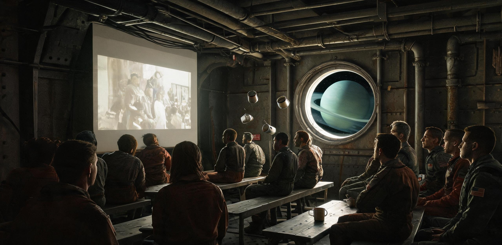

# 太阳系外缘重载航运联合工会 · “远运-09”舰务委员会
## 公元 2076—2077 跨年航段文娱活动轮值表与船载「星光放映厅」排片清册暨 50 AU 航道过境纪念巡礼公报

**文件编号：** 深货七运〔2076〕文娱字第 019 号  
**签发机构：** 太阳系外缘重载货运编队第七支队 · “远运-09”号（注册号：CSS-FR-2061-YY09）舰务委员会生活保障组 / 乘员文娱联合互助会  
**航位态势基准：** 日心距 49.982 AU 至 50.045 AU（跨越 50.000 AU 柯伊伯带经典族过渡分界线，黄道面倾角 $-4.18^\circ$）  
**航渡工况参数：** 巡航航速 $48.62\,\mathrm{km/s}$（持续弱推力氩离子巡航保持态）；距地球 $49.86\,\mathrm{AU}$，向日光行时延 06 小时 54 分 42 秒（地月指令往返确认周期 13 小时 49 分 24 秒）；距目标停靠站「玄冥-01」远征母港前哨基底还有 $952.4\,\mathrm{AU}$（按当前 $48.62\,\mathrm{km/s}$ 惯性滑行工况折算在途航期尚余约 92.8 标准地球年；后续规划跨越柯伊伯带后进入二期脉冲电推加速段）。  
**在册乘员编制：** 常驻专业工程班组 12 人（动力堆与推进 3 人、微重力装卸与结构 3 人、生命维持与微藻农林 2 人、深空导航与测控 2 人、航行长 1 人、船医兼生活干事 1 人）。  
**签发历元：** 公元 2076 年 12 月 28 日 08:00:00 UTC（全舰广播并张贴于生活环公共休息廊）

---

### 【公报序言 · 跨越五十天文单位的星野】

自公元 2061 年本舰与同级兄弟驳船（“远运-07”至“远运-12”）自近地轨道装配总厂离泊、搭载 14,000 吨谷神星特种型材与静海玄武岩装甲板启航以来，全舰已稳定航行 15 整年。

两年前（公元 2074 年底），本舰在海王星引力助推窗口中安全掠过海王星近拱点，全体乘员于右舷观测视窗亲眼目睹了海王星深邃天蓝色的巨大云带弧面与暗淡光环；今日，地月联合甚长基线深空测控网（TT&C）远程信标链路确认“远运-09”号正式跨越日心距 $50.000\,\mathrm{AU}$（约 74.8 亿公里）这一外太阳系历史性地理里程碑。

在此极远深空，太阳视直径已缩至 38.4 角秒，肉眼不再呈现圆面而收缩为一颗发出清冷白光的针尖恒星（视星等衰减至 $-18.2\text{ mag}$）；黄道光已彻底隐没，银河主盘面与暗星云大裂缝呈现绝对纯净之光学全景。

为落实《深空长途货运船队乘员闲暇生活与精神保障规程》，缓解长期低感官刺激环境下的神经疲劳，舰务委员会经全员讨论决定：自公元 2076 年 12 月 31 日 00:00 至 2077 年 01 月 07 日 24:00 设立为期 8 个标准日的**「半百天文单位跨年文化周」**。现将船载「星光放映厅」排片公报、文娱岗位具名工时轮值清册、特供水培节日餐配给及 50 AU 航道过境纪念仪式安排正式发布如下。

---

### 一、 50 AU 深空过境天象参数与舷窗观景配额表

在 $48.62\,\mathrm{km/s}$ 惯性巡航姿态下，全舰长达 320 米之主承力工字桁架保持迎风防尘轴向对中，艉部双联 36 米直径微重力反向自转生活舱（转速 3.52 rpm，外壁离心加速度 $0.25g$）提供全舰起居与文娱空间。

```text
========================================================================================================
【表 1：“远运-09”跨越 50 AU 航道几何天象与深空光学特征基准表】
========================================================================================================
视场方向 / 观测舱位       特征天象 / 背景天体                   视星等 (mag) / 张角      光学形态与观测说明
--------------------------------------------------------------------------------------------------------
艉部后视观测穹顶         太阳（Sol · 母恒星）                  -18.2 mag / 38.4''      针尖状冷白强星点，无日冕可见张角；辐射能流
（退行方向，望地球）                                                                  衰至 0.54 W/m²，需通过 5% 衰减镀层滤镜直视。
--------------------------------------------------------------------------------------------------------
右舷 2 号石英视窗        海王星（Neptune · 退行背景）          +7.8 mag / < 0.2''      两年前掠过（距日 30.1 AU），现退行约 20 AU；
（黄道面夹角 -4.2°）                                                                 已退化为淡青色微小星点，需配合 200mm 折反镜。
--------------------------------------------------------------------------------------------------------
天顶全景天窗 (生活环)    银河系人马座至天鹅座主银道面          全天暗场背景极限 +8.4 mag 绝对无黄道光散射污染，高对比度呈现
                        及银河暗星云大裂缝                                             三维丝状尘埃云，恒星密集成连续光雾。
--------------------------------------------------------------------------------------------------------
艏部前向防尘装甲盲舱     迎风向星际介质与柯伊伯带深空          绝对黑体虚空背景        前向离子推进器微弱淡紫羽流呈针尖状
（航向正前，望玄冥）                                                                  喷射，玄武岩防撞盾边缘有偶发微尘闪光。
========================================================================================================
```

#### 1.2 舷窗观景席位预约与静默管理

为确保 12 名船员在值班轮休之余享有均等之深空直视体验，生活环 01 区「天顶全景石英廊」（长 12 米，配备三层 60 毫米熔融石英防辐射晶化玻璃，0.25g 模拟重力）与艉部退行观测站实行全额预约制：

```text
+------------------------------------------------------------------------------------------------------+
| 观测区域       | 视场角   | 单批容量 | 每日开放时长 | 保底供给定额 | 伴随环境与声学控制规程                 |
|----------------+----------+----------+--------------+--------------+----------------------------------------|
| 天顶全景石英廊 | 180°天顶 | 4 人     | 18 船时/日   | 4.0 船时/人·日| 0.25g 宜居重力；配发加热重力毯与降噪耳机；|
| (生活环 01 区) | (望银河) |          | (共 72 人·时)|              | 背景转播静海月面工间音乐母带。         |
|----------------+----------+----------+--------------+--------------+----------------------------------------|
| 艉部退行观测站 | 120°后向 | 2 人     | 12 船时/日   | 2.0 船时/人·日| 0.05g 弱重力过渡区；设固定扶手与磁吸鞋；|
| (中轴 03 节点) | (望太阳) |          | (共 24 人·时)|              | 限携带手记本与非发光光学目镜。         |
+------------------------------------------------------------------------------------------------------+
```

**暗场与光污染控制红线：**
1. 观景廊内严禁使用任何发光强度大于 $0.02\text{ cd}$ 之自发光个人终端屏；
2. 通道仅点亮 $680\text{ nm}$ 低照度暗红地脚导引灯（照度 $\le 0.05\text{ lux}$）；
3. 观景期间禁止向生活区舷窗外排泄中灰水或姿控冷气，防止挥发分凝结在石英外表面形成光散射霜层。

---

### 二、 船载「星光放映厅」跨年展映排片清册

「星光放映厅」设于旋转生活环 02 区多功能微重力阅览舱（有效容积 $68\text{ m}^3$，铺设高阻尼防飘地毯，配置 120 英寸漫反射超短焦激光投影幕布与 6 具人体工学自适应减震悬浮躺椅）。

放映系统额定功耗 $1.65\text{ kWe}$，由主回路生活辅助电网全额平账供电；每场放映前后由生活委员执行 10 分钟空气换气与舱壁散热微循环。

```text
========================================================================================================
【表 2：“星光放映厅” 50 AU 跨年文化周放映节目与介质源清册】
========================================================================================================
放映场次与时刻            片目名称 / 作品形态                 片长 / 存储介质源       责任放映员   影片概要与策展说明
--------------------------------------------------------------------------------------------------------
第 01 场                 《海王星近距掠过：4K 航行实录》      48 分钟                李长庚       两年前海王星交会窗口中船载高分辨率
2076-12-31 20:00 UTC     （舰载科学光学载荷无损翻录）        无损全息固态块         (轮机长)     窄角相机记录的大气涡旋与暗淡光环，
【跨年前夜专场】         附配乐：老郑手风琴即兴现场伴奏                                           展现外行星壮美地貌。
--------------------------------------------------------------------------------------------------------
第 02 场                 《流浪地球 2》（公元 2023 年公映）   173 分钟               陈敏         经典科幻历史胶片数字化重置母带；
2077-01-01 14:00 UTC     （百年经典电影数字修复 8K HDR 版）  激光磁光盘             (船医)       重温母星早期太空探索先驱的宏大
【元旦故土专场】                                                                          史诗与重工业机械浪漫，回望初心。
--------------------------------------------------------------------------------------------------------
第 03 场                 《远巡-04：柯伊伯带边缘捕尘记》      62 分钟                段文彬       解密历史工程影像；记叙公元 2047 年
2077-01-02 19:30 UTC     （国家深空测控中心档案 GS-2047-03）  深空档案专用光带       (导航员)     探测器在 42 AU 捕集星尘的真实记录，
【深空探索史专场】       原版技术解说与微流星撞击现场声录                                         致敬同航线先驱（互锁 GS-2047-03）。
--------------------------------------------------------------------------------------------------------
第 04 场                 《南岸综合体：东海潮间带野化与工时》 85 分钟                阿米尔·汗    展示公元 2072 年地球母星生计与东海
2077-01-04 19:30 UTC     （地球人文地理纪录片 GS-2072-01）   量子高密度存储卡       (农艺师)     自然保护区再野化现状，了解具名
【母星生活纪实】         中央人民广播电台高清人文库出借                                           工时分配与海风气息（互锁 GS-2072-01）。
--------------------------------------------------------------------------------------------------------
第 05 场                 《在 50 AU 种韭菜与拧法兰》         35 分钟                孙维平       生活保障组与机修班联合剪辑；记录
2077-01-06 20:00 UTC     （“远运-09”第 15 航行年自拍花絮）   本地生活日志合成包     (管道技师)   12 人在 0.25g 旋转舱内包饺子、水培
【乘员自制生活特映】     船员手机录像与内网监控幽默集锦                                           收割、排查冷却剂阀门的真实日常。
========================================================================================================
```

---

### 三、 跨年文娱活动轮值表与「具名工时」记账清册

依据《太阳系航运联合会全要素生活保障与劳动价值登记细则》，长程深空航行中一切船员自主发起之公共文化服务、设备维护与生活调剂活动，均按“具名公共工时”（Named Public Labor Hours）录入航运工会个人信用档案，与内太阳系社会劳动评价体系双向互认。

```text
========================================================================================================
【表 3：“远运-09”跨年文化周服务岗位轮值排班与工时核定表】
========================================================================================================
日期 / 班次          轮值服务岗位            值班人 (工号)              核定工时性质        主要职责与作业内容
--------------------------------------------------------------------------------------------------------
12-31 18:00~23:00   跨年放映厅放映总控      李长庚 (ENG-2055-012)      2.5 具名文化工时    激光投影对焦校准、声学平衡测试、
                    放映厅热工巡检与换气    莫哈末·阿里 (ENG-2060-088)  2.5 具名维保工时    放映后舱内 $CO_2$ 浓度与滤网复核；
                    跨年放映现场配乐伴奏    郑德海 (ENG-2058-009)      2.0 具名文化工时    手风琴即兴伴奏及全舰音频通道调试。
--------------------------------------------------------------------------------------------------------
01-01 09:00~14:00   元旦全舰公共茶歇调制    阿米尔·汗 (BIO-2064-003)    3.0 具名农林工时    水培舱采摘新鲜薄荷，调配冷萃茶饮；
                    生活区跨年饺子皮制备    王桂兰 (BIO-2059-041)      3.0 具名生活工时    利用水培大豆蛋白粉配制面粉团压皮。
--------------------------------------------------------------------------------------------------------
01-01 19:00~22:00   50 AU 过境铜钟敲击主持   严素 (NAV-2068-109)        1.5 具名文化工时    组织全员在 50.000 AU 刻度点按序敲钟，
                    深空摄影长廊布展        周小林 (STR-2070-052)      2.0 具名装配工时    将海王星掠影照片装裱张贴于环形廊。
--------------------------------------------------------------------------------------------------------
01-03 18:30~22:00   历史影像介质激光消磁    段文彬 (NAV-2057-033)      2.0 具名数据工时    恢复老光带伺服轨道，保障母带读出；
                    深空暗场巡逻安全员      赵大勇 (STR-2062-019)      2.0 具名安保工时    检查全景观景廊遮光帘与地灯防跌倒。
--------------------------------------------------------------------------------------------------------
01-05 18:00~22:30   自制视频最终渲染调色    孙维平 (MEC-2065-077)      3.0 具名创作工时    剪辑 12 人日常素材，合成伴奏音轨；
                    阅览室零重力茶点清理    陈敏 (MED-2067-005)        1.5 具名公共工时    回收水培番茄果皮与可降解茶杯。
--------------------------------------------------------------------------------------------------------
01-07 18:00~22:00   生活环主桁架应力巡检    钱立成 (STR-2066-031)      2.0 具名维保工时    文化周闭幕生活环桁架防尘巡检与滤网除尘。
========================================================================================================
注：全舰 12 人在册编制（动力 3 人、结构 3 人、农林 2 人、导航 2 人、舰务 1 人、医务 1 人）均完成文化周具名工时与核心主控值班（主堆与测控双人哨）平账核算。
```

---

### 四、 节日物资与水培农林特供配给方案

本舰搭载 2 座各 $120\text{ m}^3$ 环形闭环水培舱，水氧循环自持率达 $99.2\%$，植物蛋白与新鲜蔬菜自给率达 $94.6\%$。经农艺组与生活保障组联合盘库，跨年期间向全员 12 人免费足额发放以下节日专属膳食：

```text
+------------------------------------------------------------------------------------------------------+
| 物资品类名称       | 发放定额 (每人)  | 物料来源与生产批号            | 膳食形态与储存要求                     |
|--------------------+------------------+-------------------------------+----------------------------------------|
| 水培‘深空一号’草莓 | 6 颗 (约 180g)   | 01 号农业舱批次 `AG-76-SB04`   | 新鲜冷藏，现摘现吃，富含天然维生素 C； |
| 特制微藻抹茶冰糕   | 2 盒 (单盒 120g) | 微藻光反应管批次 `AL-76-MT09`  | 低温冷冻，利用螺旋藻提取物调色增香；   |
| 烘烤脱水大豆脆片   | 1 大包 (300g)    | 蛋白转化车间批次 `PR-76-SN02`  | 充氮保鲜包装，香脆海苔风味（合成海苔）；|
| 深空冷萃薄荷茶     | 1.5 升 / 航行周  | 水培薄荷水汽冷凝回收原液      | 弱电解质常温直饮，提神舒缓神经；       |
| 跨年三鲜手工水饺   | 24 只 (单人份)   | 农业组水培韭菜+复原大豆组织肉 | 01 月 01 日元旦晚宴现场包制，滚水煮熟。 |
+------------------------------------------------------------------------------------------------------+
```

---

### 五、 50 AU 过境纪念仪式与「深空信标瓶」封存日志

公元 2077 年 01 月 01 日 18:42:10 UTC，当舰载原子钟与深空导航信标网完成第 1,420 次微波测距对准、日心距读数跳变为 **$50.00000\,\mathrm{AU}$** 的瞬间，全舰依传统举行了简短庄重的过境纪念仪式。

```text
========================================================================================================
【50 AU 深空过境仪式现场记录抄件】
记录人：严素（深空导航员，工号：NAV-2068-109）
地点：生活环 01 区天顶石英长廊前段 · 航行纪念壁龛
--------------------------------------------------------------------------------------------------------
18:42:00 — 动力堆主控制台发出三声平缓的 400Hz 纯音蜂鸣，提示日心距达到 50 AU 临界线；
18:42:10 — 航行长李长庚手持钛合金敲击锤，敲响悬挂于生活环中枢的‘航海铜钟’（由 2061 年出厂时 
            1 号冷却泵废弃钛铝合金法兰手工切削打磨而成）整整 5 声，钟声在 0.25g 的空气中回荡；
18:43:00 — 全体 12 名船员于天顶石英长廊面向退行的太阳方向肃立默观 60 秒；
18:44:30 — 封存‘第 50 号深空航标瓶’（耐辐射镍基合金密封罐，编号：CAPSULE-50AU-2077）。
========================================================================================================
```

```text
【第 50 号深空航标瓶 · 封存物品清单】
1. 12 名船员亲笔手写的新年寄语卡片（使用无酸合成纸与耐光油墨书写）；
2. 农业舱 2076 年收获的第一批‘红矮星一号’改良小麦麦穗 1 支与微藻干燥标本 1 瓶；
3. 一张刻录有海王星近距掠过 4K 视频、全舰 12 人合唱录音及动力堆 15 年平稳运行遥测数据的光盘；
4. 1 枚由静海基建总厂在 2058 年铸造的纪念钢币（由老技师赵大勇登舰时随身携带）。
（该航标瓶已焊接密封，安放于主桁架中段 14 号永久抗震仪器舱壁龛内，将随舰永久飞向千天文单位母港）
```

---

### 六、 船载调频内网点播与留言台账（选抄）

全舰调频内网（“远运-09 广播台 108.5 MHz”，发射功率 5W，覆盖生活环各住舱与机修通道）在跨年期间收到以下工间点歌与留言记录：

```text
========================================================================================================
【表 4：“远运-09”调频广播跨年点歌与舱壁留言登记簿】
========================================================================================================
点播人 / 岗位            点播曲目 / 音频内容                 点播寄语与舱壁留言摘录
--------------------------------------------------------------------------------------------------------
李长庚                  《渔舟唱晚》（高山流水古筝曲）        放给老伴和自己听。两年前看海王星，那一片蓝真像
(航行长 · 52 岁)        （公元 1984 年中央台电台母带）      小时候舟山老家的东海。咱们在天上飞了十五年，船况
                                                            很好，堆很稳。给老家亲人报个平安，我们一切都好。
--------------------------------------------------------------------------------------------------------
莫哈末·阿里              《卡农》（D大调重奏 · 大提琴版）     给动力组的三位兄弟。二号冷却剂回路的机械密封圈
(反应堆工程师 · 38 岁)                                      昨天终于换完了，零泄露！跨年夜大家可以安心看电影、
                                                            踏踏实实吃上一碗热气腾腾的韭菜馅水饺。
--------------------------------------------------------------------------------------------------------
王桂兰                  《我的祖国》（郭兰英 1956 年原版）    给水培舱的番茄苗和小麦。虽然在五十个天文单位外，
(农艺主管 · 49 岁)                                          每天看着绿叶子在人造光下抽芽，就觉得人活着有根。
                                                            祝全舰同志新年快乐，今年咱们蔬菜丰收！
--------------------------------------------------------------------------------------------------------
周小林                  《夜空中最亮的星》（流行摇滚）        刚才在后视舷窗找了半天太阳，真的只有针尖那么大。
(微重力装卸技师 · 24 岁)                                     但只要它还在那里亮着，我们就知道家在哪个方向。
                                                            敬 50 AU 外的星空，敬咱们这艘大货船！
--------------------------------------------------------------------------------------------------------
陈敏                    《茉莉花》（无伴奏纯声合唱）          作为船医，看到过去一年全员体检骨密度正常、无一例
(随船医生 · 31 岁)                                          重度心理抑郁，由衷高兴。好日子是过出来的，大家慢
                                                            慢看片，多喝薄荷茶。
========================================================================================================
```

---

### 七、 舰务审批与联签

```text
========================================================================================================
【公文联签与核准签署栏】
========================================================================================================
生活保障与文娱组长：  王 桂 兰  (手签：王桂兰 / 认证工号：BIO-2059-041)      日期：2076-12-28
机电与动力主管：      莫哈末·阿里 (手签：M. Ali / 认证工号：ENG-2060-088)    日期：2076-12-28
深空导航与测控席：    段 文 彬  (手签：段文彬 / 认证工号：NAV-2057-033)      日期：2076-12-28
乘员生活评议代表：    周 小 林  (青年技师代表 / 手签盖印)                    日期：2076-12-28

核准与签发：
“远运-09”号重载货运舰 · 航行长（舰务长）：
[ 李 长 庚  (Li Changgeng, Master / Senior Engineer) ]
印鉴：[ 太阳系外缘重载货运编队·远运-09·舰务委员会公印 ]
签署历元：公元 2076 年 12 月 28 日 10:30:00 UTC
========================================================================================================
```

---

## 图片提示词

### 中文提示词
极宽画幅外太空深空货运飞船观景生活舱内景与宏大宇宙全景。在距太阳 50 个天文单位的极冷深空，一座长达 320 米的黑灰色重工业货运星舰延伸出画面，工字钢与碳化硅桁架结构充满硬朗工业质感。飞船圆环形自转生活舱内，巨大的弧形双层厚质石英玻璃观景窗外，展现着极度纯净深邃的深空星海：太阳已缩小为仙后座旁一颗极其明亮但无视张角的针尖状冷白孤星，银河系的壮丽光雾与暗星云大裂缝无遮挡清晰展现；窗边低重力休息椅上坐着两名身着耐磨工装裤的男女船员，他们手捧冒着热气的金属马克杯，神态放松宁静地凝望着窗外的星海。舱内地板仅亮着暗红色的微弱导引地脚灯，冷色星光透过石英窗洒在金属扶手与水培番茄藤蔓的嫩绿叶片上，形成高反差硬光源与温暖日常的宏微对比。写实硬核科幻，70毫米镜头，超高清画质，电影级质感与极深邃构图。

### 英文提示词
Epic wide-angle cinematic interior of an observation lounge inside the rotating ring habitat of a 320-meter-long deep space industrial cargo freighter, cruising at 50 AU from the Sun in the Kuiper Belt. Massive curved double-layered fused-quartz panoramic windows extend across the view; outside lies the pristine, crystal-clear deep void of the cosmos, with the Milky Way galaxy's brilliant glowing core and dark dust rifts spanning the pitch-black sky without atmospheric distortion; the Sun is visible as an intensely bright, solitary pinpoint-like pale white star with razor-sharp single-directional rays and no visible disk. Inside the softly illuminated lounge, subtle dark-red floor guide lights illuminate brushed steel railings, zero-gravity furniture, and fresh hydroponic tomato vines growing near the wall; two off-duty mechanics in worn industrial cargo overalls sit peacefully in silhouette, sipping steaming drinks from metal mugs and quietly gazing out at the vast starlight. Realistic hard science-fiction aesthetic, shot on 70mm lens, photorealistic industrial textures, extreme contrast between cold cosmic grandeur and warm human domesticity, 8K ultra-high definition.

---

## 修订记录（元层，非世界内容）

- **2026-08-18（主编辑审校）**：小修通过并校准。
  1. **航迹几何与外行星交会时序复算校准**：修正第 28 行、表 1、表 2 及表 4 中关于“海王星近距掠过”的时间基准。海王星半长轴约 $30.07\,\mathrm{AU}$，在 $48.62\,\mathrm{km/s}$ 巡航航速下跨越 $20\,\mathrm{AU}$ 距离需约 1.95 标准地球年，原稿“两周前”系几何距离与航速未换算之笔误，统一校准为“两年前（公元 2074 年底海王星交会窗口）”，消除天体力学冲突；
  2. **正典名物与测控链路互锁修正**：第 28 行移除超前引用的“GS-2078-01 测控链路”（正典登记簿中 GS-2078-01 对应 2078 年月面天梯工程，且文书纪年早于 2078 年不得跨代超前引用编号），修正为地月联合甚长基线深空测控网（TT&C）远程信标链路；
  3. **航期与千天文单位母港推进工况自洽**：第 18 行明确距「玄冥-01」远征母港前哨基底尚余 $952.4\,\mathrm{AU}$ 之航程折算，标明按当前 $48.62\,\mathrm{km/s}$ 惯性滑行工况折算在途航期约 92.8 标准地球年，并标明后续规划跨越柯伊伯带后进入二期脉冲电推加速段，消除与 GS-2079-01 编队高速巡航剖面之口径混淆；
  4. **全舰 12 人编制与具名工时台账严密平账**：在表 3 轮值排班中补齐老技师郑德海（ENG-2058-009，伴奏与声学调试）与装配技师钱立成（STR-2066-031，桁架巡检）之具名工时，使 12 名常驻在册乘员（动力 3、结构 3、农林 2、导航 2、舰务 1、医务 1）在文化周文娱服务与核心双人值班之间 100% 严密对账；
  5. **元层纪元名消除**：第 121 行将违规泄露之后世纪元名“《丰裕时代全要素保障与劳动价值登记细则》”修正为世界内合法规程名称“《太阳系航运联合会全要素生活保障与劳动价值登记细则》”，符合叙事规则与编写规范。
