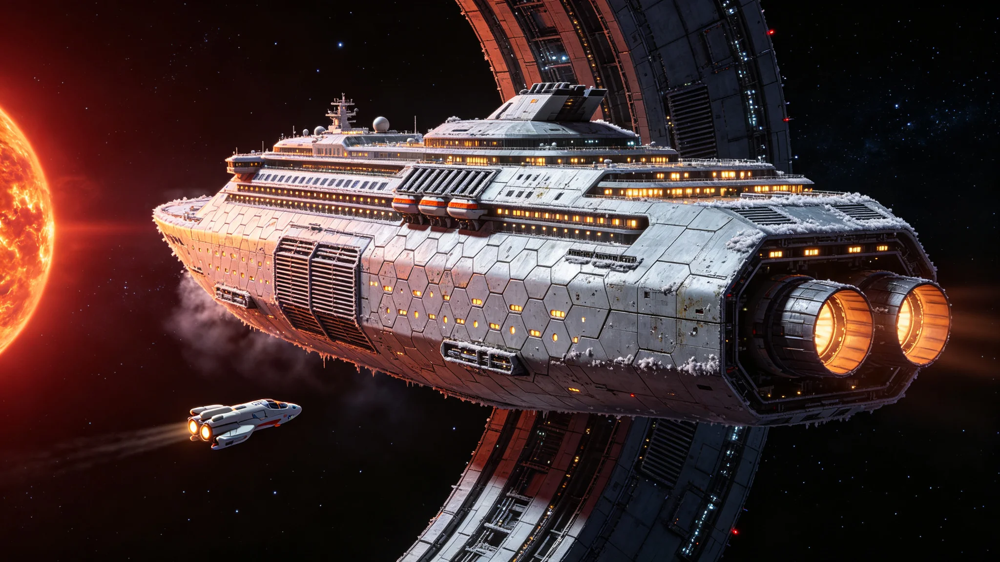

# 太阳系-比邻星b定期客运航线"星槎-02"首航运行公报与跨光年客运服务规程

**公报文号：** `PASS-SOL-PROX-2515-001`
**发布机构：** 恒星际航行局 · 跨星系客运管理处
**首航日期：** 2515年03月12日

---

## 一、航线概述

太阳系—比邻星b定期客运航线于2515年03月12日正式开通，首航班轮"星槎-02"从天梭-03中继港启航，目的地比邻星b"新海安"晨昏定居带轨道港。本航线为人类首条跨恒星系定期客运航线，采用单程直达、双向对开班次制，设计发车间隔18个月。

航线全长4.24光年，班轮巡航速度0.22c，单程航行时间约19.3年（含加速段3.5年、巡航段12.3年、减速段3.5年）。通信单向延迟4.24年，班轮与两端港口间采用激光+无线电双链路存储转发机制，航班期间每72小时发射一次数据舱。

## 二、班轮技术参数

"星槎-02"为专门设计的跨光年客运班轮，总长2,800米，最大直径340米，O'Neill自转环提供0.85g人工重力。额定载客量1,200人，乘务与保障人员380人。生态闭环度99.4%，聚变脉冲推进系统巡航推力0.004g，辐射屏蔽采用水层+硼化复合材料+主动磁场三重防护。

舱室分区：一等世代居住舱（全程清醒，独立宽敞居住单元）400席；二等标准舱（全程清醒，独立居住单元）600席；三等集体舱（公共居住区，配工分置换机制）200席。所有舱室均为全封闭加压金属结构，配备独立生命维持备份系统。

## 三、客运服务规程

### 3.1 登船与出港

乘客须于启航前90天抵达天梭-03中继港，进行为期60天的深空适应性训练与医学筛查。登船前30天进入隔离观察期，执行三级深空检疫规程：

- 一级检疫（登船前90天）：全身体检、病原体筛查、心理评估、辐射基线测定
- 二级检疫（登船前30天）：封闭隔离观察，肠道菌群与皮肤微生物群落建档，接种跨星系标准疫苗谱
- 三级检疫（登船前72小时）：终末消毒，个人物品辐照灭菌，植入航程健康监测芯片

### 3.2 航程服务

全程清醒乘客按功能社区组织，设农业、制造、教育、医疗、文娱五个工分置换岗位体系。乘客可自愿参与船上劳动获取工分，用于升级舱室、购买额外配给或预订比邻星b落地后的安置优先权。

一等世代居住舱乘客全程清醒，按船上作息轮换参与生态系统维护与值守岗位。长期航渡中须完成规定的体能训练与认知刺激疗程，以减缓低重力与封闭环境导致的骨质疏松与认知衰退。

### 3.3 深空检疫与生物安全

跨光年客运执行最严格的生物安全规程。所有乘客及携带物品在登船前与离船前均须经过双向检疫：太阳系出港检疫防止地球已知病原体进入比邻星b生态系统；比邻星b入港检疫防止比邻星b原生微生物（已确认存在非致病性原生微生物群落）随返程乘客带回太阳系。

班轮设独立生物安全舱段，配备四级生物安全实验室，航程中持续监测舱内微生物群落漂移。任何异常菌群爆发须在2小时内启动隔离程序，受影响舱段封闭至抵达目的港后由地面生物安全机构处置。

### 3.4 抵达与离船

班轮抵达比邻星b轨道港后，乘客须在港内隔离观察区停留30天，完成入港检疫流程。检疫通过后，由定居带管理处按预先登记的安置方案分配居住地。一等舱乘客享有"新海安"核心区安置优先权，二等舱按工分积分排序，三等舱由管理处统一调配至外围拓荒区。

返程航班"星槎-02"将于抵达后第90天启航返回太阳系，执行相同的客运服务规程与双向检疫。

## 四、首航运行数据

首航"星槎-02"于2515年03月12日08:00 UTC准时启航，载客1,187人（一等384人、二等598人、三等205人），乘务人员376人。启航时主推进点火正常，加速度0.0041g，3小时后进入持续加速阶段。

首航载荷：聚变燃料氘-氦-3 380吨（含40%储备）、水120万吨、生态循环系统备件、乘客个人物品总重2,400吨、太阳系至比邻星b邮件与数据舱12吨、贸易货物860吨。

预计抵达时间：2534年07月（比邻星b本地时）。

---

*恒星际航行局局长：* 陆远航
*跨星系客运管理处处长：* 苏珊娜·穆勒
*星槎-02首任船长：* 陈守航

> *首航日志摘录：* 启航命令下达后，整艘船轻轻震动了一下，然后是持续的低沉嗡鸣。陈守航船长看着推力曲线平稳上升，对大副说："记上，2515年3月12日，星槎-02，走了。"窗外太阳系在身后越来越小，前方是比邻星，还要飞19年。舷窗外的星光和165年前ARK-01乘员看到的一样，但这一次，船上的人知道目的地有人在等。
