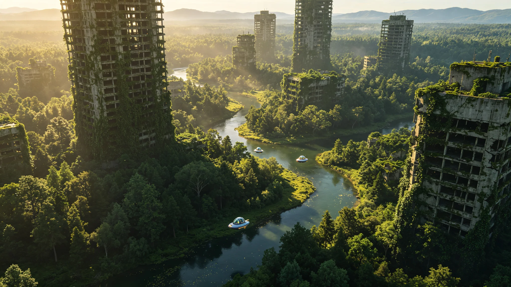

# 太阳系地球"原乡保护区"全域野化百年评估公报与人类居住限制执行清册

**公报文号：** `ECO-EARTH-RESERVE-2610-100Y`
**发布机构：** 太阳系原乡保护区管理委员会 · 地球生态监测局 · 居住限制执行处
**评估基准日：** 2610年05月20日

---

## 一、保护区概述

地球于2510年经太阳系议会决议全域划为"原乡保护区"，执行全域野化与人类居住限制政策。至2610年，野化进程已满100年。本公报基于百年累计监测数据，对地球生态系统恢复状况进行系统评估，并发布人类居住限制执行清册。

保护区管理原则：最小干预、自然恢复、严格准入。除经批准的科研监测人员与维护人员外，禁止任何形式的永久居住与资源开发。保护区总面积5.1亿平方公里（含陆地1.49亿平方公里与海洋3.61亿平方公里），划分为核心区（70%，完全禁止人类进入）、缓冲区（25%，允许经批准的科研活动）与过渡区（5%，允许有限的维护与监测设施）。

## 二、百年生态恢复评估

### 2.1 大气与气候

| 指标 | 2510年基准 | 2610年实测 | 变化 |
|---|---|---|---|
| 大气CO₂浓度 | 412 ppm | 278 ppm | -32.5% |
| 大气甲烷浓度 | 1,890 ppb | 745 ppb | -60.6% |
| 全球平均气温 | +1.8°C（相对前工业） | +0.4°C | -1.4°C |
| 海平面 | +0.62米（相对2000年） | +0.31米 | 回落0.31米 |
| 海洋pH值 | 8.05 | 8.18 | 酸化逆转 |
| 臭氧层（南极空洞） | 22.1 DU | 285 DU（已闭合） | 完全恢复 |

大气成分的显著改善主要源于：人类能源消费全面迁移至轨道与外星（地球表面化石燃料消费降至零）、大规模工业排放停止、森林与海洋生态系统恢复增强碳汇。全球平均气温回落至接近前工业水平，极端天气事件频率下降67%。

### 2.2 陆地生态系统

**森林覆盖率**：从2510年的31.8%恢复至2610年的67.4%。其中：

- 原欧亚大陆温带森林带：森林覆盖率从28%恢复至72%，主要树种为栎属、山毛榉属、松属的自然混交林
- 原北美大陆东部：落叶阔叶林覆盖率从35%恢复至78%，阿巴拉契亚山脉区域已恢复至原始林状态
- 原亚马逊流域：热带雨林覆盖率从62%恢复至91%，此前被砍伐区域已完成次生演替
- 原撒哈拉以南非洲：稀树草原面积稳定，局部区域因降水增加向森林过渡
- 原东亚大陆：森林覆盖率从22%恢复至65%，原都市带（如长三角、珠三角、京津冀）已被温带落叶阔叶林完全覆盖，仅存少量建筑遗迹作为地标

**生物多样性**：陆地脊椎动物种群数量较2510年平均增长218%。此前濒危物种中，83%已脱离濒危状态，12%种群数量恢复至历史峰值水平。大型食肉动物（狼、熊、大型猫科动物）的栖息地范围扩大了340%，已重新进入原人类密集居住区。

**土壤与水文**：表层土壤有机质含量平均增加45%，土壤侵蚀速率下降82%。河流系统已恢复自然洪泛过程，原人工堤防90%已自然溃决或被拆除，洪泛平原重新连通。地下水水位平均回升12米，原超采区已完全恢复。

### 2.3 海洋生态系统

**海洋生物量**：海洋鱼类总生物量较2510年增长186%，珊瑚礁覆盖率从18%恢复至47%。海洋大型动物（鲸类、鲨鱼、海龟）种群数量平均增长312%。

**海洋保护区**：全域海洋均属保护区范围，禁止一切捕捞与资源开发。原渔场区域已完全恢复，鱼群结构回归自然状态。海洋塑料污染已基本降解（微塑料浓度下降94%），海洋酸化逆转。

### 2.4 人类遗迹与自然的融合

原人类聚居区的建筑遗迹经历了100年的自然侵蚀与生态演替：

- 低层建筑（<20米）：约85%已完全坍塌，被土壤与植被覆盖，仅地基轮廓可辨
- 高层建筑（20-100米）：约60%仍部分矗立，结构钢筋锈蚀膨胀导致混凝土剥落，建筑表面被藤蔓与苔藓覆盖，内部已成为鸟类与小型哺乳动物的栖息地
- 超高层建筑（>100米）：约30%仍矗立，其中部分因结构失稳发生倾斜或局部坍塌，成为独特的"人造悬崖"生态位
- 基础设施（公路、铁路、桥梁）：90%已被植被覆盖或自然损毁，仅少量高海拔/干旱区域的路段仍可辨识
- 地下设施（地铁、地下管网）：约70%已进水坍塌，成为地下水系与洞穴生物的栖息地

## 三、人类居住限制执行清册

### 3.1 居住人口统计

截至2610年05月20日，地球表面经批准的常驻人口为：

| 类别 | 人数 | 分布 |
|---|---|---|
| 生态监测人员 | 284人 | 12个监测站（缓冲区） |
| 维护与工程人员 | 156人 | 8个维护基地（过渡区） |
| 科研人员（短期） | 平均在站92人 | 流动，驻留期<6个月 |
| 保护区管理机构 | 48人 | 1个管理中心（过渡区） |
| **合计** | **580人** | |

此外，每年约有1,200-1,500人次经批准进入保护区进行短期科研、教育或维护活动，单次驻留期不超过30天。

### 3.2 禁止事项清单

以下行为在保护区全域严格禁止：

1. 永久居住与家庭定居（经批准的工作人员宿舍除外，且不得携带家属）
2. 任何形式的农业、林业、渔业与畜牧业生产
3. 矿产资源开发与能源开采
4. 工业生产与制造活动
5. 机动车与航空器在核心区的运行（监测用全封闭加压无人载具除外）
6. 引入非原生物种（经科学委员会批准的生态恢复项目除外）
7. 建造新的永久性建筑（监测与维护设施除外，且须为可移除式模块化结构）
8. 燃放烟花、篝火等明火活动（核心区内完全禁止，缓冲区与过渡区仅限设施内受控火源）
9. 丢弃任何废弃物（所有进入保护区的物品须登记并带离）
10. 干扰野生动物的自然行为（科研观察须保持50米以上距离，不得投喂或诱导）

### 3.3 违规处置记录

2510—2610年间，共记录违规事件147起：

- 未经批准进入保护区：89起（其中67起为个人探险行为，22起为商业偷渡）
- 非法采集生物样本：28起
- 非法丢弃废弃物：19起
- 其他违规：11起

所有违规者均被处以经济处罚（平均罚款相当于3年平均收入）与禁入处罚（禁入期5-20年），其中12起情节严重者被移送司法机关追究刑事责任。违规事件发生率呈下降趋势，近10年（2600—2610）年均违规事件2.3起，较首个十年（2510—2520）的年均8.7起下降73.6%。

## 四、评估结论与展望

### 4.1 主要结论

1. 地球生态系统在人类撤离后100年内实现了显著恢复，大气、气候、陆地与海洋生态指标均大幅改善，多数指标已接近或达到前工业时代水平。
2. 野化进程符合生态演替理论，未出现不可逆转的生态崩溃或异常演替。生物多样性恢复速度快于预期，主要得益于栖息地连通性的恢复与人类压力的完全消除。
3. 人类居住限制政策执行有效，常驻人口控制在设计目标（<1,000人）以内，违规事件率持续下降。
4. 原人类建筑遗迹与自然生态的融合产生了独特的"次生文化景观"，具有生态与历史双重价值，建议将部分保存完好的遗迹列为文化遗产保护点。

### 4.2 下一个百年展望

预计2610—2710年间，地球生态系统将继续向顶级群落演替，森林覆盖率有望达到75-80%，生物多样性恢复至全新世中期水平。大气CO₂浓度可能进一步降至260-270ppm，全球气候进入新的稳定态。

保护区管理将继续坚持最小干预原则，但需关注以下长期问题：

- 原核设施与化工厂址的长期监测与维护（部分设施仍需人工监控以防止泄漏）
- 入侵物种的持续防控（此前人类引入的非原生物种中，约17%仍未被自然生态系统完全同化或清除）
- 文化遗产遗迹的保护与自然侵蚀之间的平衡
- 人类"原乡情结"与保护区准入限制之间的社会张力（每年约有10,000-15,000人申请进入保护区"寻根"，批准率约8%）

---

*太阳系原乡保护区管理委员会主任：* 林归野
*地球生态监测局局长：* 艾米丽·罗德里格斯
*居住限制执行处处长：* 赵守界

> *监测日志摘录：* 2610年5月20日，监测员陈青叶驾驶全封闭加压无人载具飞越原长三角区域。下方是连绵的森林，栎树和山毛榉的树冠在初夏的阳光下泛着深浅不一的绿。她在原东方明珠塔的位置上空盘旋了一圈——那座塔还在，但已经倾斜了大约15度，塔身爬满了常春藤，顶端的天线早已锈蚀断裂，一群白鹭在塔身上筑了巢。她在日志里写："原上海，东经121.5度，北纬31.2度，森林覆盖度94%，未见人类活动痕迹。东方明珠塔，结构倾斜，鸟类栖息，建议列为文化遗产保护点。"她没有写的是，她的曾曾祖父就出生在这座塔脚下的城市里。但那是100多年前的事了。现在这里是森林，是白鹭的家，是地球的。
