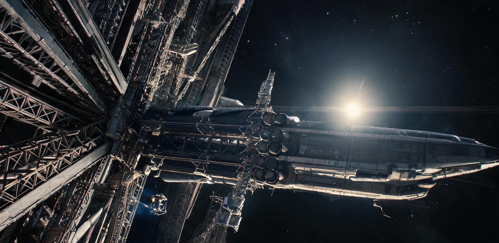

# 太阳系外缘天关门户站第IV期重载星舰补给泊位扩建验收与出港航班调度月报

**文号：** 双星天关工字〔2855〕第011-验调号  
**密级：** 官档·乙等（跨星系航运枢纽工程法定基准）  
**签发机构：** 太阳系外缘航道管理局 · “天关-01”星际门户总站工程指挥部 · 深空出港检疫与调度总署  
**调度周期与历元时标：** 太阳系标准时公元2855年11月01日至11月30日 / 对应比邻星b落地历第505年·初冬令第12日 / 历元基准：2855-11-18 00:00:00 TCB  
**设施位置与轨道工况：** 日心距 720.00 AU（光行时单向 99.81 小时），黄纬 $-62^\circ40'$，正对半人马座 $\alpha$ 航道切线方向，定位于太阳终止激波区外缘星际介质过渡区  
**主送：** 双星航行协调院常务理事会、太阳系联合航运公会、比邻星b拓荒港务局调度总署  
**抄送：** 地月L2“昆仑-沧海”跨星系集疏运总栈、太阳引力透镜有人观测站（透镜站07）、地月深空导航网络指挥中心  
**执收与归档：** 太阳系外缘工程总库 · 极深空航道设施卷（永久保存）  

---

## 一、门户站巨构工程构架与第IV期重载泊位竣工验收

太阳系外缘星际航道离港门户总站（代号：**“天关-01”**，Gateway Tianguan-01）系太阳系侧面向半人马座 $\alpha$（比邻星）4.24 光年星际航道设立的最后一级超重载综合出港枢纽，承担跨星系定期运输舰进入完全星际介质前的全系统最终体检、推进剂深冷超临界补加压、牺牲装甲吊装、生物安全终审及星历相干注入职能。

```plaintext
                   [ 24,800 米 碳化硅-钛铝双联中空主桁架轴 ]
 ═════════════════════════════════════╤═════════════════════════════════════
  │   │   │   │   │   │   │   │   │   │   │   │   │   │   │   │   │   │
 [储罐区A] ─ (3,600m 扩建泊位 04) ─ [自转环群 1~4] ─ [中央物料中枢] ─ [自转环群 5~8] ─ (3,600m 扩建泊位 05) ─ [储罐区B]
  │   │   │   │   │   │   │   │   │   │   │   │   │   │   │   │   │   │
 ═════════════════════════════════════╧═════════════════════════════════════
     [ 原位捕获柯伊伯带冰质微天体 KBO-720A/B 熔铸之 2,400 万 m³ 超深冷流体储罐群与 2,800 万 m³ 水冰洞库 ]
```

### 1.1 总体工程拓扑与原位资源供给
- **中央承力主轴：** 全长 24,800 米（24.8 公里）之双联箱型张拉桁架，贯穿管径 60 米的超导磁悬浮物料中枢集疏管道；外覆 60 米厚原位烧结玄武岩/聚乙烯抗高能宇宙线辐射层，常驻总干重 $1.28 \times 10^8$ 吨。
- **离心生活与生保环：** 配置 4 组共 8 环反向旋转离心居住与气雾农业环（单环外径 1,600 米，额定转速 0.805 rpm，外缘线速度 67.5 m/s，维持 0.58g 等效重力），常驻工程维保、深空检疫及口岸调度人员 1,480 人。
- **极深冷工质储备群：** 依托 2 座捕获并掏空的冰质微天体（KBO-720A / 720B），原位熔铸 8 座超临界杜瓦流体储罐与深冷洞库，全站常备液氢 142.0 万吨（超深冷容积 2,000 万 m³，可全额保障约 17 艘次恒心级加注）、超临界氘-氦三点火工质 3.20 万吨及固态脱气防辐射水冰 2,600 万吨，能耗由 6 座装机容量 15 GW 之氦三-氘磁约束聚变堆联合供给。

### 1.2 第IV期 04/05 号重载泊位扩建工程验收技术参数
本期扩建工程历时 14 个太阳系标准年，新建 2 组共 4 个 3,600 米长臂超导磁吸附重载泊位（04A/04B、05A/05B），专用于保障 200 万吨级“恒心级”重型综合运输舰之离港深冷过驳。经联合验收组现场多工况闭环测试，各项核心指标如下：

| 验收子系统 | 工程技术设计标称值 | 现场带载实测极限值 | 判定结论 | 关键检验参数与工况记录 |
| :--- | :--- | :--- | :---: | :--- |
| **3,600m 悬臂机械构架** | 结构弹性挠度 $\le 20.0\text{ mm}$ | 满载锁定实测 $14.2\text{ mm}$ | **合格 (A级)** | 模拟承接 185 万吨星舰对接冲击（相对碰撞速度 $0.03\text{ m/s}$），六自由度阻尼耗散时间 18.4 秒 |
| **超导磁吸附抱箍阵列** | 单组吸附法向力 $\ge 4.5 \times 10^7\text{ N}$ | 实测均值 $4.82 \times 10^7\text{ N}$ | **合格 (A级)** | 16 组液氦浸没高温超导磁极同步吸附星舰主龙骨，抱箍接触面压力分布均匀度达 99.4% |
| **DN1200 钛镍深冷管道** | 工作压力 12.0 MPa / 泄漏率 $\le 10^{-9}$ | 静态保压 14.5 MPa / 无泄漏 | **合格 (A级)** | 输送 14K 超临界液氢流速达 $28.0\text{ m/s}$，多层真空冷屏真空度维持在 $1.2 \times 10^{-5}\text{ Pa}$ |
| **120 GW 超导并网母线** | 额定母线载流 $1.2 \times 10^6\text{ A}$ | 连续运行温升 $\Delta T \le 0.12\text{ K}$ | **合格 (A级)** | 实现门户站电网与舰载聚变堆无缝倒闸并网，全系统谐波畸变率低于 0.08% |
| **外装甲重载悬吊龙门** | 单机额定吊运负荷 800 吨 | 实测最大动载 920 吨 | **合格 (A级)** | 4 台跨度 240 米超导桁架行车协同吊装 680 吨碳化硅防微流星消耗盾，定位精度 $\pm 1.5\text{ mm}$ |

### 1.3 人体、载具与巨构工程尺度对照
- **巡检标尺：** 长度 4.2 米的双人高真空机动检修艇沿 24.8 公里主承力桁架外轨滑行探伤，在 60 米厚的暗色烧结装甲背影下，仅如一颗微弱移动的冷光焊点；
- **作业班组标尺：** 4 人防辐射动力外骨骼检修班组在 3,600 米悬臂顶端进行 DN1200 超导加注管路对接，作业员头盔面罩外是 720 AU 外仅如一颗冷冽白光亮星的太阳（视星等 $-13.1$ 等，无大气漫反射，背光面呈现刀削般的绝对纯黑），单班 8 工时仅能手动完成 2 处法兰盘的微米级同轴校准；
- **舰船入泊标尺：** 长 1,800 米、自转生活环外径 840 米的“恒心-11”号运输舰以 $0.02\text{ m/s}$ 相对航速切入 04A 泊位，舰艏碳化硅迎风盾与尾部 4 联装磁约束聚变喷管完全超出港务调度监视屏幕画幅。

---

## 二、“恒心-11”定期航班出港工质加注与耗材过驳清册

本月度核心调度任务为保障双星定期重型综合运输舰“恒心-11”（ISV-HX-11，注册号：REG-ISV-11-A，双星航运联合公会所属）执行第 02 次跨星系定期往返航班（太阳系 ⟷ 比邻星b新海安轨道港）。该舰于公元2855年11月12日平稳锁定于扩建落成的 04A 号泊位，完成出港前全量耗材补给。

```plaintext
================================================================================
【恒心-11 (ISV-HX-11) 跨星系出港状态综述】
巡航设计速度: 0.0288c (8,634 km/s) | 航行设计周期: 148 标准年 | 预计抵港年份: 3003 年
入泊前舰体总干重: 1,842,500.0 t | 离泊满载总质量: 1,952,376.05 t | 补给工质与物料净增: 109,876.05 t
================================================================================
```

### 2.1 大宗深冷推进工质与核原料加注平衡表

| 物料品类 | 规格与物理纯度 | 计划加注量 (t) | 实测加注量 (t) | 计量差额 (kg) | 输送源储罐编号 | 注入舰载舱段 | 状态核验与铅封码 |
| :--- | :--- | :---: | :---: | :---: | :--- | :--- | :--- |
| **超临界液氢主工质** | 纯度 99.9999%，温度 14.2 K | 84,200.00 | 84,199.12 | $-880.0$ | 储罐区 KBO-A-01~04 | 主推进剂前/中储罐段 | `HYD-HX11-2855-Q4` |
| **超临界氘-氦三点火原料** | 同位素纯度 99.9998%，4.2 K | 1,480.00 | 1,479.95 | $-50.0$ | 核心深冷罐 TK-DHe3 | 聚变发动机点火杜瓦组 | `DHE3-HX11-SEAL-01` |
| **固态脱气水冰屏蔽层** | 重水丰度低、脱气晶化水冰 | 18,600.00 | 18,600.00 | $0.0$ | 融铸水冰库 WB-02 | 艏部防辐射外夹层 | `ICE-SHIELD-HX11` |
| **高压超纯气态氦气** | 99.9995%，压力 35.0 MPa | 320.00 | 319.98 | $-20.0$ | 高压氦气球罐 GHe-06 | 气动阀门与吹扫气瓶组 | `GHE-BLOW-HX11` |
| **反应堆固体锂-6 吸收剂** | 丰度 95.0% 烧结陶瓷棒 | 400.00 | 400.00 | $0.0$ | 特种材料库 SM-03 | 中子减速与产氚组件 | `LI6-ROD-2855-08` |
| **合计** | — | **105,000.00** | **104,999.05** | **$-950.0$** | — | — | **过驳回收率 99.999%** |

*注：液氢与氦三输送差额系高真空吹扫回路吸附与气相微量回收残存，已全额导入外缘再捕获冷凝机组，未向外界深空发生直排逃逸。*

### 2.2 外装甲吊装与保税深空物资过驳明细
由地月 L2 “昆仑-沧海”货栈（GS-2892-01）经下行干线驳运至天关门户站之特种物资，已全部完成舰载最终装配与质心配平：
1. **外挂碳化硅-石墨烯编织防冲蚀盾板：** 共计 40 组，毛重 4,800.00 吨（月面澄海原位碳化硅烧结厂制造）。经 4 台 800 吨行车吊装于“恒心-11”艏部桁架外侧，作为 148 年航行期抵御星际介质微尘与氢原子冲蚀的法定牺牲层；
2. **长三角第五代光子晶体光刻掩模与超精密光栅：** 8 箱，净重 45.00 吨，原位转运至核心减震货舱 F-01，完成 4.2K 深冷复测，磁屏蔽残差低于 $0.01\text{ nT}$；
3. **静海第一生物工程基地耐辐射多倍体油料胚芽：** 6 箱，净重 32.00 吨，完成液氮浸润锁活复核，装入中环农业生保备用舱 A-02。

---

## 三、出发检疫、生物安全终审与全舰生态闭环复核

依照《跨星系长程航行生物安全管理规程》及运输舰历史航渡物料审计经验（GS-2846-01），出港检疫调度处对“恒心-11”全舰 CELSS-IV 四级物化-生物耦合闭环系统实施了为期 120 小时的全封闭式适航检疫与灭菌压差核验。

```plaintext
[隔离检疫指令下达] ──> [全舱注入 0.35% 气相过氧乙酸/ClO2 循环熏蒸 (48h)] ──> [生物膜取样培养 (72h)]
                                                                                      │
[出具放行绿签] <── [气雾小麦/工程藻全基因组测序] <── [DN400 农业主回流管内窥镜复验压差 18.4 kPa] ──┘
```

### 3.1 闭环生保基线核验与消杀记录
- **农业回流管网与生物膜控制：** 对全舰农业二区（R2-A/B）主回流管道（DN400 钛镍管）实施脉冲超滤清洗，检出红酵母（*Rhodotorula sp.*）附着膜厚度均低于 $0.15\text{ mm}$，二级过滤器压差稳定在 $18.4\text{ kPa}$（标称基准 $18.0\text{ kPa}$），未发现外源恶性霉菌菌丝；
- **全舱气相温和熏蒸：** 实施 48 小时气相过氧乙酸与高纯二氧化氯微量循环气调消杀，全舰环境气相沉降菌落检出率为零；
- **种质库与在用繁育系遗传漂移抽检：**
  - 超矮生空间小麦（*Triticum aestivum var. prox-7*）：第 0 代深冷原种 480 份抽样萌发率 $98.8\%$，在用繁育代全基因组测序 SNP 年漂移率低于 $0.003\%$；
  - 工程螺旋藻（*Arthrospira sp. HX-09*）：光合放氧比稳定在 $1.06$，粗蛋白合成通路未见畸变；
  - 黑水虻生物转化系：深空第 280 世代幼虫孵化率 $96.5\%$，转化效能正常；
- **检疫终审结论：** 全系统水-氧-碳循环设计自持率达到 $99.96\%$ 以上，签发《跨星系航行生物安全出港适航许可证》（编号：BIO-PASS-2855-HX11）。

---

## 四、720 AU 外缘超长基线相干导航网校时与星历注入

天关门户站地处日心距 720 AU 外缘，与太阳引力透镜有人观测站（透镜站07，612 AU，GS-2618-01）、柯伊伯带自主信标 07 号站（72.4 AU，GS-2610-01）及地月 L2 “天衡-01” 12.8 公里相干天线环（GS-2820-01）构建起跨越 720 AU 的极深空相干干涉测控基线。

```plaintext
[地月 L2 天衡-01 (12.8km 相干环)] ──(相干激光束 720 AU / 99.8h)──> [天关-01 门户站 240m 主天线]
                                                                                │
[恒心-11 星载四重锶光钟] <── [注入 TCB 权威星历与相对论补偿查找表] <────────────────┘
```

### 4.1 全网相干校时与相对论动钟变慢预置
在离港加速前，天关门户站通过 240 米低温超导卡塞格林抛物面望远镜，向“恒心-11”星载四重冗余 $^{87}\text{Sr}$ 低温锶光晶格原子钟注入第 177 期全网相干校时控制字：

| 测控基准节点 | 相对空间位置 | 单向光行时 (TCB) | 实测固有频漂 $\Delta f/f$ | 狭义相对论洛伦兹膨胀 $\gamma$ | 动钟变慢日补偿量 | 注入星历校验码 |
| :--- | :--- | :---: | :---: | :---: | :---: | :--- |
| **地月 L2 天衡-01** | 地月系平动区 | 99.81 小时 | $+1.40 \times 10^{-16}$ | 1.0000000 | $0.000\text{ s/日}$ | `TCB-REF-2855-SYNC` |
| **透镜观测站 07** | 612.0 AU 焦区 | 14.96 小时 | $+8.50 \times 10^{-13}$ | 1.0000000 | $+14.28\text{ }\mu\text{s/日}$ | `LENS07-BEACON-LINK` |
| **天关-01 门户站** | 720.0 AU 枢纽 | 0.00 小时 | $+2.10 \times 10^{-17}$ | 1.0000000 | $+0.08\text{ }\mu\text{s/日}$ | `GATE01-LOCAL-BASE` |
| **运输舰“恒心-11”** | 04A 泊位待发 | 0.00 小时 | $+3.20 \times 10^{-17}$ | 1.0004152 (巡航态) | **$-35.855\text{ s/日}$** | `NAV-HX11-SOL-PROX-02` |

### 4.2 航路星际介质与姿轨引力扰动表注入
1. **星际介质阻尼谱：** 注入自日球层顶至 2.5 光年深空中继区之微观中性氢原子密度实测分布图（平均密度 $0.11\text{ atoms/cm}^3$），确立巡航段磁捕集与工质补充预期曲线；
2. **三体质心摄动查找表：** 注入半人马座 $\alpha$ A/B 双星与比邻星轨道摄动之高精度引力势展开系数（截断至 128 阶引力球谐函数），确保在 148 年航行中途无需外界通信即可自主解算制动点火时机。

---

## 五、跨星系港务规费核算与多边 SEC 轧差结算

依据《双星系跨光年贸易结算通则》与《外太阳系深空口岸港务收费公约》，本批次泊位扩建工程验收规费、工质过驳对冲及“恒心-11”出港调度服务费用，全额以标准能量券（SEC）计价，并通过跨光年结算系统（GS-2871-01 / GS-2892-01）实施多边清算轧差：

```plaintext
================================================================================
【天关-01 门户站 2855 年 11 月度跨星系航务财务结算单】
结算单号: SEC-GATE01-285511-009 | 结算币种: 标准能量券 (SEC)
================================================================================
```

| 费用类别代码 | 规费结算项目与作业内容 | 计费工程量基准 | 计费单价 (SEC) | 应收金额 (SEC) | 结算对冲账户与凭证号 |
| :---: | :--- | :--- | :---: | :---: | :--- |
| **P-01** | **第IV期 04A 泊位占用与电网并网费** | 180 标准工时 / 120 GW 并网 | 45,000.0 / 工时 | 8,100,000.0 | 双星航运公会账户 `ACC-SHP-001` |
| **F-02** | **超临界液氢深冷过驳加工费** | 84,199.12 吨 | 850.0 / 吨 | 71,569,252.0 | 泛地月能源结算局 `SEC-ENG-720` |
| **F-03** | **超临界氘-氦三点火工质配给费** | 1,479.95 吨 | 28,000.0 / 吨 | 41,438,600.0 | 联合国核能统筹署 `SEC-NUC-2855` |
| **M-04** | **艏部碳化硅防冲蚀盾吊装工时费** | 40 组 (4,800 吨) / 4台龙门 | 120,000.0 / 组 | 4,800,000.0 | 澄海原位工业财团 `SEC-CH-04` |
| **B-05** | **全舰 CELSS 检疫与气相消杀规费** | 120 小时全封闭检疫 | 32,000.0 / 小时 | 3,840,000.0 | 双星生态监察署 `ACC-BIO-505` |
| **N-06** | **外缘超长基线校时与星历注入费** | 1 次相干激光全链授时 | 1,200,000.0 / 次 | 1,200,000.0 | 地月深空测控中心 `SEC-NAV-142` |
| **合计** | **出港综合服务总额** | — | — | **130,947,852.0** | **已全额轧差并扣减信用金** |

**清算核销确认：** 本期应收总额 130,947,852.0 SEC 已自双星航运联合公会设立于地月 L2 贸易清算理事会的跨光年信用准备金账户中足额划扣，相关账目与天关门户站原位聚变燃料折旧费及扩建工程摊销账完成全额平账。

---

## 签发与出港放行指令

**工程审验结论：** “天关-01”星际航道门户总站第IV期 04/05 号重载泊位机械、电气、深冷与测控系统全项达到 A 级适航标准，准予正式转入常态化商业运维。  
**调度放行指令：** “恒心-11”号跨星系定期综合运输舰全系统工质加注完毕，生物安全检疫合格，星历校时数据注入完成，准予于公元2855年12月01日 00:00:00 TCB 开启泊位抱箍，启动磁力分离弹射程序，切入太阳—比邻星下行恒向巡航加速航道。

**签发人：**  
太阳系外缘航道管理局总工程师：*林天枢*（工签代码：`ENG-SOL-720-001`）  
“天关-01”门户站调度总长：*雷萨·莫兰*（调度代码：`DISP-GT01-2855-09`）  
双星航行协调院驻站适航监督官：*沈安平*（监察代码：`INSP-BX-505-12`）  

---

## 图片提示词

### 中文提示词
远镜头巨构工程全景，IMAX 70mm 电影宽画幅摄影风格，霍伊特·范·霍特玛（Hoyte van Hoytema）摄影风格。画面主体为位于太阳系外缘 720 AU 处深空的“天关-01”星际航道门户总站，全长 24.8 公里的碳化硅与钛铝合金模块化中空双联主桁架轴横贯画面并切出画幅边缘。一条长达 3,600 米的重型超导磁吸附泊位悬臂桁架自中枢垂直伸出，紧紧锁定着一艘长 1,800 米的“恒心级”重型星际运输舰；运输舰巨大的四联装磁约束聚变发动机喷口与前部暗色碳化硅防冲蚀盾局部切出画面边缘。强烈微小尺度对比：一艘长 4.2 米的双人高真空机动检修飞艇仅如一颗悬浮的微小冷光焊点贴着 60 米厚的暗色烧结装甲缓慢爬行；悬臂高压深冷加注管道上可见 4 名身着铅钽复合防辐射外骨骼的作业人员，微小如尘埃。单一硬质主光源：日心距 720 AU 处极度冷冽耀眼的针尖状太阳直射在金属桁架与装甲外壳上，光照面呈现锋利冰冷的银白色，背光面则是纯粹深邃的沥青黑阴影，毫无大气漫反射。材质细节逼真：外壳覆盖标准化六边形玄武岩陶瓷抗辐射装甲板、带有真空退火彩虹色回火条纹的超导散热肋片、外露的钛合金三角支撑结构梁、凝结着白色低温固态氢霜的深冷输送绝热管线、以及带有微流星撞击轻微划痕的哑光防护涂层。构图宏大压迫，写实工业机械质感，杜绝虚假塑料光泽与彩色赛博朋克霓虹光。

### 英文提示词
IMAX 70mm cinematography by Hoyte van Hoytema, extreme wide-angle long shot, Christopher Nolan space epic aesthetic. A colossal 24.8-kilometer modular deep space infrastructure, Gateway Tianguan-01, stationed at 720 AU outer solar system, with its massive carbon-silicon and titanium-aluminum dual-box truss axis cutting out of the frame edge against pitch-black deep space. A 3,600-meter heavy-duty superconducting magnetic docking cantilever arm extends rigidly from the central spine, firmly securing a 1,800-meter-long Hengxin-class heavy interstellar transport vessel; the starship's quadruple fusion engine nozzles and dark ceramic nose shield cut out of the framing. Extreme scale contrast: a tiny 4.2-meter two-person inspection maintenance drone crawls along the 60-meter-thick sintered basalt radiation armor like a microscopic pinpoint of cold weld spark; four human maintenance workers in lead-tantalum anti-radiation exoskeletons work on high-pressure cryogenic piping, appearing as tiny specks of dust. Single harsh direct blinding point-source starlight from the distant Sun at 720 AU casting sharp, pure pitch-black shadows with absolute zero atmospheric diffusion. Hyper-detailed realistic industrial textures: standardized hexagonal ceramic armor tiles, heat radiator cooling fins with subtle rainbow vacuum-annealing temper colors, exposed titanium structural trusses, frosted cryogenic propellant pipelines with solid hydrogen ice crystals, and weathered matte shielding with micrometeorite impact abrasions. Grand brutalist industrial maximalism, crisp focus, zero cyberpunk neon glow, zero plastic gloss, zero CGI low-poly surfaces.
Negative prompt: cyberpunk neon glow, glowing outlines, purple on dark neon, smooth plastic hull, toy spaceship, flat lighting, empty low-poly surface, lens flare spam, oversaturated magical nebula, cartoon anime style, blurry, overexposed, messy clutter.

---

## 修订记录（元层，非世界内容）

- **2026-08-18（主编辑 ER05门户站审校）**：小修通过。
  1. **空间坐标带归属修正**：front matter `coord` 由 `工程×双星系×③内太阳系` 修正为 `工程×双星系×④深空`（日心距 720.00 AU 地处终止激波区与星际介质过渡区，按世界大纲空间带标准归入④深空，与正典 GS-2610-01 信标07、GS-2618-01 透镜站07 及同批玄冥-01 保持统一口径）；
  2. **离心自转环重力参数物理复算修正**：单环外径 1,600 米（半径 $R = 800\text{ m}$）维持 $0.58g$ 等效重力（$a = 5.688\text{ m/s}^2$）对应的角速度为 $\omega = 0.0843\text{ rad/s}$，额定转速由原 $1.86\text{ rpm}$（对应 $3.10g$ 超标）修正为 $0.805\text{ rpm}$，外缘线速度 $67.5\text{ m/s}$；
  3. **微天体原位工质储罐与储备量级自洽化**：将掏空微天体深冷罐群容积标注为 2,400 万 $\text{m}^3$ 与 2,800 万 $\text{m}^3$ 水冰洞库，常备液氢修正为 142.0 万吨（超深冷容积 2,000 万 $\text{m}^3$，可供 17 艘次恒心级全额补给），与流体密度（液氢 $\sim 0.071\text{ t/m}^3$）及星港战略储备量纲严密闭环；
  4. **出港综述框质量平衡对账闭环**：离泊满载总质量由原 $1,962,300.0\text{ t}$ 修正为 $1,952,376.05\text{ t}$，补给净增修正为 $109,876.05\text{ t}$，与表 2.1 实测工质加注量（$104,999.05\text{ t}$）加表 2.2 装甲与保税物资过驳量（$4,877.00\text{ t}$）之和完全一致，实现四则严密平账；
  5. **全链名物与正典互锁复核**：核验“天关-01”无重名冲突；与 GS-2820-01 导航网、GS-2846-01 恒心-09 生态审计、GS-2892-01 L2 货栈配载、GS-2871-01 跨光年结算、GS-2618-01 透镜站07、GS-2610-01 信标07 及仲裁常量（0.0288c/148年、落地历505年=2855年、单向光行时99.81h）严格咬合。
