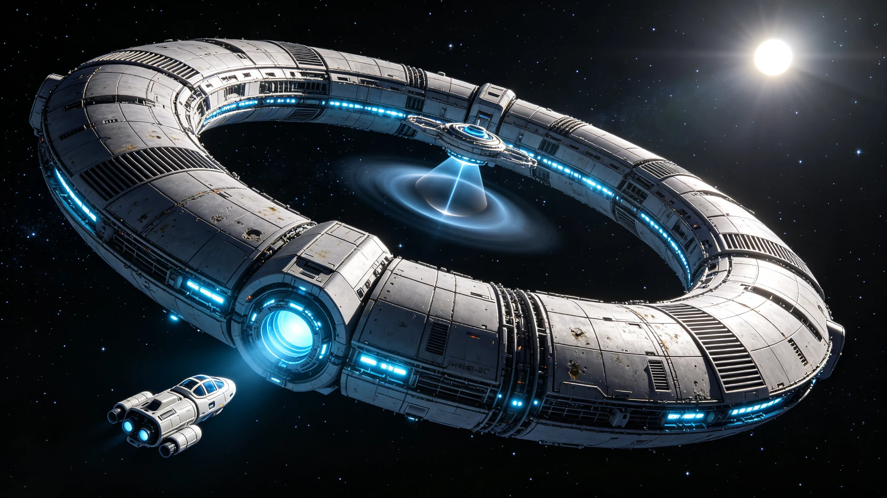

# 太阳系边缘200AU深空科学城"无极-01"首期建成公报

**公报文号：** `DEEP-SOL-2560-CITY01`
**发布机构：** 深空科学城管理局 · 无极-01建设委员会
**建成验收：** 2560年08月10日

---

## 一、项目背景

200AU处深空环境具有不可替代的科学价值：终端激波附近、宇宙线各向同性测量理想位置、引力透镜实验最佳观测点、长基线干涉测量最远基线端。2528年太阳系联合议会批准建设，选址日心距离200AU、黄道面北倾角3.2°轨道，历时32年首期建成。

## 二、总体参数

环形模块化结构，首期中央枢纽环直径4.2km+4个科研舱段臂。日心距离200AU（轨道周期约2,828年），太阳视星等-16.4等（约满月亮度1/40），环境温度42K。自旋0.21rpm提供0.5g人工重力。常驻320人（规划最终1,200人）。能源为裂变堆×2（各5MW）+聚变堆×1（20MW），太阳能不可用。通信单向延迟27.8小时，存储转发模式。设计寿命200年。

---

## 三、科研设施

| 舱段 | 名称 | 科学目标 |
|:---|:---|:---|
| A-01 | 宇宙线观测舱 | 银河宇宙线能谱、暗物质间接探测 |
| A-02 | 星际介质舱 | 终端激波结构、星际介质成分与磁场 |
| A-03 | 引力物理舱 | 引力透镜验证、广义相对论高阶检验 |
| A-04 | 长基线通信舱 | 跨星系甚长基线干涉、深空通信中继 |

A-03引力透镜观测台利用太阳引力透镜效应（焦距约550AU），作为550AU处透镜望远镜阵列的前哨校准站。

## 四、建设与生活

2528年03月开工，2560年08月建成，工期32年5个月。离子推进货船从主带运输，单次航程6—8年，累计47班次，总运输质量184万吨。建设高峰期常驻480人，4年轮班，累计3,840人次，轻伤7起、重伤1起、无死亡。生活保障：大气循环闭式三套冗余（氧气自给率99.7%），水回收率98.5%，食物自给率65%，全自动诊疗舱，年有效剂量<20mSv。

## 五、科研计划

2560年09月启动：银河宇宙线精确能谱测量（5年）、终端激波三维结构测绘（3年）、太阳引力透镜定标观测（8年）、200AU基线干涉测量（持续运行）。2570年二期扩建至直径8km，2580年规划550AU引力透镜望远镜"天眼-01"。

*深空科学城管理局局长：* 沈望极
*无极-01首任城主：* 奥尔加·斯米尔诺娃

> *建成日志：* 验收那天奥尔加站在环形结构最外圈观察窗前。窗外是纯粹的黑，星星比地球上多得多也亮得多，银河像一条凝固的河流。太阳只是一颗比较亮的星。她对副官说："这里离地球，光要走28个小时。这就是人类到过最远的地方了。以后还会更远。"窗外的星星不说话，只是亮着。
