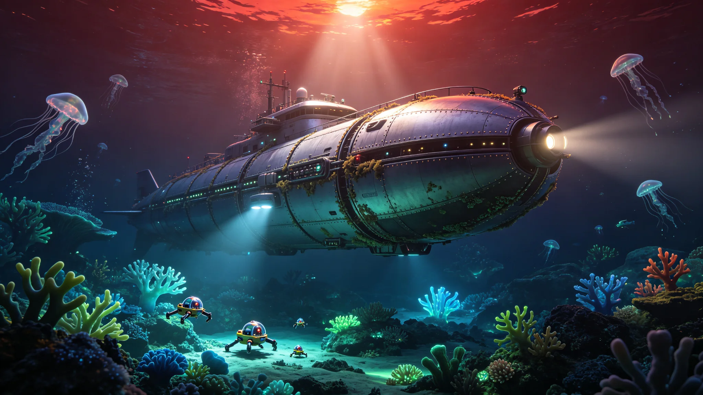

# 巴纳德星b"绿原"大陆架原生海洋生态系统首次科学普查公报与生物多样性编目

**公报文号：** `BIO-BARN-GREEN-2640-OCEAN01`
**发布机构：** 绿原定居点科学管理委员会 · 海洋生态研究所 · 外星生物安全审查办公室
**普查周期：** 2638年03月—2640年09月

---

## 一、普查概述

巴纳德星b"绿原"大陆架原生海洋生态系统首次系统性科学普查于2638年03月启动，2640年09月完成第一阶段调查。本次普查是人类在第二个恒星系开展的首次大规模海洋生态调查，覆盖绿原定居点以东大陆架区域（面积约120万平方公里，水深0-500米），旨在建立巴纳德星b海洋生物多样性基线编目、评估海洋生态系统结构与功能、评估外星生命对人类定居点的生物安全风险。

普查队由86名科研人员组成，配备全封闭加压深海调查潜航器"观澜-绿原"号（最大潜深1,200米，乘员6人，自持力30天）、全封闭加压遥控水下探测器12台、表层水采样艇4艘、岸基实验室2座。所有采样与调查活动均在严格的生物安全隔离条件下进行，样本在四级生物安全实验室内处理。

## 二、海洋环境参数

### 2.1 物理化学参数

普查区域海洋环境参数如下：

| 参数 | 测量值 | 备注 |
|---|---|---|
| 表层水温 | -2°C 至 +8°C | 随季节与纬度变化，冰点因高盐度降低 |
| 深层水温（500米） | -4°C | 相对稳定 |
| 盐度 | 42-48 PSU | 高于地球海洋（35 PSU），主要溶解盐为氯化镁与硫酸钠 |
| pH值 | 7.8-8.2 | 弱碱性，接近地球海洋 |
| 溶解氧 | 2.1-4.8 mg/L | 低于地球海洋表层（约8 mg/L），生物需氧量较低 |
| 溶解甲烷 | 0.05-0.32 mg/L | 显著高于地球海洋，可能来自地质来源与生物代谢 |
| 透光层深度 | 18-35米 | 巴纳德星光度低，红光为主，光合作用有效辐射仅为地球的0.4% |
| 表层叶绿素类似物浓度 | 0.08-0.45 mg/m³ | 低于地球富营养海域，但高于寡营养海域 |

### 2.2 海洋地质与地形

普查区域大陆架宽度约180公里，坡度平缓（平均坡度0.3°），海底覆盖以细粒沉积物为主，有机质含量较高（平均4.2%）。大陆架边缘存在明显的坡折带，水深从约150米迅速下降至2,000米以上。海底热液活动较弱，仅发现2处低温热液喷口（温度比周围海水高3-5°C）。

## 三、生物多样性编目

### 3.1 生物化学基础

通过对采集样本的生物化学分析，确认巴纳德星b海洋生命具有以下基础特征：

- **溶剂系统**：以水为基础溶剂，但细胞内液含有较高浓度的多元醇（甘油、山梨醇类似物）作为抗冻剂，适应低温环境
- **手性**：氨基酸以D型为主（地球生命为L型），糖类以L型为主（地球生命为D型），与地球生命形成镜像手性
- **遗传物质**：未发现DNA或RNA，疑似采用一种含硼的聚合物作为信息存储分子（暂命名为"BNA"，硼核酸），其结构与功能尚在研究中
- **能量代谢**：光合作用不使用叶绿素，而使用一种含钒的金属蛋白（暂命名为"钒绿素"），吸收光谱峰值在680-750纳米（深红/近红外），与巴纳德星的光谱特征匹配
- **细胞膜**：细胞膜脂质为异戊二烯醚类（类似地球古菌），而非脂肪酸酯类，在低温高盐环境下更稳定

**重要结论**：巴纳德星b生命与地球生命在生物化学基础上完全不兼容。D型氨基酸与L型糖意味着地球生物无法消化巴纳德星b生物（反之亦然），BNA遗传物质意味着不存在水平基因转移的可能。这一发现从根本上降低了跨星球生物污染的风险，但也意味着巴纳德星b生态系统对人类而言是完全独立的生命体系。

### 3.2 已编目物种清单

截至普查第一阶段结束，共编目海洋生物物种（含疑似物种）347种，按营养级分类如下：

**生产者（128种）**：
- 浮游"藻类"：67种，单细胞或简单多细胞，含钒绿素，大小2-200微米。优势类群为"红雾藻"（一种形成表层水华的丝状生物，使海水呈现暗红色）
- 底栖"藻类"：41种，附着于岩石或沉积物表面，形成类似海藻床的群落，最大个体可达3米长
- 共生"藻类"：20种，与动物形成共生关系，类似地球珊瑚虫与虫黄藻的共生

**消费者（186种）**：
- 浮游动物：54种，以浮游"藻类"为食，大小0.1-10毫米。优势类群为"晶虫"（一种透明的节肢动物类似物，具几丁质外骨骼）
- 底栖无脊椎动物：98种，包括：
  - "管虫"类似物：23种，栖息于U形管中，滤食性
  - "海星"类似物：12种，五辐对称，捕食性
  - "螺"类似物：31种，具碳酸钙外壳，草食或腐食
  - "海参"类似物：18种，沉积食性
  - 其他：14种
- 游泳动物：34种，包括：
  - "鱼"类似物：22种，脊椎动物类似物（内骨骼为软骨而非硬骨），大小5厘米至1.2米，用鳃呼吸，血液含钒（而非铁）作为氧载体
  - 头足类类似物：8种，软体动物，具触手与内壳，最大个体可达2米
  - 其他游泳动物：4种

**顶级捕食者（7种）**：
- "鲨"类似物：3种，大型软骨"鱼"，最大个体可达4米，处于食物链顶端
- 大型头足类：2种，深海捕食者
- 其他：2种

**分解者（26种）**：
- 各种"细菌"与"古菌"类似物，参与有机质分解与生物地球化学循环。其中甲烷产生菌活性较高，是海洋溶解甲烷的重要生物来源。

### 3.3 生态系统结构

巴纳德星b大陆架海洋生态系统呈现以下结构特征：

- **低生产力但高稳定性**：因巴纳德星光度极低，海洋初级生产力仅为地球大陆架的约12%，但生态系统结构稳定，物种间竞争强度较低
- **长食物链与低代谢率**：低温环境导致生物代谢率普遍较低，食物链较长（可达5-6个营养级，地球海洋通常为3-4级），生物寿命较长（优势"鱼类"寿命估计可达80-120年）
- **生物发光普遍**：约62%的已编目物种具有生物发光能力，用于通讯、伪装或诱捕猎物，发光颜色以蓝绿色为主
- **共生关系发达**：约34%的动物物种与"藻类"或其他微生物形成共生关系，以补充营养来源
- **缺乏大型植食动物**：海洋中未发现类似地球鲸类或海牛的大型植食动物，可能因生产力不足以支撑大型恒温动物

## 四、生物安全评估

### 4.1 风险评估

基于生物化学不兼容性的发现，巴纳德星b海洋生命对人类的生物安全风险评估如下：

| 风险类型 | 风险等级 | 说明 |
|---|---|---|
| 病原体感染 | 极低 | D型氨基酸/BNA生命无法感染地球生物，不存在致病可能 |
| 毒素危害 | 低-中 | 部分物种可能产生对地球生物有毒的代谢产物，需通过接触与摄入测试确认 |
| 生态入侵 | 极低 | 双向生态入侵均不可能（生物化学不兼容导致无法在对方生态系统中存活） |
| 过敏反应 | 低 | 部分蛋白质可能引发人类过敏，但因D型氨基酸结构，致敏性预计低于地球生物 |

### 4.2 安全规程

普查期间执行以下生物安全规程：

1. 所有潜航器与采样设备在出海前进行表面消毒，返回后进行二次消毒
2. 所有生物样本在四级生物安全实验室内处理，操作人员穿戴全封闭加压防护服
3. 禁止任何巴纳德星b生物样本进入人类居住舱段
4. 禁止在海洋中游泳或直接接触海水（所有采样通过机械臂完成）
5. 所有废水经过滤与高温灭菌后排放
6. 建立海洋生物监测站，持续监测定居点附近海域的生物活动与异常变化

## 五、后续工作计划

第一阶段普查仅覆盖绿原大陆架120万平方公里区域，约占巴纳德星b海洋总面积的0.8%。后续计划：

- 第二阶段（2641—2645）：扩展至大陆坡与深海平原（水深500-4,000米），预计新增编目物种500-800种
- 第三阶段（2646—2655）：覆盖全球海洋，建立完整的巴纳德星b海洋生物多样性编目
- 长期监测：在大陆架建立5个永久海洋生态监测站，持续监测生态系统变化

---

*绿原定居点科学管理委员会主任：* 方海生
*海洋生态研究所所长：* 汉斯·穆勒
*外星生物安全审查办公室主任：* 苏卫宁

> *普查日志摘录：* "观澜-绿原"号潜航器在水深120米的大陆架边缘悬停。探照灯扫过海底，一片暗红色的"海藻"床在水流中缓缓摆动，像一块巨大的、呼吸着的地毯。几条半透明的"鱼"游过，它们的血液是淡蓝色的（含钒），眼睛在探照灯下反射出银色的光。首席科学家汉斯·穆勒盯着舷窗外的景象，在采样日志上写："2640年8月3日，水深120米，绿原大陆架东缘。目击物种：红雾藻（底栖型）、晶虫群、蓝血鱼（暂定名，3条，体长约40厘米）。海水温度-1°C，盐度45 PSU。一切正常，无异常生物活动。"他写完后，在舷窗前站了很久。窗外的世界是活的，但又是完全陌生的。这些生物和人类之间隔着的不是4.24光年的距离，而是生命本身的另一种写法。
