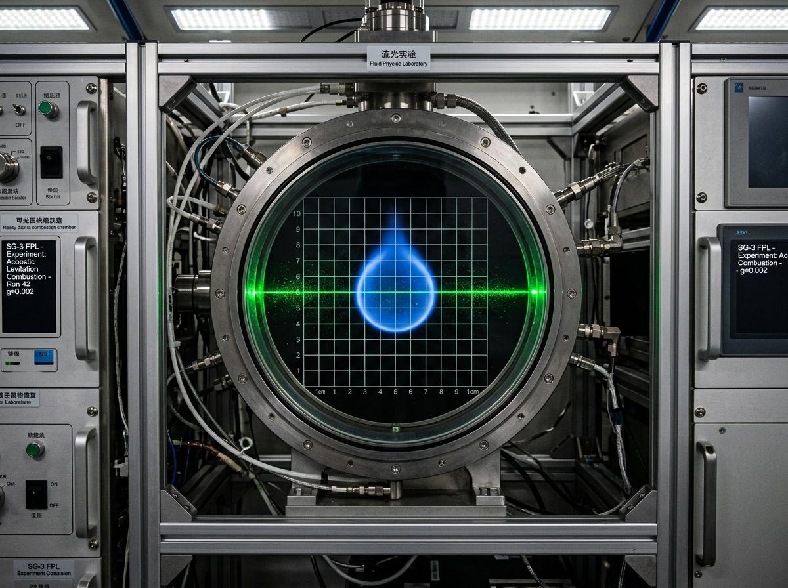

# 推进剂离心气液分离器微重力流体动力学验证日志与高速光学观测记录

**实验编号**：EXP-FLUID-2102-SEP44  
**测试平台**：曙光三环动力预研中心 · 0.002g 轴心失重实验舱（舱位：DOCK-002-LAB-07）  
**记录人**：流体动力学工程师 陆承德（工号 SHU-ENG-0911）  
**协同观测**：激光干涉诊断组 艾琳娜·雷（工号 OPT-332）

image: ../../world/生图集/025_气液分离器_微重力动力学.jpg
---




### 一、 实验目标与光学光路配置

在微重力（$\mu\mathrm{g} \approx 2\times 10^{-3}\,\mathrm{g}_0$）环境下，验证全自主闭环推进剂储罐在超临界抽吸工况下的气液两相界面稳定性，观测声学驻波（Acoustic Standing Wave）对残余悬浮微气泡的节点捕集效率。

* **观测腔体**：$300\times 300\times 300\,\mathrm{mm}$ 高纯光学合成石英观察窗（耐压 $4.5\,\mathrm{MPa}$），暗哑光吸光背景并刻有 $5.0\,\mathrm{mm}$ 正交标定方格网。
* **高速相机配置**：Phantom Ultra-High-Speed CMOS 传感器，快门速度 $1/10,000\,\mathrm{s}$，帧率 $5,000\,\mathrm{fps}$。
* **照明系统**：$532\,\mathrm{nm}$ 连续波固体激光片光源（厚度 $0.8\,\mathrm{mm}$），垂直切过流体轴心剖面。

image: ../../world/生图集/025_气液分离器_微重力动力学.jpg
---

### 二、 高速光学观测实录与流体相变特征

```text
================================================================================
时间戳 (ms)   相态与光学观测特征                                    动力学测量数据
--------------------------------------------------------------------------------
T + 000.0     主推进离心泵启动，剪切流场建立                        角速度 omega = 120 rad/s
T + 014.2     气液分界面在离心力下贴壁，中心形成完美柱状气核        表面张力波波长 lambda = 4.2 mm
T + 045.8     超声波换能器开启（28 kHz 驻波场生效）                  声辐射力平衡微气泡浮力
T + 082.4     自由悬浮在中心低重力区的甲苯测试液滴形成绝对正球体    液滴球形度圆度误差 < 0.002%
T + 120.0     微气泡完全被驱赶并锁定在声学驻波节线（Node lines）上  气泡直径分布 d = 50~200 um
================================================================================
```

> **【光学组现场批注（附截图快照 #FRAME-04821）】**：  
> “在第 4821 帧激光片光截面上，悬浮在石英腔中央的蓝色荧光示踪微滴呈现出完美的球形几何，没有任何地球重力下的下垂或沉降撕裂。周围由微气泡排列构成的同心声学驻波节线清晰可见。高速摄影完全冻结了流体的表面张力微颤。这一观测证明，在微重力轴心启动离心分离泵时，推进剂不会发生泵体气蚀。”

image: ../../world/生图集/025_气液分离器_微重力动力学.jpg
---

### 三、 伴生微重力燃烧对照验证（Sub-test C）

为标定燃烧室喷嘴微滴雾化质量，在副腔实施了微重力甲醇微滴引燃试验：

1. **火焰形态**：在无浮力对流（Zero natural convection）状态下，火焰呈现极其纯净、通体幽蓝的**绝对球形扩散火焰（Spherical diffusion flame）**。
2. **燃烧特征**：无任何明黄色黑烟尾迹（Soot-free），热量仅以纯球面对称热传导向四周耗散，熄火半径稳定在 $6.4\,\mathrm{mm}$。

image: ../../world/生图集/025_气液分离器_微重力动力学.jpg
---

### 四、 结论与工程归档

1. **分离器定型**：新型声学-离心复合式气液分离器通过 0.002g 适航认证，正式列入《曙光三环穿梭机推进包技术清单》（SEC-SHU-2102-SPEC）。
2. **影像存档**：原始 RAW 视频数据流（240 GB）已写入光学晶体磁存储库（盘号：`OPT-RAW-2102-SEP44`）。

image: ../../world/生图集/025_气液分离器_微重力动力学.jpg
---

```text
[实验章戳：SHUGUANG-3 ADVANCED PROPULSION LAB · VERIFIED]
[主试工程师：陆承德（电子手签）]
```
