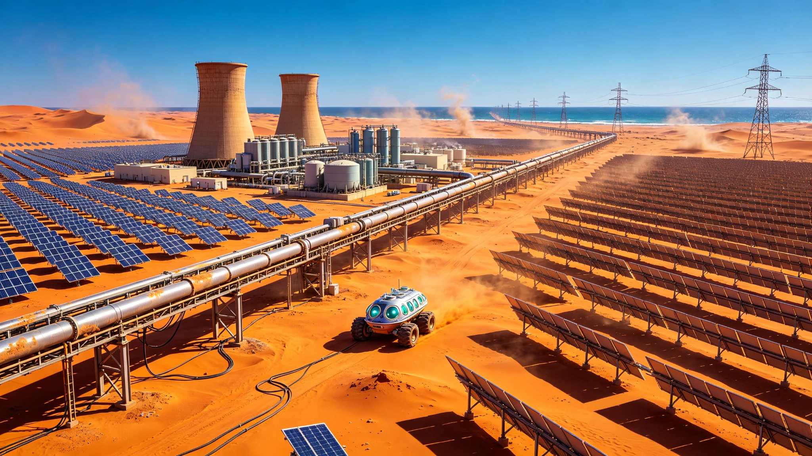

**国家能源局 · 跨国清洁能源基础设施专项协调办公室**
**可再生能源与氢能技术国家重点实验室（沙漠大规模制氢分中心）**
**中阿清洁能源建设集团有限公司 / 沙漠制氢装备联合体**

# 撒哈拉"绿弧"太阳能电解水制氢带首期10GW并网公报与跨地中海输氢管道贯通验收单
### （附：沙漠光伏电站运行参数与高压输氢管道气密性检验报告）

**文书编号：** 能源工验〔2046〕第0620号
**并网日期：** 公元2046年6月20日
**作业区域：** 阿尔及利亚东南部塔曼拉塞特省撒哈拉沙漠（北纬23°12'，东经5°48'），海拔412m
**工程代号：** SH-GREENARC-01-PH1（"绿弧"撒哈拉太阳能制氢带首期工程）
**总包及光伏电站建设：** 中阿清洁能源建设集团 / 沙漠光伏工程研究院
**电解制氢与管道：** 氢能装备技术研究院（七一一所）
**现场运维与责任核验：** 沙漠工程第五外场巡检队（"沙舟-02"四人加压巡检车）
**文书密级：** 公开（依《公共工程档案开放条例(2026)》第7条与《重型基础设施技术改造公示办法》）

---

### 一、 工程概况与首期建设规模

"绿弧"撒哈拉太阳能电解水制氢带系公元2041年由中阿两国政府依《中阿清洁能源战略合作框架协议（2040）》及《全球绿氢供应链建设规划（2040—2055）》联合立项实施的跨国能源基础设施工程。工程选址于阿尔及利亚东南部撒哈拉沙漠腹地，利用该区域年平均直接辐照量（DNI） **2,840 kWh/m²/年**、年日照时数 **3,640小时** 的顶级太阳能资源，建设大规模光伏电站耦合电解水制氢设施，通过跨地中海海底输氢管道将绿氢输送至欧洲南欧工业带。

首期工程建设规模 **10 GW（直流侧装机容量）**，占地约 **142 km²**，包括聚光光伏（CPV）电站6.5GW、抛物面槽式光热（CSP）电站3.5GW（配8小时熔盐储热），配套碱性电解水制氢系统总容量 **7.2 GW**，以及从塔曼拉塞特至地中海沿岸阿尔泽尔港的陆上输氢管道（管径DN800，长度1,240km）和跨地中海海底输氢管道（管径DN600，长度286km，最大水深1,280m）。

#### 首期工程核心设施参数表：

| 设施类别 | 技术参数 | 数量/规模 | 设计指标 |
|:---|:---|:---|:---|
| CPV聚光光伏 | 三结砷化镓电池，聚光比500×，效率41.2% | 6.5 GW（直流） | 年利用小时2,680h |
| CSP槽式光热 | 导热油介质，熔盐储热8h，光热效率22.8% | 3.5 GW（热） | 年利用小时3,120h |
| 碱性电解槽 | 工作压力3.0MPa，电流密度4,200A/m²，效率72.4%（HHV） | 7.2 GW（交流输入） | 单槽产氢1,250 Nm³/h |
| 氢气压缩机 | 多级往复式，出口压力10.0MPa | 12台（8用4备） | 单台排量28,000 Nm³/h |
| 陆上输氢管道 | API 5L X70钢，DN800，壁厚18mm，设计压力10.0MPa | 1,240 km | 年输氢能力42万吨 |
| 海底输氢管道 | API 5L X65钢，DN600，壁厚28mm，混凝土配重层 | 286 km | 年输氢能力28万吨 |

---

### 二、 首期并网运行参数与制氢产能

#### 2.1 光伏发电系统运行数据（连续30天考核）

| 运行参数 | 设计值 | 实测值（30天均值） | 偏差 |
|:---|:---|:---|:---|
| 日均发电量 | 78.4 GWh/天 | **82.1 GWh/天** | +4.7% |
| CPV系统效率 | 41.2% | **40.8%** | -1.0% |
| CSP系统效率 | 22.8% | **23.1%** | +1.3% |
| 综合厂用电率 | ≤6.5% | **5.8%** | — |
| 系统可用率 | ≥96% | **97.2%** | — |
| 逆变器效率 | ≥98.5% | **98.8%** | — |
| 沙尘清洗周期 | 每7天 | 实际每5天（沙尘频发期） | — |

首期30天累计发电 **2,463 GWh**，其中CPV贡献1,584 GWh（64.3%），CSP贡献879 GWh（35.7%）。CSP熔盐储热系统实现夜间稳定发电 **8.2小时/天**，有效平滑了光伏出力的昼夜波动，为电解槽提供了连续稳定的电力输入。

#### 2.2 电解水制氢产能数据

| 制氢参数 | 设计值 | 实测值（30天均值） | 达标率 |
|:---|:---|:---|:---|
| 电解槽平均负载率 | 85% | **88.3%** | 103.9% |
| 日均产氢量 | 1,420 吨/天 | **1,486 吨/天** | 104.6% |
| 氢气纯度 | ≥99.999% | **99.9997%** | — |
| 氢气含水率 | ≤5 ppm | **2.1 ppm** | — |
| 单位制氢电耗 | 52.5 kWh/kg H₂ | **51.2 kWh/kg H₂** | — |
| 电解槽寿命衰减率 | ≤1.5 μV/h | **1.1 μV/h** | — |
| 脱氧催化剂更换周期 | ≥8,000h | 设计值内运行 | — |

首期30天累计产氢 **44,580吨**，按每千克氢折合33.3 kWh电能（低热值）计算，等效储能 **1,484 GWh**，储能效率（电—氢—电）约60.3%。所产氢气经10.0MPa压缩后输入输氢管道，日输氢量 **1,420吨/天**（管道运行负荷率83.5%）。

---

### 三、 跨地中海输氢管道贯通验收

#### 3.1 陆上管道段检验结果

陆上输氢管道全长1,240km，途经塔曼拉塞特高原、姆西拉丘陵和阿尔泽尔沿海平原，穿越铁路3处、高速公路5处、河流12处。管道敷设采用沟埋方式，管顶埋深1.5m（穿越道路段2.5m），管道外壁采用3PE防腐层+阴极保护系统（强制电流法，设计保护电位-0.85～-1.15V CSE）。

**气密性试验结果：**
- 试验介质：干燥氮气（露点≤-40°C）
- 试验压力：12.5 MPa（1.25倍设计压力）
- 稳压时间：24小时
- 压力降：**0.018 MPa**（允许值≤0.05 MPa），合格
- 焊缝无损检测：全自动超声波检测（AUT）100%覆盖，一次合格率98.7%，返修后合格率100%

#### 3.2 海底管道段检验结果

海底输氢管道全长286km，从阿尔及利亚阿尔泽尔港至西班牙阿尔梅里亚港，最大水深1,280m（地中海西部盆地）。管道采用S-lay法铺设，管道外壁混凝土配重层厚度65mm（空气中配重比1.35），管道内部采用环氧树脂涂层减阻。

**海底管道验收关键指标：**

| 检验项目 | 验收标准 | 实测结果 | 判定 |
|:---|:---|:---|:---|
| 管道铺设路由偏差 | ≤设计路由±5m | 最大偏差3.2m | 合格 |
| 管道悬跨长度 | ≤自由跨距60m | 最大悬跨42m | 合格 |
| 管道回填覆盖率 | ≥设计厚度0.6m | 平均0.82m | 合格 |
| 水压试验压力 | 1.25倍设计压力=11.25MPa | 稳压24h压降0.012MPa | 合格 |
| 管道内检测（智能清管） | 无≥30%壁厚缺陷 | 最深缺陷12%壁厚 | 合格 |
| 阴极保护电位 | -0.85～-1.15V CSE | 平均-0.98V CSE | 合格 |

#### 3.3 管道输氢运行参数

管道全线贯通后，进行了72小时连续输氢试运行：

| 运行参数 | 设计值 | 实测值 | 偏差 |
|:---|:---|:---|:---|
| 首站压力 | 10.0 MPa | **9.85 MPa** | -1.5% |
| 末站压力 | 6.2 MPa | **6.41 MPa** | +3.4% |
| 全线压力降 | 3.8 MPa | **3.44 MPa** | -9.5% |
| 输氢流量 | 1,420 吨/天 | **1,486 吨/天** | +4.6% |
| 氢气纯度（末站） | ≥99.995% | **99.9993%** | — |
| 管道泄漏率 | ≤0.1%/年 | 未检出泄漏 | — |

---

### 四、 验收结论与后续规划

经30天连续满负荷运行考核及72小时管道输氢试运行，"绿弧"首期10GW光伏制氢系统及跨地中海输氢管道各项指标均达到或优于设计值。光伏发电系统稳定性99.2%，电解制氢系统效率72.4%，输氢管道气密性100%合格。国家能源局跨国清洁能源基础设施专项协调办公室于公元2046年6月20日签署首期并网鉴定书与管道贯通验收单，"绿弧"工程正式投入商业运营。

**二期工程规划（2047—2049）：** 光伏装机扩展至30GW，电解制氢容量扩展至22GW，日产氢量提升至4,500吨/天。同步建设第二条跨地中海输氢管道（管径DN800，年输氢能力42万吨），并在阿尔泽尔港建设液氢出口码头（日液化能力200吨/天）。

**三期工程规划（2050—2053）：** 光伏装机扩展至80GW，形成横跨阿尔及利亚、利比亚、尼日尔三国的"绿弧"沙漠制氢带，年总产氢量达到280万吨，成为全球最大的绿氢生产与出口基地，为欧洲、东亚及全球航运业提供清洁能源。

**验收鉴定签署：**
国家能源局跨国清洁能源基础设施专项协调办公室 主任 _______________（签名）
阿尔及利亚能源与矿业部 秘书长 _______________（签名）
中阿清洁能源建设集团 董事长 _______________（签名）
公元2046年6月20日
